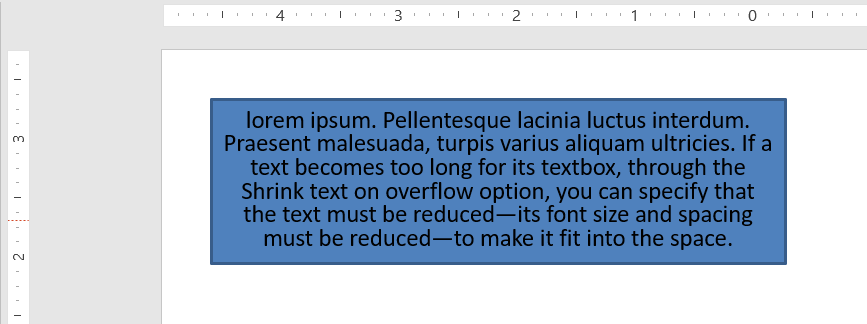

## **Introduction**

By default, when you add a textbox, Microsoft PowerPoint uses the **Resize shape to fix text** setting for the textbox—it automatically resizes the textbox to ensure its text always fits into it. 


* When the text in the textbox becomes longer or bigger, PowerPoint automatically enlarges the textbox—increases its height—to allow it to hold more text. 
* When the text in the textbox becomes shorter or smaller, PowerPoint automatically reduces the textbox—decreases its height—to clear redundant space. 

In PowerPoint, these are the 4 important parameters or options that control the autofit behavior for a textbox: 

* **Do not Autofit**
* **Shrink text on overflow**
* **Resize shape to fit text**
* **Wrap text in shape.**


Aspose.Slides for Python via Java provides similar options—some properties under the [TextFrameFormat](https://reference.aspose.com/slides/python-java/aspose.slides/textframeformat/) class—that allow you to control the autofit behavior for textboxes in presentations. 

## **Resize a Shape to Fit Text**

If you want the text in a box to always fit into that box after changes are made to the text, you have to use the **Resize shape to fix text** option. To specify this setting, use the [setAutofitType](https://reference.aspose.com/slides/python-java/aspose.slides/textframeformat/#setAutofitType) method (from the [TextFrameFormat](https://reference.aspose.com/slides/python-java/aspose.slides/textframeformat/) class) with [Shape](https://reference.aspose.com/slides/python-java/aspose.slides/textautofittype/#Shape).


This Python code shows you how to specify that a text must always fit into its box in a PowerPoint presentation:

```python
import jpype
import asposeslides

if not jpype.isJVMStarted():
    jpype.startJVM()

from asposeslides.api import Presentation, ShapeType, Portion, FillType, TextAutofitType, SaveFormat
from java.awt import Color

presentation = Presentation()
try:
    slide = presentation.getSlides().get_Item(0)
    auto_shape = slide.getShapes().addAutoShape(ShapeType.Rectangle, 30, 30, 350, 100)

    portion = Portion("lorem ipsum...")
    portion.getPortionFormat().getFillFormat().getSolidFillColor().setColor(Color.BLACK)
    portion.getPortionFormat().getFillFormat().setFillType(FillType.Solid)
    auto_shape.getTextFrame().getParagraphs().get_Item(0).getPortions().add(portion)

    text_frame_format = auto_shape.getTextFrame().getTextFrameFormat()
    text_frame_format.setAutofitType(TextAutofitType.Shape)

    presentation.save("Output-presentation.pptx", SaveFormat.Pptx)
finally:
    presentation.dispose()
```

If the text becomes longer or bigger, the textbox will be automatically resized (increase in height) to ensure all the text fits into it. If the text becomes shorter, the reverse occurs. 

## **Do Not Autofit**

If you want a textbox or shape to retain its dimensions no matter the changes made to the text it contains, you have to use the **Do not Autofit** option. To specify this setting, use the [setAutofitType](https://reference.aspose.com/slides/python-java/aspose.slides/textframeformat/#setAutofitType) method (from the [TextFrameFormat](https://reference.aspose.com/slides/python-java/aspose.slides/textframeformat/) class) with [None](https://reference.aspose.com/slides/python-java/aspose.slides/textautofittype/#None). 


This Python code shows you how to specify that a textbox must always retain its dimensions in a PowerPoint presentation:

```python
import jpype
import asposeslides

if not jpype.isJVMStarted():
    jpype.startJVM()

from asposeslides.api import Presentation, ShapeType, Portion, FillType, TextAutofitType, SaveFormat
from java.awt import Color

presentation = Presentation()
try:
    slide = presentation.getSlides().get_Item(0)
    auto_shape = slide.getShapes().addAutoShape(ShapeType.Rectangle, 30, 30, 350, 100)

    portion = Portion("lorem ipsum...")
    portion.getPortionFormat().getFillFormat().getSolidFillColor().setColor(Color.BLACK)
    portion.getPortionFormat().getFillFormat().setFillType(FillType.Solid)
    auto_shape.getTextFrame().getParagraphs().get_Item(0).getPortions().add(portion)

    text_frame_format = auto_shape.getTextFrame().getTextFrameFormat()
    text_frame_format.setAutofitType(TextAutofitType.None)

    presentation.save("Output-presentation.pptx", SaveFormat.Pptx)
finally:
    presentation.dispose()
```

When the text becomes too long for its box, it spills out. 

## **Shrink Text on Overflow**

If a text becomes too long for its box, through the **Shrink text on overflow** option, you can specify that the text's size and spacing must be reduced to make it fit into its box. To specify this setting, use the [setAutofitType](https://reference.aspose.com/slides/python-java/aspose.slides/textframeformat/#setAutofitType) method (from the [TextFrameFormat](https://reference.aspose.com/slides/python-java/aspose.slides/textframeformat/) class) with [Normal](https://reference.aspose.com/slides/python-java/aspose.slides/textautofittype/#Normal).



This Python code shows you how to specify that a text must be shrunk on overflow in a PowerPoint presentation:

```python
import jpype
import asposeslides

if not jpype.isJVMStarted():
    jpype.startJVM()

from asposeslides.api import Presentation, ShapeType, Portion, FillType, TextAutofitType, SaveFormat
from java.awt import Color

presentation = Presentation()
try:
    slide = presentation.getSlides().get_Item(0)
    auto_shape = slide.getShapes().addAutoShape(ShapeType.Rectangle, 30, 30, 350, 100)

    portion = Portion("lorem ipsum...")
    portion.getPortionFormat().getFillFormat().getSolidFillColor().setColor(Color.BLACK)
    portion.getPortionFormat().getFillFormat().setFillType(FillType.Solid)
    auto_shape.getTextFrame().getParagraphs().get_Item(0).getPortions().add(portion)

    text_frame_format = auto_shape.getTextFrame().getTextFrameFormat()
    text_frame_format.setAutofitType(TextAutofitType.Normal)

    presentation.save("Output-presentation.pptx", SaveFormat.Pptx)
finally:
    presentation.dispose()
```

{}

When the **Shrink text on overflow** option is used, the setting gets applied only when the text becomes too long for its box. 

{}

## **Wrap Text**

If you want the text in a shape to get wrapped inside that shape when the text goes beyond the shape's border (width only), you have to use the **Wrap text in shape** parameter. To specify this setting, you have to use the [setWrapText](https://reference.aspose.com/slides/python-java/aspose.slides/textframeformat/#setWrapText) method (from the [TextFrameFormat](https://reference.aspose.com/slides/python-java/aspose.slides/textframeformat/) class) with [NullableBool.True](https://reference.aspose.com/slides/python-java/aspose.slides/nullablebool/#True). 

This Python code shows you how to use the Wrap Text setting in a PowerPoint presentation:

```python
import jpype
import asposeslides

if not jpype.isJVMStarted():
    jpype.startJVM()

from asposeslides.api import Presentation, ShapeType, Portion, FillType, NullableBool, SaveFormat
from java.awt import Color

presentation = Presentation()
try:
    slide = presentation.getSlides().get_Item(0)
    auto_shape = slide.getShapes().addAutoShape(ShapeType.Rectangle, 30, 30, 350, 100)

    portion = Portion("lorem ipsum...")
    portion.getPortionFormat().getFillFormat().getSolidFillColor().setColor(Color.BLACK)
    portion.getPortionFormat().getFillFormat().setFillType(FillType.Solid)
    auto_shape.getTextFrame().getParagraphs().get_Item(0).getPortions().add(portion)

    text_frame_format = auto_shape.getTextFrame().getTextFrameFormat()
    text_frame_format.setWrapText(NullableBool.True)

    presentation.save("Output-presentation.pptx", SaveFormat.Pptx)
finally:
    presentation.dispose()
```

{} 

If you use the [setWrapText](https://reference.aspose.com/slides/python-java/aspose.slides/textframeformat/#setWrapText) method with [NullableBool.False](https://reference.aspose.com/slides/python-java/aspose.slides/nullablebool/#False) for a shape, when the text inside the shape becomes longer than the shape's width, the text gets extended beyond the shape's borders along a single line. 

{}

## **FAQ**

**Do the text frame’s internal margins affect AutoFit?**

Yes. Padding (internal margins) reduces the usable area for text, so AutoFit will kick in earlier—shrinking the font or resizing the shape sooner. Check and adjust margins before tuning AutoFit.

**How does AutoFit interact with manual and soft line breaks?**

Forced breaks remain in place, and AutoFit adapts font size and spacing around them. Removing unnecessary breaks often reduces how aggressively AutoFit needs to shrink the text.

**Does changing the theme font or triggering font substitution affect AutoFit results?**

Yes. Substituting to a font with different glyph metrics changes text width/height, which can alter final font size and line wrapping. After any font change or substitution, re-check the slides.
