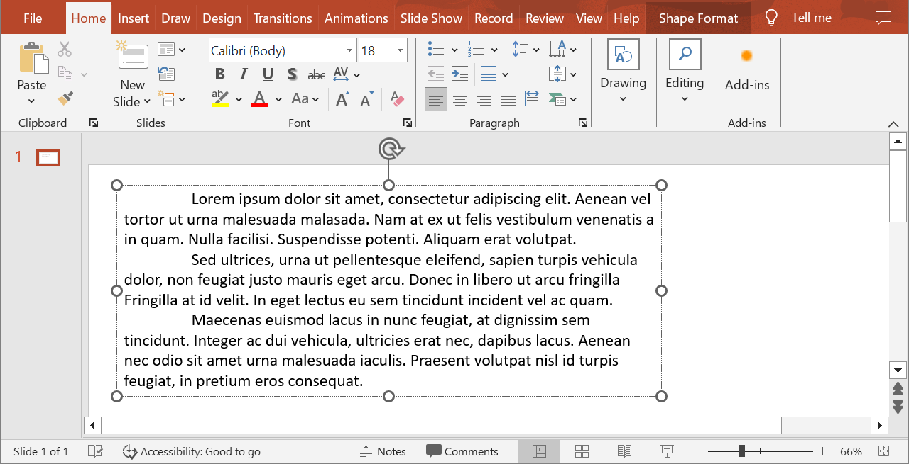

## **Overview**

Aspose.Slides for Python via Java represents text as a hierarchy of text frames, paragraphs, and portions:

* [TextFrame](https://reference.aspose.com/slides/python-java/aspose.slides/textframe/) represents the text container in a shape and provides access to its paragraph collection.
* [Paragraph](https://reference.aspose.com/slides/python-java/aspose.slides/paragraph/) represents one paragraph in a text frame and provides access to its portions and paragraph-level formatting.
* [Portion](https://reference.aspose.com/slides/python-java/aspose.slides/portion/) represents a text run within a paragraph. Each portion can have its own text and character-level formatting.

A paragraph can therefore contain text with different fonts, colors, sizes, and other formatting by using multiple portions.

## **Create and Format Paragraphs**

### **Create Paragraphs with Multiple Portions**

The following steps create a text frame with three paragraphs, each containing three portions:

1. Create an instance of the [Presentation](https://reference.aspose.com/slides/python-java/aspose.slides/presentation/) class.
2. Access the relevant slide through its index.
3. Add a rectangular [AutoShape](https://reference.aspose.com/slides/python-java/aspose.slides/autoshape/) to the slide.
4. Access the shape's [TextFrame](https://reference.aspose.com/slides/python-java/aspose.slides/textframe/).
5. Use the default paragraph and add two more [Paragraph](https://reference.aspose.com/slides/python-java/aspose.slides/paragraph/) objects to the text frame.
6. Add enough [Portion](https://reference.aspose.com/slides/python-java/aspose.slides/portion/) objects for each paragraph to contain three portions. The default paragraph already contains one empty portion.
7. Set the text of each portion.
8. Apply character-level formatting through [Portion.getPortionFormat](https://reference.aspose.com/slides/python-java/aspose.slides/portion/#getPortionFormat).
9. Save the modified presentation.

This Python example implements the steps:

```python
import jpype
import asposeslides

if not jpype.isJVMStarted():
    jpype.startJVM()

from asposeslides.api import FillType, NullableBool, Paragraph, Portion, Presentation, SaveFormat, ShapeType
from java.awt import Color

presentation = Presentation()
try:
    slide = presentation.getSlides().get_Item(0)
    shape = slide.getShapes().addAutoShape(ShapeType.Rectangle, 50, 150, 300, 150)
    text_frame = shape.getTextFrame()
    first_paragraph = text_frame.getParagraphs().get_Item(0)
    first_paragraph.getPortions().add(Portion())
    first_paragraph.getPortions().add(Portion())
    second_paragraph = Paragraph()
    second_paragraph.getPortions().add(Portion())
    second_paragraph.getPortions().add(Portion())
    second_paragraph.getPortions().add(Portion())
    text_frame.getParagraphs().add(second_paragraph)
    third_paragraph = Paragraph()
    third_paragraph.getPortions().add(Portion())
    third_paragraph.getPortions().add(Portion())
    third_paragraph.getPortions().add(Portion())
    text_frame.getParagraphs().add(third_paragraph)
    paragraph_count = text_frame.getParagraphs().getCount()
    for paragraph_index in range(paragraph_count):
        paragraph = text_frame.getParagraphs().get_Item(paragraph_index)
        portion_count = paragraph.getPortions().getCount()
        for portion_index in range(portion_count):
            portion = paragraph.getPortions().get_Item(portion_index)
            portion.setText(f"Portion {paragraph_index + 1}.{portion_index + 1}")
            if portion_index == 0:
                portion.getPortionFormat().getFillFormat().setFillType(FillType.Solid)
                portion.getPortionFormat().getFillFormat().getSolidFillColor().setColor(Color.RED)
                portion.getPortionFormat().setFontBold(NullableBool.True_)
                portion.getPortionFormat().setFontHeight(15)
            elif portion_index == 1:
                portion.getPortionFormat().getFillFormat().setFillType(FillType.Solid)
                portion.getPortionFormat().getFillFormat().getSolidFillColor().setColor(Color.BLUE)
                portion.getPortionFormat().setFontItalic(NullableBool.True_)
                portion.getPortionFormat().setFontHeight(18)
    presentation.save("paragraphs_with_portions.pptx", SaveFormat.Pptx)
finally:
    presentation.dispose()
```


## **Create Bulleted and Numbered Lists**

### **Create a Bulleted or Numbered List**

Bullets and numbering make related items easier to scan. In Aspose.Slides, list settings are defined through [BulletFormat](https://reference.aspose.com/slides/python-java/aspose.slides/bulletformat/).

1. Create an instance of the [Presentation](https://reference.aspose.com/slides/python-java/aspose.slides/presentation/) class.
2. Access the relevant slide through its index.
3. Add an [AutoShape](https://reference.aspose.com/slides/python-java/aspose.slides/autoshape/) to the selected slide.
4. Access the shape's [TextFrame](https://reference.aspose.com/slides/python-java/aspose.slides/textframe/).
5. Remove the default paragraph from the text frame.
6. Create a [Paragraph](https://reference.aspose.com/slides/python-java/aspose.slides/paragraph/) for a symbol bullet.
7. Set [BulletFormat.setType](https://reference.aspose.com/slides/python-java/aspose.slides/bulletformat/#setType) to [BulletType.Symbol](https://reference.aspose.com/slides/python-java/aspose.slides/bullettype/#Symbol) and specify the bullet character.
8. Set the paragraph text, indent, bullet color, and bullet height.
9. Add the paragraph to the text frame.
10. Create a second paragraph and set [BulletFormat.setType](https://reference.aspose.com/slides/python-java/aspose.slides/bulletformat/#setType) to [BulletType.Numbered](https://reference.aspose.com/slides/python-java/aspose.slides/bullettype/#Numbered).
11. Configure the numbered bullet style and add the paragraph to the text frame.
12. Save the presentation.

This Python example creates a symbol bullet and a numbered bullet:

```python
import jpype
import asposeslides

if not jpype.isJVMStarted():
    jpype.startJVM()

from asposeslides.api import BulletType, ColorType, NullableBool, NumberedBulletStyle, Paragraph, Presentation, SaveFormat, ShapeType
from java.awt import Color

presentation = Presentation()
try:
    slide = presentation.getSlides().get_Item(0)
    shape = slide.getShapes().addAutoShape(ShapeType.Rectangle, 200, 200, 400, 200)
    text_frame = shape.getTextFrame()
    text_frame.getParagraphs().clear()
    symbol_paragraph = Paragraph()
    symbol_paragraph.setText("Welcome to Aspose.Slides")
    symbol_paragraph.getParagraphFormat().getBullet().setType(BulletType.Symbol)
    symbol_paragraph.getParagraphFormat().getBullet().setChar("•")
    symbol_paragraph.getParagraphFormat().setIndent(25)
    symbol_paragraph.getParagraphFormat().getBullet().getColor().setColorType(ColorType.RGB)
    symbol_paragraph.getParagraphFormat().getBullet().getColor().setColor(Color.BLACK)
    symbol_paragraph.getParagraphFormat().getBullet().setBulletHardColor(NullableBool.True_)
    symbol_paragraph.getParagraphFormat().getBullet().setHeight(100)
    text_frame.getParagraphs().add(symbol_paragraph)
    numbered_paragraph = Paragraph()
    numbered_paragraph.setText("This is a numbered item")
    numbered_paragraph.getParagraphFormat().getBullet().setType(BulletType.Numbered)
    numbered_paragraph.getParagraphFormat().getBullet().setNumberedBulletStyle(NumberedBulletStyle.BulletCircleNumWDBlackPlain)
    numbered_paragraph.getParagraphFormat().setIndent(25)
    numbered_paragraph.getParagraphFormat().getBullet().getColor().setColorType(ColorType.RGB)
    numbered_paragraph.getParagraphFormat().getBullet().getColor().setColor(Color.BLACK)
    numbered_paragraph.getParagraphFormat().getBullet().setBulletHardColor(NullableBool.True_)
    numbered_paragraph.getParagraphFormat().getBullet().setHeight(100)
    text_frame.getParagraphs().add(numbered_paragraph)
    presentation.save("bulleted_and_numbered_list.pptx", SaveFormat.Pptx)
finally:
    presentation.dispose()
```


### **Use Picture Bullets**

Picture bullets let you use a custom image instead of a symbol or number.

1. Create an instance of the [Presentation](https://reference.aspose.com/slides/python-java/aspose.slides/presentation/) class.
2. Access the relevant slide through its index.
3. Add an [AutoShape](https://reference.aspose.com/slides/python-java/aspose.slides/autoshape/) and access its [TextFrame](https://reference.aspose.com/slides/python-java/aspose.slides/textframe/).
4. Remove the default paragraph from the text frame.
5. Load the bullet image and add it to the presentation's image collection as an [PPImage](https://reference.aspose.com/slides/python-java/aspose.slides/ppimage/).
6. Create a [Paragraph](https://reference.aspose.com/slides/python-java/aspose.slides/paragraph/) and set its text.
7. Set [BulletFormat.setType](https://reference.aspose.com/slides/python-java/aspose.slides/bulletformat/#setType) to [BulletType.Picture](https://reference.aspose.com/slides/python-java/aspose.slides/bullettype/#Picture).
8. Assign the image through [BulletFormat.getPicture](https://reference.aspose.com/slides/python-java/aspose.slides/bulletformat/#getPicture) and set the bullet height.
9. Add the paragraph to the text frame.
10. Save the modified presentation.

This Python example creates a picture bullet:

```python
import jpype
import asposeslides

if not jpype.isJVMStarted():
    jpype.startJVM()

from asposeslides.api import BulletType, Images, Paragraph, Presentation, SaveFormat, ShapeType

presentation = Presentation()
try:
    slide = presentation.getSlides().get_Item(0)
    bullet_image = Images.fromFile("bullets.png")
    try:
        presentation_image = presentation.getImages().addImage(bullet_image)
    finally:
        bullet_image.dispose()
    shape = slide.getShapes().addAutoShape(ShapeType.Rectangle, 200, 200, 400, 200)
    text_frame = shape.getTextFrame()
    text_frame.getParagraphs().clear()
    paragraph = Paragraph()
    paragraph.setText("Welcome to Aspose.Slides")
    paragraph.getParagraphFormat().getBullet().setType(BulletType.Picture)
    paragraph.getParagraphFormat().getBullet().getPicture().setImage(presentation_image)
    paragraph.getParagraphFormat().getBullet().setHeight(100)
    text_frame.getParagraphs().add(paragraph)
    presentation.save("picture_bullet.pptx", SaveFormat.Pptx)
    presentation.save("picture_bullet.ppt", SaveFormat.Ppt)
finally:
    presentation.dispose()
```


### **Create a Multilevel List**

Set [ParagraphFormat.setDepth](https://reference.aspose.com/slides/python-java/aspose.slides/paragraphformat/#setDepth) to place paragraphs at different levels of a list. The top level has a depth of `0`.

1. Create a [Presentation](https://reference.aspose.com/slides/python-java/aspose.slides/presentation/) and access a slide.
2. Add an [AutoShape](https://reference.aspose.com/slides/python-java/aspose.slides/autoshape/) and clear the default paragraph from its text frame.
3. Create four paragraphs and configure their bullet symbols.
4. Set their [ParagraphFormat.setDepth](https://reference.aspose.com/slides/python-java/aspose.slides/paragraphformat/#setDepth) values to `0`, `1`, `2`, and `3`.
5. Add the paragraphs to the text frame and save the presentation.

This Python example creates a four-level bulleted list:

```python
import jpype
import asposeslides

if not jpype.isJVMStarted():
    jpype.startJVM()

from asposeslides.api import BulletType, FillType, Paragraph, Presentation, SaveFormat, ShapeType
from java.awt import Color

presentation = Presentation()
try:
    slide = presentation.getSlides().get_Item(0)
    shape = slide.getShapes().addAutoShape(ShapeType.Rectangle, 200, 200, 400, 200)
    text_frame = shape.getTextFrame()
    text_frame.getParagraphs().clear()
    first_paragraph = Paragraph()
    first_paragraph.setText("Content")
    first_paragraph.getParagraphFormat().getBullet().setType(BulletType.Symbol)
    first_paragraph.getParagraphFormat().getBullet().setChar("•")
    first_paragraph.getParagraphFormat().getDefaultPortionFormat().getFillFormat().setFillType(FillType.Solid)
    first_paragraph.getParagraphFormat().getDefaultPortionFormat().getFillFormat().getSolidFillColor().setColor(Color.BLACK)
    first_paragraph.getParagraphFormat().setDepth(0)
    second_paragraph = Paragraph()
    second_paragraph.setText("Second level")
    second_paragraph.getParagraphFormat().getBullet().setType(BulletType.Symbol)
    second_paragraph.getParagraphFormat().getBullet().setChar('-')
    second_paragraph.getParagraphFormat().getDefaultPortionFormat().getFillFormat().setFillType(FillType.Solid)
    second_paragraph.getParagraphFormat().getDefaultPortionFormat().getFillFormat().getSolidFillColor().setColor(Color.BLACK)
    second_paragraph.getParagraphFormat().setDepth(1)
    third_paragraph = Paragraph()
    third_paragraph.setText("Third level")
    third_paragraph.getParagraphFormat().getBullet().setType(BulletType.Symbol)
    third_paragraph.getParagraphFormat().getBullet().setChar("•")
    third_paragraph.getParagraphFormat().getDefaultPortionFormat().getFillFormat().setFillType(FillType.Solid)
    third_paragraph.getParagraphFormat().getDefaultPortionFormat().getFillFormat().getSolidFillColor().setColor(Color.BLACK)
    third_paragraph.getParagraphFormat().setDepth(2)
    fourth_paragraph = Paragraph()
    fourth_paragraph.setText("Fourth level")
    fourth_paragraph.getParagraphFormat().getBullet().setType(BulletType.Symbol)
    fourth_paragraph.getParagraphFormat().getBullet().setChar('-')
    fourth_paragraph.getParagraphFormat().getDefaultPortionFormat().getFillFormat().setFillType(FillType.Solid)
    fourth_paragraph.getParagraphFormat().getDefaultPortionFormat().getFillFormat().getSolidFillColor().setColor(Color.BLACK)
    fourth_paragraph.getParagraphFormat().setDepth(3)
    text_frame.getParagraphs().add(first_paragraph)
    text_frame.getParagraphs().add(second_paragraph)
    text_frame.getParagraphs().add(third_paragraph)
    text_frame.getParagraphs().add(fourth_paragraph)
    presentation.save("multilevel_list.pptx", SaveFormat.Pptx)
finally:
    presentation.dispose()
```


### **Start Numbered List Items at Custom Values**

Use [BulletFormat.setNumberedBulletStartWith](https://reference.aspose.com/slides/python-java/aspose.slides/bulletformat/#setNumberedBulletStartWith) to set the initial number displayed for a numbered paragraph.

1. Create a [Presentation](https://reference.aspose.com/slides/python-java/aspose.slides/presentation/) and add an [AutoShape](https://reference.aspose.com/slides/python-java/aspose.slides/autoshape/) to a slide.
2. Clear the default paragraph from the shape's text frame.
3. Create three numbered paragraphs.
4. Set [BulletFormat.setNumberedBulletStartWith](https://reference.aspose.com/slides/python-java/aspose.slides/bulletformat/#setNumberedBulletStartWith) to `2`, `3`, and `7` for the respective paragraphs.
5. Add the paragraphs to the text frame and save the presentation.

This Python example assigns a custom starting number to each paragraph:

```python
import jpype
import asposeslides

if not jpype.isJVMStarted():
    jpype.startJVM()

from asposeslides.api import BulletType, Paragraph, Presentation, SaveFormat, ShapeType

presentation = Presentation()
try:
    slide = presentation.getSlides().get_Item(0)
    shape = slide.getShapes().addAutoShape(ShapeType.Rectangle, 200, 200, 400, 200)
    text_frame = shape.getTextFrame()
    text_frame.getParagraphs().clear()
    first_paragraph = Paragraph()
    first_paragraph.setText("Start at 2")
    first_paragraph.getParagraphFormat().getBullet().setType(BulletType.Numbered)
    first_paragraph.getParagraphFormat().getBullet().setNumberedBulletStartWith(2)
    text_frame.getParagraphs().add(first_paragraph)
    second_paragraph = Paragraph()
    second_paragraph.setText("Start at 3")
    second_paragraph.getParagraphFormat().getBullet().setType(BulletType.Numbered)
    second_paragraph.getParagraphFormat().getBullet().setNumberedBulletStartWith(3)
    text_frame.getParagraphs().add(second_paragraph)
    third_paragraph = Paragraph()
    third_paragraph.setText("Start at 7")
    third_paragraph.getParagraphFormat().getBullet().setType(BulletType.Numbered)
    third_paragraph.getParagraphFormat().getBullet().setNumberedBulletStartWith(7)
    text_frame.getParagraphs().add(third_paragraph)
    presentation.save("custom_numbered_list.pptx", SaveFormat.Pptx)
finally:
    presentation.dispose()
```

## **Control Paragraph Layout and End Properties**

### **Set a First-Line Indent**

Use [ParagraphFormat.setIndent](https://reference.aspose.com/slides/python-java/aspose.slides/paragraphformat/#setIndent) to control the first-line indent of a paragraph. This method moves only the first line relative to the paragraph's left margin. A positive value shifts the first line to the right, while the remaining lines stay aligned to the paragraph body.

Use [ParagraphFormat.setMarginLeft](https://reference.aspose.com/slides/python-java/aspose.slides/paragraphformat/#setMarginLeft) when you need to move the whole paragraph. Use [ParagraphFormat.setIndent](https://reference.aspose.com/slides/python-java/aspose.slides/paragraphformat/#setIndent) when you need to move only the first line.

The example below creates several paragraphs and applies different [ParagraphFormat.setIndent](https://reference.aspose.com/slides/python-java/aspose.slides/paragraphformat/#setIndent) values to demonstrate how the first-line indent affects paragraph layout.

1. Create an instance of the [Presentation](https://reference.aspose.com/slides/python-java/aspose.slides/presentation/) class.
2. Access the target slide.
3. Add a rectangular [AutoShape](https://reference.aspose.com/slides/python-java/aspose.slides/autoshape/) to the slide.
4. Access the shape's [TextFrame](https://reference.aspose.com/slides/python-java/aspose.slides/textframe/) and remove the default paragraph.
5. Create several paragraphs and set different [ParagraphFormat.setIndent](https://reference.aspose.com/slides/python-java/aspose.slides/paragraphformat/#setIndent) values for them.
6. Add the paragraphs to the text frame.
7. Save the modified presentation.

This code shows you how to set a paragraph indent:

```python
import jpype
import asposeslides

if not jpype.isJVMStarted():
    jpype.startJVM()

from asposeslides.api import FillType, Paragraph, Presentation, SaveFormat, ShapeType, TextAutofitType
from java.awt import Color

presentation = Presentation()
try:
    slide = presentation.getSlides().get_Item(0)
    shape = slide.getShapes().addAutoShape(ShapeType.Rectangle, 50, 50, 420, 220)
    shape.getFillFormat().setFillType(FillType.NoFill)
    shape.getLineFormat().getFillFormat().setFillType(FillType.Solid)
    shape.getLineFormat().getFillFormat().getSolidFillColor().setColor(Color.GRAY)
    text_frame = shape.getTextFrame()
    text_frame.getTextFrameFormat().setAutofitType(TextAutofitType.Shape)
    text_frame.getParagraphs().clear()
    first_paragraph = Paragraph()
    first_paragraph.setText("No first-line indent. Wrapped lines start at the same position as the first line.")
    first_paragraph.getParagraphFormat().getDefaultPortionFormat().getFillFormat().setFillType(FillType.Solid)
    first_paragraph.getParagraphFormat().getDefaultPortionFormat().getFillFormat().getSolidFillColor().setColor(Color.BLACK)
    first_paragraph.getParagraphFormat().setMarginLeft(20.0)
    first_paragraph.getParagraphFormat().setIndent(0.0)
    second_paragraph = Paragraph()
    second_paragraph.setText("First-line indent of 20 points. The first line moves to the right, while wrapped lines remain aligned to the paragraph body.")
    second_paragraph.getParagraphFormat().getDefaultPortionFormat().getFillFormat().setFillType(FillType.Solid)
    second_paragraph.getParagraphFormat().getDefaultPortionFormat().getFillFormat().getSolidFillColor().setColor(Color.BLACK)
    second_paragraph.getParagraphFormat().setMarginLeft(20.0)
    second_paragraph.getParagraphFormat().setIndent(20.0)
    third_paragraph = Paragraph()
    third_paragraph.setText("First-line indent of 40 points. This paragraph shows a larger first-line offset to make the effect easier to see.")
    third_paragraph.getParagraphFormat().getDefaultPortionFormat().getFillFormat().setFillType(FillType.Solid)
    third_paragraph.getParagraphFormat().getDefaultPortionFormat().getFillFormat().getSolidFillColor().setColor(Color.BLACK)
    third_paragraph.getParagraphFormat().setMarginLeft(20.0)
    third_paragraph.getParagraphFormat().setIndent(40.0)
    text_frame.getParagraphs().add(first_paragraph)
    text_frame.getParagraphs().add(second_paragraph)
    text_frame.getParagraphs().add(third_paragraph)
    presentation.save("paragraph_indent.pptx", SaveFormat.Pptx)
finally:
    presentation.dispose()
```

The result:


### **Set a Hanging Indent**

A hanging indent is a paragraph layout in which the first line starts to the left of the remaining lines. In Aspose.Slides, you create this effect with [ParagraphFormat.setIndent](https://reference.aspose.com/slides/python-java/aspose.slides/paragraphformat/#setIndent). Pass a negative value to move the first line to the left relative to the paragraph body.

In practice, [ParagraphFormat.setMarginLeft](https://reference.aspose.com/slides/python-java/aspose.slides/paragraphformat/#setMarginLeft) defines the left position of the paragraph body, and [ParagraphFormat.setIndent](https://reference.aspose.com/slides/python-java/aspose.slides/paragraphformat/#setIndent) defines the position of the first line relative to that margin. To create a hanging indent, pass a positive value to [ParagraphFormat.setMarginLeft](https://reference.aspose.com/slides/python-java/aspose.slides/paragraphformat/#setMarginLeft) and a negative value to [ParagraphFormat.setIndent](https://reference.aspose.com/slides/python-java/aspose.slides/paragraphformat/#setIndent).

This formatting is useful for bibliographies, references, glossary entries, and other paragraphs where wrapped lines must align under the paragraph body rather than under the first character of the first line.

1. Create an instance of the [Presentation](https://reference.aspose.com/slides/python-java/aspose.slides/presentation/) class.
2. Access the target slide.
3. Add a rectangular [AutoShape](https://reference.aspose.com/slides/python-java/aspose.slides/autoshape/) to the slide.
4. Access the shape's [TextFrame](https://reference.aspose.com/slides/python-java/aspose.slides/textframe/) and remove the default paragraph.
5. Create paragraphs and pass a positive value to [ParagraphFormat.setMarginLeft](https://reference.aspose.com/slides/python-java/aspose.slides/paragraphformat/#setMarginLeft) for each paragraph.
6. Pass a negative value to [ParagraphFormat.setIndent](https://reference.aspose.com/slides/python-java/aspose.slides/paragraphformat/#setIndent) to create the hanging indent effect.
7. Add the paragraphs to the text frame.
8. Save the modified presentation.

This code shows you how to set a hanging indent for a paragraph:

```python
import jpype
import asposeslides

if not jpype.isJVMStarted():
    jpype.startJVM()

from asposeslides.api import FillType, Paragraph, Presentation, SaveFormat, ShapeType, TextAutofitType
from java.awt import Color

presentation = Presentation()
try:
    slide = presentation.getSlides().get_Item(0)
    shape = slide.getShapes().addAutoShape(ShapeType.Rectangle, 50, 50, 420, 220)
    shape.getFillFormat().setFillType(FillType.NoFill)
    shape.getLineFormat().getFillFormat().setFillType(FillType.Solid)
    shape.getLineFormat().getFillFormat().getSolidFillColor().setColor(Color.GRAY)
    text_frame = shape.getTextFrame()
    text_frame.getTextFrameFormat().setAutofitType(TextAutofitType.Shape)
    text_frame.getParagraphs().clear()
    first_paragraph = Paragraph()
    first_paragraph.setText("A hanging indent is created by combining a positive left margin with a negative indent. The first line starts to the left, while wrapped lines align with the paragraph body.")
    first_paragraph.getParagraphFormat().getDefaultPortionFormat().getFillFormat().setFillType(FillType.Solid)
    first_paragraph.getParagraphFormat().getDefaultPortionFormat().getFillFormat().getSolidFillColor().setColor(Color.BLACK)
    first_paragraph.getParagraphFormat().setMarginLeft(40.0)
    first_paragraph.getParagraphFormat().setIndent(-20.0)
    second_paragraph = Paragraph()
    second_paragraph.setText("This second example uses a deeper hanging indent so the difference between the first line and the wrapped lines is easier to compare.")
    second_paragraph.getParagraphFormat().getDefaultPortionFormat().getFillFormat().setFillType(FillType.Solid)
    second_paragraph.getParagraphFormat().getDefaultPortionFormat().getFillFormat().getSolidFillColor().setColor(Color.BLACK)
    second_paragraph.getParagraphFormat().setMarginLeft(60.0)
    second_paragraph.getParagraphFormat().setIndent(-30.0)
    text_frame.getParagraphs().add(first_paragraph)
    text_frame.getParagraphs().add(second_paragraph)
    presentation.save("hanging_indent.pptx", SaveFormat.Pptx)
finally:
    presentation.dispose()
```

The result:


### **Set End Paragraph Run Properties**

[Paragraph.setEndParagraphPortionFormat](https://reference.aspose.com/slides/python-java/aspose.slides/paragraph/#setEndParagraphPortionFormat) controls the formatting of the paragraph end mark. The following example assigns a font size and Latin font to the end mark of the second paragraph:

1. Load a [Presentation](https://reference.aspose.com/slides/python-java/aspose.slides/presentation/) and access a slide.
2. Add an [AutoShape](https://reference.aspose.com/slides/python-java/aspose.slides/autoshape/) and clear its default paragraph.
3. Create two paragraphs and add text portions to them.
4. Create a [PortionFormat](https://reference.aspose.com/slides/python-java/aspose.slides/portionformat/) for the second paragraph's end mark.
5. Set [BasePortionFormat.setFontHeight](https://reference.aspose.com/slides/python-java/aspose.slides/baseportionformat/#setFontHeight) and [BasePortionFormat.setLatinFont](https://reference.aspose.com/slides/python-java/aspose.slides/baseportionformat/#setLatinFont).
6. Assign the format with [Paragraph.setEndParagraphPortionFormat](https://reference.aspose.com/slides/python-java/aspose.slides/paragraph/#setEndParagraphPortionFormat) and save the presentation.

```python
import jpype
import asposeslides

if not jpype.isJVMStarted():
    jpype.startJVM()

from asposeslides.api import FontData, Paragraph, Portion, PortionFormat, Presentation, SaveFormat, ShapeType

presentation = Presentation("Test.pptx")
try:
    slide = presentation.getSlides().get_Item(0)
    shape = slide.getShapes().addAutoShape(ShapeType.Rectangle, 10, 10, 200, 250)
    text_frame = shape.getTextFrame()
    text_frame.getParagraphs().clear()
    first_paragraph = Paragraph()
    first_portion = Portion("Sample text")
    first_paragraph.getPortions().add(first_portion)
    second_paragraph = Paragraph()
    second_portion = Portion("Sample text 2")
    second_paragraph.getPortions().add(second_portion)
    end_paragraph_format = PortionFormat()
    end_paragraph_format.setFontHeight(48)
    latin_font = FontData("Times New Roman")
    end_paragraph_format.setLatinFont(latin_font)
    second_paragraph.setEndParagraphPortionFormat(end_paragraph_format)
    text_frame.getParagraphs().add(first_paragraph)
    text_frame.getParagraphs().add(second_paragraph)
    presentation.save("end_paragraph_format.pptx", SaveFormat.Pptx)
finally:
    presentation.dispose()
```


## **Import and Export Paragraph Content**

### **Import HTML Text into Paragraphs**

Use [ParagraphCollection.addFromHtml](https://reference.aspose.com/slides/python-java/aspose.slides/paragraphcollection/#addFromHtml) to convert HTML markup into paragraphs and portions in a text frame.

1. Create an instance of the [Presentation](https://reference.aspose.com/slides/python-java/aspose.slides/presentation/) class.
2. Access a slide and add an [AutoShape](https://reference.aspose.com/slides/python-java/aspose.slides/autoshape/).
3. Access the shape's [TextFrame](https://reference.aspose.com/slides/python-java/aspose.slides/textframe/) and clear its default paragraph.
4. Read the source HTML file.
5. Pass the HTML string to [ParagraphCollection.addFromHtml](https://reference.aspose.com/slides/python-java/aspose.slides/paragraphcollection/#addFromHtml).
6. Save the modified presentation.

This Python example imports HTML into a text frame:

```python
import jpype
import asposeslides

if not jpype.isJVMStarted():
    jpype.startJVM()

from asposeslides.api import FillType, Presentation, SaveFormat, ShapeType
from pathlib import Path

presentation = Presentation()
try:
    slide = presentation.getSlides().get_Item(0)
    shape_width = presentation.getSlideSize().getSize().getWidth() - 20
    shape_height = presentation.getSlideSize().getSize().getHeight() - 20
    shape = slide.getShapes().addAutoShape(ShapeType.Rectangle, 10, 10, shape_width, shape_height)
    shape.getFillFormat().setFillType(FillType.NoFill)
    shape.getTextFrame().getParagraphs().clear()
    try:
        html = Path("file.html").read_text(encoding="utf-8")
        shape.getTextFrame().getParagraphs().addFromHtml(html)
        presentation.save("html_text.pptx", SaveFormat.Pptx)
    except OSError as exception:
        print("The HTML file could not be read: " + str(exception))
finally:
    presentation.dispose()
```


### **Export Paragraph Text to HTML**

Use [ParagraphCollection.exportToHtml](https://reference.aspose.com/slides/python-java/aspose.slides/paragraphcollection/#exportToHtml) to export a selected range of paragraphs as HTML.

1. Create an instance of the [Presentation](https://reference.aspose.com/slides/python-java/aspose.slides/presentation/) class and load the desired presentation.
2. Access the slide and find the [AutoShape](https://reference.aspose.com/slides/python-java/aspose.slides/autoshape/) that contains the text.
3. Access the shape's [TextFrame](https://reference.aspose.com/slides/python-java/aspose.slides/textframe/).
4. Call [ParagraphCollection.exportToHtml](https://reference.aspose.com/slides/python-java/aspose.slides/paragraphcollection/#exportToHtml) with the starting paragraph index and the number of paragraphs to export.
5. Write the returned HTML string to a file.

This Python example exports all paragraphs from the first text shape:

```python
import jpype
import asposeslides

if not jpype.isJVMStarted():
    jpype.startJVM()

from asposeslides.api import AutoShape, Presentation
from pathlib import Path

presentation = Presentation("ExportingHTMLText.pptx")
try:
    shape = presentation.getSlides().get_Item(0).getShapes().get_Item(0)
    if isinstance(shape, AutoShape):
        text_shape = shape
        text_frame = text_shape.getTextFrame()
        if text_frame is not None:
            paragraphs = text_frame.getParagraphs()
            html = paragraphs.exportToHtml(0, paragraphs.getCount(), None)
            try:
                Path("paragraphs.html").write_text(str(html), encoding="utf-8")
            except OSError as exception:
                print("The HTML file could not be written: " + str(exception))
        else:
            print("The first shape does not contain a text frame.")
    else:
        print("The first shape is not a text shape.")
finally:
    presentation.dispose()
```

### **Render a Paragraph as an Image**

[Paragraph.getImage](https://reference.aspose.com/slides/python-java/aspose.slides/paragraph/) renders an individual paragraph directly and returns an image object. Save the result to a file or stream with its `save` method. You do not need to render the containing shape or crop a bitmap manually.

[Paragraph.getImage](https://reference.aspose.com/slides/python-java/aspose.slides/paragraph/) can return `None` if the paragraph cannot be found in its parent collection, has no valid rendering bounds, or cannot be rendered. Check the result before saving it and dispose of the returned image after use.

#### **Render a Paragraph at the Default Scale**

Let's assume we have a presentation file called sample.pptx with one slide, where the first shape is a text box containing three paragraphs.



The following example renders the second paragraph in a regular text shape at the default scale and saves the returned image in PNG format. The `finally` block ensures that the image is disposed of correctly.

```python
import jpype
import asposeslides

if not jpype.isJVMStarted():
    jpype.startJVM()

from asposeslides.api import AutoShape, ImageFormat, Presentation

presentation = Presentation("sample.pptx")
try:
    shape = presentation.getSlides().get_Item(0).getShapes().get_Item(0)
    if isinstance(shape, AutoShape):
        text_shape = shape
        text_frame = text_shape.getTextFrame()
        if text_frame is not None and text_frame.getParagraphs().getCount() > 1:
            paragraph = text_frame.getParagraphs().get_Item(1)
            paragraph_image = paragraph.getImage()
            if paragraph_image is not None:
                try:
                    paragraph_image.save("paragraph.png", ImageFormat.Png)
                finally:
                    paragraph_image.dispose()
            else:
                print("The paragraph could not be rendered.")
        else:
            print("The expected paragraph was not found.")
    else:
        print("The first shape is not a text shape.")
finally:
    presentation.dispose()
```

The result:


#### **Render a Paragraph in a Table Cell with Scaling**

Use the [Paragraph.getImage](https://reference.aspose.com/slides/python-java/aspose.slides/paragraph/) overload that accepts `scale_x` and `scale_y` parameters to set the horizontal and vertical scale factors. The following example creates a table, renders the paragraph in its first cell at twice its default width and height, and saves the result as a PNG image.

```python
import jpype
import asposeslides

if not jpype.isJVMStarted():
    jpype.startJVM()

from asposeslides.api import ImageFormat, Presentation

scale_x = 2.0
scale_y = 2.0
presentation = Presentation()
try:
    slide = presentation.getSlides().get_Item(0)
    table = slide.getShapes().addTable(50, 50, [300.0], [80.0])
    paragraph = table.get_Item(0, 0).getTextFrame().getParagraphs().get_Item(0)
    paragraph.setText("Text in a table cell")
    paragraph_image = paragraph.getImage(scale_x, scale_y)
    if paragraph_image is not None:
        try:
            paragraph_image.save("table_paragraph.png", ImageFormat.Png)
        finally:
            paragraph_image.dispose()
    else:
        print("The paragraph could not be rendered.")
finally:
    presentation.dispose()
```

A scale factor of `1` keeps that axis at its default pixel size. For example, `2` for both factors produces an image whose width and height are approximately twice the default dimensions, resulting in four times as many pixels. Larger factors generally produce sharper text for zooming or high-resolution output, but they also increase memory use and file size. Factors below `1` produce smaller images with less detail. Use equal factors to preserve the paragraph's aspect ratio; different horizontal and vertical factors stretch the output independently.

Rendering a whole shape with [Shape.getImage](https://reference.aspose.com/slides/python-java/aspose.slides/shape/#getImage) remains useful when the output must include the shape's fill, border, or other visual context. For a paragraph-only image, use [Paragraph.getImage](https://reference.aspose.com/slides/python-java/aspose.slides/paragraph/).

## **FAQ**

**Can I completely disable line wrapping inside a text frame?**

Yes. Set [TextFrameFormat.setWrapText](https://reference.aspose.com/slides/python-java/aspose.slides/textframeformat/#setWrapText) to disable wrapping so lines do not break at the text frame's edges.

**How can I get the exact on-slide bounds of a specific paragraph?**

Use [Paragraph.getRect](https://reference.aspose.com/slides/python-java/aspose.slides/paragraph/#getRect) to retrieve the paragraph's bounding rectangle. [Portion.getRect](https://reference.aspose.com/slides/python-java/aspose.slides/portion/#getRect) provides the bounds of an individual portion.

**Where is paragraph alignment (left, right, center, or justify) controlled?**

[ParagraphFormat.setAlignment](https://reference.aspose.com/slides/python-java/aspose.slides/paragraphformat/#setAlignment) is a paragraph-level setting and applies to the whole paragraph regardless of individual portion formatting.

**Can I set the proofing language for part of a paragraph?**

Yes. Set [BasePortionFormat.setLanguageId](https://reference.aspose.com/slides/python-java/aspose.slides/baseportionformat/#setLanguageId) for individual portions, so one paragraph can contain text in multiple languages.
