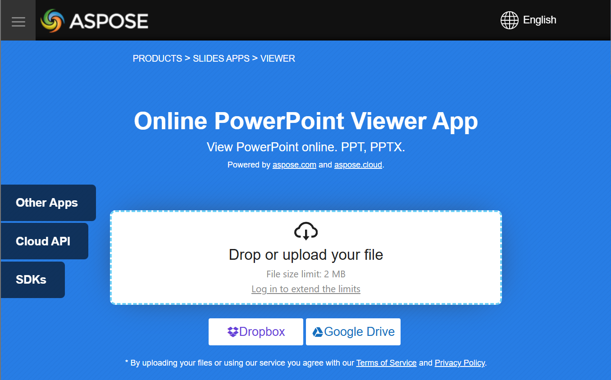

## **Introduction**

Aspose.Slides for Python via Java is used to create presentation files with slides. These slides can be viewed by opening presentations in Microsoft PowerPoint, for example. However, sometimes developers may need to view slides as images in their preferred image viewer or create their own presentation viewer. In such cases, Aspose.Slides allows you to export an individual slide as an image. This article describes how to do it.

## **Generate an SVG Image from a Slide**

To generate an SVG image from a presentation slide with Aspose.Slides, please follow the steps below:

1. Create an instance of the [Presentation](https://reference.aspose.com/slides/python-java/aspose.slides/presentation/) class.
1. Get the slide reference by its index.
1. Open a byte stream.
1. Save the slide as an SVG image to the stream and write it to a file.

```python
import jpype
import asposeslides

if not jpype.isJVMStarted():
    jpype.startJVM()

from asposeslides.api import Presentation
from java.io import ByteArrayOutputStream

slide_index = 0

presentation = Presentation("sample.pptx")
try:
    slide = presentation.getSlides().get_Item(slide_index)
    svg_stream = ByteArrayOutputStream()
    try:
        slide.writeAsSvg(svg_stream)
        svg_data = bytes(svg_stream.toByteArray())
        with open("output.svg", "wb") as output_file:
            output_file.write(svg_data)
    finally:
        svg_stream.close()
finally:
    presentation.dispose()
```

## **Generate an SVG with a Custom Shape ID**

Aspose.Slides can be used to generate an [SVG](https://docs.fileformat.com/page-description-language/svg/) from a slide with a custom shape ID. To do this, use the [SvgShape.setId](https://reference.aspose.com/slides/python-java/aspose.slides/svgshape/#setId) method from [SvgShape](https://reference.aspose.com/slides/python-java/aspose.slides/svgshape/). `CustomSvgShapeFormattingController` can be used to set the shape ID.

```python
import jpype
import asposeslides

if not jpype.isJVMStarted():
    jpype.startJVM()

from asposeslides.api import Presentation, SVGOptions
from java.io import ByteArrayOutputStream

class CustomSvgShapeFormattingController:
    def __init__(self, shape_start_index=0):
        self.shape_index = shape_start_index

    def formatShape(self, svg_shape, shape):
        svg_shape.setId(f"shape-{self.shape_index}")
        self.shape_index += 1


slide_index = 0

presentation = Presentation("sample.pptx")
try:
    slide = presentation.getSlides().get_Item(slide_index)
    controller = CustomSvgShapeFormattingController()
    controller_proxy = jpype.JProxy("com.aspose.slides.ISvgShapeFormattingController", inst=controller)
    svg_options = SVGOptions()
    svg_options.setShapeFormattingController(controller_proxy)

    svg_stream = ByteArrayOutputStream()
    try:
        slide.writeAsSvg(svg_stream, svg_options)
        svg_data = bytes(svg_stream.toByteArray())
        with open("output.svg", "wb") as output_file:
            output_file.write(svg_data)
    finally:
        svg_stream.close()
finally:
    presentation.dispose()
```

## **Create a Slide Thumbnail Image**

Aspose.Slides helps you generate thumbnail images of slides. To generate a thumbnail of a slide using Aspose.Slides, please follow the steps below:

1. Create an instance of the [Presentation](https://reference.aspose.com/slides/python-java/aspose.slides/presentation/) class.
1. Get the slide reference by its index.
1. Get the thumbnail image of the referenced slide at a defined scale.
1. Save the thumbnail image in any desired image format.

```python
import jpype
import asposeslides

if not jpype.isJVMStarted():
    jpype.startJVM()

from asposeslides.api import Presentation, ImageFormat

slide_index = 0
scale_x = 1.0
scale_y = scale_x

presentation = Presentation("sample.pptx")
try:
    slide = presentation.getSlides().get_Item(slide_index)
    image = slide.getImage(scale_x, scale_y)
    try:
        image.save("output.jpg", ImageFormat.Jpeg)
    finally:
        image.dispose()
finally:
    presentation.dispose()
```

## **Create a Slide Thumbnail with User-Defined Dimensions**

To create a slide thumbnail image with user-defined dimensions, please follow the steps below:

1. Create an instance of the [Presentation](https://reference.aspose.com/slides/python-java/aspose.slides/presentation/) class.
1. Get the slide reference by its index.
1. Get the thumbnail image of the referenced slide with the defined dimensions.
1. Save the thumbnail image in any desired image format.

```python
import jpype
import asposeslides

if not jpype.isJVMStarted():
    jpype.startJVM()

from asposeslides.api import Presentation, ImageFormat
from java.awt import Dimension

slide_index = 0
slide_size = Dimension(1200, 800)

presentation = Presentation("sample.pptx")
try:
    slide = presentation.getSlides().get_Item(slide_index)
    image = slide.getImage(slide_size)
    try:
        image.save("output.jpg", ImageFormat.Jpeg)
    finally:
        image.dispose()
finally:
    presentation.dispose()
```

## **Create a Slide Thumbnail with Speaker Notes**

To generate the thumbnail of a slide with speaker notes using Aspose.Slides, please follow the steps below:

1. Create an instance of the [RenderingOptions](https://reference.aspose.com/slides/python-java/aspose.slides/renderingoptions/) class.
1. Use the [RenderingOptions.setSlidesLayoutOptions](https://reference.aspose.com/slides/python-java/aspose.slides/renderingoptions/#setSlidesLayoutOptions) method to set the position of speaker notes.
1. Create an instance of the [Presentation](https://reference.aspose.com/slides/python-java/aspose.slides/presentation/) class.
1. Get the slide reference by its index.
1. Get the thumbnail image of the referenced slide with the rendering options.
1. Save the thumbnail image in any desired image format.

```python
import jpype
import asposeslides

if not jpype.isJVMStarted():
    jpype.startJVM()

from asposeslides.api import Presentation, ImageFormat, NotesCommentsLayoutingOptions, NotesPositions, RenderingOptions

slide_index = 0
layouting_options = NotesCommentsLayoutingOptions()
layouting_options.setNotesPosition(NotesPositions.BottomTruncated)

rendering_options = RenderingOptions()
rendering_options.setSlidesLayoutOptions(layouting_options)

presentation = Presentation("sample.pptx")
try:
    slide = presentation.getSlides().get_Item(slide_index)
    image = slide.getImage(rendering_options)
    try:
        image.save("output.png", ImageFormat.Png)
    finally:
        image.dispose()
finally:
    presentation.dispose()
```

## **Live Example**

You can try the [**Aspose.Slides Viewer**](https://products.aspose.app/slides/viewer/) free app to see what you can implement with Aspose.Slides API:



## **FAQ**

**Can I embed a presentation viewer in a web application?**

Yes. You can use Aspose.Slides on the server side to render slides as images or HTML and display them in the browser. Navigation and zoom features can be implemented with JavaScript for an interactive experience.

**What is the best way to display slides inside a custom viewer?**

The recommended approach is to render each slide as an image (e.g., PNG or SVG) or convert it to HTML using Aspose.Slides, then display the output inside a picture box (for desktop) or HTML container (for web).

**How do I handle large presentations with many slides?**

For large decks, consider lazy-loading or on-demand rendering of slides. This means generating a slide's content only when the user navigates to it, reducing memory and load time.
