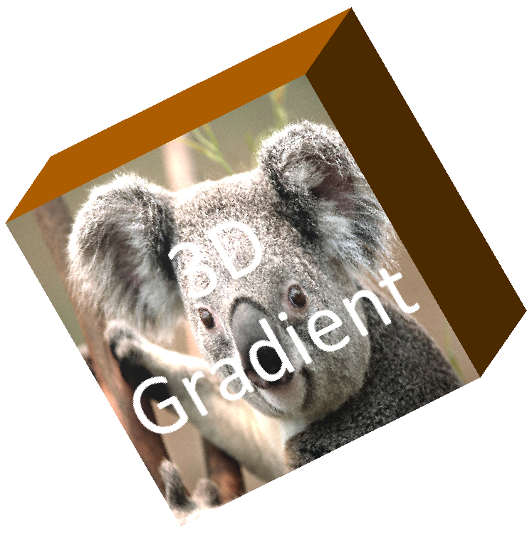
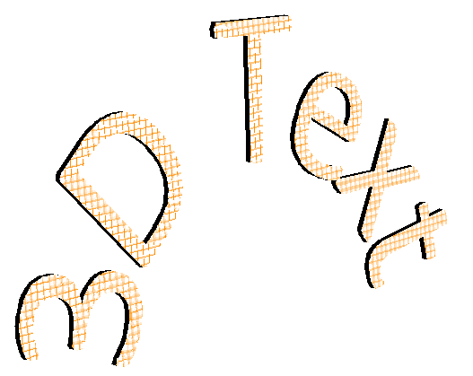

## **Overview**

How do you usually create a 3D PowerPoint presentation? Microsoft PowerPoint lets you add 3D models, apply 3D effects to shapes, create 3D text, insert 3D graphics, and build 3D animations.

Creating 3D effects has a big impact and is often the easiest way to turn a standard deck into a 3D presentation. Since Aspose.Slides 20.9, a new **cross-platform 3D engine** has been added. This engine enables exporting and rasterizing shapes and text with 3D effects. In earlier versions, shapes with 3D effects were rendered flat; now they can be rendered with **full-fledged 3D**. You can also create shapes with 3D effects through the Aspose.Slides API.

In the Aspose.Slides API, to make a shape a PowerPoint 3D shape, use the [Shape.three_d_format](https://reference.aspose.com/slides/python-net/aspose.slides/shape/three_d_format/) property, which exposes the members of the [ThreeDFormat](https://reference.aspose.com/slides/python-net/aspose.slides/threedformat) class:

- [bevel_bottom](https://reference.aspose.com/slides/python-net/aspose.slides/threedformat/bevel_bottom/) and [bevel_top](https://reference.aspose.com/slides/python-net/aspose.slides/threedformat/bevel_top/): set bevels, choose a bevel type (e.g., Angle, Circle, SoftRound), and define bevel height and width.
- [camera](https://reference.aspose.com/slides/python-net/aspose.slides/threedformat/camera/): simulate camera movement around the object; by adjusting camera rotation, zoom, and other properties, you can manipulate shapes like 3D models in PowerPoint.
- [contour_color](https://reference.aspose.com/slides/python-net/aspose.slides/threedformat/contour_color/) and [contour_width](https://reference.aspose.com/slides/python-net/aspose.slides/threedformat/contour_width/): set contour properties to make a shape look like a 3D PowerPoint object.
- [depth](https://reference.aspose.com/slides/python-net/aspose.slides/threedformat/depth/), [extrusion_color](https://reference.aspose.com/slides/python-net/aspose.slides/threedformat/extrusion_color/), and [extrusion_height](https://reference.aspose.com/slides/python-net/aspose.slides/threedformat/extrusion_height/): make a shape three-dimensional by setting its depth or extruding it.
- [light_rig](https://reference.aspose.com/slides/python-net/aspose.slides/threedformat/light_rig/): create lighting effects on a 3D shape; similar to the camera, you can set the light’s rotation relative to the 3D shape and choose a light type.
- [material](https://reference.aspose.com/slides/python-net/aspose.slides/threedformat/material/): select a material to make the 3D shape more lifelike. Predefined materials include Metal, Plastic, Powder, Matte, and more.

All 3D features can be applied to both shapes and text. The sections below show how to access these properties and then examine them step by step.

```py
import aspose.pydrawing as drawing
import aspose.slides as slides

image_scale = 2

with slides.Presentation() as presentation:
    slide = presentation.slides[0]

    shape = slide.shapes.add_auto_shape(slides.ShapeType.RECTANGLE, 200, 150, 200, 200)
    shape.text_frame.text = "3D"
    shape.text_frame.paragraphs[0].paragraph_format.default_portion_format.font_height = 64

    shape.three_d_format.camera.camera_type = slides.CameraPresetType.ORTHOGRAPHIC_FRONT
    shape.three_d_format.camera.set_rotation(20, 30, 40)
    shape.three_d_format.light_rig.light_type = slides.LightRigPresetType.FLAT
    shape.three_d_format.light_rig.direction = slides.LightingDirection.TOP
    shape.three_d_format.material = slides.MaterialPresetType.FLAT
    shape.three_d_format.extrusion_height = 100
    shape.three_d_format.extrusion_color.color = drawing.Color.blue

    with slide.get_image(image_scale, image_scale) as thumbnail:
        thumbnail.save("sample_3d.png")

    presentation.save("sandbox_3d.pptx", slides.export.SaveFormat.PPTX)
```

The rendered thumbnail looks like that:


## **3D Rotation**

You can rotate PowerPoint 3D shapes in three-dimensional space to add interactivity. To rotate a 3D shape in PowerPoint, use the following menu:


In the Aspose.Slides API, you control a shape’s 3D rotation through the [camera](https://reference.aspose.com/slides/python-net/aspose.slides/threedformat/camera/) property.

```py
shape = slide.shapes.add_auto_shape(slides.ShapeType.RECTANGLE, 200, 150, 200, 200)
shape.three_d_format.camera.set_rotation(20, 30, 40)
# ... set other 3D scene parameters

with slide.get_image(image_scale, image_scale) as thumbnail:
    thumbnail.save("sample_3d.png")
```

## **3D Depth and Extrusion**

To add a third dimension to your shape and make it truly 3D, use the [ThreeDFormat.extrusion_height](https://reference.aspose.com/slides/python-net/aspose.slides/threedformat/extrusion_height/) and [ThreeDFormat.extrusion_color](https://reference.aspose.com/slides/python-net/aspose.slides/threedformat/extrusion_color/) properties:

```py
shape = slide.shapes.add_auto_shape(slides.ShapeType.RECTANGLE, 200, 150, 200, 200)
shape.three_d_format.camera.set_rotation(20, 30, 40)
shape.three_d_format.extrusion_height = 100
shape.three_d_format.extrusion_color.color = drawing.Color.purple
# ... set other 3D scene parameters

with slide.get_image(image_scale, image_scale) as thumbnail:
    thumbnail.save("sample_3d.png")
```

In PowerPoint, you typically use the **Depth** menu to set a 3D shape’s depth:


## **3D Gradient**

A gradient can be used to fill a PowerPoint 3D shape. Let’s create a shape with a gradient fill and apply a 3D effect to it:

```py
import aspose.pydrawing as drawing
import aspose.slides as slides

image_scale = 2

with slides.Presentation() as presentation:
    slide = presentation.slides[0]

    shape = slide.shapes.add_auto_shape(slides.ShapeType.RECTANGLE, 200, 150, 250, 250)
    shape.text_frame.text = "3D Gradient"
    shape.text_frame.paragraphs[0].paragraph_format.default_portion_format.font_height = 64

    shape.fill_format.fill_type = slides.FillType.GRADIENT
    shape.fill_format.gradient_format.gradient_stops.add(0, drawing.Color.blue)
    shape.fill_format.gradient_format.gradient_stops.add(100, drawing.Color.orange)
   
    shape.three_d_format.camera.camera_type = slides.CameraPresetType.ORTHOGRAPHIC_FRONT
    shape.three_d_format.camera.set_rotation(10, 20, 30)
    shape.three_d_format.light_rig.light_type = slides.LightRigPresetType.FLAT
    shape.three_d_format.light_rig.direction = slides.LightingDirection.TOP
    shape.three_d_format.extrusion_height = 150
    shape.three_d_format.extrusion_color.color = drawing.Color.dark_orange
   
    with slide.get_image(image_scale, image_scale) as thumbnail:
        thumbnail.save("sample_3d.png")
```

And here is the result:


In addition to gradient fills, you can fill shapes with an image:

```py
with open("image.png", "rb") as image_file:
    image_data = image_file.read()

    shape.fill_format.fill_type = slides.FillType.PICTURE
    shape.fill_format.picture_fill_format.picture.image = presentation.images.add_image(image_data)
    shape.fill_format.picture_fill_format.picture_fill_mode = slides.PictureFillMode.STRETCH
    # ... setup 3D: shape.three_d_format.camera, shape.three_d_format.light_rig, shape.three_d_format.Extrusion* properties

    with slide.get_image(image_scale, image_scale) as thumbnail:
        thumbnail.save("sample_3d.png")
```

That's how it looks like:



## **3D Text (WordArt)**

Aspose.Slides allows you to apply 3D effects to text as well. To create 3D text, you can use the WordArt transform effect:

```py
import aspose.pydrawing as drawing
import aspose.slides as slides

image_scale = 2

with slides.Presentation() as presentation:
    slide = presentation.slides[0]

    shape = slide.shapes.add_auto_shape(slides.ShapeType.RECTANGLE, 200, 150, 250, 250)
    shape.fill_format.fill_type = slides.FillType.NO_FILL
    shape.fill_format.fill_type = slides.FillType.NO_FILL
    shape.line_format.fill_format.fill_type = slides.FillType.NO_FILL
    shape.text_frame.text = "3D text"
   
    portion = shape.text_frame.paragraphs[0].portions[0]
    portion.portion_format.fill_format.fill_type = slides.FillType.PATTERN
    portion.portion_format.fill_format.pattern_format.fore_color.color = drawing.Color.dark_orange
    portion.portion_format.fill_format.pattern_format.back_color.color = drawing.Color.white
    portion.portion_format.fill_format.pattern_format.pattern_style = slides.PatternStyle.LARGE_GRID
   
    shape.text_frame.paragraphs[0].paragraph_format.default_portion_format.font_height = 128
   
    text_frame_format = shape.text_frame.text_frame_format
    # setup "Arch Up" WordArt transform effect
    text_frame_format.transform = slides.TextShapeType.ARCH_UP

    text_frame_format.three_d_format.extrusion_height = 3.5
    text_frame_format.three_d_format.depth = 3
    text_frame_format.three_d_format.material = slides.MaterialPresetType.PLASTIC
    text_frame_format.three_d_format.light_rig.direction = slides.LightingDirection.TOP
    text_frame_format.three_d_format.light_rig.light_type = slides.LightRigPresetType.BALANCED
    text_frame_format.three_d_format.light_rig.set_rotation(0, 0, 40)
    text_frame_format.three_d_format.camera.camera_type = slides.CameraPresetType.PERSPECTIVE_CONTRASTING_RIGHT_FACING
   
    with slide.get_image(image_scale, image_scale) as thumbnail:
        thumbnail.save("text3d.png")

    presentation.save("text3d.pptx", slides.export.SaveFormat.PPTX)
```

Here is the result:



## **FAQ**

**Will 3D effects be preserved when exporting a presentation to images/PDF/HTML?**

Yes. The Slides 3D engine renders 3D effects when exporting to supported formats ([images](/slides/python-net/convert-powerpoint-to-png/), [PDF](/slides/python-net/convert-powerpoint-to-pdf/), [HTML](/slides/python-net/convert-powerpoint-to-html/), etc.).

**Can I retrieve the "effective" (final) 3D parameter values that account for themes, inheritance, etc.?**

Yes. Slides provides APIs to [read effective values](/slides/python-net/shape-effective-properties/) (including for 3D—lighting, bevels, etc.) so you can see the final applied settings.

**Do 3D effects work when converting a presentation to video?**

Yes. When [generating frames for the video](/slides/python-net/convert-powerpoint-to-video/), 3D effects are rendered just as they are for [exported images](/slides/python-net/convert-powerpoint-to-png/).
