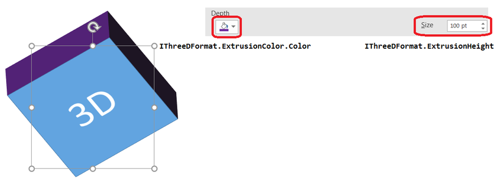

## **Overview**

Aspose.Slides for Python via .NET can create, edit, preserve, and render PowerPoint-style 3D formatting for shapes and text. This article covers 3D effects such as rotation, extrusion, bevels, lighting, material, gradient or picture fills, and 3D text.

{}

This article is about 3D formatting effects on PowerPoint shapes and text. It is not about inserting or editing standalone 3D model files. When you export a slide to an image, PDF, or HTML, Aspose.Slides renders those 3D effects into the exported 2D output.

{}

## **3D Formatting Concepts**

Use the [Shape.three_d_format](https://reference.aspose.com/slides/python-net/aspose.slides/shape/three_d_format/) property to apply 3D formatting to a shape. The property exposes [ThreeDFormat](https://reference.aspose.com/slides/python-net/aspose.slides/threedformat/), which controls the 3D scene for that shape.

For text, use the [TextFrameFormat.three_d_format](https://reference.aspose.com/slides/python-net/aspose.slides/textframeformat/three_d_format/) property. This applies 3D formatting to the text frame instead of the shape body.

The most important properties are:

| Property | What it controls | When to use it |
|---|---|---|
| [camera](https://reference.aspose.com/slides/python-net/aspose.slides/threedformat/camera/) | Viewpoint, preset camera type, rotation, zoom, and perspective. | Rotate the object in 3D space or match a PowerPoint 3D rotation preset. |
| [light_rig](https://reference.aspose.com/slides/python-net/aspose.slides/threedformat/light_rig/) | Light preset, direction, and light rotation. | Change how highlights and shadows appear on the 3D surface. |
| [material](https://reference.aspose.com/slides/python-net/aspose.slides/threedformat/material/) | Surface material, such as flat, matte, plastic, or metal. | Make the same geometry look flatter, softer, glossy, or metallic. |
| [extrusion_height](https://reference.aspose.com/slides/python-net/aspose.slides/threedformat/extrusion_height/) | How far the shape extends backward from its front face. | Turn a flat shape into a visibly thick 3D object. |
| [extrusion_color](https://reference.aspose.com/slides/python-net/aspose.slides/threedformat/extrusion_color/) | Color of the extruded sides. | Make depth visible or coordinate the side color with the front fill. |
| [depth](https://reference.aspose.com/slides/python-net/aspose.slides/threedformat/depth/) | Additional 3D depth used by PowerPoint 3D formatting. | Fine-tune depth for shapes or text, especially together with bevel and material settings. |
| [bevel_top](https://reference.aspose.com/slides/python-net/aspose.slides/threedformat/bevel_top/) and [bevel_bottom](https://reference.aspose.com/slides/python-net/aspose.slides/threedformat/bevel_bottom/) | Raised or rounded edges on the front and back faces. | Add a softened or molded edge instead of a sharp flat face. |
| [contour_color](https://reference.aspose.com/slides/python-net/aspose.slides/threedformat/contour_color/) and [contour_width](https://reference.aspose.com/slides/python-net/aspose.slides/threedformat/contour_width/) | Outline around the 3D object. | Emphasize the object boundary in rendered output. |

## **Create a 3D Shape**

A shape usually needs four kinds of settings before it looks convincingly 3D:

- Camera settings, because the default front view may hide the extrusion.
- Light settings, because lighting makes the faces and sides readable.
- Material settings, because the surface affects how light is rendered.
- Extrusion or depth settings, because a flat shape needs thickness.

The following example creates a rectangle, adds text to its front face, applies 3D formatting, saves the presentation as PPTX, and renders the slide to a PNG image.

```py
import aspose.pydrawing as drawing
import aspose.slides as slides

image_scale = 2

with slides.Presentation() as presentation:
    slide = presentation.slides[0]
    shape = slide.shapes.add_auto_shape(slides.ShapeType.RECTANGLE, 200, 150, 200, 200)
    shape.text_frame.text = "3D"
    shape.text_frame.paragraphs[0].paragraph_format.default_portion_format.font_height = 64

    shape.fill_format.fill_type = slides.FillType.SOLID
    shape.fill_format.solid_fill_color.color = drawing.Color.cornflower_blue

    shape.three_d_format.camera.camera_type = slides.CameraPresetType.ORTHOGRAPHIC_FRONT
    shape.three_d_format.camera.set_rotation(20, 30, 40)
    shape.three_d_format.light_rig.light_type = slides.LightRigPresetType.FLAT
    shape.three_d_format.light_rig.direction = slides.LightingDirection.TOP
    shape.three_d_format.material = slides.MaterialPresetType.FLAT
    shape.three_d_format.extrusion_height = 100
    shape.three_d_format.extrusion_color.color = drawing.Color.blue

    with slide.get_image(image_scale, image_scale) as thumbnail:
        thumbnail.save("shape_3d.png")

    presentation.save("shape_3d.pptx", slides.export.SaveFormat.PPTX)
```

The rendered slide image shows the rectangle as a thick 3D block:


## **Rotate a Shape with the Camera**

In PowerPoint, 3D rotation is configured from the 3-D Rotation pane. The X, Y, and Z rotation values correspond to the rotation you set through the camera API.


In Aspose.Slides, set the camera type and rotation through [ThreeDFormat.camera](https://reference.aspose.com/slides/python-net/aspose.slides/threedformat/camera/):

```py
shape.three_d_format.camera.camera_type = slides.CameraPresetType.ORTHOGRAPHIC_FRONT
shape.three_d_format.camera.set_rotation(20, 30, 40)
```

Use the camera when you need to change how the viewer sees the object. It does not change the 2D shape geometry on the slide. It changes the 3D viewpoint used by PowerPoint and by Aspose.Slides when rendering.

## **Add Extrusion and Depth**

Extrusion makes a shape look thick by extending it behind the front face. In PowerPoint, the depth control sets this visible thickness, and the color control sets the color of the side faces.



Set [ThreeDFormat.extrusion_height](https://reference.aspose.com/slides/python-net/aspose.slides/threedformat/extrusion_height/) for the thickness and [ThreeDFormat.extrusion_color](https://reference.aspose.com/slides/python-net/aspose.slides/threedformat/extrusion_color/) for the side color:

```py
shape.three_d_format.camera.set_rotation(20, 30, 40)
shape.three_d_format.extrusion_height = 100
shape.three_d_format.extrusion_color.color = drawing.Color.purple
```

Use [ThreeDFormat.depth](https://reference.aspose.com/slides/python-net/aspose.slides/threedformat/depth/) when you need to work with PowerPoint's depth value directly or combine depth with bevel, material, and text effects. In many shape scenarios, [ThreeDFormat.extrusion_height](https://reference.aspose.com/slides/python-net/aspose.slides/threedformat/extrusion_height/) is the clearer setting because it directly expresses the visible extrusion.

## **Use Gradient or Picture Fills with 3D Effects**

3D formatting is independent from the shape fill. You can apply a solid color, gradient, pattern, or picture fill to the front face and still use the same camera, light, material, and extrusion settings.

This example applies a gradient fill to the shape and a darker extrusion color to the sides:

```py
import aspose.pydrawing as drawing
import aspose.slides as slides

image_scale = 2

with slides.Presentation() as presentation:
    slide = presentation.slides[0]
    shape = slide.shapes.add_auto_shape(slides.ShapeType.RECTANGLE, 200, 150, 250, 250)
    shape.text_frame.text = "3D Gradient"
    shape.text_frame.paragraphs[0].paragraph_format.default_portion_format.font_height = 64

    shape.fill_format.fill_type = slides.FillType.GRADIENT
    shape.fill_format.gradient_format.gradient_stops.add(0, drawing.Color.blue)
    shape.fill_format.gradient_format.gradient_stops.add(100, drawing.Color.orange)

    shape.three_d_format.camera.camera_type = slides.CameraPresetType.ORTHOGRAPHIC_FRONT
    shape.three_d_format.camera.set_rotation(10, 20, 30)
    shape.three_d_format.light_rig.light_type = slides.LightRigPresetType.FLAT
    shape.three_d_format.light_rig.direction = slides.LightingDirection.TOP
    shape.three_d_format.material = slides.MaterialPresetType.FLAT
    shape.three_d_format.extrusion_height = 150
    shape.three_d_format.extrusion_color.color = drawing.Color.dark_orange

    with slide.get_image(image_scale, image_scale) as thumbnail:
        thumbnail.save("gradient_3d.png")
```

The rendered output keeps the gradient on the front face and renders the extrusion separately:


To use a picture fill instead, add the image to the presentation and assign it to the shape fill:

```py
with open("image.jpg", "rb") as image_file:
    image_data = image_file.read()

image = presentation.images.add_image(image_data)

shape.fill_format.fill_type = slides.FillType.PICTURE
shape.fill_format.picture_fill_format.picture.image = image
shape.fill_format.picture_fill_format.picture_fill_mode = slides.PictureFillMode.STRETCH

shape.three_d_format.camera.set_rotation(10, 20, 30)
shape.three_d_format.extrusion_height = 150
shape.three_d_format.extrusion_color.color = drawing.Color.dark_orange
```

The picture is rendered on the front face, while the extrusion is rendered as the 3D side surface:


## **Apply 3D Formatting to Text**

Shape 3D formatting affects the shape body. Text 3D formatting affects the text frame. This is useful for WordArt-like effects where the letters themselves need extrusion, material, lighting, and camera settings.

The following example creates text with a pattern fill, applies a WordArt transform, and configures 3D settings on [TextFrameFormat](https://reference.aspose.com/slides/python-net/aspose.slides/textframeformat/):

```py
import aspose.pydrawing as drawing
import aspose.slides as slides

image_scale = 2

with slides.Presentation() as presentation:
    slide = presentation.slides[0]
    shape = slide.shapes.add_auto_shape(slides.ShapeType.RECTANGLE, 200, 150, 250, 250)
    shape.fill_format.fill_type = slides.FillType.NO_FILL
    shape.line_format.fill_format.fill_type = slides.FillType.NO_FILL
    shape.text_frame.text = "3D Text"

    portion = shape.text_frame.paragraphs[0].portions[0]
    portion.portion_format.fill_format.fill_type = slides.FillType.PATTERN
    portion.portion_format.fill_format.pattern_format.fore_color.color = drawing.Color.dark_orange
    portion.portion_format.fill_format.pattern_format.back_color.color = drawing.Color.white
    portion.portion_format.fill_format.pattern_format.pattern_style = slides.PatternStyle.LARGE_GRID

    shape.text_frame.paragraphs[0].paragraph_format.default_portion_format.font_height = 128

    text_frame_format = shape.text_frame.text_frame_format
    text_frame_format.transform = slides.TextShapeType.ARCH_UP
    text_frame_format.three_d_format.extrusion_height = 3.5
    text_frame_format.three_d_format.depth = 3
    text_frame_format.three_d_format.material = slides.MaterialPresetType.PLASTIC
    text_frame_format.three_d_format.light_rig.direction = slides.LightingDirection.TOP
    text_frame_format.three_d_format.light_rig.light_type = slides.LightRigPresetType.BALANCED
    text_frame_format.three_d_format.light_rig.set_rotation(0, 0, 40)
    text_frame_format.three_d_format.camera.camera_type = slides.CameraPresetType.PERSPECTIVE_CONTRASTING_RIGHT_FACING

    with slide.get_image(image_scale, image_scale) as thumbnail:
        thumbnail.save("text_3d.png")

    presentation.save("text_3d.pptx", slides.export.SaveFormat.PPTX)
```

The text is rendered as curved, extruded 3D lettering:


## **Export and Rendering Behavior**

Aspose.Slides preserves 3D formatting when saving to PowerPoint formats such as PPTX. When rendering or exporting to fixed-layout formats, the 3D scene is rasterized or drawn into the output as a 2D result. This applies when you render slides to [PNG](/slides/python-net/convert-powerpoint-to-png/), export to [PDF](/slides/python-net/convert-powerpoint-to-pdf/), export to [HTML](/slides/python-net/convert-powerpoint-to-html/), or generate frames for [video conversion](/slides/python-net/convert-powerpoint-to-video/).

Keep these points in mind:

- Exported images and PDFs are not interactive. The object cannot be rotated by the viewer after export.
- The final appearance depends on the combination of camera, light rig, material, extrusion, fill, and slide scaling.
- If you need to inspect inherited or theme-based formatting values, read the [effective shape properties](/slides/python-net/shape-effective-properties/).
- Some output formats cannot store editable PowerPoint 3D formatting. In those formats, the visual result is rendered rather than preserved as editable 3D settings.

## **FAQ**

**Can Aspose.Slides create interactive 3D presentations?**

Aspose.Slides creates and renders PowerPoint 3D effects for shapes and text. It does not make exported images, PDFs, or HTML pages interactive 3D scenes that a viewer can rotate. In PPTX, the 3D formatting remains editable in PowerPoint where the format supports it.

**What is the difference between a 3D model and a 3D effect?**

A 3D model is a separate 3D object inserted into a presentation. A 3D effect is formatting applied to a regular PowerPoint shape or text, such as rotation, extrusion, bevel, lighting, and material. This article covers 3D effects.

**Which settings are required for a visible 3D shape?**

At minimum, set a camera rotation and either extrusion or depth. In practice, also set a light rig and material so the rendered faces have clear highlights and shadows.

**Can I apply 3D effects to both shapes and text?**

Yes. Use [Shape.three_d_format](https://reference.aspose.com/slides/python-net/aspose.slides/shape/three_d_format/) for the shape body and [TextFrameFormat.three_d_format](https://reference.aspose.com/slides/python-net/aspose.slides/textframeformat/three_d_format/) for text.

**Will 3D effects appear when exporting to images, PDF, HTML, or video frames?**

Yes. Aspose.Slides renders 3D effects when producing slide images, PDF output, HTML output, and frames used for video conversion. The exported output contains the rendered appearance, not an editable 3D object.

**Can I read the final 3D values after inheritance and theme settings are applied?**

Yes. Use the effective formatting APIs described in [Shape Effective Properties](/slides/python-net/shape-effective-properties/) to read final camera, light rig, bevel, and related 3D values.
