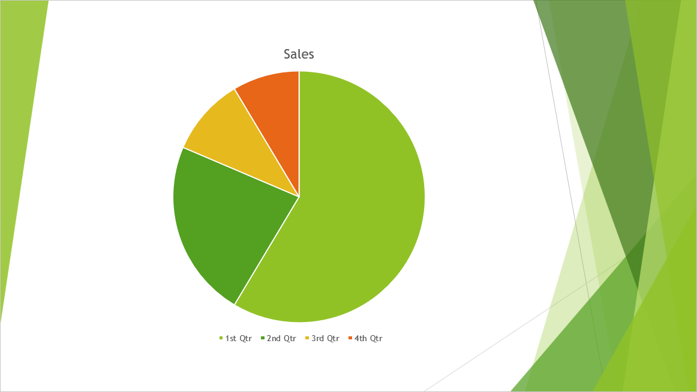

## **Overview**

TIFF (**Tagged Image File Format**) is a widely-used, lossless raster image format known for its exceptional quality and detailed preservation of graphics. Designers, photographers, and desktop publishers often choose TIFF to maintain layers, color accuracy, and original settings in their images.

Using Aspose.Slides, you can effortlessly convert your PowerPoint slides (PPT, PPTX) and OpenDocument slides (ODP) directly into high-quality TIFF images, ensuring your presentations retain maximum visual fidelity.

## **Convert a Presentation to TIFF**

Using the [save](https://reference.aspose.com/slides/python-net/aspose.slides/presentation/#methods) method provided by the [Presentation](https://reference.aspose.com/slides/python-net/aspose.slides/presentation/) class, you can quickly convert an entire PowerPoint presentation to TIFF. The resulting TIFF images correspond to the default slide size.

This Python code demonstrates how to convert a PowerPoint presentation to TIFF:

```py
import aspose.slides as slides

# Instantiate the Presentation class that represents a presentation file (PPT, PPTX, ODP, etc.).
with slides.Presentation("presentation.pptx") as presentation:
    # Save the presentation as TIFF.
    presentation.save("output.tiff", slides.export.SaveFormat.TIFF)
```

## **Convert a Presentation to Black-and-White TIFF**

The property [bw_conversion_mode](https://reference.aspose.com/slides/python-net/aspose.slides.export/tiffoptions/bw_conversion_mode/) in the [TiffOptions](https://reference.aspose.com/slides/python-net/aspose.slides.export/tiffoptions/) class allows you to specify the algorithm used when converting a colored slide or image to a black-and-white TIFF. Note that this setting applies only when the [compression_type](https://reference.aspose.com/slides/python-net/aspose.slides.export/tiffoptions/compression_type/) property is set to `CCITT4` or `CCITT3`.

Let's say we have a "sample.pptx" file with the following slide:



This Python code demonstrates how to convert the colored slide to a black-and-white TIFF:

```py
import aspose.slides as slides

tiff_options = slides.export.TiffOptions()
tiff_options.compression_type = slides.export.TiffCompressionTypes.CCITT4
tiff_options.bw_conversion_mode = slides.export.BlackWhiteConversionMode.DITHERING

with slides.Presentation("sample.pptx") as presentation:
    presentation.save("output.tiff", slides.export.SaveFormat.TIFF, tiff_options)
```

The result:


## **Convert a Presentation to TIFF with Custom Size**

If you require a TIFF image with specific dimensions, you can set your desired values using properties available in [TiffOptions](https://reference.aspose.com/slides/python-net/aspose.slides.export/tiffoptions/). For instance, the [image_size](https://reference.aspose.com/slides/python-net/aspose.slides.export/tiffoptions/image_size/) property allows you to define the size of the resulting image.

This Python code demonstrates how to convert a PowerPoint presentation to TIFF images with a custom size:

```py
import aspose.slides as slides
import aspose.pydrawing as drawing

# Instantiate the Presentation class that represents a presentation file (PPT, PPTX, ODP, etc.).
with slides.Presentation("sample.pptx") as presentation:
    tiff_options = slides.export.TiffOptions()

    # Set the compression type.
    tiff_options.compression_type = slides.export.TiffCompressionTypes.DEFAULT
    """
    Compression types:
        Default - Specifies the default compression scheme (LZW).
        None - Specifies no compression.
        CCITT3
        CCITT4
        LZW
        RLE
    """

    # Set the image DPI.
    tiff_options.dpi_x = 200
    tiff_options.dpi_y = 200

    # Set the image size.
    tiff_options.image_size = drawing.Size(1728, 1078)

    notes_options = slides.export.NotesCommentsLayoutingOptions()
    notes_options.notes_position = slides.export.NotesPositions.BOTTOM_FULL
    tiff_options.slides_layout_options = notes_options

    # Save the presentation as TIFF with the specified size.
    presentation.save("custom_size.tiff", slides.export.SaveFormat.TIFF, tiff_options)
```

## **Convert a Presentation to TIFF with Custom Image Pixel Format**

Using the [pixel_format](https://reference.aspose.com/slides/python-net/aspose.slides.export/tiffoptions/pixel_format/) property from the [TiffOptions](https://reference.aspose.com/slides/python-net/aspose.slides.export/tiffoptions/) class, you can specify your preferred pixel format for the resulting TIFF image.

This Python code demonstrates how to convert a PowerPoint presentation to a TIFF image with a custom pixel format:

```py
import aspose.slides as slides

# Instantiate the Presentation class that represents a presentation file (PPT, PPTX, ODP, etc.).
with slides.Presentation("Presentation.pptx") as presentation:
    tiff_options = slides.export.TiffOptions()

    tiff_options.pixel_format = slides.export.ImagePixelFormat.FORMAT_8BPP_INDEXED
    """
    ImagePixelFormat contains the following values (as stated in the documentation):
        FORMAT_1BPP_INDEXED - 1 bit per pixel, indexed.
        FORMAT_4BPP_INDEXED - 4 bits per pixel, indexed.
        FORMAT_8BPP_INDEXED - 8 bits per pixel, indexed.
        FORMAT_24BPP_RGB    - 24 bits per pixel, RGB.
        FORMAT_32BPP_ARGB   - 32 bits per pixel, ARGB.
    """

    # Save the presentation as TIFF with the specified image size.
    presentation.save("Custom_Image_Pixel_Format.tiff", slides.export.SaveFormat.TIFF, tiff_options)
```

{}

Check out Aspose's [FREE PowerPoint to Poster converter](https://products.aspose.app/slides/conversion/convert-ppt-to-poster-online).

{}

## **FAQ**

**Can I convert an individual slide instead of entire PowerPoint presentation to TIFF?**

Yes. Aspose.Slides allows you to convert individual slides from PowerPoint and OpenDocument presentations into TIFF images separately.

**Is there any limit to the number of slides when converting a presentation to TIFF?**

No, Aspose.Slides does not impose any restrictions on the number of slides. You can convert presentations of any size into TIFF format.

**Are PowerPoint animations and transition effects preserved when converting slides to TIFF?**

No, TIFF is a static image format. Therefore, animations and transition effects are not preserved; only static snapshots of slides are exported.
