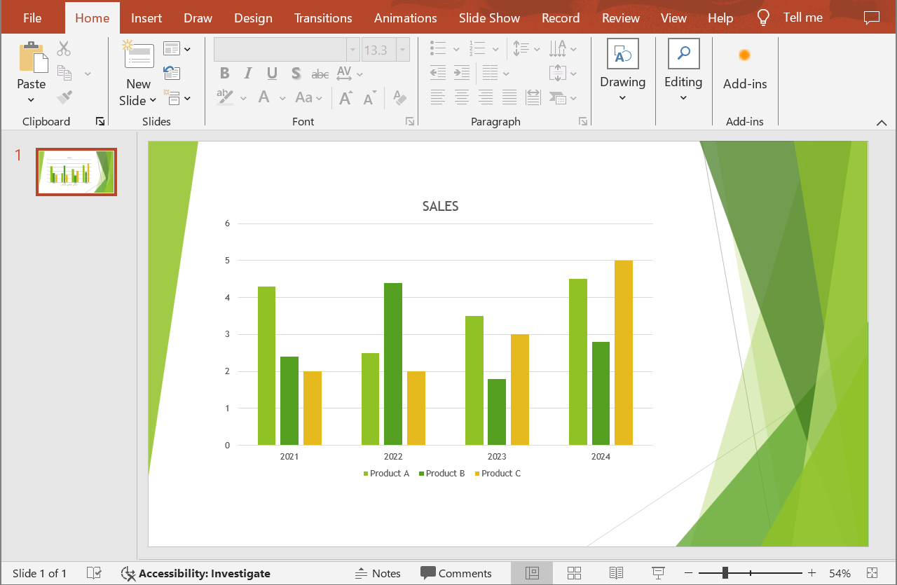
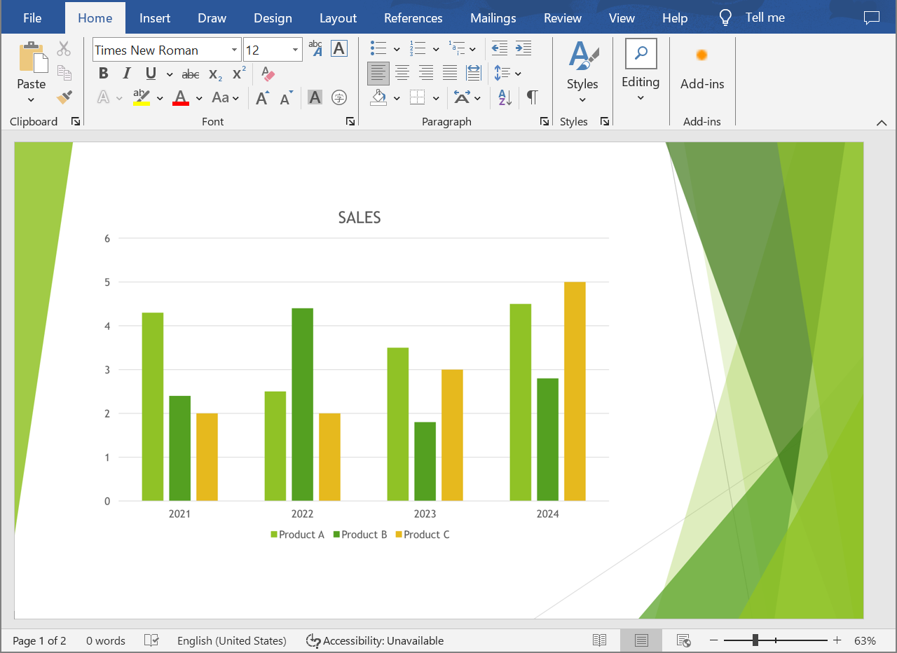

## **Overview**

This article provides a solution for developers on converting PowerPoint and OpenDocument presentations to Word documents using Aspose.Slides for Python via .NET and Aspose.Words for Python via .NET. The step-by-step guide walks you through every stage of the conversion process.

## **Convert a Presentation to a Word Document**

Follow the instructions below to convert a PowerPoint or OpenDocument presentation to a Word document:

1. Instantiate the [Presentation](https://reference.aspose.com/slides/python-net/aspose.slides/presentation/) class and load a presentation file.
2. Instantiate the [Document](https://reference.aspose.com/words/python-net/aspose.words/document/) and [DocumentBuilder](https://reference.aspose.com/words/python-net/aspose.words/documentbuilder/) classes to generate a Word document.
3. Set the page size for the Word document to match that of the presentation using the [DocumentBuilder.page_setup](https://reference.aspose.com/words/python-net/aspose.words/documentbuilder/page_setup/) property.
4. Set margins in the Word document using the [DocumentBuilder.page_setup](https://reference.aspose.com/words/python-net/aspose.words/documentbuilder/page_setup/) property.
5. Go through all the presentation slides using the [Presentation.slides](https://reference.aspose.com/slides/python-net/aspose.slides/presentation/slides/) property.
    - Generate a slide image using the `get_image` method from the [Slide](https://reference.aspose.com/slides/python-net/aspose.slides/slide/) class and save it to a memory stream.
    - Add the slide image to the Word document using the `insert_image` method from the [DocumentBuilder](https://reference.aspose.com/words/python-net/aspose.words/documentbuilder/) class.
6. Save the Word document to a file.

Let's say we have a presentation "sample.pptx" that looks like this:



The following Python code example demonstrates how to convert the PowerPoint presentation to a Word document:

```py
import aspose.slides as slides
import aspose.words as words

# Load a presentation file.
with slides.Presentation("sample.pptx") as presentation:

    # Create Document and DocumentBuilder objects.
    document = words.Document()
    builder = words.DocumentBuilder(document)

    # Set the page size in the Word document.
    slide_size = presentation.slide_size.size
    builder.page_setup.page_width = slide_size.width
    builder.page_setup.page_height = slide_size.height

    # Set margins in the Word document.
    builder.page_setup.left_margin = 0
    builder.page_setup.right_margin = 0
    builder.page_setup.top_margin = 0
    builder.page_setup.bottom_margin = 0

    scale_x = 2
    scale_y = 2

    # Go through all the presentation slides.
    for slide in presentation.slides:

        # Generate a slide image and save it to a memory stream.
        with slide.get_image(scale_x, scale_y) as image:
            image_stream = BytesIO()
            image.save(image_stream, slides.ImageFormat.PNG)

        # Add the slide image to the Word document.
        image_stream.seek(0)
        image_width = builder.page_setup.page_width
        image_height = builder.page_setup.page_height
        builder.insert_image(image_stream.read(), image_width, image_height)

        builder.insert_break(words.BreakType.PAGE_BREAK)

    # Save the Word document to a file.
    document.save("output.docx")
```

The result:



{} 

Try our [**Online PPT to Word Converter**](https://products.aspose.app/slides/conversion/ppt-to-word) to see what you could gain from converting PowerPoint and OpenDocument presentations to Word documents. 

{}

## **FAQ**

**What components need to be installed to convert PowerPoint and OpenDocument presentations to Word documents?**

You only need to add the respective packages for [Aspose.Slides for Python via .NET](https://pypi.org/project/Aspose.Slides/) and [Aspose.Words for Python .NET](https://pypi.org/project/aspose-words/) to your Python project. Both packages operate as standalone APIs, and there is no requirement for Microsoft Office to be installed.

**Are all PowerPoint and OpenDocument presentation formats supported?**

Aspose.Slides for Python .NET [supports all presentation formats](/slides/python-net/supported-file-formats/), including PPT, PPTX, ODP, and other common file types. This ensures that you can work with presentations created in various versions of Microsoft PowerPoint.
