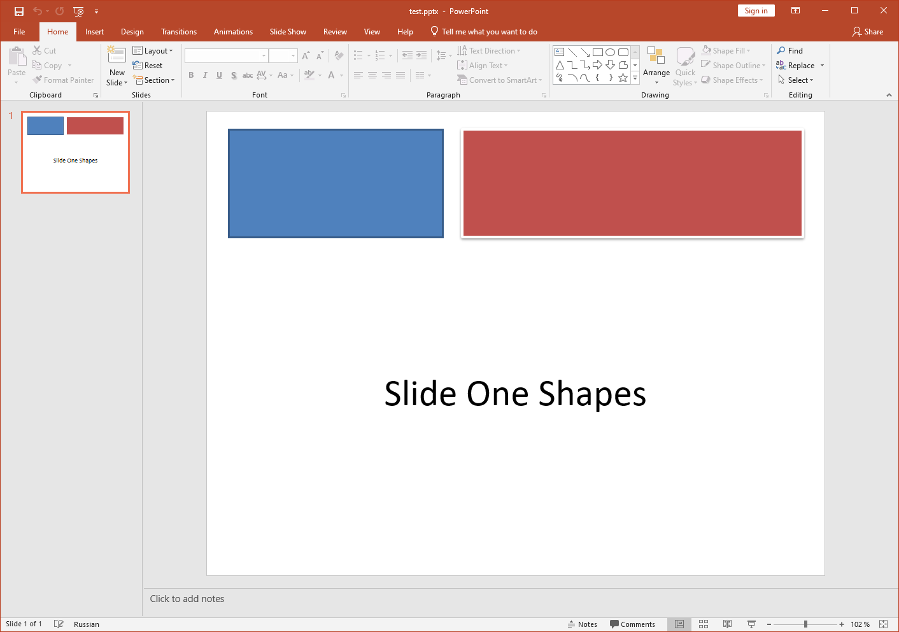

## **About XPS**
Microsoft developed [XPS](https://docs.fileformat.com/page-description-language/xps/) as an alternative to [PDF](https://docs.fileformat.com/pdf/).  It allows you to print content by outputting a file very similar to a PDF. The XPS format is based on XML. The layout or structure of an XPS file remains the same on all operating systems and printers. 

## When to Use Microsoft XPS Format

{} 

To see how Aspose.Slides converts PPT or PPTX presentation to the XPS format, you can check out [this free online converter app](https://products.aspose.app/slides/conversion). 

{} 

If you want to cut down on storage costs, you can convert your Microsoft PowerPoint presentation to the XPS format. This way, you will find it easier to save, share, and print your documents. 

Microsoft continues to implement strong support for XPS in Windows (even in Windows 10), so you may want to consider saving files to this format. If you are dealing with Windows 8.1, Windows 8, Windows 7, and Windows Vista, then XPS might actually be your best option for certain operations. 

- **Windows 8** uses the OXPS (Open XPS) format for XPS files. OXPS is a standardized version of the original XPS format. Windows 8 provides better support for XPS files than it does for PDF files. 
  - **XPS:** Built-in XPS viewer/reader and printing to XPS feature available. 
  - **PDF**: PDF reader available but no printing to PDF feature. 

-  **Windows 7 and Windows Vista** use the original XPS format. These operating systems also provide better support for XPS files than they do for PDFs. 
  - **XPS**: Built-in XPS viewer and printing to XPS feature available. 
  - **PDF**: No PDF reader. No printing to PDF feature. 

|<p>**Input PPT(X):</p><p>****</p>|<p>**Output XPS:</p><p>****</p>|
| :- | :- |


Microsoft eventually implemented support for printing operations in PDF through the Print to PDF feature in Windows 10. Previously, users were expected to print documents through the XPS format. 

## XPS Conversion with Aspose.Slides

In [**Aspose.Slides**](https://products.aspose.com/slides/python-net/) for .NET, you can use the [**Save**](https://reference.aspose.com/slides/python-net/aspose.slides/presentation/) method exposed by the [Presentation](https://reference.aspose.com/slides/python-net/aspose.slides/presentation/) class to convert the entire presentation into an XPS document. 

When converting a presentation to XPS, you have to save the presentation using either of these settings:

- Default settings (without [**XPSOptions**](https://reference.aspose.com/slides/python-net/aspose.slides.export/xpsoptions/))
- Custom settings (with [**XPSOptions**](https://reference.aspose.com/slides/python-net/aspose.slides.export/xpsoptions/))

### **Converting Presentations to XPS Using Default Settings**

This sample code in Python shows you how to convert a presentation to an XPS document using standard settings:

```py
import aspose.slides as slides

# Instantiate a Presentation object that represents a presentation file
pres = slides.Presentation("Convert_XPS.pptx")

# Saving the presentation to XPS document
pres.save("XPS_Output_Without_XPSOption_out.xps", slides.export.SaveFormat.XPS)
```


### **Converting Presentations to XPS Using Custom Settings**
This sample code shows you how to convert a presentation to an XPS document using custom settings in Python:

```py
import aspose.slides as slides

# Instantiate a Presentation object that represents a presentation file
pres = slides.Presentation("Convert_XPS_Options.pptx")

# Instantiate the TiffOptions class
options = slides.export.XpsOptions()

# Save MetaFiles as PNG
options.save_metafiles_as_png = True

# Save the presentation to XPS document
pres.save("XPS_With_Options_out.xps", slides.export.SaveFormat.XPS, options)
```

## **FAQ**

**Can I save to XPS into a stream instead of a file?**

Yes—Aspose.Slides lets you export directly to a stream, which is ideal for web APIs, server-side pipelines, or any scenario where you want to send the XPS without touching the file system.

**Are hidden slides carried over to XPS, and can I exclude them?**

By default, only regular (visible) slides are rendered. You can [include or exclude hidden slides](https://reference.aspose.com/slides/python-net/aspose.slides.export/xpsoptions/show_hidden_slides/) through [export settings](https://reference.aspose.com/slides/python-net/aspose.slides.export/xpsoptions/) before saving to XPS, ensuring the output contains exactly the pages you intend.
