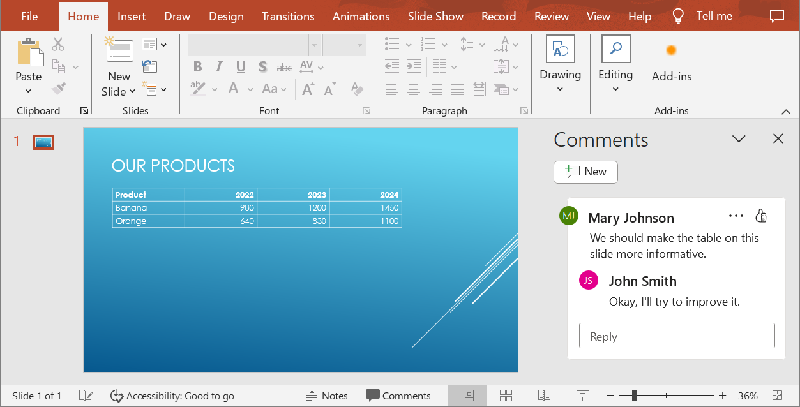

{}

In **Aspose.Slides 21.9**, we implemented support for HTML5 export. However, if you prefer to export your PowerPoint to HTML using WebExtensions, see [this article](/slides/net/web-extensions/) instead. 

{} 

The export to HTML5 process here allows you to convert PowerPoint to HTML without web extensions or dependencies. This way, using your own templates, you can apply very flexible options that define the export process and the resulting HTML, CSS, JavaScript, and animation attributes. 

## **Export PowerPoint to HTML5**

This python code shows how you to export a presentation to HTML5 without web extensions and dependencies:

```py
import aspose.slides as slides

with slides.Presentation("pres.pptx") as presentation:
    presentation.save("index.html", slides.export.SaveFormat.HTML5)
```

{} 

In this case, you get clean HTML. 

{}

You may want to specify the settings for shape animations and slide transitions this way:

```py
import aspose.slides as slides

with slides.Presentation("pres.pptx") as presentation:
    options = slides.export.Html5Options()
    options.animate_shapes = False
    options.animate_transitions = False

    presentation.save("index.html", slides.export.SaveFormat.HTML5, options)
```

## **Export PowerPoint to HTML**

This python code demonstrates the standard PowerPoint to HTML process:

```py
import aspose.slides as slides

with slides.Presentation("pres.pptx") as presentation:
    presentation.save("index.html", slides.export.SaveFormat.HTML)
```

In this case, the presentation content is rendered through SVG in a form like this:

```html
<body>
<div class="slide" name="slide" id="slideslideIface1">
     <svg version="1.1">
         <g> THE SLIDE CONTENT GOES HERE </g>
     </svg>
</div>
</body>
```

{} 

When you use this method to export PowerPoint to HTML, due to the SVG rendering, you will not be able to apply styles or animate specific elements. 

{}

## **Export PowerPoint to HTML5 Slide View**

**Aspose.Slides** allows you to convert a PowerPoint presentation to an HTML5 document in which the slides are presented in a slide view mode. In this case, when you open the resulting HTML5 file in a browser, you see the presentation in slide view mode on a web page. 

This Python code demonstrates the PowerPoint to HTML5 Slide View export process:

```python
import aspose.slides as slides

with slides.Presentation("pres.pptx") as pres:
    # Export a presentation containing slides transitions, animations, and shapes animations to HTML5
    options = slides.export.Html5Options()
    options.animate_shapes = True
    options.animate_transitions = True

    # Save presentation
    pres.save("HTML5-slide-view.html", slides.export.SaveFormat.HTML5, options)
```

## **Convert a Presentation to an HTML5 Document with Comments**

Comments in PowerPoint are a tool that allows users to leave notes or feedback on presentation slides. They are especially useful in collaborative projects, where multiple people can add their suggestions or remarks to specific slide elements without altering the main content. Each comment shows the author's name, making it easy to track who left the remark.

Let's say we have the following PowerPoint presentation saved in the "sample.pptx" file.



When you convert a PowerPoint presentation to an HTML5 document, you can easily specify whether to include comments from the presentation in the output document. To do this, you need to specify the display parameters for comments in the `notes_comments_layouting` property of the [Html5Options](https://reference.aspose.com/slides/python-net/aspose.slides.export/html5options/) class.

The following code example converts a presentation to an HTML5 document with comments displayed to the right of the slides.
```py
html5_options = Html5Options()
html5_options.notes_comments_layouting.comments_position = CommentsPositions.RIGHT

with Presentation("sample.pptx") as presentation:
    presentation.save("output.html", SaveFormat.HTML5, html5_options)
```

The "output.html" document is shown in the image below.


## **FAQ**

**Can I control whether object animations and slide transitions will play in HTML5?**

Yes, HTML5 provides separate options to enable or disable [shape animations](https://reference.aspose.com/slides/python-net/aspose.slides.export/html5options/animate_shapes/) and [slide transitions](https://reference.aspose.com/slides/python-net/aspose.slides.export/html5options/animate_transitions/).

**Is the output of comments supported, and where can they be placed relative to the slide?**

Yes, comments can be added in HTML5 and positioned (for example, to the right of the slide) through [layout settings](https://reference.aspose.com/slides/python-net/aspose.slides.export/html5options/notes_comments_layouting/) for notes and comments.

**Can I skip links that invoke JavaScript for security or CSP reasons?**

Yes, there is a [setting](https://reference.aspose.com/slides/python-net/aspose.slides.export/html5options/skip_java_script_links/) that allows you to skip hyperlinks with JavaScript calls during saving. This helps comply with strict security policies.
