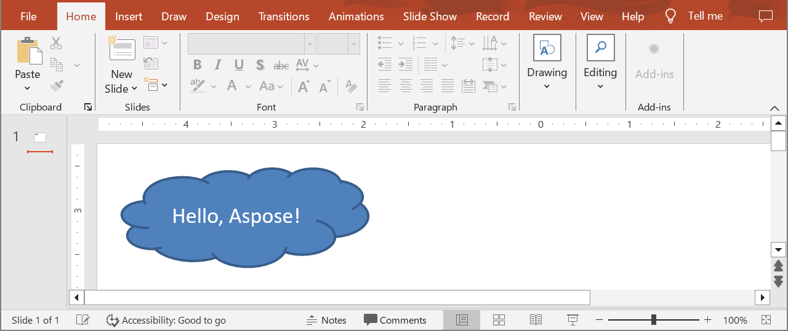

## **Overview**

Aspose.Slides for Python lets you build a brand‑new presentation file entirely in code. This article shows the core workflow—creating a [Presentation](https://reference.aspose.com/slides/python-net/aspose.slides/presentation/) object, grabbing the first slide, injecting a simple shape, and persisting the result—so you can see how little setup is required to generate a presentation without Microsoft Office. Because the same API writes PPT, PPTX, and ODP files, you can target both traditional PowerPoint and OpenDocument formats from a single code base. Aspose.Slides is suited to desktop, web, or server environments, giving your Python application an efficient starting point for adding richer content such as text, images, or charts once the initial slide deck is in place.

## **Create a Presentation**

Creating a PowerPoint file from scratch in Aspose.Slides for Python is as direct as instantiating the [Presentation](https://reference.aspose.com/slides/python-net/aspose.slides/presentation/) class. The constructor automatically supplies a blank deck with a single slide, giving you an immediate canvas for shapes, text, charts, or any other content your application needs. Once you modify that slide—or add new ones—you can persist the result to PPTX, legacy PPT, or even OpenDocument formats. The short code sample below illustrates this workflow by adding a simple shape onto the first slide.

1. Create an instance of the [Presentation](https://reference.aspose.com/slides/python-net/aspose.slides/presentation/) class.
1. Get a reference to the slide by its index.
1. Add an [AutoShape](https://reference.aspose.com/slides/python-net/aspose.slides/autoshape/) object of `CLOUD` type using the `add_auto_shape` method exposed by the `shapes` collection.
1. Add text to the auto-shape.
1. Save the modified presentation as a PPTX file.

In the example below, a cloud shape is added to the first slide of the presentation.

```py
import aspose.slides as slides

# Instantiate the Presentation class that represents a presentation file.
with slides.Presentation() as presentation:
    # Get the first slide.
    slide = presentation.slides[0]

    # Add an auto-shape of type CLOUD.
    auto_shape = slide.shapes.add_auto_shape(slides.ShapeType.CLOUD, 20, 20, 200, 80)
    auto_shape.text_frame.text = "Hello, Aspose!"

    # Save the presentation as a PPTX file.
    presentation.save("new_presentation.pptx", slides.export.SaveFormat.PPTX)
```

The result:



## **FAQ**

**What formats can I save a new presentation to?**

You can save to [PPTX, PPT, and ODP](/slides/python-net/save-presentation/), and export to [PDF](/slides/python-net/convert-powerpoint-to-pdf/), [XPS](/slides/python-net/convert-powerpoint-to-xps/), [HTML](/slides/python-net/convert-powerpoint-to-html/), [SVG](/slides/python-net/convert-powerpoint-to-png/), and [images](/slides/python-net/convert-powerpoint-to-png/), among others.

**Can I start from a template (POTX/POTM) and save as a regular PPTX?**

Yes. Load the template and save to the desired format; POTX/POTM/PPTM and similar formats [are supported](/slides/python-net/supported-file-formats/).

**How do I control slide size/aspect ratio when creating a presentation?**

Set the [slide size](/slides/python-net/slide-size/) (including presets like 4:3 and 16:9 or custom dimensions) and choose how content should scale.

**In what units are sizes and coordinates measured?**

In points: 1 inch equals 72 units.

**How do I handle very large presentations (with many media files) to reduce memory usage?**

Use [BLOB management strategies](/slides/python-net/manage-blob/), limit in-memory storage by leveraging temporary files, and prefer file-based workflows over purely in-memory streams.

**Can I create/save presentations in parallel?**

You cannot operate on the same [Presentation](https://reference.aspose.com/slides/python-net/aspose.slides/presentation/) instance from [multiple threads](/slides/python-net/multithreading/). Run separate, isolated instances per thread or process.

**How do I remove the trial watermark and limitations?**

[Apply a license](/slides/python-net/licensing/) once per process. The license XML must remain unmodified, and the license setup should be synchronized if multiple threads are involved.

**Can I digitally sign the PPTX I create?**

Yes. [Digital signatures](/slides/python-net/digital-signature-in-powerpoint/) (adding and verifying) are supported for presentations.

**Are macros (VBA) supported in created presentations?**

Yes. You can [create/edit VBA projects](/slides/python-net/presentation-via-vba/) and save macro-enabled files such as PPTM/PPSM.
