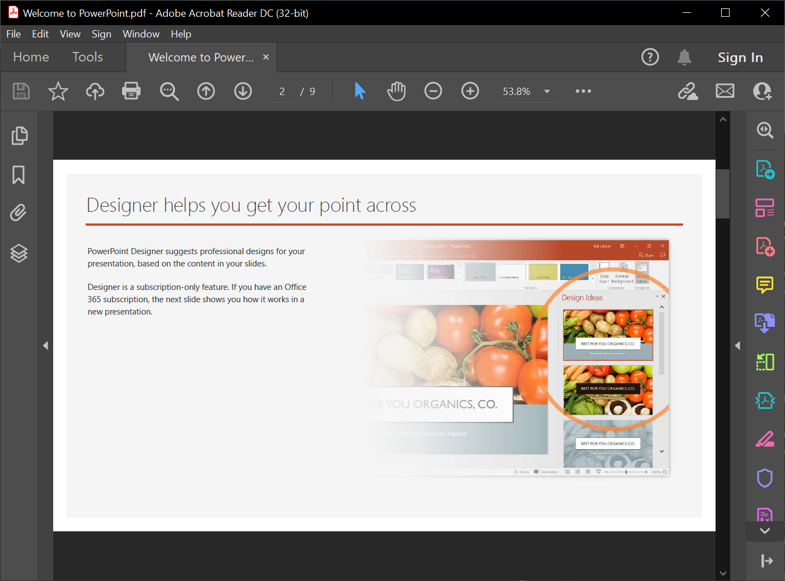

## **Overview**

With [**Aspose.Slides for Python via .NET**](https://products.aspose.com/slides/python-net/), you can import content into a presentation from other file formats. The [SlideCollection](https://reference.aspose.com/slides/python-net/aspose.slides/slidecollection/) class provides methods to import slides from PDF, HTML, and other sources.

## **Convert a PDF to a Presentation**

This section shows how to convert a PDF into a presentation using Aspose.Slides. It walks you through importing the PDF, turning its pages into slides, and saving the result as a PPTX file.



1. Create an instance of the [Presentation](https://reference.aspose.com/slides/python-net/aspose.slides/presentation/) class.
2. Call the [add_from_pdf](https://reference.aspose.com/slides/python-net/aspose.slides/slidecollection/add_from_pdf/) method and pass the PDF file.
3. Use the [save](https://reference.aspose.com/slides/python-net/aspose.slides/presentation/save/) method to save the presentation in PowerPoint format.

The following Python example demonstrates converting a PDF to a presentation:

```py
import aspose.slides as slides

with slides.Presentation() as presentation:
    presentation.slides.remove_at(0)

    presentation.slides.add_from_pdf("sample.pdf")

    presentation.save("output.pptx", slides.export.SaveFormat.PPTX)
```

{}

You may want to try **Aspose’s free** [PDF to PowerPoint](https://products.aspose.app/slides/import/pdf-to-powerpoint) web app—it’s a live implementation of the process described here.

{}

## **Convert an HTML to a Presentation**

This section shows how to import HTML content into a presentation using Aspose.Slides. It covers loading the HTML, transforming it into slides with preserved text, images, and basic formatting, and saving the result as a PPTX file.

1. Create an instance of the [Presentation](https://reference.aspose.com/slides/python-net/aspose.slides/presentation/) class.
2. Call the [add_from_html](https://reference.aspose.com/slides/python-net/aspose.slides/slidecollection/add_from_html/) method and pass the HTML file. 
3. Use the [save](https://reference.aspose.com/slides/python-net/aspose.slides/presentation/save/) method to save the presentation in PowerPoint format.

The following Python example demonstrates converting an HTML to a presentation:

```python
import aspose.slides as slides

with slides.Presentation() as presentation:
    presentation.slides.remove_at(0)

    with open("page.html", "rb") as html_stream:
        presentation.slides.add_from_html(html_stream)

    presentation.save("output.pptx", slides.export.SaveFormat.PPTX)
```

## **FAQ**

**Are tables preserved when importing a PDF, and can their detection be improved?**

Tables can be detected during import; [PdfImportOptions](https://reference.aspose.com/slides/python-net/aspose.slides.importing/pdfimportoptions/) includes a [detect_tables](https://reference.aspose.com/slides/python-net/aspose.slides.importing/pdfimportoptions/detect_tables/) parameter that enables table recognition. The effectiveness depends on the PDF’s structure.

{}

You can also use Aspose.Slides to convert HTML into other popular file formats:

* [HTML to image](https://products.aspose.com/slides/python-net/conversion/html-to-image/)
* [HTML to JPG](https://products.aspose.com/slides/python-net/conversion/html-to-jpg/)
* [HTML to XML](https://products.aspose.com/slides/python-net/conversion/html-to-xml/)
* [HTML to TIFF](https://products.aspose.com/slides/python-net/conversion/html-to-tiff/)

{}
