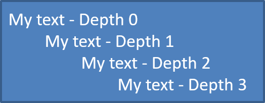
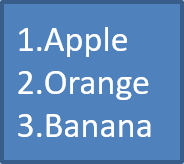

## **Overview**

Managing bulleted and numbered lists effectively is important when creating impactful presentations. With Aspose.Slides for Python, you can easily automate list formatting in your slides programmatically. This article guides you through clear examples of how to create, modify, and customize bulleted and numbered lists using Python. Discover simple yet powerful ways to control indentation, styling, numbering schemes, and bullets, allowing your presentations to look professional and consistent every time.

**Why Use Bulleted Lists?**

Bulleted lists help you organize and clearly present information, enhancing readability and engagement. Typically, a bulleted list serves three key purposes:

- Highlights important information, immediately capturing attention.
- Enables readers to quickly scan and identify main points.
- Efficiently communicates essential details in a concise format.

**Why Use Numbered Lists?**

Numbered lists are another valuable tool for clearly organizing and presenting your content. They are especially useful when the sequence or hierarchy of items matters. Use numbered lists instead of bullet points when the steps or items must follow a specific order (for example, *Step 1, Step 2, Step 3,* etc.), or when you need to reference particular steps later in your text (such as, *refer back to Step 3*). This makes your instructions or explanations clearer, easier to follow, and ensures readers can easily navigate and reference your content.

## **Create Symbol Bullets**

To create a bulleted list, follow these steps:

1. Create an instance of the [Presentation](https://reference.aspose.com/slides/python-net/aspose.slides/presentation/) class.
1. Access the slide (in which you want to add the bulleted list) from the slide collection using the [ISlide](https://reference.aspose.com/slides/python-net/aspose.slides/islide/) object.
1. Add an [AutoShape](https://reference.aspose.com/slides/python-net/aspose.slides/autoshape/) to the selected slide.
1. Access the [TextFrame](https://reference.aspose.com/slides/python-net/aspose.slides/textframe/) of the added shape.
1. Remove the default paragraph in the text frame.
1. Create the first paragraph using the [Paragraph](https://reference.aspose.com/slides/python-net/aspose.slides/paragraph/) class.
1. Set the bullet type to `SYMBOL`, and define the bullet character.
1. Set the paragraph text.
1. Set the paragraph indent to control bullet placement.
1. Set the bullet color.
1. Set the bullet height.
1. Add the created paragraph to the text frame’s paragraph collection.
1. Add a second paragraph and repeat steps 7–12.
1. Save the presentation.

The following Python code demonstrates how to create a bulleted list in a slide:

```py
import aspose.slides as slides
import aspose.pydrawing as draw

def create_paragraph(text):
    paragraph = slides.Paragraph()
    paragraph.paragraph_format.bullet.type = slides.BulletType.SYMBOL
    paragraph.paragraph_format.bullet.char = '*'
    paragraph.paragraph_format.indent = 15
    paragraph.paragraph_format.bullet.is_bullet_hard_color = slides.NullableBool.TRUE
    paragraph.paragraph_format.bullet.color.color = draw.Color.indian_red
    paragraph.paragraph_format.bullet.height = 100
    paragraph.text = text
    return paragraph


with slides.Presentation() as presentation:
    slide = presentation.slides[0]
    auto_shape = slide.shapes.add_auto_shape(slides.ShapeType.RECTANGLE, 20, 20, 200, 50)

    text_frame = auto_shape.text_frame
    text_frame.paragraphs.clear()

    paragraph1 = create_paragraph("The first paragraph")
    text_frame.paragraphs.add(paragraph1)

    paragraph2 = create_paragraph("The second paragraph")
    text_frame.paragraphs.add(paragraph2)

    presentation.save("symbol_bullets.pptx", slides.export.SaveFormat.PPTX)
```

The result:


## **Create Picture Bullets**

Aspose.Slides for Python via .NET allows you to customize bullets in bulleted lists. You can replace standard bullets with custom symbols or images. If you want to add visual interest to a list or draw more attention to specific entries, you can use your own image as the bullet.

 {}

Ideally, if you plan to replace the regular bullet symbol with an image, it's best to choose a simple graphic with a transparent background. Such images work well as custom bullet symbols.

Keep in mind that the image will be scaled down to a very small size. For that reason, we strongly recommend selecting an image that remains clear and visually effective when used as a bullet in a list.

{}

To create a picture bullet, follow these steps:

1. Create an instance of the [Presentation](https://reference.aspose.com/slides/python-net/aspose.slides/presentation/) class.
1. Access the desired slide from the slide collection using the [ISlide](https://reference.aspose.com/slides/python-net/aspose.slides/islide/) object.
1. Add an [AutoShape](https://reference.aspose.com/slides/python-net/aspose.slides/autoshape/) to the selected slide using the `add_auto_shape` method.
1. Access the [TextFrame](https://reference.aspose.com/slides/python-net/aspose.slides/textframe/) of the added shape.
1. Remove the default paragraph from the text frame.
1. Load an image from disk, add it to [Presentation.images](https://reference.aspose.com/slides/python-net/aspose.slides/presentation/images/), and get the [IPPImage](https://reference.aspose.com/slides/python-net/aspose.slides/ippimage/) instance returned by the [add_image](https://reference.aspose.com/slides/python-net/aspose.slides/imagecollection/#methods) method.
1. Create the first paragraph instance using the [Paragraph](https://reference.aspose.com/slides/python-net/aspose.slides/paragraph/) class.
1. Set the bullet type to `PICTURE`, then assign the image.
1. Set the paragraph text.
1. Set the paragraph indent to position the bullet.
1. Set the bullet color.
1. Set the bullet height.
1. Add the paragraph to the text frame's paragraph collection.
1. Add a second paragraph and repeat steps 8–13.
1. Save the presentation.

Let's say we have an "image.png":


The following Python code shows how to create picture bullets in a slide:

```py
import aspose.slides as slides

def create_paragraph(text, image):
    paragraph = slides.Paragraph()
    paragraph.paragraph_format.bullet.type = slides.BulletType.PICTURE
    paragraph.paragraph_format.bullet.picture.image = image
    paragraph.paragraph_format.indent = 15
    paragraph.paragraph_format.bullet.height = 100
    paragraph.text = text
    return paragraph


with slides.Presentation() as presentation:
    slide = presentation.slides[0]
    auto_shape = slide.shapes.add_auto_shape(slides.ShapeType.RECTANGLE, 20, 20, 200, 50)

    text_frame = auto_shape.text_frame
    text_frame.paragraphs.clear()

    with open("image.png", "rb") as image_stream:
        bullet_image = presentation.images.add_image(image_stream)

    paragraph1 = create_paragraph("The first paragraph", bullet_image)
    text_frame.paragraphs.add(paragraph1)

    paragraph2 = create_paragraph("The second paragraph", bullet_image)
    text_frame.paragraphs.add(paragraph2)

    presentation.save("picture_bullets.pptx", slides.export.SaveFormat.PPTX)
```

The result:


## **Create Multilevel Lists**

To create a bulleted list that contains items on multiple levels (sub-lists under main bullets), follow these steps:

1. Create an instance of the [Presentation](https://reference.aspose.com/slides/python-net/aspose.slides/presentation/) class.
1. Access the desired slide from the slide collection using the [ISlide](https://reference.aspose.com/slides/python-net/aspose.slides/islide/) object.
1. Add an [AutoShape](https://reference.aspose.com/slides/python-net/aspose.slides/autoshape/) to the selected slide using the `add_auto_shape` method.
1. Access the [TextFrame](https://reference.aspose.com/slides/python-net/aspose.slides/textframe/) of the added shape.
1. Remove the default paragraph from the text frame.
1. Create the first [Paragraph](https://reference.aspose.com/slides/python-net/aspose.slides/paragraph/) instance and set its depth to 0 (main level).
1. Create the second paragraph and set its depth to 1 (first sub-level).
1. Create the third paragraph and set its depth to 2 (second sub-level).
1. Create the fourth paragraph and set its depth to 3 (third sub-level).
1. Add all created paragraphs to the text frame's paragraph collection.
1. Save the presentation.

The following Python code shows how to create a multilevel bulleted list:

```py
import aspose.slides as slides

with slides.Presentation() as presentation:
    slide = presentation.slides[0]
    auto_shape = slide.shapes.add_auto_shape(slides.ShapeType.RECTANGLE, 20, 20, 260, 110)

    text_frame = auto_shape.text_frame
    text_frame.paragraphs.clear()

    paragraph1 = slides.Paragraph()
    paragraph1.paragraph_format.depth = 0
    paragraph1.text = "My text - Depth 0"
    text_frame.paragraphs.add(paragraph1)

    paragraph2 = slides.Paragraph()
    paragraph2.paragraph_format.depth = 1
    paragraph2.text = "My text - Depth 1"
    text_frame.paragraphs.add(paragraph2)

    paragraph3 = slides.Paragraph()
    paragraph3.paragraph_format.depth = 2
    paragraph3.text = "My text - Depth 2"
    text_frame.paragraphs.add(paragraph3)

    paragraph4 = slides.Paragraph()
    paragraph4.paragraph_format.depth = 3
    paragraph4.text = "My text - Depth 3"
    text_frame.paragraphs.add(paragraph4)

    presentation.save("multilevel_bullets.pptx", slides.export.SaveFormat.PPTX)
```

The result:



## **Create Numbered Bullets**

Creating clear and organized numbered lists is straightforward with Aspose.Slides for Python. Numbered lists significantly enhance readability and help guide your audience through steps or ordered information clearly. Whether you're preparing instructional slides, documenting processes, or outlining presentations, numbered lists ensure your message remains structured and easy to follow.

Aspose.Slides allows you to easily add, customize, and format numbered lists programmatically. You can specify different numbering styles—such as numeric (1, 2, 3), alphabetic (A, B, C), or Roman numerals (I, II, III)—to match the context or desired style of your presentations.

The following Python code shows how to create a numbered list in a slide:

```py
import aspose.slides as slides

with slides.Presentation() as presentation:
    slide = presentation.slides[0]
    auto_shape = slide.shapes.add_auto_shape(slides.ShapeType.RECTANGLE, 20, 20, 90, 80)

    text_frame = auto_shape.text_frame
    text_frame.paragraphs.clear()

    paragraph1 = slides.Paragraph()
    paragraph1.paragraph_format.bullet.type = slides.BulletType.NUMBERED
    paragraph1.text = "Apple"
    text_frame.paragraphs.add(paragraph1)

    paragraph2 = slides.Paragraph()
    paragraph2.paragraph_format.bullet.type = slides.BulletType.NUMBERED
    paragraph2.text = "Orange"
    text_frame.paragraphs.add(paragraph2)

    paragraph3 = slides.Paragraph()
    paragraph3.paragraph_format.bullet.type = slides.BulletType.NUMBERED
    paragraph3.text = "Banana"
    text_frame.paragraphs.add(paragraph3)

    presentation.save("numbered_bullets.pptx", slides.export.SaveFormat.PPTX)
```

The result:



## **FAQ**

**Can bulleted and numbered lists created with Aspose.Slides be exported to other formats such as PDF or images?**

Yes, Aspose.Slides fully preserves the formatting and structure of bullet and numbered lists when presentations are exported to formats like PDF, images, and others, ensuring consistent results.

**Is it possible to import bullet or numbered lists from existing presentations?**

Yes, Aspose.Slides allows you to import and edit bullet or numbered lists from existing presentations while preserving their original formatting and appearance.

**Does Aspose.Slides support bullet and numbered lists in presentations created in multiple languages?**

Yes, Aspose.Slides fully supports multilingual presentations, allowing you to create bullet and numbered lists in any language, including the use of special or non-Latin characters.
