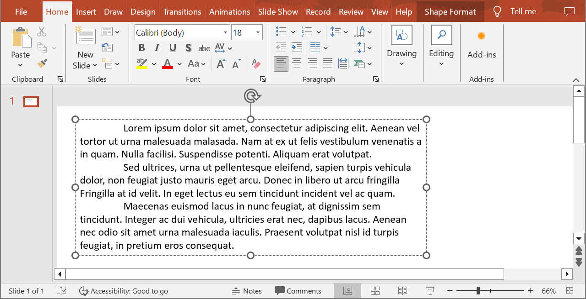

## **Overview**

Aspose.Slides provides the classes you need to work with PowerPoint text in Python.

* Aspose.Slides provides the [TextFrame](https://reference.aspose.com/slides/python-net/aspose.slides/textframe/) class for creating text frame objects. A `TextFrame` object can contain one or more paragraphs (each paragraph is separated by a carriage return).
* Aspose.Slides provides the [Paragraph](https://reference.aspose.com/slides/python-net/aspose.slides/paragraph/) class for creating paragraph objects. A `Paragraph` object can contain one or more text portions.
* Aspose.Slides provides the [Portion](https://reference.aspose.com/slides/python-net/aspose.slides/portion/) class for creating text portion objects and specifying their formatting properties.

A `Paragraph` object can handle text with different formatting properties through its underlying `Portion` objects.

## **Add Multiple Paragraphs Containing Multiple Portions**

These steps show how to add a text frame that contains three paragraphs, each with three portions:

1. Create an instance of the [Presentation](https://reference.aspose.com/slides/python-net/aspose.slides/presentation/) class.
1. Get a reference to the target slide by its index.
1. Add a rectangular [AutoShape](https://reference.aspose.com/slides/python-net/aspose.slides/autoshape/) to the slide.
1. Get the [TextFrame](https://reference.aspose.com/slides/python-net/aspose.slides/textframe/) associated with the [AutoShape](https://reference.aspose.com/slides/python-net/aspose.slides/autoshape/).
1. Create two [Paragraph](https://reference.aspose.com/slides/python-net/aspose.slides/paragraph/) objects and add them to the paragraph collection of the [TextFrame](https://reference.aspose.com/slides/python-net/aspose.slides/textframe/) (together with the default paragraph, this gives three paragraphs).
1. For each paragraph, create three [Portion](https://reference.aspose.com/slides/python-net/aspose.slides/portion/) objects and add them to that paragraph’s portion collection.
1. Set the text for each portion.
1. Apply any desired formatting to each text portion using the properties exposed by [Portion](https://reference.aspose.com/slides/python-net/aspose.slides/portion/).
1. Save the modified presentation.

The following Python code implements these steps:

```python
import aspose.slides as slides
import aspose.pydrawing as draw

# Instantiate the Presentation class to create a new PPTX file.
with slides.Presentation() as presentation:

    # Access the first slide.
    slide = presentation.slides[0]

    # Add a rectangle AutoShape.
    shape = slide.shapes.add_auto_shape(slides.ShapeType.RECTANGLE, 50, 150, 300, 150)

    # Access the AutoShape's TextFrame.
    text_frame = shape.text_frame

    # Create paragraphs and portions; formatting is applied below.
    paragraph0 = text_frame.paragraphs[0]
    portion01 = slides.Portion()
    portion02 = slides.Portion()
    paragraph0.portions.add(portion01)
    paragraph0.portions.add(portion02)

    paragraph1 = slides.Paragraph()
    text_frame.paragraphs.add(paragraph1)
    portion10 = slides.Portion()
    portion11 = slides.Portion()
    portion12 = slides.Portion()
    paragraph1.portions.add(portion10)
    paragraph1.portions.add(portion11)
    paragraph1.portions.add(portion12)

    paragraph2 = slides.Paragraph()
    text_frame.paragraphs.add(paragraph2)
    portion20 = slides.Portion()
    portion21 = slides.Portion()
    portion22 = slides.Portion()
    paragraph2.portions.add(portion20)
    paragraph2.portions.add(portion21)
    paragraph2.portions.add(portion22)

    for i in range(3):
        for j in range(3):
            text_frame.paragraphs[i].portions[j].text = "Portion0" + str(j)
            if j == 0:
                text_frame.paragraphs[i].portions[j].portion_format.fill_format.fill_type = slides.FillType.SOLID
                text_frame.paragraphs[i].portions[j].portion_format.fill_format.solid_fill_color.color = draw.Color.red
                text_frame.paragraphs[i].portions[j].portion_format.font_bold = 1
                text_frame.paragraphs[i].portions[j].portion_format.font_height = 15
            elif j == 1:
                text_frame.paragraphs[i].portions[j].portion_format.fill_format.fill_type = slides.FillType.SOLID
                text_frame.paragraphs[i].portions[j].portion_format.fill_format.solid_fill_color.color = draw.Color.blue
                text_frame.paragraphs[i].portions[j].portion_format.font_italic = 1
                text_frame.paragraphs[i].portions[j].portion_format.font_height = 18

    # Save the PPTX to disk.
    presentation.save("paragraphs_and_portions_out.pptx", slides.export.SaveFormat.PPTX)
```

## **Manage Paragraph Bullets**

Bullet lists help you organize and present information quickly and efficiently. Bulleted paragraphs are often easier to read and understand.

1. Create an instance of the [Presentation](https://reference.aspose.com/slides/python-net/aspose.slides/presentation/) class.
1. Access the target slide by its index.
1. Add an [AutoShape](https://reference.aspose.com/slides/python-net/aspose.slides/autoshape/) to the slide.
1. Access the shape’s [TextFrame](https://reference.aspose.com/slides/python-net/aspose.slides/textframe/).
1. Remove the default paragraph from the [TextFrame](https://reference.aspose.com/slides/python-net/aspose.slides/textframe/).
1. Create the first paragraph using the [Paragraph](https://reference.aspose.com/slides/python-net/aspose.slides/paragraph/) class.
1. Set the paragraph’s bullet type to `SYMBOL` and specify the bullet character.
1. Set the paragraph’s text.
1. Set the bullet indent for the paragraph.
1. Set the bullet color.
1. Set the bullet size (height).
1. Add the paragraph to the [TextFrame](https://reference.aspose.com/slides/python-net/aspose.slides/textframe/)’s paragraph collection.
1. Add a second paragraph and repeat steps 7–12.
1. Save the presentation.

This Python code shows how to add bulleted paragraphs:

```python
import aspose.slides as slides
import aspose.pydrawing as draw

# Create a presentation instance.
with slides.Presentation() as presentation:

    # Access the first slide.
    slide = presentation.slides[0]

    # Add and access an AutoShape.
    shape = slide.shapes.add_auto_shape(slides.ShapeType.RECTANGLE, 200, 200, 400, 200)

    # Access the text frame of the created AutoShape.
    text_frame = shape.text_frame

    # Remove the default paragraph.
    text_frame.paragraphs.remove_at(0)

    # Create a paragraph.
    paragraph = slides.Paragraph()

    # Set the paragraph's bullet style and symbol.
    paragraph.paragraph_format.bullet.type = slides.BulletType.SYMBOL
    paragraph.paragraph_format.bullet.char = chr(8226)

    # Set the paragraph text.
    paragraph.text = "Welcome to Aspose.Slides"

    # Set the bullet indent.
    paragraph.paragraph_format.indent = 25

    # Set the bullet color.
    paragraph.paragraph_format.bullet.color.color_type = slides.ColorType.RGB
    paragraph.paragraph_format.bullet.color.color = draw.Color.black
    paragraph.paragraph_format.bullet.is_bullet_hard_color = 1 

    # Set the bullet height.
    paragraph.paragraph_format.bullet.height = 100

    # Add the paragraph to the text frame.
    text_frame.paragraphs.add(paragraph)

    # Create the second paragraph.
    paragraph2 = slides.Paragraph()

    # Set the paragraph's bullet type and style.
    paragraph2.paragraph_format.bullet.type = slides.BulletType.NUMBERED
    paragraph2.paragraph_format.bullet.numbered_bullet_style = slides.NumberedBulletStyle.BULLET_CIRCLE_NUM_WDBLACK_PLAIN

    # Set the paragraph text.
    paragraph2.text = "This is numbered bullet"

    # Set the bullet indent.
    paragraph2.paragraph_format.indent = 25

    # Set the bullet color.
    paragraph2.paragraph_format.bullet.color.color_type = slides.ColorType.RGB
    paragraph2.paragraph_format.bullet.color.color = draw.Color.black
    paragraph2.paragraph_format.bullet.is_bullet_hard_color = 1

    # Set the bullet height.
    paragraph2.paragraph_format.bullet.height = 100

    # Add the paragraph to the text frame.
    text_frame.paragraphs.add(paragraph2)

    # Save the presentation as a PPTX file.
    presentation.save("bullets_out.pptx", slides.export.SaveFormat.PPTX)
```

## **Manage Picture Bullets**

Bulleted lists help you organize and present information quickly and efficiently. Picture bullets are easy to read and understand.

1. Create an instance of the [Presentation](https://reference.aspose.com/slides/python-net/aspose.slides/presentation/) class.
1. Access the target slide by its index.
1. Add an [AutoShape](https://reference.aspose.com/slides/python-net/aspose.slides/autoshape/) to the slide.
1. Access the shape’s [TextFrame](https://reference.aspose.com/slides/python-net/aspose.slides/textframe/).
1. Remove the default paragraph from the [TextFrame](https://reference.aspose.com/slides/python-net/aspose.slides/textframe/).
1. Create the first paragraph using the [Paragraph](https://reference.aspose.com/slides/python-net/aspose.slides/paragraph/) class.
1. Load an image into an [PPImage](https://reference.aspose.com/slides/python-net/aspose.slides/ppimage/).
1. Set the bullet type to [PPImage](https://reference.aspose.com/slides/python-net/aspose.slides/ppimage/) and assign the image.
1. Set the paragraph text.
1. Set the paragraph indent for the bullet.
1. Set the bullet color.
1. Set the bullet height.
1. Add the new paragraph to the [TextFrame](https://reference.aspose.com/slides/python-net/aspose.slides/textframe/)’s paragraph collection.
1. Add a second paragraph and repeat steps 8–12.
1. Save the presentation.

This Python code shows how to add and manage picture bullets:

```python
import aspose.slides as slides
import aspose.pydrawing as draw

with slides.Presentation() as presentation:

    # Access the first slide.
    slide = presentation.slides[0]

    # Load the bullet image.
    image = draw.Bitmap("bullets.png")
    pp_image = presentation.images.add_image(image)

    # Add and access an AutoShape.
    auto_shape = slide.shapes.add_auto_shape(slides.ShapeType.RECTANGLE, 200, 200, 400, 200)

    # Access the TextFrame of the created AutoShape.
    text_frame = auto_shape.text_frame

    # Remove the default paragraph.
    text_frame.paragraphs.remove_at(0)

    # Create a new paragraph.
    paragraph = slides.Paragraph()
    paragraph.text = "Welcome to Aspose.Slides"

    # Set the paragraph's bullet type to Picture and assign the image.
    paragraph.paragraph_format.bullet.type = slides.BulletType.PICTURE
    paragraph.paragraph_format.bullet.picture.image = pp_image

    # Set the bullet height.
    paragraph.paragraph_format.bullet.height = 100

    # Add the paragraph to the text frame.
    text_frame.paragraphs.add(paragraph)

    # Save the presentation as a PPTX file.
    presentation.save("picture_bullets_out.pptx", slides.export.SaveFormat.PPTX)
    # Save the presentation as a PPT file.
    presentation.save("picture_bullets_out.ppt", slides.export.SaveFormat.PPT)
```

## **Manage Multilevel Bullets**

Bulleted lists help you organize and present information quickly and efficiently. Multilevel bullets are easy to read and understand.

1. Create an instance of the [Presentation](https://reference.aspose.com/slides/python-net/aspose.slides/presentation/) class.
1. Access the target slide by its index.
1. Add an [AutoShape](https://reference.aspose.com/slides/python-net/aspose.slides/autoshape/) to the slide.
1. Access the [AutoShape](https://reference.aspose.com/slides/python-net/aspose.slides/autoshape/)’s [TextFrame](https://reference.aspose.com/slides/python-net/aspose.slides/textframe/).
1. Remove the default paragraph from the [TextFrame](https://reference.aspose.com/slides/python-net/aspose.slides/textframe/).
1. Create the first paragraph using the [Paragraph](https://reference.aspose.com/slides/python-net/aspose.slides/paragraph/) class and set its depth to 0.
1. Create the second paragraph using the [Paragraph](https://reference.aspose.com/slides/python-net/aspose.slides/paragraph/) class and set its depth to 1.
1. Create the third paragraph using the [Paragraph](https://reference.aspose.com/slides/python-net/aspose.slides/paragraph/) class and set its depth to 2.
1. Create the fourth paragraph using the [Paragraph](https://reference.aspose.com/slides/python-net/aspose.slides/paragraph/) class and set its depth to 3.
1. Add the new paragraphs to the [TextFrame](https://reference.aspose.com/slides/python-net/aspose.slides/textframe/)’s paragraph collection.
1. Save the presentation.

The following Python code shows how to add and manage multilevel bullets:

```python
import aspose.slides as slides
import aspose.pydrawing as draw

# Create a presentation instance.
with slides.Presentation() as presentation:

    # Access the first slide.
    slide = presentation.slides[0]
    
    # Add an AutoShape.
    shape = slide.shapes.add_auto_shape(slides.ShapeType.RECTANGLE, 200, 200, 400, 200)

    # Access the TextFrame of the created AutoShape.
    text_frame = auto_shape.text_frame
    
    # Clear the default paragraph.
    text_frame.paragraphs.clear()

    # Add the first paragraph.
    paragraph1 = slides.Paragraph()
    paragraph1.text = "Content"
    paragraph1.paragraph_format.bullet.type = slides.BulletType.SYMBOL
    paragraph1.paragraph_format.bullet.char = chr(8226)
    paragraph1.paragraph_format.default_portion_format.fill_format.fill_type = slides.FillType.SOLID
    paragraph1.paragraph_format.default_portion_format.fill_format.solid_fill_color.color = draw.Color.black
    # Set the bullet level.
    paragraph1.paragraph_format.depth = 0

    # Add the second paragraph.
    paragraph2 = slides.Paragraph()
    paragraph2.text = "Second Level"
    paragraph2.paragraph_format.bullet.type = slides.BulletType.SYMBOL
    paragraph2.paragraph_format.bullet.char = '-'
    paragraph2.paragraph_format.default_portion_format.fill_format.fill_type = slides.FillType.SOLID
    paragraph2.paragraph_format.default_portion_format.fill_format.solid_fill_color.color = draw.Color.black
    # Set the bullet level.
    paragraph2.paragraph_format.depth = 1

    # Add the third paragraph.
    paragraph3 = slides.Paragraph()
    paragraph3.text = "Third Level"
    paragraph3.paragraph_format.bullet.type = slides.BulletType.SYMBOL
    paragraph3.paragraph_format.bullet.char = chr(8226)
    paragraph3.paragraph_format.default_portion_format.fill_format.fill_type = slides.FillType.SOLID
    paragraph3.paragraph_format.default_portion_format.fill_format.solid_fill_color.color = draw.Color.black
    # Set the bullet level.
    paragraph3.paragraph_format.depth = 2

    # Add the fourth paragraph.
    paragraph4 = slides.Paragraph()
    paragraph4.text = "Fourth Level"
    paragraph4.paragraph_format.bullet.type = slides.BulletType.SYMBOL
    paragraph4.paragraph_format.bullet.char = '-'
    paragraph4.paragraph_format.default_portion_format.fill_format.fill_type = slides.FillType.SOLID
    paragraph4.paragraph_format.default_portion_format.fill_format.solid_fill_color.color = draw.Color.black
    # Set the bullet level.
    paragraph4.paragraph_format.depth = 3

    # Add the paragraphs to the collection.
    text_frame.paragraphs.add(paragraph1)
    text_frame.paragraphs.add(paragraph2)
    text_frame.paragraphs.add(paragraph3)
    text_frame.paragraphs.add(paragraph4)

    # Save the presentation as a PPTX file.
    presentation.save("multilevel_bullets_out.pptx", slides.export.SaveFormat.PPTX)
```

## **Manage Paragraphs with Custom Numbered Lists**

The [BulletFormat](https://reference.aspose.com/slides/python-net/aspose.slides/bulletformat/) class provides the `numbered_bullet_start_with` property (and others) to control custom numbering and formatting for paragraphs.

1. Create an instance of the [Presentation](https://reference.aspose.com/slides/python-net/aspose.slides/presentation/) class.
1. Access the slide that will contain the paragraphs.
1. Add an [AutoShape](https://reference.aspose.com/slides/python-net/aspose.slides/autoshape/) to the slide.
1. Access the shape’s [TextFrame](https://reference.aspose.com/slides/python-net/aspose.slides/textframe/).
1. Remove the default paragraph from the [TextFrame](https://reference.aspose.com/slides/python-net/aspose.slides/textframe/).
1. Create the first [Paragraph](https://reference.aspose.com/slides/python-net/aspose.slides/paragraph/) and set `numbered_bullet_start_with` to 2.
1. Create the second [Paragraph](https://reference.aspose.com/slides/python-net/aspose.slides/paragraph/) and set `numbered_bullet_start_with` to 3.
1. Create the third [Paragraph](https://reference.aspose.com/slides/python-net/aspose.slides/paragraph/) and set `numbered_bullet_start_with` to 7.
1. Add the paragraphs to the [TextFrame](https://reference.aspose.com/slides/python-net/aspose.slides/textframe/)’s collection.
1. Save the presentation.

The following Python code demonstrates how to add and manage paragraphs with custom numbering and formatting.

```python
import aspose.slides as slides

with slides.Presentation() as presentation:

    # Add and access an AutoShape.
    shape = presentation.slides[0].shapes.add_auto_shape(slides.ShapeType.RECTANGLE, 200, 200, 400, 200)

    # Access the TextFrame of the created AutoShape.
    text_frame = shape.text_frame

    # Remove the default existing paragraph.
    text_frame.paragraphs.remove_at(0)

    # Create the first numbered item (start at 2, depth level 4).
    paragraph1 = slides.Paragraph()
    paragraph1.text = "bullet 2"
    paragraph1.paragraph_format.depth = 4 
    paragraph1.paragraph_format.bullet.numbered_bullet_start_with = 2
    paragraph1.paragraph_format.bullet.type = slides.BulletType.NUMBERED
    text_frame.paragraphs.add(paragraph1)

    # Create the second numbered item (start at 3, depth level 4).
    paragraph2 = slides.Paragraph()
    paragraph2.text = "bullet 3"
    paragraph2.paragraph_format.depth = 4
    paragraph2.paragraph_format.bullet.numbered_bullet_start_with = 3 
    paragraph2.paragraph_format.bullet.type = slides.BulletType.NUMBERED  
    text_frame.paragraphs.add(paragraph2)

    # Create the third numbered item (start at 7, depth level 4).
    paragraph5 = slides.Paragraph()
    paragraph5.text = "bullet 7"
    paragraph5.paragraph_format.depth = 4
    paragraph5.paragraph_format.bullet.numbered_bullet_start_with = 7
    paragraph5.paragraph_format.bullet.type = slides.BulletType.NUMBERED
    text_frame.paragraphs.add(paragraph5)

    presentation.save("custom_bullets_out.pptx", slides.export.SaveFormat.PPTX)
```

## **Set Paragraph Indent**

Paragraph indentation helps establish a clear reading hierarchy on a slide and fine-tune text alignment. The example below shows how to set both overall and first-line indents in Aspose.Slides for Python through the [ParagraphFormat](https://reference.aspose.com/slides/python-net/aspose.slides/paragraphformat/) properties.

1. Create an instance of the [Presentation](https://reference.aspose.com/slides/python-net/aspose.slides/presentation/) class.
1. Access the target slide by its index.
1. Add a rectangular [AutoShape](https://reference.aspose.com/slides/python-net/aspose.slides/autoshape/) to the slide.
1. Add a [TextFrame](https://reference.aspose.com/slides/python-net/aspose.slides/textframe/) with three paragraphs to the [AutoShape](https://reference.aspose.com/slides/python-net/aspose.slides/autoshape/).
1. Hide the rectangle’s outline.
1. Set the indent for each [Paragraph](https://reference.aspose.com/slides/python-net/aspose.slides/paragraph/) using its `paragraph_format` property.
1. Save the modified presentation as a PPT file.

The following Python code shows how to set paragraph indents:

```python
import aspose.slides as slides

# Instantiate the Presentation class.
with slides.Presentation() as presentation:

    # Access the first slide.
    slide = presentation.slides[0]

    # Add a rectangle shape.
    shape = slide.shapes.add_auto_shape(slides.ShapeType.RECTANGLE, 100, 100, 500, 150)

    # Add a TextFrame to the rectangle.
    text_frame = shape.add_text_frame("This is first line \rThis is second line \rThis is third line")

    # Set the text to fit the shape.
    text_frame.text_frame_format.autofit_type = slides.TextAutofitType.SHAPE

    # Set a solid outline for the rectangle.
    shape.line_format.fill_format.fill_type = slides.FillType.SOLID

    # Get the first paragraph in the TextFrame and set its bullet and indent.
    paragraph1 = text_frame.paragraphs[0]
    # Set the paragraph bullet style and symbol.
    paragraph1.paragraph_format.bullet.type = slides.BulletType.SYMBOL
    paragraph1.paragraph_format.bullet.char = chr(8226)
    paragraph1.paragraph_format.alignment = slides.TextAlignment.LEFT

    paragraph1.paragraph_format.depth = 2
    paragraph1.paragraph_format.indent = 30

    # Get the second paragraph in the TextFrame and set its bullet and indent.
    paragraph2 = text_frame.paragraphs[1]
    paragraph2.paragraph_format.bullet.type = slides.BulletType.SYMBOL
    paragraph2.paragraph_format.bullet.char = chr(8226)
    paragraph2.paragraph_format.alignment = slides.TextAlignment.LEFT
    paragraph2.paragraph_format.depth = 2
    paragraph2.paragraph_format.indent = 40

    # Get the third paragraph in the TextFrame and set its bullet and indent.
    paragraph3 = text_frame.paragraphs[2]
    paragraph3.paragraph_format.bullet.type = slides.BulletType.SYMBOL
    paragraph3.paragraph_format.bullet.char = chr(8226)
    paragraph3.paragraph_format.alignment = slides.TextAlignment.LEFT
    paragraph3.paragraph_format.depth = 2
    paragraph3.paragraph_format.indent = 50

    # Write the presentation to disk.
    presentation.save("indent_out.pptx", slides.export.SaveFormat.PPTX)
```

## **Set Hanging Indent for Paragraphs**

This Python code shows how to set a hanging indent for a paragraph:

```python
import aspose.slides as slides

with slides.Presentation() as presentation:
    auto_shape = presentation.slides[0].shapes.add_auto_shape(slides.ShapeType.RECTANGLE, 50, 250, 550, 150)

    paragraph1 = slides.Paragraph()
    paragraph1.text = "Example"
    paragraph2 = slides.Paragraph()
    paragraph2.text = "Set Hanging Indent for Paragraphs"
    paragraph3 = slides.Paragraph()
    paragraph3.text = "This Python code shows how to set a hanging indent for a paragraph: "

    paragraph2.paragraph_format.margin_left = 10
    paragraph3.paragraph_format.margin_left = 20

    paragraphs = auto_shape.text_frame.paragraphs
    paragraphs.add(paragraph1)
    paragraphs.add(paragraph2)
    paragraphs.add(paragraph3)

    presentation.save("presentation.pptx", slides.export.SaveFormat.PPTX)
```

## **Manage End-of-Paragraph Portion Format**

When you need to control the styling of the "end" of a paragraph (the formatting applied after the last text portion), use the `end_paragraph_portion_format` property. The example below applies a larger Times New Roman font to the end of the second paragraph.

1. Create or open a [Presentation](https://reference.aspose.com/slides/python-net/aspose.slides/presentation/) file.
1. Get the target slide by index.
1. Add a rectangle [AutoShape](https://reference.aspose.com/slides/python-net/aspose.slides/autoshape/) to the slide.
1. Use the shape’s [TextFrame](https://reference.aspose.com/slides/python-net/aspose.slides/textframe/) and create two paragraphs.
1. Create a [PortionFormat](https://reference.aspose.com/slides/python-net/aspose.slides/portionformat/) set to 48-pt Times New Roman and apply it as the paragraph’s end-paragraph portion format.
1. Assign it to paragraph's `end_paragraph_portion_format` (applies to the second paragraph’s ending).
1. Write the modified presentation as a PPTX file.

This Python code shows you how to set the end-of-paragraph formatting for the second paragraph:

```python
import aspose.slides as slides

with slides.Presentation("presentation.pptx") as presentation:
	shape = presentation.slides[0].shapes.add_auto_shape(slides.ShapeType.RECTANGLE, 10, 10, 200, 250)

	paragraph1 = slides.Paragraph()
	paragraph1.portions.add(slides.Portion("Sample text"))

	end_paragraph_portion_format = slides.PortionFormat()
	end_paragraph_portion_format.font_height = 48
	end_paragraph_portion_format.latin_font = slides.FontData("Times New Roman")

	paragraph2 = slides.Paragraph()
	paragraph2.portions.add(slides.Portion("Sample text 2"))
	paragraph2.end_paragraph_portion_format = end_paragraph_portion_format

	shape.text_frame.paragraphs.add(paragraph1)
	shape.text_frame.paragraphs.add(paragraph2)

	presentation.save("presentation.pptx", slides.export.SaveFormat.PPTX)
```

## **Import HTML Text into Paragraphs**

Aspose.Slides provides enhanced support for importing HTML text into paragraphs.

1. Create an instance of the [Presentation](https://reference.aspose.com/slides/python-net/aspose.slides/presentation/) class.
1. Access the target slide by its index.
1. Add an [AutoShape](https://reference.aspose.com/slides/python-net/aspose.slides/autoshape/) to the slide.
1. Access the [TextFrame](https://reference.aspose.com/slides/python-net/aspose.slides/textframe/) of the [AutoShape](https://reference.aspose.com/slides/python-net/aspose.slides/autoshape/).
1. Remove the default paragraph from the [TextFrame](https://reference.aspose.com/slides/python-net/aspose.slides/textframe/).
1. Read the source HTML file.
1. Create the first paragraph using the [Paragraph](https://reference.aspose.com/slides/python-net/aspose.slides/paragraph/) class.
1. Add the HTML content to the [TextFrame](https://reference.aspose.com/slides/python-net/aspose.slides/textframe/)’s paragraph collection.
1. Save the modified presentation.

The following Python code implements these steps for importing HTML text into paragraphs.

```python
import aspose.slides as slides

# Create an empty Presentation instance.
with slides.Presentation() as presentation:

    # Access the first slide of the presentation.
    slide = presentation.slides[0]

    slide_width = presentation.slide_size.size.width
    slide_height = presentation.slide_size.size.height

    # Add an AutoShape to accommodate the HTML content.
    shape = slide.shapes.add_auto_shape(slides.ShapeType.RECTANGLE, 10, 10, slide_width - 20, slide_height - 10)

    # Clear all paragraphs in the added text frame.
    shape.text_frame.paragraphs.clear()

    # Load the HTML file.
    with open("file.html", "rt") as html_stream:
        # Add text from the HTML file to the text frame.
        shape.text_frame.paragraphs.add_from_html(html_stream.read())

    # Save the presentation.
    presentation.save("output.pptx", slides.export.SaveFormat.PPTX)
```

## **Export Paragraph Text to HTML**

Aspose.Slides provides enhanced support for exporting text to HTML.

1. Create an instance of the [Presentation](https://reference.aspose.com/slides/python-net/aspose.slides/presentation/) class and load the target presentation.
1. Access the desired slide by its index.
1. Select the shape that contains the text to export.
1. Access the shape’s [TextFrame](https://reference.aspose.com/slides/python-net/aspose.slides/textframe/).
1. Open a file stream to write the HTML output.
1. Specify the starting index and export the required paragraphs.

This Python example shows how to export paragraph text to HTML.

```python
import aspose.slides as slides

# Load the presentation file.
with slides.Presentation("exporting_HTML_text.pptx") as presentation:
    # Access the first slide of the presentation.
    slide = presentation.slides[0]

    # Target shape index.
    index = 0

    # Access the shape by index.
    shape = slide.shapes[index]

    with open("output.html", "w") as html_stream:
        # Write paragraph data to HTML by providing the starting paragraph index and the total number of paragraphs to export.
        html_stream.write(shape.text_frame.paragraphs.export_to_html(0, shape.text_frame.paragraphs.count, None))
```

## **Save a Paragraph as an Image**

In this section, we will explore two examples that demonstrate how to save a text paragraph, represented by the [Paragraph](https://reference.aspose.com/slides/python-net/aspose.slides/paragraph/) class, as an image. Both examples include obtaining the image of a shape containing the paragraph using the `get_image` methods from the [Shape](https://reference.aspose.com/slides/python-net/aspose.slides/shape/) class, calculating the bounds of the paragraph within the shape, and exporting it as a bitmap image. These approaches allow you to extract specific parts of the text from PowerPoint presentations and save them as separate images, which can be useful for further use in various scenarios.

Let's assume we have a presentation file called sample.pptx with one slide, where the first shape is a text box containing three paragraphs.



**Example 1**

In this example, we obtain the second paragraph as an image. To do this, we extract the image of the shape from the first slide of the presentation and then calculate the bounds of the second paragraph in the shape's text frame. The paragraph is then redrawn onto a new bitmap image, which is saved in PNG format. This method is especially useful when you need to save a specific paragraph as a separate image while preserving the exact dimensions and formatting of the text.

```py
import aspose.slides as slides
import math
import io
from PIL import Image

with slides.Presentation("sample.pptx") as presentation:
    first_shape = presentation.slides[0].shapes[0]

    # Save the shape in memory as a bitmap.
    with first_shape.get_image() as shape_image:
        shape_image_stream = io.BytesIO()
        shape_image.save(shape_image_stream, slides.ImageFormat.PNG)

    # Create a shape bitmap from memory.
    shape_image_stream.seek(0)
    shape_bitmap = Image.open(shape_image_stream)

    # Calculate the boundaries of the second paragraph.
    second_paragraph = first_shape.text_frame.paragraphs[1]
    paragraph_rectangle = second_paragraph.get_rect()

    # Calculate the coordinates and size for the output image (minimum size - 1x1 pixel).
    image_left = math.floor(paragraph_rectangle.x)
    image_top = math.floor(paragraph_rectangle.y)
    image_right = image_left + max(1, math.ceil(paragraph_rectangle.width))
    image_bottom = image_top + max(1, math.ceil(paragraph_rectangle.height))

    # Crop the shape bitmap to get the paragraph bitmap only.
    paragraph_bitmap = shape_bitmap.crop((image_left, image_top, image_right, image_bottom))

    paragraph_bitmap.save("paragraph.png")
```

The result:


**Example 2**

In this example, we extend the previous approach by adding scaling factors to the paragraph image. The shape is extracted from the presentation and saved as an image with a scaling factor of `2`. This allows for a higher resolution output when exporting the paragraph. The paragraph bounds are then calculated considering the scale. Scaling can be particularly useful when a more detailed image is needed, for example, for use in high-quality printed materials.

```py
import aspose.slides as slides
import math
import io
from PIL import Image

image_scale_x = 2
image_scale_y = image_scale_x

with slides.Presentation("sample.pptx") as presentation:
    first_shape = presentation.slides[0].shapes[0]

    # Save the shape in memory as a bitmap.
    with first_shape.get_image(slides.ShapeThumbnailBounds.SHAPE, image_scale_x, image_scale_y) as shape_image:
        shape_image_stream = io.BytesIO()
        shape_image.save(shape_image_stream, slides.ImageFormat.PNG)

    # Create a shape bitmap from memory.
    shape_image_stream.seek(0)
    shape_bitmap = Image.open(shape_image_stream)

    # Calculate the boundaries of the second paragraph.
    second_paragraph = first_shape.text_frame.paragraphs[1]
    paragraph_rectangle = second_paragraph.get_rect()
    paragraph_rectangle.x *= image_scale_x
    paragraph_rectangle.y *= image_scale_y
    paragraph_rectangle.width *= image_scale_x
    paragraph_rectangle.height *= image_scale_y

    # Calculate the coordinates and size for the output image (minimum size - 1x1 pixel).
    image_left = math.floor(paragraph_rectangle.x)
    image_top = math.floor(paragraph_rectangle.y)
    image_right = image_left + max(1, math.ceil(paragraph_rectangle.width))
    image_bottom = image_top + max(1, math.ceil(paragraph_rectangle.height))

    # Crop the shape bitmap to get the paragraph bitmap only.
    paragraph_bitmap = shape_bitmap.crop((image_left, image_top, image_right, image_bottom))

    paragraph_bitmap.save("paragraph.png")
```

## **FAQ**

**Can I completely disable line wrapping inside a text frame?**

Yes. Use the text frame’s wrapping setting ([wrap_text](https://reference.aspose.com/slides/python-net/aspose.slides/textframeformat/wrap_text/)) to turn wrapping off so lines won’t break at the frame’s edges.

**How can I get the exact on-slide bounds of a specific paragraph?**

You can retrieve the paragraph’s (and even a single portion’s) bounding rectangle to know its precise position and size on the slide.

**Where is paragraph alignment (left/right/center/justify) controlled?**

[Alignment](https://reference.aspose.com/slides/python-net/aspose.slides/paragraphformat/alignment/) is a paragraph-level setting in [ParagraphFormat](https://reference.aspose.com/slides/python-net/aspose.slides/paragraphformat/); it applies to the whole paragraph regardless of individual portion formatting.

**Can I set a spell-check language for just part of a paragraph (e.g., one word)?**

Yes. The language is set at the portion level ([PortionFormat.language_id](https://reference.aspose.com/slides/python-net/aspose.slides/portionformat/language_id/)), so multiple languages can coexist within a single paragraph.
