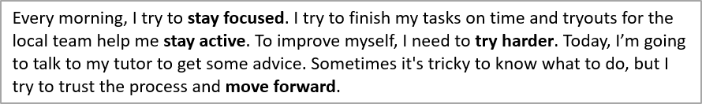

## **Overview**

This article shows how to format text in PowerPoint and OpenDocument presentations using Aspose.Slides for Python via .NET. It covers highlighting, background colors, transparency, character spacing, font properties, rotation, paragraph spacing, autofit behavior, text anchoring, tab stops, and language settings.

In the examples below, we'll use a file named "sample.pptx", which contains a single text box on the first slide with the following text:



## **Highlight Text**

Use the [TextFrame.highlight_text](https://reference.aspose.com/slides/python-net/aspose.slides/textframe/highlight_text/) method when you need to highlight text that matches a specific sample within a text frame. The method applies a highlight color to matching text fragments and can be used with [TextSearchOptions](https://reference.aspose.com/slides/python-net/aspose.slides/textsearchoptions/) to control how the search is performed, for example, to match only whole words.

The code example below highlights all occurrences of the characters **"try"** and then highlights only the full word **"to"**.

```python
import aspose.pydrawing as draw
import aspose.slides as slides

with slides.Presentation("sample.pptx") as presentation:
    # Get the first shape from the first slide.
    shape = presentation.slides[0].shapes[0]

    # Highlight the word "try" in the shape.
    shape.text_frame.highlight_text("try", draw.Color.light_blue)

    search_options = slides.TextSearchOptions()
    search_options.whole_words_only = True

    # Highlight the word "to" in the shape.
    shape.text_frame.highlight_text("to", draw.Color.violet, search_options, None)

    presentation.save("highlighted_text.pptx", slides.export.SaveFormat.PPTX)
```

The result:


## **Highlight Text Using Regular Expressions**

The [TextFrame.highlight_regex](https://reference.aspose.com/slides/python-net/aspose.slides/textframe/highlight_regex/) method highlights text matches found by a regular expression. In Python, this API is exposed on [TextFrame](https://reference.aspose.com/slides/python-net/aspose.slides/textframe/).

The code example below highlights all words that contain **seven or more characters**:

```python
import aspose.pydrawing as draw
import aspose.slides as slides

with slides.Presentation("sample.pptx") as presentation:
    shape = presentation.slides[0].shapes[0]

    regex = r"\b[^\s]{7,}\b"

    # Highlight all words with seven or more characters.
    shape.text_frame.highlight_regex(regex, draw.Color.yellow, None)

    presentation.save("highlighted_text_using_regex.pptx", slides.export.SaveFormat.PPTX)
```

The result:


## **Set Text Background Color**

Use [ParagraphFormat.default_portion_format](https://reference.aspose.com/slides/python-net/aspose.slides/paragraphformat/default_portion_format/) to set the default highlight color for a paragraph, or use [PortionFormat.highlight_color](https://reference.aspose.com/slides/python-net/aspose.slides/portionformat/highlight_color/) for individual text portions.

The following code example shows how to set the background color for the **entire paragraph**:

```python
import aspose.pydrawing as draw
import aspose.slides as slides

with slides.Presentation("sample.pptx") as presentation:
    auto_shape = presentation.slides[0].shapes[0]
    paragraph = auto_shape.text_frame.paragraphs[0]

    # Set the highlight color for the entire paragraph.
    paragraph.paragraph_format.default_portion_format.highlight_color.color = draw.Color.light_gray

    presentation.save("gray_paragraph.pptx", slides.export.SaveFormat.PPTX)
```

The result:


The code example below demonstrates how to set the background color for **text portions with a bold font**:

```python
import aspose.pydrawing as draw
import aspose.slides as slides

with slides.Presentation("sample.pptx") as presentation:
    auto_shape = presentation.slides[0].shapes[0]
    paragraph = auto_shape.text_frame.paragraphs[0]

    for portion in paragraph.portions:
        if portion.portion_format.get_effective().font_bold:
            # Set the highlight color for the text portion.
            portion.portion_format.highlight_color.color = draw.Color.light_gray

    presentation.save("gray_text_portions.pptx", slides.export.SaveFormat.PPTX)
```

The result:


## **Align Text Paragraphs**

Use [ParagraphFormat.alignment](https://reference.aspose.com/slides/python-net/aspose.slides/paragraphformat/alignment/) to set paragraph alignment within a text frame. The value can be centered, left-aligned, right-aligned, justified, and so on.

The following code example shows how to align the paragraph to the **center**:

```python
import aspose.slides as slides

with slides.Presentation("sample.pptx") as presentation:
    auto_shape = presentation.slides[0].shapes[0]
    paragraph = auto_shape.text_frame.paragraphs[0]

    # Set the alignment of the paragraph to center.
    paragraph.paragraph_format.alignment = slides.TextAlignment.CENTER

    presentation.save("aligned_paragraph.pptx", slides.export.SaveFormat.PPTX)
```

The result:


## **Set Transparency for Text**

Text transparency is controlled through the alpha component of the color assigned to [PortionFormat.fill_format](https://reference.aspose.com/slides/python-net/aspose.slides/portionformat/fill_format/). In the examples below, `alpha = 50` is an ARGB alpha-channel value on the 0-255 scale, not a transparency percentage.

The code example below shows how to apply transparency to the **entire paragraph**:

```python
import aspose.pydrawing as draw
import aspose.slides as slides

alpha = 50

with slides.Presentation("sample.pptx") as presentation:
    auto_shape = presentation.slides[0].shapes[0]
    paragraph = auto_shape.text_frame.paragraphs[0]

    # Set the fill color of the text to transparent color.
    paragraph.paragraph_format.default_portion_format.fill_format.fill_type = slides.FillType.SOLID
    paragraph.paragraph_format.default_portion_format.fill_format.solid_fill_color.color = draw.Color.from_argb(alpha, draw.Color.black)

    presentation.save("transparent_paragraph.pptx", slides.export.SaveFormat.PPTX)
```

The result:


The following code example shows how to apply transparency to **text portions with a bold font**:

```python
import aspose.pydrawing as draw
import aspose.slides as slides

alpha = 50

with slides.Presentation("sample.pptx") as presentation:
    auto_shape = presentation.slides[0].shapes[0]
    paragraph = auto_shape.text_frame.paragraphs[0]

    for portion in paragraph.portions:
        if portion.portion_format.get_effective().font_bold:
            # Set the transparency of the text portion.
            portion.portion_format.fill_format.fill_type = slides.FillType.SOLID
            portion.portion_format.fill_format.solid_fill_color.color = draw.Color.from_argb(alpha, draw.Color.black)

    presentation.save("transparent_text_portions.pptx", slides.export.SaveFormat.PPTX)
```

The result:


## **Set Character Spacing for Text**

Use [BasePortionFormat.spacing](https://reference.aspose.com/slides/python-net/aspose.slides/baseportionformat/spacing/) to expand or condense spacing between characters in a text box.

The following Python code shows how to expand the character spacing in the **entire paragraph**:

```python
import aspose.slides as slides

with slides.Presentation("sample.pptx") as presentation:
    auto_shape = presentation.slides[0].shapes[0]
    paragraph = auto_shape.text_frame.paragraphs[0]

    # Note: Use negative values to compress the character spacing.
    paragraph.paragraph_format.default_portion_format.spacing = 3  # Expand character spacing.

    presentation.save("character_spacing_in_paragraph.pptx", slides.export.SaveFormat.PPTX)
```

The result:


The code example below shows how to expand the character spacing in **text portions with a bold font**:

```python
import aspose.slides as slides

with slides.Presentation("sample.pptx") as presentation:
    auto_shape = presentation.slides[0].shapes[0]
    paragraph = auto_shape.text_frame.paragraphs[0]

    for portion in paragraph.portions:
        if portion.portion_format.get_effective().font_bold:
            # Note: Use negative values to compress the character spacing.
            portion.portion_format.spacing = 3  # Expand character spacing.

    presentation.save("character_spacing_in_text_portions.pptx", slides.export.SaveFormat.PPTX)
```

The result:


### **Disable Kerning for Specific Fonts**

In some cases, text rendered by Aspose.Slides may look slightly tighter than the same text displayed in PowerPoint. This can happen because PowerPoint may ignore kerning data for certain fonts, even when the font contains valid kerning information and kerning is enabled in PowerPoint settings.

To make the rendered output closer to PowerPoint in such cases, you can disable kerning for text portions that use the affected font. Set [PortionFormat.kerning_minimal_size](https://reference.aspose.com/slides/python-net/aspose.slides/baseportionformat/kerning_minimal_size/) to a value significantly larger than the actual font size:

```python
import aspose.slides as slides

with slides.Presentation("presentation.pptx") as presentation:
    auto_shape = presentation.slides[0].shapes[0]
    target_font = "Roboto"

    for paragraph in auto_shape.text_frame.paragraphs:
        for portion in paragraph.portions:
            latin_font = portion.portion_format.latin_font
            east_asian_font = portion.portion_format.east_asian_font
            complex_script_font = portion.portion_format.complex_script_font

            if ((latin_font is not None and latin_font.font_name == target_font) or
                    (east_asian_font is not None and east_asian_font.font_name == target_font) or
                    (complex_script_font is not None and complex_script_font.font_name == target_font)):
                portion.portion_format.kerning_minimal_size = 100

    presentation.save("output.pptx", slides.export.SaveFormat.PPTX)
```

This setting prevents kerning from being applied to matching text portions and can help align Aspose.Slides rendering with PowerPoint's visual output for fonts affected by this PowerPoint-specific behavior.

## **Manage Text Font Properties**

Font properties can be set at the paragraph level through [ParagraphFormat.default_portion_format](https://reference.aspose.com/slides/python-net/aspose.slides/paragraphformat/default_portion_format/) or on individual portions through [PortionFormat](https://reference.aspose.com/slides/python-net/aspose.slides/portionformat/).

The following code sets the font and text style for the entire paragraph: it applies font size, bold, italic, dotted underline, and the Times New Roman font to all portions in the paragraph.

```python
import aspose.slides as slides

with slides.Presentation("sample.pptx") as presentation:
    auto_shape = presentation.slides[0].shapes[0]
    paragraph = auto_shape.text_frame.paragraphs[0]

    # Set the font properties for the paragraph.
    paragraph.paragraph_format.default_portion_format.font_height = 12
    paragraph.paragraph_format.default_portion_format.font_bold = slides.NullableBool.TRUE
    paragraph.paragraph_format.default_portion_format.font_italic = slides.NullableBool.TRUE
    paragraph.paragraph_format.default_portion_format.font_underline = slides.TextUnderlineType.DOTTED
    paragraph.paragraph_format.default_portion_format.latin_font = slides.FontData("Times New Roman")

    presentation.save("font_properties_for_paragraph.pptx", slides.export.SaveFormat.PPTX)
```

The result:


The code example below applies similar properties to **text portions with a bold font**:

```python
import aspose.slides as slides

with slides.Presentation("sample.pptx") as presentation:
    auto_shape = presentation.slides[0].shapes[0]
    paragraph = auto_shape.text_frame.paragraphs[0]

    for portion in paragraph.portions:
        if portion.portion_format.get_effective().font_bold:
            # Set the font properties for the text portion.
            portion.portion_format.font_height = 13
            portion.portion_format.font_italic = slides.NullableBool.TRUE
            portion.portion_format.font_underline = slides.TextUnderlineType.DOTTED
            portion.portion_format.latin_font = slides.FontData("Times New Roman")

    presentation.save("font_properties_for_text_portions.pptx", slides.export.SaveFormat.PPTX)
```

The result:


## **Set Text Rotation**

Use [TextFrameFormat.text_vertical_type](https://reference.aspose.com/slides/python-net/aspose.slides/textframeformat/text_vertical_type/) to set a predefined text orientation within a shape.

The following code example sets the text orientation in the shape to `VERTICAL270`, which rotates the text **90 degrees counterclockwise**:

```python
import aspose.slides as slides

with slides.Presentation("sample.pptx") as presentation:
    auto_shape = presentation.slides[0].shapes[0]

    auto_shape.text_frame.text_frame_format.text_vertical_type = slides.TextVerticalType.VERTICAL270

    presentation.save("text_rotation.pptx", slides.export.SaveFormat.PPTX)
```

The result:


## **Set Custom Rotation for Text Frames**

Use [TextFrameFormat.rotation_angle](https://reference.aspose.com/slides/python-net/aspose.slides/textframeformat/rotation_angle/) to set a custom rotation angle for a [TextFrame](https://reference.aspose.com/slides/python-net/aspose.slides/textframe/).

The code example below rotates the text frame by 3 degrees clockwise within the shape:

```python
import aspose.slides as slides

with slides.Presentation("sample.pptx") as presentation:
    auto_shape = presentation.slides[0].shapes[0]

    auto_shape.text_frame.text_frame_format.rotation_angle = 3

    presentation.save("custom_text_rotation.pptx", slides.export.SaveFormat.PPTX)
```

The result:


## **Set Line Spacing of Paragraphs**

Aspose.Slides provides [ParagraphFormat.space_after](https://reference.aspose.com/slides/python-net/aspose.slides/paragraphformat/space_after/), [ParagraphFormat.space_before](https://reference.aspose.com/slides/python-net/aspose.slides/paragraphformat/space_before/), and [ParagraphFormat.space_within](https://reference.aspose.com/slides/python-net/aspose.slides/paragraphformat/space_within/) to control paragraph spacing. These properties are used as follows:

* Use a positive value to specify line spacing as a percentage of the line height.
* Use a negative value to specify line spacing in points.

The following code example shows how to specify the line spacing within the paragraph:

```python
import aspose.slides as slides

with slides.Presentation("sample.pptx") as presentation:
    auto_shape = presentation.slides[0].shapes[0]
    paragraph = auto_shape.text_frame.paragraphs[0]

    paragraph.paragraph_format.space_within = 200

    presentation.save("line_spacing.pptx", slides.export.SaveFormat.PPTX)
```

The result:


## **Set Autofit Type for Text Frames**

[TextFrameFormat.autofit_type](https://reference.aspose.com/slides/python-net/aspose.slides/textframeformat/autofit_type/) determines how text behaves when it exceeds the boundaries of its container. Use it to control whether the text shrinks, overflows, or resizes the shape automatically.

```python
import aspose.slides as slides

with slides.Presentation("sample.pptx") as presentation:
    auto_shape = presentation.slides[0].shapes[0]

    auto_shape.text_frame.text_frame_format.autofit_type = slides.TextAutofitType.SHAPE

    presentation.save("autofit_type.pptx", slides.export.SaveFormat.PPTX)
```

## **Set Anchor of Text Frames**

[TextFrameFormat.anchoring_type](https://reference.aspose.com/slides/python-net/aspose.slides/textframeformat/anchoring_type/) defines how text is positioned vertically inside a shape, for example at the top, middle, or bottom.

```python
import aspose.slides as slides

with slides.Presentation("sample.pptx") as presentation:
    auto_shape = presentation.slides[0].shapes[0]

    auto_shape.text_frame.text_frame_format.anchoring_type = slides.TextAnchorType.BOTTOM

    presentation.save("text_anchor.pptx", slides.export.SaveFormat.PPTX)
```

## **Set Text Tabulation**

Use [ParagraphFormat.default_tab_size](https://reference.aspose.com/slides/python-net/aspose.slides/paragraphformat/default_tab_size/) and [ParagraphFormat.tabs](https://reference.aspose.com/slides/python-net/aspose.slides/paragraphformat/tabs/) to configure tab stops in a paragraph.

```python
import aspose.slides as slides

with slides.Presentation("sample.pptx") as presentation:
    auto_shape = presentation.slides[0].shapes[0]
    paragraph = auto_shape.text_frame.paragraphs[0]

    paragraph.paragraph_format.default_tab_size = 100
    paragraph.paragraph_format.tabs.add(30, slides.TabAlignment.LEFT)

    presentation.save("paragraph_tabs.pptx", slides.export.SaveFormat.PPTX)
```

The result:


## **Set Proofing Language**

Aspose.Slides provides [PortionFormat.language_id](https://reference.aspose.com/slides/python-net/aspose.slides/portionformat/language_id/), which allows you to set the proofing language for a text portion. The proofing language determines the language used for spelling and grammar checks in PowerPoint.

The following code example shows how to set the proofing language for a text portion:

```python
import aspose.slides as slides

with slides.Presentation("presentation.pptx") as presentation:
    auto_shape = presentation.slides[0].shapes[0]

    paragraph = auto_shape.text_frame.paragraphs[0]
    paragraph.portions.clear()

    font = slides.FontData("SimSun")

    text_portion = slides.Portion()
    text_portion.portion_format.complex_script_font = font
    text_portion.portion_format.east_asian_font = font
    text_portion.portion_format.latin_font = font

    # Set the Id of a proofing language.
    text_portion.portion_format.language_id = "zh-CN"

    text_portion.text = "1."
    paragraph.portions.add(text_portion)

    presentation.save("proofing_language.pptx", slides.export.SaveFormat.PPTX)
```

## **Set Default Language**

Use [LoadOptions.default_text_language](https://reference.aspose.com/slides/python-net/aspose.slides/loadoptions/default_text_language/) to define the default language for text created while loading or creating a presentation.

```python
import aspose.slides as slides

load_options = slides.LoadOptions()
load_options.default_text_language = "en-US"

with slides.Presentation(load_options) as presentation:
    slide = presentation.slides[0]

    # Add a new rectangle shape with text.
    shape = slide.shapes.add_auto_shape(slides.ShapeType.RECTANGLE, 20, 20, 150, 50)
    shape.text_frame.text = "Sample text"

    # Check the first portion language.
    portion = shape.text_frame.paragraphs[0].portions[0]
    print(portion.portion_format.language_id)
```

## **Set Default Text Style**

To apply default text formatting at the presentation level, use [Presentation.default_text_style](https://reference.aspose.com/slides/python-net/aspose.slides/presentation/default_text_style/).

The following code example shows how to set a default bold font with a 14 pt size for all text across slides in a new presentation.

```python
import aspose.slides as slides

with slides.Presentation() as presentation:
    # Get the top level paragraph format.
    paragraph_format = presentation.default_text_style.get_level(0)

    if paragraph_format is not None:
        paragraph_format.default_portion_format.font_height = 14
        paragraph_format.default_portion_format.font_bold = slides.NullableBool.TRUE

    presentation.save("default_text_style.pptx", slides.export.SaveFormat.PPTX)
```

## **Extract Text with the All-Caps Effect**

In PowerPoint, applying the **All Caps** font effect makes text appear in uppercase on the slide even when it was originally typed in lowercase. When you retrieve such a text portion with Aspose.Slides, the library returns the text exactly as it was entered. To match the displayed text, check [TextCapType](https://reference.aspose.com/slides/python-net/aspose.slides/textcaptype/) and convert the returned string to uppercase when the value is `ALL`.

Let's say we have the following text box on the first slide of the sample2.pptx file.


The code example below shows how to extract the text with the **All Caps** effect applied:

```python
import aspose.slides as slides

with slides.Presentation("sample2.pptx") as presentation:
    auto_shape = presentation.slides[0].shapes[0]
    text_portion = auto_shape.text_frame.paragraphs[0].portions[0]

    print("Original text:", text_portion.text)

    text_format = text_portion.portion_format.get_effective()
    if text_format.text_cap_type == slides.TextCapType.ALL:
        text = text_portion.text.upper()
        print("All-Caps effect:", text)
```

Output:

```text
Original text: Hello, Aspose!
All-Caps effect: HELLO, ASPOSE!
```

## **FAQ**

**How to modify text in a table on a slide?**

To modify text in a table on a slide, use [Table](https://reference.aspose.com/slides/python-net/aspose.slides/table/). Iterate through the cells and update each cell through [Cell.text_frame](https://reference.aspose.com/slides/python-net/aspose.slides/cell/text_frame/) and paragraph formatting through [Paragraph.paragraph_format](https://reference.aspose.com/slides/python-net/aspose.slides/paragraph/paragraph_format/).

**How to apply gradient color to text in a PowerPoint slide?**

To apply a gradient color to text, use [PortionFormat.fill_format](https://reference.aspose.com/slides/python-net/aspose.slides/portionformat/fill_format/). Set [FillFormat.fill_type](https://reference.aspose.com/slides/python-net/aspose.slides/fillformat/fill_type/) to [FillType.GRADIENT](https://reference.aspose.com/slides/python-net/aspose.slides/filltype/) and configure the gradient stops, direction, and transparency.
