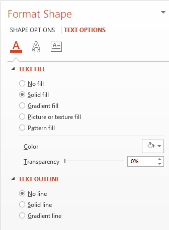

## **About WordArt?**
WordArt or Word Art is a feature that allows you to apply effects to texts to make them stand out. With WordArt, for example, you can outline a text or fill it with a color (or gradient), add 3D effects to it, etc. You also get to skew, bend, and stretch the shape of a text. 

{} 

WordArt allows you to treat a text as you would a graphical object. WordArt consists of effects or special modifications made to texts to make them more attractive or noticeable. 

{} 

**WordArt in Microsoft PowerPoint**

To use WordArt in Microsoft PowerPoint, you have to select one of the predefined WordArt templates. A WordArt template is a set of effects that gets applied to a text or its shape. 

**WordArt in Aspose.Slides**

In Aspose.Slides for Python via .NET 20.10, we implemented support for WordArt and made improvements to the feature in subsequent Aspose.Slides for Python via .NET releases. 

With Aspose.Slides for Python via .NET, you can easily create your own WordArt template (one effect or combination of effects) in Python and apply it to texts. 

## Creating a Simple WordArt Template and Applying It to a Text

**Using Aspose.Slides** 

First, we create a simple text using this Python code: 

```py
import aspose.slides as slides

with slides.Presentation() as pres:
    slide = pres.slides[0]
    autoShape = slide.shapes.add_auto_shape(slides.ShapeType.RECTANGLE, 200, 200, 400, 200)
    textFrame = autoShape.text_frame

    portion = textFrame.paragraphs[0].portions[0]
    portion.text = "Aspose.Slides"

    pres.save("wordart-1.pptx", slides.export.SaveFormat.PPTX)
```
Now, we set the text’s font height to a bigger value to make the effect more noticeable through this code:

```py 
    fontData = slides.FontData("Arial Black")
    portion.portion_format.latin_font = fontData
    portion.portion_format.font_height = 36
```

**Using Microsoft PowerPoint**

Go to the WordArt effects menu in Microsoft PowerPoint:


From the menu on the right, you can choose a predefined WordArt effect. From the menu on the left, you can specify the settings for a new WordArt. 

These are some of the available parameters or options:



**Using Aspose.Slides**

Here, we apply the SmallGrid pattern color to the text and add a 1-width black text border using this code:

```py 
    portion.portion_format.fill_format.fill_type = slides.FillType.PATTERN
    portion.portion_format.fill_format.pattern_format.fore_color.color = draw.Color.dark_orange
    portion.portion_format.fill_format.pattern_format.back_color.color = draw.Color.white
    portion.portion_format.fill_format.pattern_format.pattern_style = slides.PatternStyle.SMALL_GRID
                
    portion.portion_format.line_format.fill_format.fill_type = slides.FillType.SOLID
    portion.portion_format.line_format.fill_format.solid_fill_color.color = draw.Color.black
```

The resulting text:


## Applying Other WordArt Effects

**Using Microsoft PowerPoint**

From the program’s interface, you can apply these effects to a text, text block, shape, or similar element:


For example, Shadow, Reflection, and Glow effects can be applied to a text; 3D Format and 3D Rotation effects can be applied to a text block; Soft Edges property can be applied to a Shape Object (it still has an effect when no 3D Format property is set). 

### Applying Shadow Effects

Here, we intend to set the properties relating to a text only. We apply the shadow effect to a text using this code in Python:

```py 
    portion.portion_format.effect_format.enable_outer_shadow_effect()
    portion.portion_format.effect_format.outer_shadow_effect.shadow_color.color = draw.Color.black
    portion.portion_format.effect_format.outer_shadow_effect.scale_horizontal = 100
    portion.portion_format.effect_format.outer_shadow_effect.scale_vertical = 65
    portion.portion_format.effect_format.outer_shadow_effect.blur_radius = 4.73
    portion.portion_format.effect_format.outer_shadow_effect.direction = 230
    portion.portion_format.effect_format.outer_shadow_effect.distance = 2
    portion.portion_format.effect_format.outer_shadow_effect.skew_horizontal = 30
    portion.portion_format.effect_format.outer_shadow_effect.skew_vertical = 0
    portion.portion_format.effect_format.outer_shadow_effect.shadow_color.color_transform.add(slides.ColorTransformOperation.SET_ALPHA, 0.32)
```

Aspose.Slides API supports three types of shadows: OuterShadow, InnerShadow, and PresetShadow. 

 With PresetShadow, you can apply a shadow for a text (using preset values). 

**Using Microsoft PowerPoint**

In PowerPoint, you can use one type of shadow. Here’s an example:


**Using Aspose.Slides**

Aspose.Slides actually allows you to apply two types of shadows at once: InnerShadow and PresetShadow.

**Notes:**

- When OuterShadow and PresetShadow are used together, only the OuterShadow effect gets applied. 
- If OuterShadow and InnerShadow get used simultaneously, the resulting or applied effect depends on the PowerPoint version. For instance, in PowerPoint 2013, the effect gets doubled. But in PowerPoint 2007, the OuterShadow effect gets applied. 

### Applying Display to Texts

We add display to the text through this code sample in Python:

```py 
    portion.portion_format.effect_format.enable_reflection_effect()
    portion.portion_format.effect_format.reflection_effect.blur_radius = 0.5 
    portion.portion_format.effect_format.reflection_effect.distance = 4.72 
    portion.portion_format.effect_format.reflection_effect.start_pos_alpha = 0 
    portion.portion_format.effect_format.reflection_effect.end_pos_alpha = 60
    portion.portion_format.effect_format.reflection_effect.direction = 90 
    portion.portion_format.effect_format.reflection_effect.scale_horizontal = 100 
    portion.portion_format.effect_format.reflection_effect.scale_vertical = -100
    portion.portion_format.effect_format.reflection_effect.start_reflection_opacity = 60
    portion.portion_format.effect_format.reflection_effect.end_reflection_opacity = 0.9
    portion.portion_format.effect_format.reflection_effect.rectangle_align = slides.RectangleAlignment.BOTTOM_LEFT  
```

### Applying Glow Effect to Texts

We apply the glow effect to the text to make it shine or stand out using this code:

```py 
    portion.portion_format.effect_format.enable_glow_effect()
    portion.portion_format.effect_format.glow_effect.color.r = 255
    portion.portion_format.effect_format.glow_effect.color.color_transform.add(slides.ColorTransformOperation.SET_ALPHA, 0.54)
    portion.portion_format.effect_format.glow_effect.radius = 7
```

The result of the operation:


{} 

You can change the parameters for shadow, display, and glow. The effects’ properties get set on each portion of the text separately. 

{} 

### Using Transformations in WordArt

We use the Transform property (inherent in the entire block of text) through this code:
```py 
textFrame.text_frame_format.transform = slides.TextShapeType.ARCH_UP_POUR
```

The result:


{} 

Both Microsoft PowerPoint and Aspose.Slides for Python via .NET provide a certain number of predefined transformation types. 

{} 

**Using PowerPoint**

To access predefined transformation types, go through: **Format** -> **TextEffect** -> **Transform**

**Using Aspose.Slides**

To select a transformation type, use the TextShapeType enum. 

### Applying 3D effects to Texts and Shapes

We set a 3D effect to a text shape using this sample code:

```py 
    autoShape.three_d_format.bevel_bottom.bevel_type = slides.BevelPresetType.CIRCLE
    autoShape.three_d_format.bevel_bottom.height = 10.5
    autoShape.three_d_format.bevel_bottom.width = 10.5

    autoShape.three_d_format.bevel_top.bevel_type = slides.BevelPresetType.CIRCLE
    autoShape.three_d_format.bevel_top.height = 12.5
    autoShape.three_d_format.bevel_top.width = 11

    autoShape.three_d_format.extrusion_color.color = draw.Color.orange
    autoShape.three_d_format.extrusion_height = 6

    autoShape.three_d_format.contour_color.color = draw.Color.dark_red
    autoShape.three_d_format.contour_width = 1.5

    autoShape.three_d_format.depth = 3

    autoShape.three_d_format.material = slides.MaterialPresetType.PLASTIC

    autoShape.three_d_format.light_rig.direction = slides.LightingDirection.TOP
    autoShape.three_d_format.light_rig.light_type = slides.LightRigPresetType.BALANCED
    autoShape.three_d_format.light_rig.set_rotation(0, 0, 40)

    autoShape.three_d_format.camera.camera_type = slides.CameraPresetType.PERSPECTIVE_CONTRASTING_RIGHT_FACING
```

The resulting text and its shape:


We apply a 3D effect to the text with this Python code:

```py 
    textFrame.text_frame_format.three_d_format.bevel_bottom.bevel_type = slides.BevelPresetType.CIRCLE
    textFrame.text_frame_format.three_d_format.bevel_bottom.height = 3.5
    textFrame.text_frame_format.three_d_format.bevel_bottom.width = 3.5

    textFrame.text_frame_format.three_d_format.bevel_top.bevel_type = slides.BevelPresetType.CIRCLE
    textFrame.text_frame_format.three_d_format.bevel_top.height = 4
    textFrame.text_frame_format.three_d_format.bevel_top.width = 4

    textFrame.text_frame_format.three_d_format.extrusion_color.color = draw.Color.orange
    textFrame.text_frame_format.three_d_format.extrusion_height= 6

    textFrame.text_frame_format.three_d_format.contour_color.color = draw.Color.dark_red
    textFrame.text_frame_format.three_d_format.contour_width = 1.5

    textFrame.text_frame_format.three_d_format.depth= 3

    textFrame.text_frame_format.three_d_format.material = slides.MaterialPresetType.PLASTIC

    textFrame.text_frame_format.three_d_format.light_rig.direction = slides.LightingDirection.TOP
    textFrame.text_frame_format.three_d_format.light_rig.light_type = slides.LightRigPresetType.BALANCED
    textFrame.text_frame_format.three_d_format.light_rig.set_rotation(0, 0, 40)

    textFrame.text_frame_format.three_d_format.camera.camera_type = slides.CameraPresetType.PERSPECTIVE_CONTRASTING_RIGHT_FACING
```

The result of the operation:


{} 

The application of 3D effects to texts or their shapes and interactions between effects are based on certain rules. 

Consider a scene for a text and the shape containing that text. The 3D effect contains 3D object representation and the scene on which the object got placed. 

- When the scene is set for both the figure and the text, the figure scene gets the higher priority—the text scene is ignored. 
- When the figure lacks its own scene but has 3D representation, the text scene is used. 
- Otherwise—when the shape originally has no 3D effect—the shape is flat and the 3D effect only gets applied to the text. 

The descriptions are connected to the [ThreeDFormat.LightRig](https://reference.aspose.com/slides/python-net/aspose.slides/threedformat/) and [ThreeDFormat.Camera](https://reference.aspose.com/slides/python-net/aspose.slides/threedformat/) properties.

{} 

## **Apply Outer Shadow Effects to Texts**
Aspose.Slides for Python via .NET provides the [**IOuterShadow**](https://reference.aspose.com/slides/python-net/aspose.slides.effects/ioutershadow/) and [**IInnerShadow**](https://reference.aspose.com/slides/python-net/aspose.slides.effects/iinnershadow/) classes that allow you to apply shadow effects to a text carried by TextFrame. Go through these steps:

1. Create an instance of the [Presentation](https://reference.aspose.com/slides/python-net/aspose.slides/presentation/) class.
2. Obtain the reference of a slide by using its index.
3. Add an AutoShape of Rectangle type to the slide.
4. Access the TextFrame associated with the AutoShape.
5. Set the FillType of the AutoShape to NoFill.
6. Instantiate OuterShadow class
7. Set the BlurRadius of the shadow.
8. Set the Direction of the shadow
9. Set the Distance of the shadow.
10. Set the RectanglelAlign to TopLeft.
11. Set the PresetColor of the shadow to Black.
12. Write the presentation as a PPTX file.

This sample code in Python—an implementation of the steps above—shows you how to apply the outer shadow effect to a text:

```py
import aspose.slides as slides
import aspose.pydrawing as draw

with slides.Presentation() as pres:

    # Get reference of the slide
    sld = pres.slides[0]

    # Add an AutoShape of Rectangle type
    ashp = sld.shapes.add_auto_shape(slides.ShapeType.RECTANGLE, 150, 75, 150, 50)

    # Add TextFrame to the Rectangle
    ashp.add_text_frame("Aspose TextBox")

    # Disable shape fill in case we want to get shadow of text
    ashp.fill_format.fill_type = slides.FillType.NO_FILL

    # Add outer shadow and set all necessary parameters
    ashp.effect_format.enable_outer_shadow_effect()
    shadow = ashp.effect_format.outer_shadow_effect
    shadow.blur_radius = 4.0
    shadow.direction = 45
    shadow.distance = 3
    shadow.rectangle_align = slides.RectangleAlignment.TOP_LEFT
    shadow.shadow_color.preset_color = slides.PresetColor.BLACK

    #Write the presentation to disk
    pres.save("pres_out.pptx", slides.export.SaveFormat.PPTX)
```


## **Apply Inner Shadow Effect to Shapes**
Go through these steps:

1. Create an instance of the [Presentation](https://reference.aspose.com/slides/python-net/aspose.slides/presentation/) class.
2. Get a reference of the slide.
3. Add an AutoShape of the Rectangle type.
4. Enable InnerShadowEffect.
5. Set all the necessary parameters.
6. Set the ColorType as Scheme.
7. Set the Scheme Color.
8. Write the presentation as a [PPTX](https://docs.fileformat.com/presentation/pptx/) file.

This sample code (based on the steps above) shows you how to add a connector between two shapes in Python:

```py
import aspose.slides as slides
import aspose.pydrawing as draw

with slides.Presentation() as presentation:
    # Get reference of a slide
    slide = presentation.slides[0]

    # Add an AutoShape of Rectangle type
    ashp = slide.shapes.add_auto_shape(slides.ShapeType.RECTANGLE, 150, 75, 400, 300)
    ashp.fill_format.fill_type = slides.FillType.NO_FILL

    # Add TextFrame to the Rectangle
    ashp.add_text_frame("Aspose TextBox")
    port = ashp.text_frame.paragraphs[0].portions[0]
    pf = port.portion_format
    pf.font_height = 50

    # Enable inner_shadow_effect    
    ef = pf.effect_format
    ef.enable_inner_shadow_effect()

    # Set all necessary parameters
    ef.inner_shadow_effect.blur_radius = 8.0
    ef.inner_shadow_effect.direction = 90.0
    ef.inner_shadow_effect.distance = 6.0
    ef.inner_shadow_effect.shadow_color.b = 189

    # Set ColorType as Scheme
    ef.inner_shadow_effect.shadow_color.color_type = slides.ColorType.SCHEME

    # Set Scheme Color
    ef.inner_shadow_effect.shadow_color.scheme_color = slides.SchemeColor.ACCENT1

    # Save Presentation
    presentation.save("WordArt_out.pptx", slides.export.SaveFormat.PPTX)
```

## **FAQ**

**Can I use WordArt effects with different fonts or scripts (e.g., Arabic, Chinese)?**

Yes, Aspose.Slides supports Unicode and works with all major fonts and scripts. WordArt effects such as shadow, fill, and outline can be applied regardless of the language, although font availability and rendering may depend on the system fonts.

**Can I apply WordArt effects to slide master elements?**

Yes, you can apply WordArt effects to shapes on master slides, including title placeholders, footers, or background text. Changes made to the master layout will be reflected across all associated slides.

**Do WordArt effects affect presentation file size?**

Slightly. WordArt effects like shadows, glows, and gradient fills may slightly increase the file size due to added formatting metadata, but the difference is usually negligible.

**Can I preview the result of WordArt effects without saving the presentation?**

Yes, you can render slides containing WordArt to images (e.g., PNG, JPEG) using the `get_image` method from the [Shape](https://reference.aspose.com/slides/python-net/aspose.slides/shape/) or [Slide](https://reference.aspose.com/slides/python-net/aspose.slides/slide/) classes. This lets you preview the result in-memory or on-screen before saving or exporting the full presentation.
