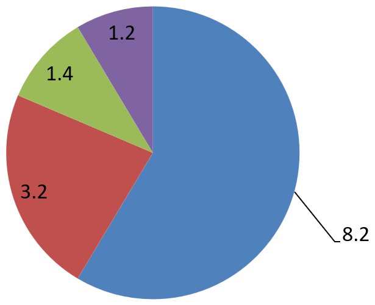

## **Overview**

Data labels on a chart show details about the chart data series or individual data points. They allow readers to quickly identify data series and they also make charts easier to understand. In Aspose.Slides for Python, you can enable, customize, and format data labels for any chart—choosing what to display (values, percentages, series or category names), where to position labels, and how they look (font, number format, separators, leader lines, and more). This article outlines the essential APIs and examples you need to add clear, informative labels to your charts.

## **Set Data Label Precision**

Chart data labels often display numeric values that require consistent precision. This section shows how to control the number of decimal places for data labels in Aspose.Slides by applying an appropriate number format.

The following Python example shows how to set the numeric precision for chart data labels:

```py
import aspose.slides as slides
import aspose.slides.charts as charts

with slides.Presentation() as presentation:
    slide = presentation.slides[0]

    chart = slide.shapes.add_chart(charts.ChartType.LINE, 50, 50, 500, 300)

    series = chart.chart_data.series[0]
    series.labels.default_data_label_format.show_value = True
    series.number_format_of_values = "#,##0.00"

    presentation.save("data_label_precision.pptx", slides.export.SaveFormat.PPTX)
```

## **Display Percentages as Labels**

With Aspose.Slides, you can display percentages as data labels on charts. The example below calculates each point’s share within its category and formats the label to show the percentage.

```py
import aspose.slides as slides
import aspose.slides.charts as charts

# Create an instance of the Presentation class.
with slides.Presentation() as presentation:
    slide = presentation.slides[0]

    chart = slide.shapes.add_chart(charts.ChartType.STACKED_COLUMN, 20, 20, 600, 400)
    series = chart.chart_data.series[0]

    total_for_categories = [0]*len(chart.chart_data.categories)
    for k in range(len(chart.chart_data.categories)):
        for i in range(len(chart.chart_data.series)):
            total_for_categories[k] += chart.chart_data.series[i].data_points[k].value.data

    for i in range(len(chart.chart_data.series)):
        series = chart.chart_data.series[i]
        series.labels.default_data_label_format.show_legend_key = False

        for j in range(len(series.data_points)):
            data_point_percent = series.data_points[j].value.data / total_for_categories[j] * 100

            text_portion = slides.Portion()
            text_portion.text = "{0:.2f} %".format(data_point_percent)
            text_portion.portion_format.font_height = 8

            label = series.data_points[j].label
            label.text_frame_for_overriding.text = ""

            paragraph = label.text_frame_for_overriding.paragraphs[0]
            paragraph.portions.add(text_portion)

            label.data_label_format.show_series_name = False
            label.data_label_format.show_percentage = False
            label.data_label_format.show_legend_key = False
            label.data_label_format.show_category_name = False
            label.data_label_format.show_bubble_size = False

    # Save the presentation containing the chart.
    presentation.save("percentage_as_label.pptx", slides.export.SaveFormat.PPTX)
```

## **Show Percent Signs with Chart Data Labels**

This section shows how to display percentages in chart data labels and include the percent sign using Aspose.Slides. You’ll learn how to enable percentage values for entire series or specific points (ideal for pie, doughnut, and 100% stacked charts) and how to control formatting through label options or a custom number format.

The following Python example shows how to add a percent sign to a chart’s data label:

```py
import aspose.slides as slides
import aspose.slides.charts as charts
import aspose.pydrawing as draw

# Create an instance of the Presentation class.
with slides.Presentation() as presentation:

    # Get a slide reference by index.
    slide = presentation.slides[0]

    # Create a PercentsStackedColumn chart on the slide.
    chart = slide.shapes.add_chart(charts.ChartType.PERCENTS_STACKED_COLUMN, 20, 20, 600, 400)

    chart.axes.vertical_axis.is_number_format_linked_to_source = False
    chart.axes.vertical_axis.number_format = "0.00%"

    chart.chart_data.series.clear()

    # Get the chart data workbook.
    workbook = chart.chart_data.chart_data_workbook
    worksheet_index = 0

    # Add a new series.
    series = chart.chart_data.series.add(workbook.get_cell(worksheet_index, 0, 1, "Reds"), chart.type)
    series.data_points.add_data_point_for_bar_series(workbook.get_cell(worksheet_index, 1, 1, 0.30))
    series.data_points.add_data_point_for_bar_series(workbook.get_cell(worksheet_index, 2, 1, 0.50))
    series.data_points.add_data_point_for_bar_series(workbook.get_cell(worksheet_index, 3, 1, 0.80))
    series.data_points.add_data_point_for_bar_series(workbook.get_cell(worksheet_index, 4, 1, 0.65))

    # Set the series fill color.
    series.format.fill.fill_type = slides.FillType.SOLID
    series.format.fill.solid_fill_color.color = draw.Color.red

    # Set label format properties.
    series.labels.default_data_label_format.show_value = True
    series.labels.default_data_label_format.is_number_format_linked_to_source = False
    series.labels.default_data_label_format.number_format = "0.0%"
    series.labels.default_data_label_format.text_format.portion_format.font_height = 10
    series.labels.default_data_label_format.text_format.portion_format.fill_format.fill_type = slides.FillType.SOLID
    series.labels.default_data_label_format.text_format.portion_format.fill_format.solid_fill_color.color = draw.Color.white
    series.labels.default_data_label_format.show_value = True

    # Add a new series.
    series2 = chart.chart_data.series.add(workbook.get_cell(worksheet_index, 0, 2, "Blues"), chart.type)
    series2.data_points.add_data_point_for_bar_series(workbook.get_cell(worksheet_index, 1, 2, 0.70))
    series2.data_points.add_data_point_for_bar_series(workbook.get_cell(worksheet_index, 2, 2, 0.50))
    series2.data_points.add_data_point_for_bar_series(workbook.get_cell(worksheet_index, 3, 2, 0.20))
    series2.data_points.add_data_point_for_bar_series(workbook.get_cell(worksheet_index, 4, 2, 0.35))

    # Set the fill type and color.
    series2.format.fill.fill_type = slides.FillType.SOLID
    series2.format.fill.solid_fill_color.color = draw.Color.blue
    series2.labels.default_data_label_format.show_value = True
    series2.labels.default_data_label_format.is_number_format_linked_to_source = False
    series2.labels.default_data_label_format.number_format = "0.0%"
    series2.labels.default_data_label_format.text_format.portion_format.font_height = 10
    series2.labels.default_data_label_format.text_format.portion_format.fill_format.fill_type = slides.FillType.SOLID
    series2.labels.default_data_label_format.text_format.portion_format.fill_format.solid_fill_color.color = draw.Color.white

    # Save the presentation.
    presentation.save("percentage_sign.pptx", slides.export.SaveFormat.PPTX)
```

## **Set Label Distance from Axis**

This section shows how to control the distance between data labels and the chart axis in Aspose.Slides. Adjusting this offset helps prevent overlaps and improves readability in dense visuals.

The following Python code shows how to set the label distance from the category axis when working with an axes-based chart:

```py
import aspose.slides as slides
import aspose.slides.charts as charts

# Create an instance of the Presentation class.
with slides.Presentation() as presentation:
    # Get a slide reference.
    slide = presentation.slides[0]

    # Create a clustered column chart on the slide.
    chart = slide.shapes.add_chart(charts.ChartType.CLUSTERED_COLUMN, 20, 20, 500, 300)

    # Set the label distance from the category (horizontal) axis.
    chart.axes.horizontal_axis.label_offset = 500

    # Save the presentation.
    presentation.save("axis_label_distance.pptx", slides.export.SaveFormat.PPTX)
```

## **Adjust Label Position**

When you create a chart that does not use axes, such as a pie chart, the data labels may be too close to the edge. In that case, adjust the label position so leader lines display clearly.

The following Python code shows how to adjust the label position on a pie chart:

```python
import aspose.slides as slides
import aspose.slides.charts as charts

with slides.Presentation() as presentation:
    slide = presentation.slides[0]

    chart = slide.shapes.add_chart(charts.ChartType.PIE, 50, 50, 600, 300)

    series = chart.chart_data.series[0]
    series.labels.default_data_label_format.show_value = True
    series.labels.default_data_label_format.show_leader_lines = True

    label = series.labels[0]
    label.data_label_format.position = charts.LegendDataLabelPosition.OUTSIDE_END

    label.x = 0.05
    label.y = 0.1

    presentation.save("presentation.pptx", slides.export.SaveFormat.PPTX)
```



## **FAQ**

**How can I prevent data labels from overlapping on dense charts?**

Combine automatic label placement, leader lines, and reduced font size; if necessary, hide some fields (for example, the category) or show labels only for extreme/key points.

**How can I disable labels only for zero, negative, or empty values?**

Filter data points before enabling labels and turn off display for values of 0, negative values, or missing values according to a defined rule.

**How can I ensure a consistent label style when exporting to PDF/images?**

Explicitly set fonts (family, size) and verify that the font is available on the rendering side to avoid fallback.
