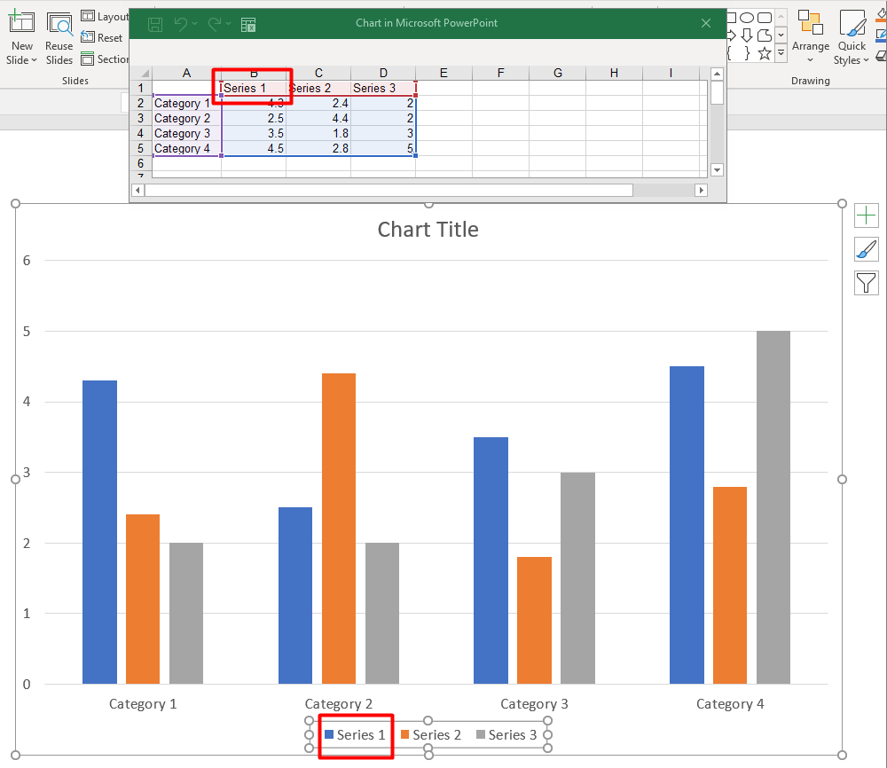
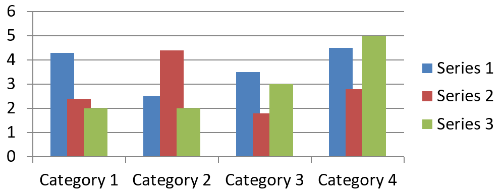
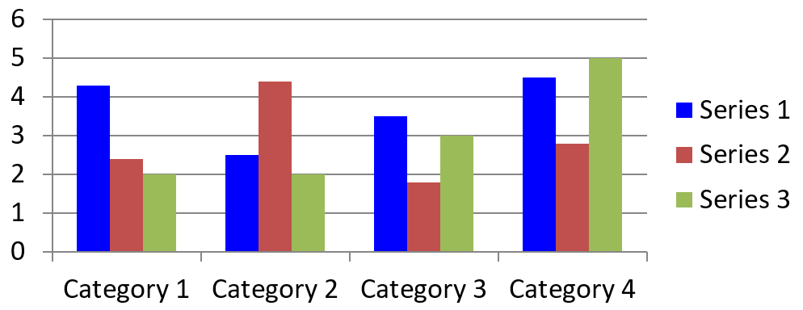
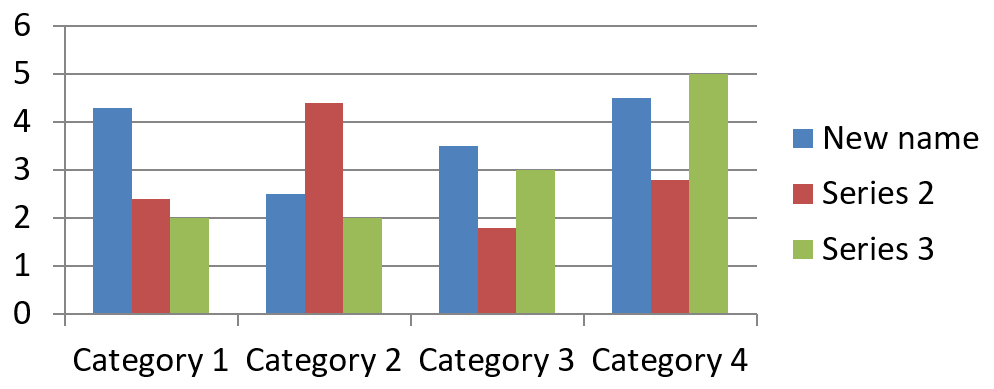
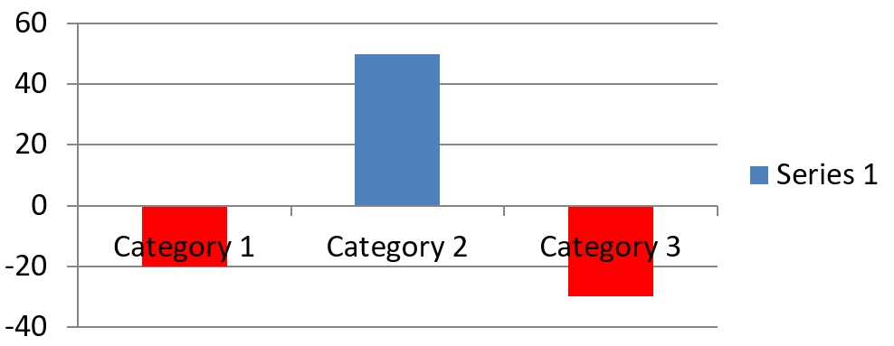
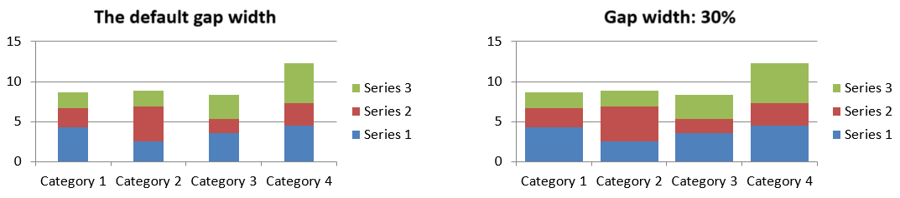

## **Overview**

This article describes the role of [ChartSeries](https://reference.aspose.com/slides/python-net/aspose.slides.charts/chartseries/) in Aspose.Slides for Python, focusing on how data is structured and visualized within presentations. These objects provide the foundational elements that define individual sets of data points, categories, and appearance parameters in a chart. By working with [ChartSeries](https://reference.aspose.com/slides/python-net/aspose.slides.charts/chartseries/), developers can seamlessly integrate underlying data sources and maintain full control over how information is displayed, resulting in dynamic, data-driven presentations that clearly convey insights and analysis.

A series is a row or column of numbers plotted in a chart.



## **Set Series Overlap**

The [ChartSeries.overlap](https://reference.aspose.com/slides/python-net/aspose.slides.charts/chartseries/overlap/) property controls how bars and columns overlap in a 2D chart by specifying a range from -100 to 100. Since this property is associated with the series group rather than individual chart series, it is read-only at the series level. To configure overlap values, use the `parent_series_group.overlap` read/write property, which applies the specified overlap to all series in that group.

Below is a Python example that demonstrates how to create a presentation, add a clustered column chart, access the first chart series, configure the overlap setting, and then save the result as a PPTX file:

```py
import aspose.slides as slides
import aspose.slides.charts as charts

series_overlap = 30

with slides.Presentation() as presentation:
    slide = presentation.slides[0]

    # Add a clustered column chart with default data.
    chart = slide.shapes.add_chart(charts.ChartType.CLUSTERED_COLUMN, 20, 20, 500, 200)

    series = chart.chart_data.series[0]
    if series.overlap == 0:
        # Set the series overlap.
        series.parent_series_group.overlap = series_overlap

    # Save the presentation file to disk.
    presentation.save("series_overlap.pptx", slides.export.SaveFormat.PPTX)
```

The result:



## **Change Series Fill Color**

Aspose.Slides makes it straightforward to customize the fill colors of chart series, allowing you to highlight specific data points and create visually appealing charts. This is achieved through the [Format](https://reference.aspose.com/slides/python-net/aspose.slides.charts/format/) object, which supports various fill types, color configurations, and other advanced styling options. After adding a chart to a slide and accessing the desired series, simply get a series and apply the appropriate fill color. Beyond solid fills, you can also leverage gradient or pattern fills for enhanced design flexibility. Once you’ve set the colors according to your requirements, save the presentation to finalize the updated look.

The following Python code example shows how to change the color of the first series:

```py
import aspose.slides as slides
import aspose.slides.charts as charts
import aspose.pydrawing as draw

series_color = draw.Color.blue

with slides.Presentation() as presentation:
    slide = presentation.slides[0]

    # Add a clustered column chart with default data.
    chart = slide.shapes.add_chart(charts.ChartType.CLUSTERED_COLUMN, 20, 20, 500, 200)

    # Set the color of the first series.
    series = chart.chart_data.series[0]
    series.format.fill.fill_type = slides.FillType.SOLID
    series.format.fill.solid_fill_color.color = series_color

    # Save the presentation file to disk.
    presentation.save("series_color.pptx", slides.export.SaveFormat.PPTX)
```

The result:



## **Rename a Series** 

Aspose.Slides offers a simple way to modify the names of chart series, making it easier to label data in a clear and meaningful way. By accessing the relevant worksheet cell in the chart data, developers can customize how the data is presented. This modification is particularly useful when series names need to be updated or clarified based on the data’s context. After renaming the series, the presentation can be saved to persist the changes. 

Below is a Python code snippet demonstrating this process in action.

```py
import aspose.slides as slides
import aspose.slides.charts as charts

series_name = "New name"

with slides.Presentation() as presentation:
    slide = presentation.slides[0]

    # Add a clustered column chart with default data.
    chart = slide.shapes.add_chart(charts.ChartType.CLUSTERED_COLUMN, 20, 20, 500, 200)
    
    # Set the name of the first series.
    series_cell = chart.chart_data.chart_data_workbook.get_cell(0, 0, 1)
    series_cell.value = series_name
    
    # Save the presentation file to disk.
    presentation.save("series_name.pptx", slides.export.SaveFormat.PPTX)
```

The following Python code shows an alternative way to change the series name:

```py
import aspose.slides as slides
import aspose.slides.charts as charts

series_name = "New name"

with slides.Presentation() as presentation:
    slide = presentation.slides[0]

    # Add a clustered column chart with default data.
    chart = slide.shapes.add_chart(charts.ChartType.CLUSTERED_COLUMN, 20, 20, 500, 200)
    series = chart.chart_data.series[0]
    
    # Set the name of the first series.
    series.name.as_cells[0].value = series_name

    # Save the presentation file to disk.
    presentation.save("series_name.pptx", slides.export.SaveFormat.PPTX) 
```

The result:



## **Get Automatic Series Fill Color**

Aspose.Slides for Python allows you to get the automatic fill color for chart series within a plot area. After creating an instance of the [Presentation](https://reference.aspose.com/slides/python-net/aspose.slides/presentation/) class, you can obtain a reference to the desired slide by index, then add a chart using your preferred type (such as `ChartType.CLUSTERED_COLUMN`). By accessing the series in the chart, you can get the automatic fill color.

The Python code below demonstrates this process in detail.

```py
import aspose.slides as slides
import aspose.slides.charts as charts

with slides.Presentation() as presentation:
    slide = presentation.slides[0]

    # Add a clustered column chart with default data.
    chart = slide.shapes.add_chart(charts.ChartType.CLUSTERED_COLUMN, 20, 20, 500, 200)

    for i in range(len(chart.chart_data.series)):
        # Get the fill color of the series.
        color = chart.chart_data.series[i].get_automatic_series_color()
        print(f"Series {i} color: {color.name}")
```

Example Output:

```text
Series 0 color: ff4f81bd
Series 1 color: ffc0504d
Series 2 color: ff9bbb59
```

## **Set Invert Fill Colors for a Series**

When your data series contains both positive and negative values, simply coloring every column or bar the same can make the chart hard to read. Aspose.Slides for Python lets you assign an invert fill color—a separate fill applied automatically to data points that fall below zero—so negative values stand out at a glance. In this section you’ll learn how to enable that option, choose an appropriate color, and save the updated presentation.

The following code example demonstrates the operation:

```py
import aspose.slides as slides
import aspose.slides.charts as charts
import aspose.pydrawing as draw

invert_color = draw.Color.red

with slides.Presentation() as presentation:
    slide = presentation.slides[0]

    chart = slide.shapes.add_chart(charts.ChartType.CLUSTERED_COLUMN, 20, 20, 500, 200)
    workBook = chart.chart_data.chart_data_workbook

    chart.chart_data.series.clear()
    chart.chart_data.categories.clear()

    # Add new categories.
    chart.chart_data.categories.add(workBook.get_cell(0, 1, 0, "Category 1"))
    chart.chart_data.categories.add(workBook.get_cell(0, 2, 0, "Category 2"))
    chart.chart_data.categories.add(workBook.get_cell(0, 3, 0, "Category 3"))

    # Add a new series.
    series = chart.chart_data.series.add(workBook.get_cell(0, 0, 1, "Series 1"), chart.type)

    # Populate the series data.
    series.data_points.add_data_point_for_bar_series(workBook.get_cell(0, 1, 1, -20))
    series.data_points.add_data_point_for_bar_series(workBook.get_cell(0, 2, 1, 50))
    series.data_points.add_data_point_for_bar_series(workBook.get_cell(0, 3, 1, -30))

    # Set the color settings for the series.
    series_color = series.get_automatic_series_color()
    series.invert_if_negative = True
    series.format.fill.fill_type = slides.FillType.SOLID
    series.format.fill.solid_fill_color.color = series_color
    series.inverted_solid_fill_color.color = invert_color
    presentation.save("inverted_solid_fill_color.pptx", slides.export.SaveFormat.PPTX)
```

The result:



You can invert the fill color for a single data point rather than the whole series. Simply access the desired `ChartDataPoint` and set its `invert_if_negative` property to `True`.

The following code example shows how to do this:

```py
import aspose.slides as slides
import aspose.slides.charts as charts
import aspose.pydrawing as draw

with slides.Presentation() as presentation:
    slide = presentation.slides[0]

	chart = slide.shapes.add_chart(charts.ChartType.CLUSTERED_COLUMN, 20, 20, 500, 200, True)
	chart.chart_data.series.clear()

	series = series.add(chart.chart_data.chart_data_workbook.get_cell(0, "B1"), chart.type)

	series.data_points.add_data_point_for_bar_series(chart.chart_data.chart_data_workbook.get_cell(0, "B2", -5))
	series.data_points.add_data_point_for_bar_series(chart.chart_data.chart_data_workbook.get_cell(0, "B3", 3))
	series.data_points.add_data_point_for_bar_series(chart.chart_data.chart_data_workbook.get_cell(0, "B4", -3))
	series.data_points.add_data_point_for_bar_series(chart.chart_data.chart_data_workbook.get_cell(0, "B5", 1))

	series.invert_if_negative = False
	series.data_points[2].invert_if_negative = True

	presentation.save("data_point_invert_color_if_negative.pptx", slides.export.SaveFormat.PPTX)
```

## **Clear Data for Specific Data Points**

Sometimes a chart contains test values, outliers, or obsolete entries that you need to remove without rebuilding the entire series. Aspose.Slides for Python lets you target any data point by index, clear its contents, and instantly refresh the plot so the remaining points shift and the axes rescale automatically.

The following code exammple demonstrates the operation:

```py
import aspose.slides as slides
import aspose.slides.charts as charts

with slides.Presentation("test_chart.pptx") as presentation:
    slide = presentation.slides[0]
    chart = slide.shapes[0]
    series = chart.chart_data.series[0]

    for data_point in series.data_points:
        data_point.x_value.as_cell.value = None
        data_point.y_value.as_cell.value = None

    series.data_points.clear()

    presentation.save("clear_data_points.pptx", slides.export.SaveFormat.PPTX)
```

## **Set Series Gap Width**

Gap width controls the amount of empty space between adjacent columns or bars—wider gaps emphasize individual categories, while narrower gaps create a denser, more compact look. Through Aspose.Slides for Python you can fine‑tune this parameter for an entire series, achieving exactly the visual balance your presentation requires without altering the underlying data.

The following code example shows how to set the gap width for a series:

```py
import aspose.slides as slides
import aspose.slides.charts as charts

gap_width = 30

# Create an empty presentation.
with slides.Presentation() as presentation:

    # Access the first slide.
    slide = presentation.slides[0]

    # Add a chart with default data with default data.
    chart = slide.shapes.add_chart(charts.ChartType.STACKED_COLUMN, 20, 20, 500, 200)

    # Save the presentation to disk.
    presentation.save("default_gap_width.pptx", slides.export.SaveFormat.PPTX)

    # Set the gap_width value.
    series = chart.chart_data.series[0]
    series.parent_series_group.gap_width = gap_width

    # Save the presentation to disk.
    presentation.save("gap_width_30.pptx", slides.export.SaveFormat.PPTX)
```

The result:



## **FAQ**

**Is there a limit to how many series a single chart can contain?**

Aspose.Slides imposes no fixed cap on the number of series you add. The practical ceiling is set by chart readability and by the memory available to your application.

**What if the columns within a cluster are too close together or too far apart?**

Adjust the [gap_width](https://reference.aspose.com/slides/python-net/aspose.slides.charts/chartseries/gap_width/) setting for that series (or its parent series group). Increasing the value widens the space between columns, while decreasing it brings them closer together.
