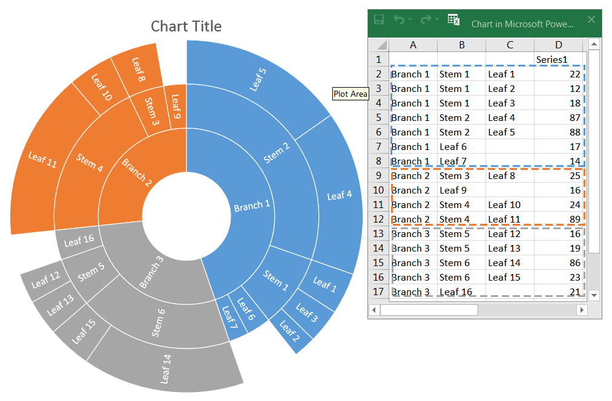
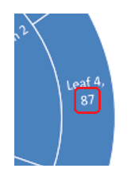
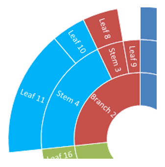

## **Introduction**

Among other PowerPoint chart types, there are two hierarchical ones—**Treemap** and **Sunburst** (also known as Sunburst Graph, Sunburst Diagram, Radial Chart, Radial Graph, or Multi-Level Pie Chart). These charts display hierarchical data organized as a tree—from leaves to the top of a branch. Leaves are defined by the series data points, and each subsequent nested grouping level is defined by the corresponding category. Aspose.Slides for Python via .NET allows you to format data points of Sunburst charts and Treemaps in Python.

Here is a Sunburst chart where data in the Series1 column defines the leaf nodes, while the other columns define hierarchical data points:



Let’s start by adding a new Sunburst chart to the presentation:

```py
with slides.Presentation() as presentation:
    slide = presentation.slides[0]
    chart = slide.shapes.add_chart(charts.ChartType.SUNBURST, 30, 30, 450, 400)
```

{}
- [**Create Sunburst Charts**](/slides/python-net/create-chart/#create-sunburst-charts)
{}

If you need to format chart data points, use the following APIs:

[ChartDataPointLevelsManager](https://reference.aspose.com/slides/python-net/aspose.slides.charts/chartdatapointlevelsmanager/), [ChartDataPointLevel](https://reference.aspose.com/slides/python-net/aspose.slides.charts/chartdatapointlevel/), and the [ChartDataPoint.data_point_levels](https://reference.aspose.com/slides/python-net/aspose.slides.charts/chartdatapoint/data_point_levels/) property. They provide access to formatting data points in Treemap and Sunburst charts. [ChartDataPointLevelsManager](https://reference.aspose.com/slides/python-net/aspose.slides.charts/chartdatapointlevelsmanager/) is used to access multi-level categories; it represents a container of [ChartDataPointLevel](https://reference.aspose.com/slides/python-net/aspose.slides.charts/chartdatapointlevel/) objects. It is essentially a wrapper around [ChartCategoryLevelsManager](https://reference.aspose.com/slides/python-net/aspose.slides.charts/chartcategorylevelsmanager/) with additional properties specific to data points. The [ChartDataPointLevel](https://reference.aspose.com/slides/python-net/aspose.slides.charts/chartdatapointlevel/) type exposes two properties—[format](https://reference.aspose.com/slides/python-net/aspose.slides.charts/chartdatapointlevel/format/) and [label](https://reference.aspose.com/slides/python-net/aspose.slides.charts/chartdatapointlevel/label/)—which provide access to the corresponding settings.

## **Display Data Point Values**

This section shows how to display the value for individual data points in Treemap and Sunburst charts. You’ll see how to enable value labels for selected points.

Display the value of the "Leaf 4" data point:

```py
data_points = chart.chart_data.series[0].data_points
data_points[3].data_point_levels[0].label.data_label_format.show_value = True
```



## **Set Labels and Colors for Data Points**

This section shows how to set custom labels and colors for individual data points in Treemap and Sunburst charts. You will learn how to access a specific data point, assign a label, and apply a solid fill to highlight important nodes.

Set the "Branch 1" data label to show the series name ("Series1") instead of the category name, and then set the text color to yellow:

```py
branch1_label = data_points[0].data_point_levels[2].label
branch1_label.data_label_format.show_category_name = False
branch1_label.data_label_format.show_series_name = True

branch1_label.data_label_format.text_format.portion_format.fill_format.fill_type = slides.FillType.SOLID
branch1_label.data_label_format.text_format.portion_format.fill_format.solid_fill_color.color = draw.Color.yellow
```


## **Set Branch Colors for Data Points**

Use branch colors to control how parent and child nodes are visually grouped in Treemap and Sunburst charts. This section shows how to set a custom branch color for a specific data point so you can highlight important subtrees and improve chart readability.

Change the color of the "Stem 4" branch:

```py
import aspose.slides as slides
import aspose.slides.charts as charts
import aspose.pydrawing as draw

with slides.Presentation() as presentation:
    slide = presentation.slides[0]

    chart = slide.shapes.add_chart(charts.ChartType.SUNBURST, 30, 30, 450, 400)
    data_points = chart.chart_data.series[0].data_points

    stem4_branch = data_points[9].data_point_levels[1]
    
    stem4_branch.format.fill.fill_type = slides.FillType.SOLID
    stem4_branch.format.fill.solid_fill_color.color = draw.Color.red
      
    presentation.save("branch_color.pptx", slides.export.SaveFormat.PPTX)
```



## **FAQ**

**Can I change the order (sorting) of segments in Sunburst/Treemap?**

No. PowerPoint sorts segments automatically (typically by descending values, clockwise). Aspose.Slides mirrors this behavior: you can’t change the order directly; you achieve it by preprocessing the data.

**How does the presentation theme affect the colors of segments and labels?**

Chart colors inherit the presentation’s [theme/palette](/slides/python-net/presentation-theme/) unless you explicitly set fills/fonts. For consistent results, lock in solid fills and text formatting at the required levels.

**Will export to PDF/PNG preserve custom branch colors and label settings?**

Yes. When exporting the presentation, chart settings (fills, labels) are preserved in the output formats because Aspose.Slides renders with the chart’s formatting applied.

**Can I compute the actual coordinates of a label/element for custom overlay placement on top of the chart?**

Yes. After the chart layout is validated, `actual_x`/`actual_y` are available for elements (for example, a [DataLabel](https://reference.aspose.com/slides/python-net/aspose.slides.charts/datalabel/)), which helps with precise positioning of overlays.
