## **Overview**

This article provides a comprehensive guide on how to create and customize charts using Aspose.Slides for Python via .NET. You will learn how to programmatically add a chart to a slide, populate it with data, and apply various formatting options to match your specific design requirements. Throughout the article, detailed code examples illustrate each step, from initializing the presentation and chart object to configuring series, axes, and legends. By following this guide, you'll gain a solid understanding of how to integrate dynamic chart generation into your applications, streamlining the process of creating data-driven presentations.

## **Create a Chart**

Charts help people quickly visualize data and gain insights that may not be immediately obvious from a table or spreadsheet.

**Why Create Charts?**

Using charts, you can:

* aggregate, condense, or summarize large amounts of data on a single slide in a presentation;
* expose patterns and trends in data;
* deduce the direction and momentum of data over time or with respect to a specific unit of measurement;
* spot outliers, aberrations, deviations, errors, and nonsensical data;
* communicate or present complex data.

In PowerPoint, you can create charts through the *Insert* function, which provides templates for designing many types of charts. Using Aspose.Slides, you can create both regular charts (based on popular chart types) and custom charts.

{} 

Use the [ChartType](https://reference.aspose.com/slides/python-net/aspose.slides.charts/charttype/) enumeration under the [Aspose.Slides.Charts](https://reference.aspose.com/slides/python-net/aspose.slides.charts/) namespace. The values in this enumeration correspond to different chart types.

{} 

### **Create Clustered Column Charts**

This section explains how to create clustered column charts using Aspose.Slides for Python via .NET. You'll learn to initialize a presentation, add a chart, and customize its elements such as title, data, series, categories, and styling. Follow the steps below to see how a standard clustered column chart is generated:

1. Create an instance of the [Presentation](https://reference.aspose.com/slides/python-net/aspose.slides/presentation/) class.
1. Get a reference to a slide using its index.
1. Add a chart with some data and specify the `ChartType.CLUSTERED_COLUMN` type.
1. Add a title to the chart.
1. Access the chart's data worksheet.
1. Clear all the default series and categories.
1. Add new series and categories.
1. Add new chart data for the chart series.
1. Apply a fill color to the chart series.
1. Add labels to the chart series.
1. Save the modified presentation as a PPTX file.

This Python code demonstrates how to create a clustered column chart:

```py
import aspose.slides.charts as charts
import aspose.slides as slides
import aspose.pydrawing as draw

# Instantiate the Presentation class that represents a PPTX file.
with slides.Presentation() as presentation:

    # Access the first slide.
    slide = presentation.slides[0]

    # Add a clustered column chart with its default data.
    chart = slide.shapes.add_chart(charts.ChartType.CLUSTERED_COLUMN, 20, 20, 500, 300)

    # Set the chart title.
    chart.chart_title.add_text_frame_for_overriding("Sample Title")
    chart.chart_title.text_frame_for_overriding.text_frame_format.center_text = slides.NullableBool.TRUE
    chart.chart_title.height = 20
    chart.has_title = True

    # Set the first series to show values.
    chart.chart_data.series[0].labels.default_data_label_format.show_value = True

    # Set the index of the chart data sheet.
    worksheet_index = 0

    # Get the chart data workbook.
    workbook = chart.chart_data.chart_data_workbook

    # Delete the default generated series and categories.
    chart.chart_data.series.clear()
    chart.chart_data.categories.clear()

    # Add new series.
    chart.chart_data.series.add(workbook.get_cell(worksheet_index, 0, 1, "Series 1"), chart.type)
    chart.chart_data.series.add(workbook.get_cell(worksheet_index, 0, 2, "Series 2"), chart.type)

    # Add new categories.
    chart.chart_data.categories.add(workbook.get_cell(worksheet_index, 1, 0, "Category 1"))
    chart.chart_data.categories.add(workbook.get_cell(worksheet_index, 2, 0, "Category 2"))
    chart.chart_data.categories.add(workbook.get_cell(worksheet_index, 3, 0, "Category 3"))

    # Get the first chart series.
    series = chart.chart_data.series[0]

    # Populate the series data.
    series.data_points.add_data_point_for_bar_series(workbook.get_cell(worksheet_index, 1, 1, 20))
    series.data_points.add_data_point_for_bar_series(workbook.get_cell(worksheet_index, 2, 1, 50))
    series.data_points.add_data_point_for_bar_series(workbook.get_cell(worksheet_index, 3, 1, 30))

    # Set the fill color for the series.
    series.format.fill.fill_type = slides.FillType.SOLID
    series.format.fill.solid_fill_color.color = draw.Color.red

    # Get the second chart series.
    series = chart.chart_data.series[1]

    # Populate the series data.
    series.data_points.add_data_point_for_bar_series(workbook.get_cell(worksheet_index, 1, 2, 30))
    series.data_points.add_data_point_for_bar_series(workbook.get_cell(worksheet_index, 2, 2, 10))
    series.data_points.add_data_point_for_bar_series(workbook.get_cell(worksheet_index, 3, 2, 60))

    # Set the fill color for the series.
    series.format.fill.fill_type = slides.FillType.SOLID
    series.format.fill.solid_fill_color.color = draw.Color.green

    # Set the first label to show the category name.
    label = series.data_points[0].label
    label.data_label_format.show_category_name = True

    label = series.data_points[1].label
    label.data_label_format.show_series_name = True

    # Set the series to show the value for the third label.
    label = series.data_points[2].label
    label.data_label_format.show_value = True
    label.data_label_format.show_series_name = True
    label.data_label_format.separator = "/"
                
    # Save the presentation to disk as a PPTX file.
    presentation.save("ClusteredColumnChart.pptx", slides.export.SaveFormat.PPTX)
```

The result:

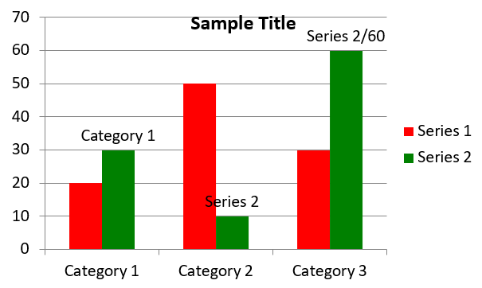

### **Create Scatter Charts**

Scatter charts (also known as scatter plots or x-y graphs) are often used to check for patterns or demonstrate correlations between two variables.

Use a scatter chart when:

* You have paired numerical data.
* You have two variables that pair well together.
* You want to determine whether the two variables are related.
* You have an independent variable that has multiple values for a dependent variable.

This Python code shows you how to create a scatter chart with a different series of markers:

```py
import aspose.slides.charts as charts
import aspose.slides as slides
import aspose.pydrawing as draw

# Instantiate the Presentation class.
with slides.Presentation() as presentation:

    # Access the first slide.
    slide = presentation.slides[0]

    # Create the default scatter chart.
    chart = slide.shapes.add_chart(charts.ChartType.SCATTER_WITH_SMOOTH_LINES, 20, 20, 500, 300)

    # Set the index of the chart data sheet.
    worksheet_index = 0

    # Get the chart data workbook.
    workbook = chart.chart_data.chart_data_workbook

    # Delete the default series.
    chart.chart_data.series.clear()

    # Add new series.
    chart.chart_data.series.add(workbook.get_cell(worksheet_index, 1, 1, "Series 1"), chart.type)
    chart.chart_data.series.add(workbook.get_cell(worksheet_index, 1, 3, "Series 2"), chart.type)

    # Get the first chart series.
    series = chart.chart_data.series[0]

    # Add a new point (1:3) to the series.
    series.data_points.add_data_point_for_scatter_series(workbook.get_cell(worksheet_index, 2, 1, 1), workbook.get_cell(worksheet_index, 2, 2, 3))

    # Add a new point (2:10).
    series.data_points.add_data_point_for_scatter_series(workbook.get_cell(worksheet_index, 3, 1, 2), workbook.get_cell(worksheet_index, 3, 2, 10))

    # Change the series type.
    series.type = charts.ChartType.SCATTER_WITH_STRAIGHT_LINES_AND_MARKERS

    # Change the chart series marker.
    series.marker.size = 10
    series.marker.symbol = charts.MarkerStyleType.STAR

    # Get the second chart series.
    series = chart.chart_data.series[1]

    # Add a new point (5:2) to the chart series.
    series.data_points.add_data_point_for_scatter_series(workbook.get_cell(worksheet_index, 2, 3, 5), workbook.get_cell(worksheet_index, 2, 4, 2))

    # Add a new point (3:1).
    series.data_points.add_data_point_for_scatter_series(workbook.get_cell(worksheet_index, 3, 3, 3), workbook.get_cell(worksheet_index, 3, 4, 1))

    # Add a new point (2:2).
    series.data_points.add_data_point_for_scatter_series(workbook.get_cell(worksheet_index, 4, 3, 2), workbook.get_cell(worksheet_index, 4, 4, 2))

    # Add a new point (5:1).
    series.data_points.add_data_point_for_scatter_series(workbook.get_cell(worksheet_index, 5, 3, 5), workbook.get_cell(worksheet_index, 5, 4, 1))

    # Change the chart series marker.
    series.marker.size = 10
    series.marker.symbol = charts.MarkerStyleType.CIRCLE

    presentation.save("ScatterChart.pptx", slides.export.SaveFormat.PPTX)
```

The result:

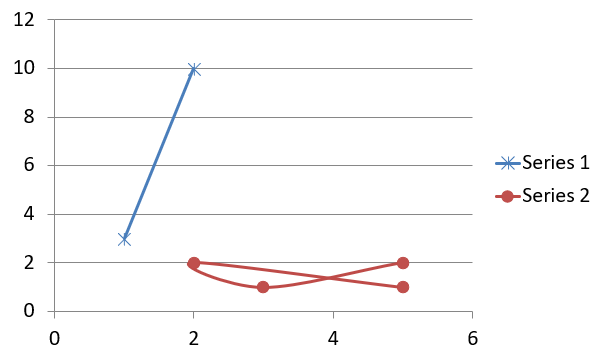

### **Create Pie Charts**

Pie charts are best used to show the part-to-whole relationship in data, especially when the data contains categorical labels with numeric values. However, if your data contains many parts or labels, you might want to consider using a bar chart instead.

1. Create an instance of the [Presentation](https://reference.aspose.com/slides/python-net/aspose.slides/presentation/) class.
1. Get a reference to a slide using its index.
1. Add a chart with default data and specify the `ChartType.PIE` type.
1. Access the chart's data workbook ([ChartDataWorkbook](https://reference.aspose.com/slides/python-net/aspose.slides.charts/chartdataworkbook/)).
1. Clear the default series and categories.
1. Add new series and categories.
1. Add new chart data for the chart series.
1. Add new points for the chart and apply custom colors to the pie chart's sectors.
1. Set labels for the series.
1. Enable leader lines for the series labels.
1. Set the rotation angle for the pie chart.
1. Save the modified presentation as a PPTX file.

This Python code shows you how to create a pie chart:

```py
import aspose.slides.charts as charts
import aspose.slides as slides
import aspose.pydrawing as draw

# Instantiate the Presentation class that represents a PPTX file.
with slides.Presentation() as presentation:

    # Access the first slide.
    slide = presentation.slides[0]

    # Add a chart with its default data.
    chart = slide.shapes.add_chart(charts.ChartType.PIE, 20, 20, 500, 300)

    # Set the chart title.
    chart.chart_title.add_text_frame_for_overriding("Sample Title")
    chart.chart_title.text_frame_for_overriding.text_frame_format.center_text = slides.NullableBool.TRUE
    chart.chart_title.height = 20
    chart.has_title = True

    # Set the first series to show values.
    chart.chart_data.series[0].labels.default_data_label_format.show_value = True

    # Set the index of the chart data sheet.
    worksheet_index = 0

    # Get the chart data workbook.
    workbook = chart.chart_data.chart_data_workbook

    # Delete the default generated series and categories.
    chart.chart_data.series.clear()
    chart.chart_data.categories.clear()

    # Add new categories.
    chart.chart_data.categories.add(workbook.get_cell(0, 1, 0, "First Qtr"))
    chart.chart_data.categories.add(workbook.get_cell(0, 2, 0, "2nd Qtr"))
    chart.chart_data.categories.add(workbook.get_cell(0, 3, 0, "3rd Qtr"))

    # Add new series.
    series = chart.chart_data.series.add(workbook.get_cell(0, 0, 1, "Series 1"), chart.type)

    # Populate the series data.
    series.data_points.add_data_point_for_pie_series(workbook.get_cell(worksheet_index, 1, 1, 20))
    series.data_points.add_data_point_for_pie_series(workbook.get_cell(worksheet_index, 2, 1, 50))
    series.data_points.add_data_point_for_pie_series(workbook.get_cell(worksheet_index, 3, 1, 30))

    # Set the sector color.
    chart.chart_data.series_groups[0].is_color_varied = True

    point = series.data_points[0]
    point.format.fill.fill_type = slides.FillType.SOLID
    point.format.fill.solid_fill_color.color = draw.Color.cyan

    # Set the sector border.
    point.format.line.fill_format.fill_type = slides.FillType.SOLID
    point.format.line.fill_format.solid_fill_color.color = draw.Color.gray
    point.format.line.width = 3.0
    point.format.line.style = slides.LineStyle.THIN_THICK
    point.format.line.dash_style = slides.LineDashStyle.DASH_DOT

    point1 = series.data_points[1]
    point1.format.fill.fill_type = slides.FillType.SOLID
    point1.format.fill.solid_fill_color.color = draw.Color.brown

    # Set the sector border.
    point1.format.line.fill_format.fill_type = slides.FillType.SOLID
    point1.format.line.fill_format.solid_fill_color.color = draw.Color.blue
    point1.format.line.width = 3.0
    point1.format.line.style = slides.LineStyle.SINGLE
    point1.format.line.dash_style = slides.LineDashStyle.LARGE_DASH_DOT

    point2 = series.data_points[2]
    point2.format.fill.fill_type = slides.FillType.SOLID
    point2.format.fill.solid_fill_color.color = draw.Color.coral

    # Set the sector border.
    point2.format.line.fill_format.fill_type = slides.FillType.SOLID
    point2.format.line.fill_format.solid_fill_color.color = draw.Color.red
    point2.format.line.width = 2.0
    point2.format.line.style = slides.LineStyle.THIN_THIN
    point2.format.line.dash_style = slides.LineDashStyle.LARGE_DASH_DOT_DOT

    # Create custom labels for each category in the new series.
    label1 = series.data_points[0].label

    label1.data_label_format.show_value = True

    label2 = series.data_points[1].label
    label2.data_label_format.show_value = True
    label2.data_label_format.show_legend_key = True
    label2.data_label_format.show_percentage = True

    label3 = series.data_points[2].label
    label3.data_label_format.show_series_name = True
    label3.data_label_format.show_percentage = True

    # Set the series to show leader lines for the chart.
    series.labels.default_data_label_format.show_leader_lines = True

    # Set the rotation angle for the pie chart sectors.
    chart.chart_data.series_groups[0].first_slice_angle = 180

    # Save the presentation to disk as a PPTX file.
    presentation.save("PieChart.pptx", slides.export.SaveFormat.PPTX)
```

The result:

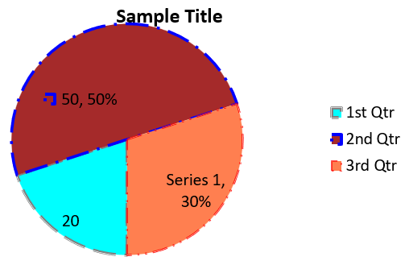

### **Create Line Charts**

Line charts (also known as line graphs) are best used in situations where you want to demonstrate changes in value over time. Using a line chart, you can compare a large amount of data at once, track changes and trends over time, highlight anomalies in data series, and more.

1. Create an instance of the [Presentation](https://reference.aspose.com/slides/python-net/aspose.slides/presentation/) class.
1. Get a reference to a slide using its index.
1. Add a chart with default data and specify the `ChartType.LINE` type.
1. Access the chart's data workbook ([ChartDataWorkbook](https://reference.aspose.com/slides/python-net/aspose.slides.charts/chartdataworkbook/)).
1. Clear the default series and categories.
1. Add new series and categories.
1. Add new chart data for the chart series.
1. Save the modified presentation as a PPTX file.

This Python code shows you how to create a line chart:

```python
import aspose.slides as slides

with slides.Presentation() as presentation:
    line_chart = presentation.slides[0].shapes.add_chart(slides.charts.ChartType.LINE, 20, 20, 500, 300)
    
    presentation.save("LineChart.pptx", slides.export.SaveFormat.PPTX)
```

By default, points on a line chart are joined by straight continuous lines. If you want the points to be joined by dashes instead, you can specify your preferred dash type as follows:

```python
line_chart = pres.slides[0].shapes.add_chart(slides.charts.ChartType.LINE, 10, 50, 600, 350)

for series in line_chart.chart_data.series:
    series.format.line.dash_style = slides.charts.LineDashStyle.DASH
```

The result:

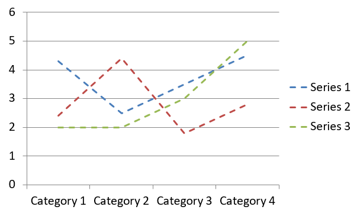

### **Create Tree Map Charts**

Tree map charts are best used for sales data when you want to show the relative size of data categories and quickly draw attention to items that are large contributors within each category.

1. Create an instance of the [Presentation](https://reference.aspose.com/slides/python-net/aspose.slides/presentation/) class.
1. Get a reference to a slide using its index.
1. Add a chart with default data and specify the `ChartType.TREEMAP` type.
1. Access the chart's data workbook ([ChartDataWorkbook](https://reference.aspose.com/slides/python-net/aspose.slides.charts/chartdataworkbook/)).
1. Clear the default series and categories.
1. Add new series and categories.
1. Add new chart data for the chart series.
1. Save the modified presentation as a PPTX file.

This Python code shows you how to create a tree map chart:

```py
import aspose.slides.charts as charts
import aspose.slides as slides
import aspose.pydrawing as draw

with slides.Presentation() as presentation:
    chart = presentation.slides[0].shapes.add_chart(charts.ChartType.TREEMAP, 20, 20, 500, 300)
    chart.chart_data.categories.clear()
    chart.chart_data.series.clear()

    workbook = chart.chart_data.chart_data_workbook
    workbook.clear(0)

    # Branch 1
    leaf = chart.chart_data.categories.add(workbook.get_cell(0, "C1", "Leaf1"))
    leaf.grouping_levels.set_grouping_item(1, "Stem1")
    leaf.grouping_levels.set_grouping_item(2, "Branch1")

    chart.chart_data.categories.add(workbook.get_cell(0, "C2", "Leaf2"))

    leaf = chart.chart_data.categories.add(workbook.get_cell(0, "C3", "Leaf3"))
    leaf.grouping_levels.set_grouping_item(1, "Stem2")

    chart.chart_data.categories.add(workbook.get_cell(0, "C4", "Leaf4"))

    # Branch 2
    leaf = chart.chart_data.categories.add(workbook.get_cell(0, "C5", "Leaf5"))
    leaf.grouping_levels.set_grouping_item(1, "Stem3")
    leaf.grouping_levels.set_grouping_item(2, "Branch2")

    chart.chart_data.categories.add(workbook.get_cell(0, "C6", "Leaf6"))

    leaf = chart.chart_data.categories.add(workbook.get_cell(0, "C7", "Leaf7"))
    leaf.grouping_levels.set_grouping_item(1, "Stem4")

    chart.chart_data.categories.add(workbook.get_cell(0, "C8", "Leaf8"))

    series = chart.chart_data.series.add(charts.ChartType.TREEMAP)
    series.labels.default_data_label_format.show_category_name = True
    series.data_points.add_data_point_for_treemap_series(workbook.get_cell(0, "D1", 4))
    series.data_points.add_data_point_for_treemap_series(workbook.get_cell(0, "D2", 5))
    series.data_points.add_data_point_for_treemap_series(workbook.get_cell(0, "D3", 3))
    series.data_points.add_data_point_for_treemap_series(workbook.get_cell(0, "D4", 6))
    series.data_points.add_data_point_for_treemap_series(workbook.get_cell(0, "D5", 9))
    series.data_points.add_data_point_for_treemap_series(workbook.get_cell(0, "D6", 9))
    series.data_points.add_data_point_for_treemap_series(workbook.get_cell(0, "D7", 4))
    series.data_points.add_data_point_for_treemap_series(workbook.get_cell(0, "D8", 3))

    series.parent_label_layout = charts.ParentLabelLayoutType.OVERLAPPING

    presentation.save("TreeMap.pptx", slides.export.SaveFormat.PPTX)
```

The result:

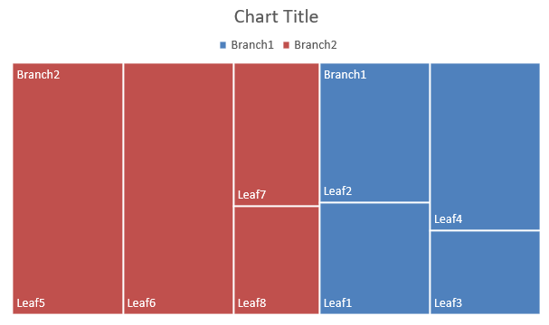

### **Create Stock Charts**

Stock charts are used to display financial data such as open, high, low, and close prices, helping analyze market trends and volatility. They offer essential insights into stock performance, aiding investors and analysts in making informed decisions.

1. Create an instance of the [Presentation](https://reference.aspose.com/slides/python-net/aspose.slides/presentation/) class.
1. Get a reference to a slide using its index.
1. Add a chart with default data and specify the `ChartType.OPEN_HIGH_LOW_CLOSE` type.
1. Access the chart's data workbook ([ChartDataWorkbook](https://reference.aspose.com/slides/python-net/aspose.slides.charts/chartdataworkbook/)).
1. Clear the default series and categories.
1. Add new series and categories.
1. Add new chart data for the chart series.
1. Specify the HiLowLines format.
1. Save the modified presentation as a PPTX file.

This Python code shows you how to create a stock chart:

```py
import aspose.slides.charts as charts
import aspose.slides as slides
import aspose.pydrawing as draw

with slides.Presentation() as presentation:
    chart = presentation.slides[0].shapes.add_chart(charts.ChartType.OPEN_HIGH_LOW_CLOSE, 20, 20, 500, 300, False)

    chart.chart_data.series.clear()
    chart.chart_data.categories.clear()

    workbook = chart.chart_data.chart_data_workbook

    chart.chart_data.categories.add(workbook.get_cell(0, 1, 0, "A"))
    chart.chart_data.categories.add(workbook.get_cell(0, 2, 0, "B"))
    chart.chart_data.categories.add(workbook.get_cell(0, 3, 0, "C"))

    chart.chart_data.series.add(workbook.get_cell(0, 0, 1, "Open"), chart.type)
    chart.chart_data.series.add(workbook.get_cell(0, 0, 2, "High"), chart.type)
    chart.chart_data.series.add(workbook.get_cell(0, 0, 3, "Low"), chart.type)
    chart.chart_data.series.add(workbook.get_cell(0, 0, 4, "Close"), chart.type)

    series = chart.chart_data.series[0]

    series.data_points.add_data_point_for_stock_series(workbook.get_cell(0, 1, 1, 72))
    series.data_points.add_data_point_for_stock_series(workbook.get_cell(0, 2, 1, 25))
    series.data_points.add_data_point_for_stock_series(workbook.get_cell(0, 3, 1, 38))

    series = chart.chart_data.series[1]
    series.data_points.add_data_point_for_stock_series(workbook.get_cell(0, 1, 2, 172))
    series.data_points.add_data_point_for_stock_series(workbook.get_cell(0, 2, 2, 57))
    series.data_points.add_data_point_for_stock_series(workbook.get_cell(0, 3, 2, 57))

    series = chart.chart_data.series[2]
    series.data_points.add_data_point_for_stock_series(workbook.get_cell(0, 1, 3, 12))
    series.data_points.add_data_point_for_stock_series(workbook.get_cell(0, 2, 3, 12))
    series.data_points.add_data_point_for_stock_series(workbook.get_cell(0, 3, 3, 13))

    series = chart.chart_data.series[3]
    series.data_points.add_data_point_for_stock_series(workbook.get_cell(0, 1, 4, 25))
    series.data_points.add_data_point_for_stock_series(workbook.get_cell(0, 2, 4, 38))
    series.data_points.add_data_point_for_stock_series(workbook.get_cell(0, 3, 4, 50))

    chart.chart_data.series_groups[0].up_down_bars.has_up_down_bars = True
    chart.chart_data.series_groups[0].hi_low_lines_format.line.fill_format.fill_type = slides.FillType.SOLID

    for ser in chart.chart_data.series:
        ser.format.line.fill_format.fill_type = slides.FillType.NO_FILL

    presentation.save("StockChart.pptx", slides.export.SaveFormat.PPTX)
```

The result:

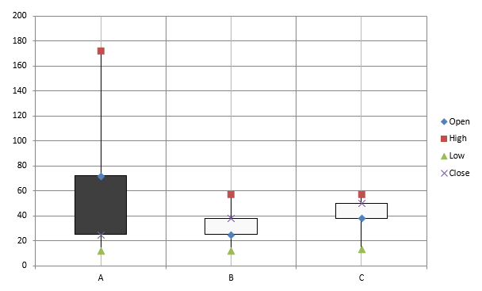

### **Create Box and Whisker Charts**

Box and Whisker charts are used to display the distribution of data by summarizing key statistical measures, such as the median, quartiles, and potential outliers. They are particularly useful in exploratory data analysis and statistical studies to quickly understand data variability and identify any anomalies.

1. Create an instance of the [Presentation](https://reference.aspose.com/slides/python-net/aspose.slides/presentation/) class.
1. Get a reference to a slide using its index.
1. Add a chart with default data and specify the `ChartType.BOX_AND_WHISKER` type.
1. Access the chart's data workbook ([ChartDataWorkbook](https://reference.aspose.com/slides/python-net/aspose.slides.charts/chartdataworkbook/)).
1. Clear the default series and categories.
1. Add new series and categories.
1. Add new chart data for the chart series.
1. Save the modified presentation as a PPTX file.

This Python code shows you how to create a box and whisker chart:

```py
import aspose.slides.charts as charts
import aspose.slides as slides
import aspose.pydrawing as draw

with slides.Presentation() as presentation:
    chart = presentation.slides[0].shapes.add_chart(charts.ChartType.BOX_AND_WHISKER, 20, 20, 500, 300)
    chart.chart_data.categories.clear()
    chart.chart_data.series.clear()

    workbook = chart.chart_data.chart_data_workbook
    workbook.clear(0)

    chart.chart_data.categories.add(workbook.get_cell(0, "A1", "Category 1"))
    chart.chart_data.categories.add(workbook.get_cell(0, "A2", "Category 1"))
    chart.chart_data.categories.add(workbook.get_cell(0, "A3", "Category 1"))
    chart.chart_data.categories.add(workbook.get_cell(0, "A4", "Category 1"))
    chart.chart_data.categories.add(workbook.get_cell(0, "A5", "Category 1"))
    chart.chart_data.categories.add(workbook.get_cell(0, "A6", "Category 1"))

    series = chart.chart_data.series.add(charts.ChartType.BOX_AND_WHISKER)

    series.quartile_method = charts.QuartileMethodType.EXCLUSIVE
    series.show_mean_line = True
    series.show_mean_markers = True
    series.show_inner_points = True
    series.show_outlier_points = True

    series.data_points.add_data_point_for_box_and_whisker_series(workbook.get_cell(0, "B1", 15))
    series.data_points.add_data_point_for_box_and_whisker_series(workbook.get_cell(0, "B2", 41))
    series.data_points.add_data_point_for_box_and_whisker_series(workbook.get_cell(0, "B3", 16))
    series.data_points.add_data_point_for_box_and_whisker_series(workbook.get_cell(0, "B4", 10))
    series.data_points.add_data_point_for_box_and_whisker_series(workbook.get_cell(0, "B5", 23))
    series.data_points.add_data_point_for_box_and_whisker_series(workbook.get_cell(0, "B6", 16))

    presentation.save("BoxAndWhiskerChart.pptx", slides.export.SaveFormat.PPTX)
```

### **Create Funnel Charts**

Funnel charts are used to visualize processes that involve sequential stages, where the volume of data decreases as it progresses from one step to the next. They are especially helpful for analyzing conversion rates, identifying bottlenecks, and tracking the efficiency of sales or marketing processes.

1. Create an instance of the [Presentation](https://reference.aspose.com/slides/python-net/aspose.slides/presentation/) class.
1. Get a reference to a slide using its index.
1. Add a chart with default data and specify the `ChartType.FUNNEL` type.
1. Save the modified presentation as a PPTX file.

This Python code shows you how to create a funnel chart:

```py
import aspose.slides.charts as charts
import aspose.slides as slides
import aspose.pydrawing as draw

with slides.Presentation() as presentation:
    chart = presentation.slides[0].shapes.add_chart(charts.ChartType.FUNNEL, 50, 50, 500, 400)
    chart.chart_data.categories.clear()
    chart.chart_data.series.clear()

    workbook = chart.chart_data.chart_data_workbook
    workbook.clear(0)

    chart.chart_data.categories.add(workbook.get_cell(0, "A1", "Category 1"))
    chart.chart_data.categories.add(workbook.get_cell(0, "A2", "Category 2"))
    chart.chart_data.categories.add(workbook.get_cell(0, "A3", "Category 3"))
    chart.chart_data.categories.add(workbook.get_cell(0, "A4", "Category 4"))
    chart.chart_data.categories.add(workbook.get_cell(0, "A5", "Category 5"))
    chart.chart_data.categories.add(workbook.get_cell(0, "A6", "Category 6"))

    series = chart.chart_data.series.add(charts.ChartType.FUNNEL)

    series.data_points.add_data_point_for_funnel_series(workbook.get_cell(0, "B1", 50))
    series.data_points.add_data_point_for_funnel_series(workbook.get_cell(0, "B2", 100))
    series.data_points.add_data_point_for_funnel_series(workbook.get_cell(0, "B3", 200))
    series.data_points.add_data_point_for_funnel_series(workbook.get_cell(0, "B4", 300))
    series.data_points.add_data_point_for_funnel_series(workbook.get_cell(0, "B5", 400))
    series.data_points.add_data_point_for_funnel_series(workbook.get_cell(0, "B6", 500))

    presentation.save("FunnelChart.pptx", slides.export.SaveFormat.PPTX)
```

The result:

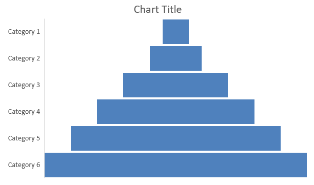

### **Create Sunburst Charts**

Sunburst charts are used to visualize hierarchical data, displaying levels as concentric rings. They help illustrate part-to-whole relationships and are ideal for representing nested categories and subcategories in a clear, compact format.

1. Create an instance of the [Presentation](https://reference.aspose.com/slides/python-net/aspose.slides/presentation/) class.
1. Get a reference to a slide using its index.
1. Add a chart with default data and specify the `ChartType.SUNBURST` type.
1. Save the modified presentation as a PPTX file.

This Python code shows you how to create a sunburst chart:

```py
import aspose.slides.charts as charts
import aspose.slides as slides
import aspose.pydrawing as draw

with slides.Presentation() as presentation:
    chart = presentation.slides[0].shapes.add_chart(charts.ChartType.SUNBURST, 20, 20, 500, 300)
    chart.chart_data.categories.clear()
    chart.chart_data.series.clear()

    workbook = chart.chart_data.chart_data_workbook
    workbook.clear(0)

    # Branch 1
    leaf = chart.chart_data.categories.add(workbook.get_cell(0, "C1", "Leaf1"))
    leaf.grouping_levels.set_grouping_item(1, "Stem1")
    leaf.grouping_levels.set_grouping_item(2, "Branch1")

    chart.chart_data.categories.add(workbook.get_cell(0, "C2", "Leaf2"))

    leaf = chart.chart_data.categories.add(workbook.get_cell(0, "C3", "Leaf3"))
    leaf.grouping_levels.set_grouping_item(1, "Stem2")

    chart.chart_data.categories.add(workbook.get_cell(0, "C4", "Leaf4"))

    # Branch 2
    leaf = chart.chart_data.categories.add(workbook.get_cell(0, "C5", "Leaf5"))
    leaf.grouping_levels.set_grouping_item(1, "Stem3")
    leaf.grouping_levels.set_grouping_item(2, "Branch2")

    chart.chart_data.categories.add(workbook.get_cell(0, "C6", "Leaf6"))

    leaf = chart.chart_data.categories.add(workbook.get_cell(0, "C7", "Leaf7"))
    leaf.grouping_levels.set_grouping_item(1, "Stem4")

    chart.chart_data.categories.add(workbook.get_cell(0, "C8", "Leaf8"))

    series = chart.chart_data.series.add(charts.ChartType.SUNBURST)
    series.labels.default_data_label_format.show_category_name = True
    series.data_points.add_data_point_for_sunburst_series(workbook.get_cell(0, "D1", 4))
    series.data_points.add_data_point_for_sunburst_series(workbook.get_cell(0, "D2", 5))
    series.data_points.add_data_point_for_sunburst_series(workbook.get_cell(0, "D3", 3))
    series.data_points.add_data_point_for_sunburst_series(workbook.get_cell(0, "D4", 6))
    series.data_points.add_data_point_for_sunburst_series(workbook.get_cell(0, "D5", 9))
    series.data_points.add_data_point_for_sunburst_series(workbook.get_cell(0, "D6", 9))
    series.data_points.add_data_point_for_sunburst_series(workbook.get_cell(0, "D7", 4))
    series.data_points.add_data_point_for_sunburst_series(workbook.get_cell(0, "D8", 3))

    presentation.save("SunburstChart.pptx", slides.export.SaveFormat.PPTX)
```

The result:

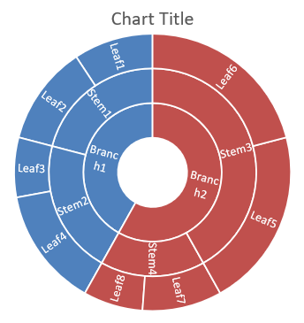

### **Create Histogram Charts**

Histogram charts are used to represent the distribution of numerical data by grouping values into ranges or bins. They are particularly useful for identifying data patterns such as frequency, skewness, and spread, and for detecting outliers in a dataset.

1. Create an instance of the [Presentation](https://reference.aspose.com/slides/python-net/aspose.slides/presentation/) class.
1. Get a reference to a slide using its index.
1. Add a chart with some data and specify the `ChartType.HISTOGRAM` type.
1. Access the chart data workbook ([ChartDataWorkbook](https://reference.aspose.com/slides/python-net/aspose.slides.charts/chartdataworkbook/)).
1. Clear the default series and categories.
1. Add new series and categories.
1. Save the modified presentation as a PPTX file.

This Python code shows you how to create a histogram chart:

```py
import aspose.slides.charts as charts
import aspose.slides as slides
import aspose.pydrawing as draw

with slides.Presentation() as presentation:
    chart = presentation.slides[0].shapes.add_chart(charts.ChartType.HISTOGRAM, 20, 20, 500, 300)
    chart.chart_data.categories.clear()
    chart.chart_data.series.clear()

    workbook = chart.chart_data.chart_data_workbook
    workbook.clear(0)

    series = chart.chart_data.series.add(charts.ChartType.HISTOGRAM)
    series.data_points.add_data_point_for_histogram_series(workbook.get_cell(0, "A1", 15))
    series.data_points.add_data_point_for_histogram_series(workbook.get_cell(0, "A2", -41))
    series.data_points.add_data_point_for_histogram_series(workbook.get_cell(0, "A3", 16))
    series.data_points.add_data_point_for_histogram_series(workbook.get_cell(0, "A4", 10))
    series.data_points.add_data_point_for_histogram_series(workbook.get_cell(0, "A5", -23))
    series.data_points.add_data_point_for_histogram_series(workbook.get_cell(0, "A6", 16))

    chart.axes.horizontal_axis.aggregation_type = charts.AxisAggregationType.AUTOMATIC

    presentation.save("HistogramChart.pptx", slides.export.SaveFormat.PPTX)
```

The result:

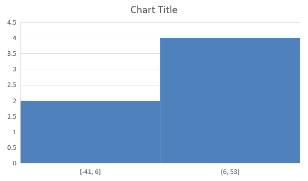

### **Create Radar Charts**

Radar charts are used to display multivariate data in a two-dimensional format, allowing for easy comparison of several variables simultaneously. They are particularly useful for identifying patterns, strengths, and weaknesses across multiple performance metrics or attributes.

1. Create an instance of the [Presentation](https://reference.aspose.com/slides/python-net/aspose.slides/presentation/) class.
1. Get a reference to a slide using its index.
1. Add a chart with some data and specify the `ChartType.RADAR` type.
1. Save the modified presentation as a PPTX file.

This Python code shows you how to create a radar chart:

```python
import aspose.slides as slides

with slides.Presentation() as presentation:
    presentation.slides[0].shapes.add_chart(slides.charts.ChartType.RADAR, 20, 20, 500, 300)
    presentation.save("RadarСhart.pptx", slides.export.SaveFormat.PPTX)
```

The result:

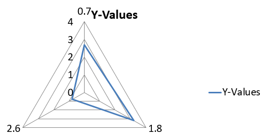

### **Create Multi Category Charts**

Multi Category charts are used to display data that involves more than one categorical grouping, allowing you to compare values across multiple dimensions simultaneously. They are particularly helpful when you need to analyze trends and relationships within complex, multi-layered datasets.

1. Create an instance of the [Presentation](https://reference.aspose.com/slides/python-net/aspose.slides/presentation/) class.
1. Get a reference to a slide using its index.
1. Add a chart with default data and specify the `ChartType.CLUSTERED_COLUMN` type.
1. Access the chart's data workbook ([ChartDataWorkbook](https://reference.aspose.com/slides/python-net/aspose.slides.charts/chartdataworkbook/)).
1. Clear the default series and categories.
1. Add new series and categories.
1. Add new chart data for the chart series.
1. Save the modified presentation as a PPTX file.

This Python code shows you how to create a multicategory chart:

```py
import aspose.slides.charts as charts
import aspose.slides as slides
import aspose.pydrawing as draw

with slides.Presentation() as presentation:
    slide = presentation.slides[0]

    chart = presentation.slides[0].shapes.add_chart(charts.ChartType.CLUSTERED_COLUMN, 20, 20, 500, 300)
    chart.chart_data.series.clear()
    chart.chart_data.categories.clear()

    workbook = chart.chart_data.chart_data_workbook
    workbook.clear(0)

    worksheet_index = 0

    category = chart.chart_data.categories.add(workbook.get_cell(0, "c2", "A"))
    category.grouping_levels.set_grouping_item(1, "Group1")
    category = chart.chart_data.categories.add(workbook.get_cell(0, "c3", "B"))

    category = chart.chart_data.categories.add(workbook.get_cell(0, "c4", "C"))
    category.grouping_levels.set_grouping_item(1, "Group2")
    category = chart.chart_data.categories.add(workbook.get_cell(0, "c5", "D"))

    category = chart.chart_data.categories.add(workbook.get_cell(0, "c6", "E"))
    category.grouping_levels.set_grouping_item(1, "Group3")
    category = chart.chart_data.categories.add(workbook.get_cell(0, "c7", "F"))

    category = chart.chart_data.categories.add(workbook.get_cell(0, "c8", "G"))
    category.grouping_levels.set_grouping_item(1, "Group4")
    category = chart.chart_data.categories.add(workbook.get_cell(0, "c9", "H"))

    # Add a series.
    series = chart.chart_data.series.add(workbook.get_cell(0, "D1", "Series 1"), charts.ChartType.CLUSTERED_COLUMN)

    series.data_points.add_data_point_for_bar_series(workbook.get_cell(worksheet_index, "D2", 10))
    series.data_points.add_data_point_for_bar_series(workbook.get_cell(worksheet_index, "D3", 20))
    series.data_points.add_data_point_for_bar_series(workbook.get_cell(worksheet_index, "D4", 30))
    series.data_points.add_data_point_for_bar_series(workbook.get_cell(worksheet_index, "D5", 40))
    series.data_points.add_data_point_for_bar_series(workbook.get_cell(worksheet_index, "D6", 50))
    series.data_points.add_data_point_for_bar_series(workbook.get_cell(worksheet_index, "D7", 60))
    series.data_points.add_data_point_for_bar_series(workbook.get_cell(worksheet_index, "D8", 70))
    series.data_points.add_data_point_for_bar_series(workbook.get_cell(worksheet_index, "D9", 80))

    # Save the presentation with the chart.
    presentation.save("MultiCategoryChart.pptx", slides.export.SaveFormat.PPTX)
```

The result:

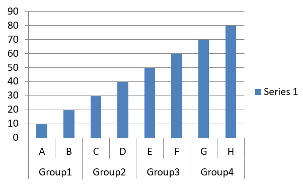

### **Create Map Charts**

Map charts are used to visualize geographical data by mapping information to specific locations such as countries, states, or cities. They are particularly useful for analyzing regional trends, demographic data, and spatial distributions in a clear, visually engaging manner.

This Python code shows you how to create a map chart:

```python
import aspose.slides as slides

with slides.Presentation() as presentation:
    chart = presentation.slides[0].shapes.add_chart(slides.charts.ChartType.MAP, 20, 20, 500, 300)
    presentation.save("mapChart.pptx", slides.export.SaveFormat.PPTX)
```

The result:

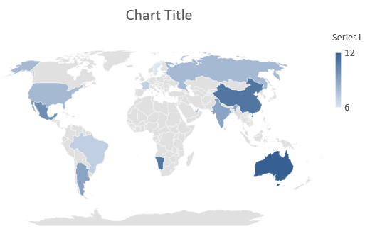

### **Create Combination Charts**

A combination chart (or combo chart) combines two or more chart types in a single graph. This chart lets you highlight, compare, or examine differences between two or more data sets, helping you identify relationships between them.

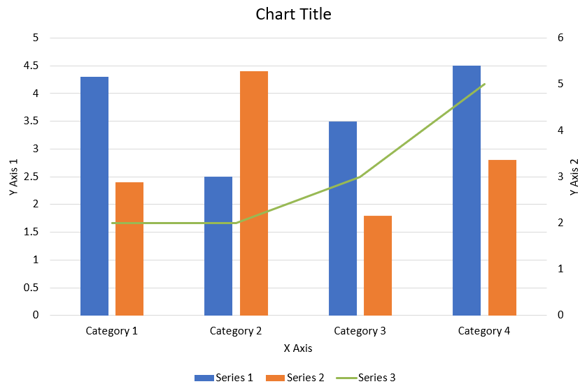

The following Python code shows how to create the combination chart shown above in a PowerPoint presentation:

```python
def create_combo_chart():
    with slides.Presentation() as presentation:
        chart = create_chart_with_first_series(presentation.slides[0])

        add_second_series_to_chart(chart)
        add_third_series_to_chart(chart)

        set_primary_axes_format(chart)
        set_secondary_axes_format(chart)

        presentation.save("combo-chart.pptx", slides.export.SaveFormat.PPTX)


def create_chart_with_first_series(slide):
    chart = slide.shapes.add_chart(charts.ChartType.CLUSTERED_COLUMN, 50, 50, 600, 400)

    # Set the chart title.
    chart.has_title = True
    chart.chart_title.add_text_frame_for_overriding("Chart Title")
    chart.chart_title.overlay = False
    title_paragraph = chart.chart_title.text_frame_for_overriding.paragraphs[0]
    title_format = title_paragraph.paragraph_format.default_portion_format

    title_format.font_bold = slides.NullableBool.FALSE
    title_format.font_height = 18

    # Set the chart legend.
    chart.legend.position = charts.LegendPositionType.BOTTOM
    chart.legend.text_format.portion_format.font_height = 12

    # Delete the default generated series and categories.
    chart.chart_data.series.clear()
    chart.chart_data.categories.clear()

    worksheet_index = 0
    workbook = chart.chart_data.chart_data_workbook

    # Add new categories.
    chart.chart_data.categories.add(workbook.get_cell(worksheet_index, 1, 0, "Category 1"))
    chart.chart_data.categories.add(workbook.get_cell(worksheet_index, 2, 0, "Category 2"))
    chart.chart_data.categories.add(workbook.get_cell(worksheet_index, 3, 0, "Category 3"))
    chart.chart_data.categories.add(workbook.get_cell(worksheet_index, 4, 0, "Category 4"))

    # Add the first series.
    series_name_cell = workbook.get_cell(worksheet_index, 0, 1, "Series 1")
    series = chart.chart_data.series.add(series_name_cell, chart.type)

    series.parent_series_group.overlap = -25
    series.parent_series_group.gap_width = 220

    series.data_points.add_data_point_for_bar_series(workbook.get_cell(worksheet_index, 1, 1, 4.3))
    series.data_points.add_data_point_for_bar_series(workbook.get_cell(worksheet_index, 2, 1, 2.5))
    series.data_points.add_data_point_for_bar_series(workbook.get_cell(worksheet_index, 3, 1, 3.5))
    series.data_points.add_data_point_for_bar_series(workbook.get_cell(worksheet_index, 4, 1, 4.5))

    return chart


def add_second_series_to_chart(chart):
    workbook = chart.chart_data.chart_data_workbook
    worksheet_index = 0

    series_name_cell = workbook.get_cell(worksheet_index, 0, 2, "Series 2")
    series = chart.chart_data.series.add(series_name_cell, charts.ChartType.CLUSTERED_COLUMN)

    series.parent_series_group.overlap = -25
    series.parent_series_group.gap_width = 220

    series.data_points.add_data_point_for_bar_series(workbook.get_cell(worksheet_index, 1, 2, 2.4))
    series.data_points.add_data_point_for_bar_series(workbook.get_cell(worksheet_index, 2, 2, 4.4))
    series.data_points.add_data_point_for_bar_series(workbook.get_cell(worksheet_index, 3, 2, 1.8))
    series.data_points.add_data_point_for_bar_series(workbook.get_cell(worksheet_index, 4, 2, 2.8))


def add_third_series_to_chart(chart):
    workbook = chart.chart_data.chart_data_workbook
    worksheet_index = 0

    series_name_cell = workbook.get_cell(worksheet_index, 0, 3, "Series 3")
    series = chart.chart_data.series.add(series_name_cell, charts.ChartType.LINE)

    series.data_points.add_data_point_for_line_series(workbook.get_cell(worksheet_index, 1, 3, 2.0))
    series.data_points.add_data_point_for_line_series(workbook.get_cell(worksheet_index, 2, 3, 2.0))
    series.data_points.add_data_point_for_line_series(workbook.get_cell(worksheet_index, 3, 3, 3.0))
    series.data_points.add_data_point_for_line_series(workbook.get_cell(worksheet_index, 4, 3, 5.0))

    series.plot_on_second_axis = True


def set_primary_axes_format(chart):
    # Set the horizontal axis.
    horizontal_axis = chart.axes.horizontal_axis
    horizontal_axis.text_format.portion_format.font_height = 12.0
    horizontal_axis.format.line.fill_format.fill_type = slides.FillType.NO_FILL

    set_axis_title(horizontal_axis, "X Axis")

    # Set the vertical axis.
    vertical_axis = chart.axes.vertical_axis
    vertical_axis.text_format.portion_format.font_height = 12.0
    vertical_axis.format.line.fill_format.fill_type = slides.FillType.NO_FILL

    set_axis_title(vertical_axis, "Y Axis 1")

    # Set the vertical major gridlines color.
    major_grid_lines_format = vertical_axis.major_grid_lines_format.line.fill_format
    major_grid_lines_format.fill_type = slides.FillType.SOLID
    major_grid_lines_format.solid_fill_color.color = draw.Color.from_argb(217, 217, 217)


def set_secondary_axes_format(chart):
    # Set the secondary horizontal axis.
    secondary_horizontal_axis = chart.axes.secondary_horizontal_axis
    secondary_horizontal_axis.position = charts.AxisPositionType.BOTTOM
    secondary_horizontal_axis.cross_type = charts.CrossesType.MAXIMUM
    secondary_horizontal_axis.is_visible = False
    secondary_horizontal_axis.major_grid_lines_format.line.fill_format.fill_type = slides.FillType.NO_FILL
    secondary_horizontal_axis.minor_grid_lines_format.line.fill_format.fill_type = slides.FillType.NO_FILL

    # Set the secondary vertical axis.
    secondary_vertical_axis = chart.axes.secondary_vertical_axis
    secondary_vertical_axis.position = charts.AxisPositionType.RIGHT
    secondary_vertical_axis.text_format.portion_format.font_height = 12.0
    secondary_vertical_axis.format.line.fill_format.fill_type = slides.FillType.NO_FILL
    secondary_vertical_axis.major_grid_lines_format.line.fill_format.fill_type = slides.FillType.NO_FILL
    secondary_vertical_axis.minor_grid_lines_format.line.fill_format.fill_type = slides.FillType.NO_FILL

    set_axis_title(secondary_vertical_axis, "Y Axis 2")


def set_axis_title(axis, axis_title):
    axis.has_title = True
    axis.title.overlay = False
    title_portion_format = axis.title.add_text_frame_for_overriding(axis_title).paragraphs[0].paragraph_format.default_portion_format
    title_portion_format.font_bold = slides.NullableBool.FALSE
    title_portion_format.font_height = 12.0
```

## **Update Charts**

Aspose.Slides for Python via .NET enables you to update PowerPoint charts by modifying chart data, formatting, and styling. This functionality simplifies the process of keeping presentations up-to-date with dynamic content and ensures that charts accurately reflect current data and visual standards.

1. Instantiate the [Presentation](https://reference.aspose.com/slides/python-net/aspose.slides/presentation/) class that represents the presentation containing a chart.
1. Get a reference to a slide using its index.
1. Traverse through all shapes to find the chart.
1. Access the chart's data worksheet.
1. Modify the chart data series by changing the series values.
1. Add a new series and populate its data.
1. Save the modified presentation as a PPTX file.

This Python code shows you how to update a chart:

```py
import aspose.slides.charts as charts
import aspose.slides as slides
import aspose.pydrawing as draw

chart_name = "My chart"

# Instantiate the Presentation class that represents a PPTX file.
with slides.Presentation("ExistingChart.pptx") as presentation:

    # Access the first slide.
    slide = presentation.slides[0]

    for shape in slide.shapes:
        if isinstance(shape, charts.Chart) and shape.name == chart_name:
            chart = shape

            # Set the index of the chart data sheet.
            worksheet_index = 0

            # Get the chart data workbook.
            workbook = chart.chart_data.chart_data_workbook

            # Change the chart category names.
            workbook.get_cell(worksheet_index, 1, 0, "Modified Category 1")
            workbook.get_cell(worksheet_index, 2, 0, "Modified Category 2")

            # Get the first chart series.
            series = chart.chart_data.series[0]

            # Update the series data.
            workbook.get_cell(worksheet_index, 0, 1, "New_Series1")  # Modifying the series name.
            series.data_points[0].value.data = 90
            series.data_points[1].value.data = 123
            series.data_points[2].value.data = 44

            # Get the second chart series.
            series = chart.chart_data.series[1]

            # Update the series data.
            workbook.get_cell(worksheet_index, 0, 2, "New_Series2")  # Modifying the series name.
            series.data_points[0].value.data = 23
            series.data_points[1].value.data = 67
            series.data_points[2].value.data = 99

            # Add a new series.
            series = chart.chart_data.series.add(workbook.get_cell(worksheet_index, 0, 3, "Series 3"), chart.type)

            # Populate the series data.
            series.data_points.add_data_point_for_bar_series(workbook.get_cell(worksheet_index, 1, 3, 20))
            series.data_points.add_data_point_for_bar_series(workbook.get_cell(worksheet_index, 2, 3, 50))
            series.data_points.add_data_point_for_bar_series(workbook.get_cell(worksheet_index, 3, 3, 30))

            chart.type = charts.ChartType.CLUSTERED_CYLINDER

            # Save the presentation with the chart.
            presentation.save("ModifiedChart.pptx", slides.export.SaveFormat.PPTX)
```

## **Set Data Range for Charts**

Aspose.Slides for Python via .NET provides the flexibility to define a specific data range from a worksheet as the source for your chart’s data. This means you can directly map a portion of your worksheet to the chart, allowing you to control which cells contribute to the chart's series and categories. As a result, you can easily update and synchronize your charts with the latest data changes in your worksheet, ensuring that your PowerPoint presentations reflect current and accurate information.

1. Instantiate the [Presentation](https://reference.aspose.com/slides/python-net/aspose.slides/presentation/) class that represents the presentation containing a chart.
1. Get a reference to a slide using its index.
1. Traverse through all shapes to find the chart.
1. Access the chart data and set the range.
1. Save the modified presentation as a PPTX file.

This Python code shows you how to set the data range for a chart:

```py
import aspose.slides.charts as charts
import aspose.slides as slides
import aspose.pydrawing as draw

chart_name = "My chart"

# Instantiate the Presentation class that represents a PPTX file.
with slides.Presentation("ExistingChart.pptx") as presentation:

    # Access the first slide.
    slide = presentation.slides[0]

    for shape in slide.shapes:
        if isinstance(shape, charts.Chart) and shape.name == chart_name:
            chart = shape
            chart.chart_data.set_range("Sheet1!A1:B4")

    presentation.save("DataRange.pptx", slides.export.SaveFormat.PPTX)
```

## **Use Default Markers in Charts**

When you use default markers in charts, each chart series gets a different default marker symbol automatically.

This Python code shows you how to set a chart series marker automatically:

```py
import aspose.slides.charts as charts
import aspose.slides as slides
import aspose.pydrawing as draw

with slides.Presentation() as presentation:
    slide = presentation.slides[0]
    chart = slide.shapes.add_chart(charts.ChartType.LINE_WITH_MARKERS, 10, 10, 400, 400)

    chart.chart_data.series.clear()
    chart.chart_data.categories.clear()

    workbook = chart.chart_data.chart_data_workbook

    series = chart.chart_data.series.add(workbook.get_cell(0, 0, 1, "Series 1"), chart.type)

    chart.chart_data.categories.add(workbook.get_cell(0, 1, 0, "C1"))
    series.data_points.add_data_point_for_line_series(workbook.get_cell(0, 1, 1, 24))

    chart.chart_data.categories.add(workbook.get_cell(0, 2, 0, "C2"))
    series.data_points.add_data_point_for_line_series(workbook.get_cell(0, 2, 1, 23))

    chart.chart_data.categories.add(workbook.get_cell(0, 3, 0, "C3"))
    series.data_points.add_data_point_for_line_series(workbook.get_cell(0, 3, 1, -10))

    chart.chart_data.categories.add(workbook.get_cell(0, 4, 0, "C4"))
    series.data_points.add_data_point_for_line_series(workbook.get_cell(0, 4, 1, None))

    series2 = chart.chart_data.series.add(workbook.get_cell(0, 0, 2, "Series 2"), chart.type)

    # Populate the series data.
    series2.data_points.add_data_point_for_line_series(workbook.get_cell(0, 1, 2, 30))
    series2.data_points.add_data_point_for_line_series(workbook.get_cell(0, 2, 2, 10))
    series2.data_points.add_data_point_for_line_series(workbook.get_cell(0, 3, 2, 60))
    series2.data_points.add_data_point_for_line_series(workbook.get_cell(0, 4, 2, 40))

    chart.has_legend = True
    chart.legend.overlay = False

    presentation.save("DefaultMarkersInChart.pptx", slides.export.SaveFormat.PPTX)
```

## **FAQ**

**What chart types are supported by Aspose.Slides for Python via .NET?**

Aspose.Slides for Python via .NET supports a wide range of chart types, including bar, line, pie, area, scatter, histogram, radar, and many more. This flexibility allows you to choose the most appropriate chart type for your data visualization needs.

**How do I add a new chart to a slide?**

To add a chart, you first create an instance of the [Presentation](https://reference.aspose.com/slides/python-net/aspose.slides/presentation/) class, retrieve the desired slide using its index, and then call the method to add a chart, specifying the chart type and initial data. This process integrates the chart directly into your presentation.

**How can I update the data displayed in a chart?**

You can update a chart’s data by accessing its data workbook ([ChartDataWorkbook](https://reference.aspose.com/slides/python-net/aspose.slides.charts/chartdataworkbook/)), clearing any default series and categories, and then adding your custom data. This allows you to programmatically refresh the chart to reflect the latest data.

**Is it possible to customize the appearance of the chart?**

Yes, Aspose.Slides for Python via .NET provides extensive customization options. You can modify colors, fonts, labels, legends, and other formatting elements to tailor the chart’s appearance to your specific design requirements.
