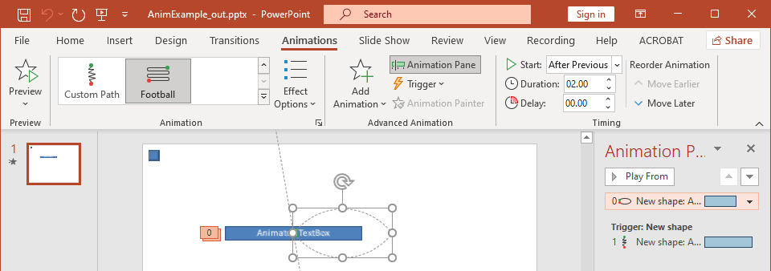

Animations are visual effects that can be applied to texts, images, shapes, or [charts](/slides/python-net/animated-charts/). They give life to presentations or its constituents. 

## **Why Use Animations in Presentations?**

Using animations, you can 

* control the flow of information
* emphasize important points
* increase interest or participation among your audience
* make content easier to read or assimilate or process
* draw your readers or viewers attention to important parts in a presentation

PowerPoint provides many options and tools for animations and animation effects across the **entrance**, **exit**, **emphasis**, and **motion paths** categories. 

## **Animations in Aspose.Slides**

* Aspose.Slides provides the classes and types you need to work with animations under the [Aspose.Slides.Animation](https://reference.aspose.com/slides/python-net/aspose.slides.animation/) namespace,
* Aspose.Slides provides over **150 animation effects** under the [EffectType](https://reference.aspose.com/slides/python-net/aspose.slides.animation/effecttype/) enumeration. These effects are essentially the same (or equivalent) effects used in PowerPoint.

## **Apply Animation to TextBox**

Aspose.Slides for Python via .NET allows you to apply animation to the text in a shape. 

1. Create an instance of the [Presentation](https://reference.aspose.com/slides/python-net/aspose.slides/presentation/) class.
2. Get a slide's reference through its index.
3. Add a `rectangle` [IAutoShape](https://reference.aspose.com/slides/python-net/aspose.slides/iautoshape/). 
4. Add text to `IAutoShape.TextFrame`.
5. Get a main sequence of effects.
6. Add an animation effect to [IAutoShape](https://reference.aspose.com/slides/python-net/aspose.slides/iautoshape/). 
7. Set the`TextAnimation.BuildType` property to the value from `BuildType` Enumeration.
8. Write the presentation to disk as a PPTX file.

This Python code shows you how to apply the `Fade` effect to AutoShape and set the text animation to the *By 1st Level Paragraphs* value:

```python
import aspose.slides as slides

# Instantiates a presentation class that represents a presentation file.
with slides.Presentation() as pres:
    sld = pres.slides[0]
    
    # Adds new AutoShape with text
    autoShape = sld.shapes.add_auto_shape(slides.ShapeType.RECTANGLE, 20, 20, 150, 100)

    textFrame = autoShape.text_frame
    textFrame.text = "First paragraph \nSecond paragraph \n Third paragraph"

    # Gets the main sequence of the slide.
    sequence = sld.timeline.main_sequence

    # Adds Fade animation effect to shape
    effect = sequence.add_effect(autoShape, slides.animation.EffectType.FADE, slides.animation.EffectSubtype.NONE, slides.animation.EffectTriggerType.ON_CLICK)

    # Animates shape text by 1st level paragraphs
    effect.text_animation.build_type = slides.animation.BuildType.BY_LEVEL_PARAGRAPHS1

    # Save the PPTX file to disk
    pres.save("AnimText_out.pptx", slides.export.SaveFormat.PPTX)
```

{} 

Besides applying animations to text, you can also apply animations to a single [Paragraph](https://reference.aspose.com/slides/python-net/aspose.slides/iparagraph/). See [**Animated Text**](/slides/python-net/animated-text/).

{} 

## **Apply Animation to PictureFrame**

1. Create an instance of the [Presentation](https://reference.aspose.com/slides/python-net/aspose.slides/presentation/) class.
2. Get a slide's reference through its index.
3. Add or get a [PictureFrame](https://reference.aspose.com/slides/python-net/aspose.slides/pictureframe/) on the slide. 
4. Get the main sequence of effects.
5. Add an animation effect to [PictureFrame](https://reference.aspose.com/slides/python-net/aspose.slides/pictureframe/).
6. Write the presentation to disk as a PPTX file.

This Python code shows you how to apply the `Fly` effect to a picture frame:

```python
import aspose.slides as slides
import aspose.pydrawing as draw


# Instantiates a presentation class that represents a presentation file.
with slides.Presentation() as pres:
    # Load Image to be added in presentaiton image collection
    img = draw.Bitmap("aspose-logo.jpg")
    image = pres.images.add_image(img)

    # Adds picture frame to slide
    picFrame = pres.slides[0].shapes.add_picture_frame(slides.ShapeType.RECTANGLE, 50, 50, 100, 100, image)

    # Gets the main sequence of the slide.
    sequence = pres.slides[0].timeline.main_sequence

    # Adds Fly from Left animation effect to picture frame
    effect = sequence.add_effect(picFrame, slides.animation.EffectType.FLY,  
        slides.animation.EffectSubtype.LEFT, 
        slides.animation.EffectTriggerType.ON_CLICK)

    # Save the PPTX file to disk
    pres.save("AnimImage_out.pptx", slides.export.SaveFormat.PPTX)
```

## **Apply Animation to Shape**

1. Create an instance of the [Presentation](https://reference.aspose.com/slides/python-net/aspose.slides/presentation/) class.
2. Get a slide's reference through its index.
3. Add a `rectangle` [IAutoShape](https://reference.aspose.com/slides/python-net/aspose.slides/iautoshape/). 
4. Add a `Bevel` [IAutoShape](https://reference.aspose.com/slides/python-net/aspose.slides/iautoshape/) (when this object is clicked, the animation gets played).
5. Create a sequence of effects on the bevel shape.
6. Create a custom `UserPath`.
7. Add commands for moving to the `UserPath`.
8. Write the presentation to disk as a PPTX file.

This Python code shows you how to apply the `PathFootball` (path football) effect to a shape:

```python
import aspose.slides.animation as anim
import aspose.slides as slides
import aspose.pydrawing as draw

# Instantiates a Prseetation class that represents a PPTX file
with slides.Presentation() as pres:
    sld = pres.slides[0]

    # Creates PathFootball effect for existing shape from scratch.
    ashp = sld.shapes.add_auto_shape(slides.ShapeType.RECTANGLE, 150, 150, 250, 25)

    ashp.add_text_frame("Animated TextBox")

    # Adds the PathFootBall animation effect.
    pres.slides[0].timeline.main_sequence.add_effect(ashp, 
        anim.EffectType.PATH_FOOTBALL,
        anim.EffectSubtype.NONE, 
        anim.EffectTriggerType.AFTER_PREVIOUS)

    # Creates some kind of "button".
    shapeTrigger = pres.slides[0].shapes.add_auto_shape(slides.ShapeType.BEVEL, 10, 10, 20, 20)

    # Creates a sequence of effects for the button.
    seqInter = pres.slides[0].timeline.interactive_sequences.add(shapeTrigger)

    # Creates a custom user path. Our object will be moved only after the button is clicked.
    fxUserPath = seqInter.add_effect(ashp, 
        anim.EffectType.PATH_USER, 
        anim.EffectSubtype.NONE, 
        anim.EffectTriggerType.ON_CLICK)

    # Adds commands for moving since created path is empty.
    motionBhv = fxUserPath.behaviors[0]

    pts = [draw.PointF(0.076, 0.59)]
    motionBhv.path.add(anim.MotionCommandPathType.LINE_TO, pts, anim.MotionPathPointsType.AUTO, True)
    pts = [draw.PointF(-0.076, -0.59)]
    motionBhv.path.add(anim.MotionCommandPathType.LINE_TO, pts, anim.MotionPathPointsType.AUTO, False)
    motionBhv.path.add(anim.MotionCommandPathType.END, None, anim.MotionPathPointsType.AUTO, False)

    # Writes the PPTX file to disk
    pres.save("AnimExample_out.pptx", slides.export.SaveFormat.PPTX)
```

## **Get the Animation Effects Applied to Shape**

The following examples show you how to use the `get_effects_by_shape` method from the [Sequence](https://reference.aspose.com/slides/python-net/aspose.slides.animation/sequence/) class to get all animation effects applied to a shape.

**Example 1: Get animation effects applied to a shape on a normal slide**

Previously, you learned how to add animation effects to shapes in PowerPoint presentations. The following sample code shows you how to get the effects applied to the first shape on the first normal slide in the presentation `AnimExample_out.pptx`.

```python
import aspose.slides as slides

with slides.Presentation("AnimExample_out.pptx") as presentation:
    first_slide = presentation.slides[0]

    # Gets the main animation sequence of the slide.
    sequence = first_slide.timeline.main_sequence

    # Gets the first shape on the first slide.
    shape = first_slide.shapes[0]

    # Gets animation effects applied to the shape.
    shape_effects = sequence.get_effects_by_shape(shape)

    if len(shape_effects) > 0:
        print("The shape", shape.name, "has", len(shape_effects), "animation effects.")
```

**Example 2: Get all animation effects, including those inherited from placeholders**

If a shape on a normal slide has placeholders that are on the layout slide and/or master slide, and animation effects have been added to these placeholders, then all effects of the shape will be played during the slide show, including those inherited from the placeholders.

Let's say we have a PowerPoint presentation file `sample.pptx` with one slide containg only a footer shape with the text "Made with Aspose.Slides" and the **Random Bars** effect is applied to the shape.


Let's also assume that the **Split** effect is applied to the footer placeholder on the **layout** slide.


And finally, the **Fly In** effect is applied to the footer placeholder on the **master** slide.


The following sample code shows you how to use the `get_base_placeholder` method from the [Shape](https://reference.aspose.com/slides/python-net/aspose.slides/shape/) class to access the shape placeholders and get the animation effects applied to the footer shape, including those inherited from placeholders located on the layout and master slides.

```py
import aspose.slides as slides

def print_effects(effects):
    for effect in effects:
        print(effect.type.name, effect.subtype.name)
```
```py
with slides.Presentation("sample.pptx") as presentation:
    slide = presentation.slides[0]

    # Get animation effects of the shape on the normal slide.
    shape = slide.shapes[0]
    shape_effects = slide.timeline.main_sequence.get_effects_by_shape(shape)

    # Get animation effects of the placeholder on the layout slide.
    layout_shape = shape.get_base_placeholder()
    layout_shape_effects = slide.layout_slide.timeline.main_sequence.get_effects_by_shape(layout_shape)

    # Get animation effects of the placeholder on the master slide.
    master_shape = layout_shape.get_base_placeholder()
    master_shape_effects = slide.layout_slide.master_slide.timeline.main_sequence.get_effects_by_shape(master_shape)

    print("Main sequence of shape effects:")
    print_effects(master_shape_effects)
    print_effects(layout_shape_effects)
    print_effects(shape_effects)
```

Output:
```text
Main sequence of shape effects:
FLY BOTTOM
SPLIT VERTICAL_IN
RANDOM_BARS HORIZONTAL
```

## **Change Animation Effect Timing Properties**

Aspose.Slides for Python via .NET allows you to change the Timing properties of an animation effect.

This is the Animation Timing pane in Microsoft PowerPoint:



These are the correspondences between PowerPoint Timing and `Effect.Timing` properties:

- PowerPoint Timing **Start** drop-down list matches the [Effect.Timing.TriggerType](https://reference.aspose.com/slides/python-net/aspose.slides.animation/effecttriggertype/) property. 
- PowerPoint Timing **Duration** matches the `Effect.Timing.Duration` property. The duration of an animation (in seconds) is the total time it takes the animation to complete one cycle. 
- PowerPoint Timing **Delay** matches the `Effect.Timing.TriggerDelayTime` property. 

This is how you change the Effect Timing properties:

1. [Apply](#apply-animation-to-shape) or get the animation effect.
2. Set new values for the `Effect.Timing` properties you need. 
3. Save the modified PPTX file.

This Python code demonstrates the operation:

```python
import aspose.slides as slides

# Instantiates a presentation class that represents a presentation file.
with slides.Presentation("AnimExample_out.pptx") as pres:
    # Gets the main sequence of the slide.
    sequence = pres.slides[0].timeline.main_sequence

    # Gets the first effect of main sequence.
    effect = sequence[0]

    # Changes effect TriggerType to start on click
    effect.timing.trigger_type = slides.animation.EffectTriggerType.ON_CLICK

    # Changes effect Duration
    effect.timing.duration = 3

    # Changes effect TriggerDelayTime
    effect.timing.trigger_delay_time = 0.5

    # Saves the PPTX file to disk
    pres.save("AnimExample_changed.pptx", slides.export.SaveFormat.PPTX)
```

## **Animation Effect Sound**

Aspose.Slides provides these properties to allow you to work with sounds in animation effects: 

- `sound`
- `stop_previous_sound`

### **Add Animation Effect Sound**

This Python code shows you how to add an animation effect sound and stop it when the next effect starts:

```python
import aspose.slides as slides

with Presentation("AnimExample_out.pptx") as pres:
    # Adds audio to presentation audio collection
    effect_sound = pres.audios.add_audio(open("sampleaudio.wav", "rb").read())

    first_slide = pres.slides[0]

    # Gets the main sequence of the slide.
    sequence = first_slide.timeline.main_sequence

    # Gets the first effect of the main sequence
    first_effect = sequence[0]

    # Сhecks the effect for "No Sound"
    if not first_effect.stop_previous_sound and first_effect.sound is None:
        # Adds sound for the first effect
        first_effect.sound = effect_sound

    # Gets the first interactive sequence of the slide.
    interactive_sequence = first_slide.timeline.interactive_sequences[0]

    # Sets the effect "Stop previous sound" flag
    interactive_sequence[0].stop_previous_sound = True

    # Writes the PPTX file to disk
    pres.save("AnimExample_Sound_out.pptx", slides.export.SaveFormat.PPTX)
```

### **Extract Animation Effect Sound**

1. Create an instance of the [Presentation](https://reference.aspose.com/slides/python-net/aspose.slides/presentation/) class.
2. Get a slide’s reference through its index. 
3. Get the main sequence of effects. 
4. Extract the `sound` embedded to each animation effect. 

This Python code shows you how to extract the sound embedded in an animation effect:

```python
import aspose.slides as slides

# Instantiates a presentation class that represents a presentation file.
with slides.Presentation("EffectSound.pptx") as presentation:
    slide = presentation.slides[0]

    # Gets the main sequence of the slide.
    sequence = slide.timeline.main_sequence

    for effect in sequence:
        if effect.sound is None:
            continue

        # Extracts the effect sound in byte array
        audio = effect.sound.binary_data
```

## **After Animation**

Aspose.Slides for .NET allows you to change the After animation property of an animation effect.

This is the Animation Effect pane and extended menu in Microsoft PowerPoint:


PowerPoint Effect **After animation** drop-down list matches these properties: 

- `after_animation_type` property which describes the After animation type :
  * PowerPoint **More Colors** matches the [COLOR](https://reference.aspose.com/slides/python-net/aspose.slides.animation/afteranimationtype/) type;
  * PowerPoint **Don't Dim** list item matches the [DO_NOT_DIM](https://reference.aspose.com/slides/python-net/aspose.slides.animation/afteranimationtype/) type (default after animation type);
  * PowerPoint **Hide After Animation** item matches the [HIDE_AFTER_ANIMATION](https://reference.aspose.com/slides/python-net/aspose.slides.animation/afteranimationtype/) type;
  * PowerPoint **Hide on Next Mouse Click** item matches the [HIDE_ON_NEXT_MOUSE_CLICK](https://reference.aspose.com/slides/python-net/aspose.slides.animation/afteranimationtype/) type;
- `after_animation_color` property which defines an after animation color format. This property works in conjunction with the  [COLOR](https://reference.aspose.com/slides/python-net/aspose.slides.animation/afteranimationtype/) type. If you change the type to another, the after animation color will be cleared.

This Python code shows you how to change an after animation effect:

```python
import aspose.slides as slides

# Instantiates a presentation class that represents a presentation file
with slides.Presentation("AnimImage_out.pptx") as pres:
    first_slide = pres.slides[0]

    # Gets the first effect of the main sequence
    first_effect = first_slide.timeline.main_sequence[0]

    # Changes the after animation type to Color
    first_effect.after_animation_type = AfterAnimationType.COLOR

    # Sets the after animation dim color
    first_effect.after_animation_color.color = Color.alice_blue

    # Writes the PPTX file to disk
    pres.save("AnimImage_AfterAnimation.pptx", slides.export.SaveFormat.PPTX)
```

## **Animate Text**

Aspose.Slides provides these properties to allow you to work with an animation effect's *Animate text* block:

- `animate_text_type` which describes an animate text type of the effect. The shape text can be animated:
  - All at once ([ALL_AT_ONCE](https://reference.aspose.com/slides/python-net/aspose.slides.animation/animatetexttype/) type)
  - By word ([BY_WORD](https://reference.aspose.com/slides/python-net/aspose.slides.animation/animatetexttype/) type)
  - By letter ([BY_LETTER](https://reference.aspose.com/slides/python-net/aspose.slides.animation/animatetexttype/) type)
- `delay_between_text_parts` sets a delay between the animated text parts (words or letters). A positive value specifies the percentage of effect duration. A negative value specifies the delay in seconds.

This is how you can change the Effect Animate text properties:

1. [Apply](#apply-animation-to-shape) or get the animation effect.
2. Set the `build_type` property to [AS_ONE_OBJECT](https://reference.aspose.com/slides/python-net/aspose.slides.animation/buildtype/) value to turn off the *By Paragraphs* animation mode.
3. Set new values for the `animate_text_type` and `delay_between_text_parts` properties.
4. Save the modified PPTX file.

This Python code demonstrates the operation:

```python
import aspose.slides as slides

with slides.Presentation("AnimTextBox_out.pptx") as pres:
    first_slide = pres.slides[0]

    # Gets the first effect of the main sequence
    first_effect = first_slide.timeline.main_sequence[0]

    # Changes the effect Text animation type to "As One Object"
    first_effect.text_animation.build_type = slides.animation.BuildType.AS_ONE_OBJECT

    # Changes the effect Animate text type to "By word"
    first_effect.animate_text_type = slides.animation.AnimateTextType.BY_WORD

    # Sets the delay between words to 20% of effect duration
    first_effect.delay_between_text_parts = 20

    # Writes the PPTX file to disk
    pres.save("AnimTextBox_AnimateText.pptx", slides.export.SaveFormat.PPTX)

```

## **FAQ**

**How can I ensure animations are preserved when publishing the presentation to the web?**

[Export to HTML5](/slides/python-net/export-to-html5/) and enable the [options](https://reference.aspose.com/slides/python-net/aspose.slides.export/html5options/) responsible for [shape](https://reference.aspose.com/slides/python-net/aspose.slides.export/html5options/animate_shapes/) and [transition](https://reference.aspose.com/slides/python-net/aspose.slides.export/html5options/animate_transitions/) animations. Plain HTML does not play slide animations, whereas HTML5 does.

**How does changing the z-order (layer order) of shapes affect animation?**

Animation and drawing order are independent: an effect controls the timing and type of appearing/disappearing, while [z-order](https://reference.aspose.com/slides/python-net/aspose.slides/shape/z_order_position/) determines what covers what. The visible result is defined by their combination. (This is the general PowerPoint behavior; the Aspose.Slides effects-and-shapes model follows the same logic.)

**Are there limitations when converting animations to video for certain effects?**

In general, [animations are supported](/slides/python-net/convert-powerpoint-to-video/), but rare cases or specific effects may be rendered differently. It is recommended to test with the effects you use and with the library version.
