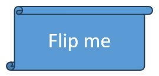
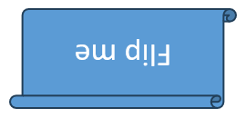

## **Overview**

This guide introduces shape manipulation in Aspose.Slides for Python via .NET. Learn practical patterns for finding shapes (including by Alternative Text), duplicating, deleting or hiding, reordering, aligning and flipping, reading IDs and layout-driven formatting, and exporting individual shapes to SVG using the [Presentation](https://reference.aspose.com/slides/python-net/aspose.slides/presentation/) and [Shape](https://reference.aspose.com/slides/python-net/aspose.slides/shape/) APIs.

## **Find Shapes on Slides**

PowerPoint identifies shapes only by internal IDs. Assign a unique Alt Text to the target shape in PowerPoint, then open the presentation with Aspose.Slides for Python, iterate over slide shapes, and select the one whose Alt Text matches. The `find_shape` method implements this approach and returns the matching shape.

```py
import aspose.slides as slides

# Finds a shape on a slide by its alternative text.
def find_shape(slide, alt_text):
    for slide_shape in slide.shapes:
        if slide_shape.alternative_text == alt_text:
            return slide_shape
    return None


# Instantiate the Presentation class that represents a presentation file.
with slides.Presentation("sample.pptx") as presentation:
    slide = presentation.slides[0]
    # Find the shape with Alt Text "Shape1".
    shape = find_shape(slide, "Shape1")
    if shape is not None:
        print("Shape name:", shape.name)
```

## **Clone Shapes**

To clone shapes from a source slide to a new slide in Aspose.Slides, follow these steps:

1. Create a [Presentation](https://reference.aspose.com/slides/python-net/aspose.slides/presentation/) from the source file.
1. Get the source slide by index and its shapes collection.
1. Retrieve a blank layout from the master slide.
1. Add an empty slide using that layout and get its shapes.
1. Clone shapes into the target slide.
1. Save the presentation as PPTX.

The following code example clones shapes from one slide to another.

```py
import aspose.slides as slides

# Instantiate the Presentation class.
with slides.Presentation("sample.pptx") as presentation:
    source_shapes = presentation.slides[0].shapes
    blank_layout = presentation.masters[0].layout_slides.get_by_type(slides.SlideLayoutType.BLANK)

    target_slide = presentation.slides.add_empty_slide(blank_layout)
    target_shapes = target_slide.shapes
	
    target_shapes.add_clone(source_shapes[1], 50, 150 + source_shapes[0].height)
    target_shapes.add_clone(source_shapes[2])
    target_shapes.insert_clone(0, source_shapes[0], 50, 150)

    # Save the presentation to disk.
    presentation.save("output.pptx", slides.export.SaveFormat.PPTX)
```

## **Remove Shapes**

Aspose.Slides lets you remove any shape from a slide. For example, to delete a shape from the first slide by its Alternative Text, follow these steps:

1. Create a [Presentation](https://reference.aspose.com/slides/python-net/aspose.slides/presentation/) instance and load the file.
1. Access the first slide from the slides collection.
1. Find the shape by the Alternative Text value.
1. Remove the shape from the slide’s shapes collection.
1. Save the presentation to disk in PPTX format.

```py
import aspose.slides as slides

# Finds a shape on a slide by its alternative text.
def find_shape(slide, alt_text):
    for slide_shape in slide.shapes:
        if slide_shape.alternative_text == alt_text:
            return slide_shape
    return None


# Instantiate the Presentation class that represents a presentation file.
with slides.Presentation("sample.pptx") as presentation:
    slide = presentation.slides[0]
    # Find the shape with Alt Text "User Defined".
    shape = find_shape(slide, "User Defined")
    # Remove the shape.
    slide.shapes.remove(shape)
    # Save the presentation to disk.
    presentation.save("output.pptx", slides.export.SaveFormat.PPTX)
```

## **Hide Shapes**

Aspose.Slides lets you hide any shape on a slide. For example, to hide a shape on the first slide by its Alternative Text, follow these steps:

1. Create a [Presentation](https://reference.aspose.com/slides/python-net/aspose.slides/presentation/) instance and load the file.
1. Access the first slide from the slides collection.
1. Find the shape by the Alternative Text value.
1. Hide the shape.
1. Save the presentation to disk in PPTX format.

```py
# Finds a shape on a slide by its alternative text.
def find_shape(slide, alt_text):
    for slide_shape in slide.shapes:
        if slide_shape.alternative_text == alt_text:
            return slide_shape
    return None


# Instantiate the Presentation class that represents a presentation file.
with slides.Presentation("sample.pptx") as presentation:
    slide = presentation.slides[0]
    # Find the shape with Alt Text "User Defined".
    shape = find_shape(slide, "User Defined")
    # Hide the shape.
    shape.hidden = True
    # Save the presentation to disk.
    presentation.save("output.pptx", slides.export.SaveFormat.PPTX)
```

## **Change the Order of Shapes**

Aspose.Slides allows developers to reorder shapes (change their z-order). Reordering determines which shape appears in front or behind. For, example, to reorder two shapes on the first slide, follow the steps below:

1. Create an instance of the [Presentation](https://reference.aspose.com/slides/python-net/aspose.slides/presentation/) class.
1. Access the first slide.
1. Add the first shape (for example, a rectangle).
1. Add the second shape (for example, a triangle).
1. Reorder the shapes by moving the second shape to the first position in the collection.
1. Save the presentation to disk.

```py
import aspose.slides as slides

with slides.Presentation("sample.pptx") as presentation:
    slide = presentation.slides[0]
    # Add two shapes to the slide.
    shape1 = slide.shapes.add_auto_shape(slides.ShapeType.RECTANGLE, 20, 20, 200, 150)
    shape2 = slide.shapes.add_auto_shape(slides.ShapeType.TRIANGLE, 20, 200, 200, 150)
    # Move the second shape to the first position.
    slide.shapes.reorder(0, shape2)
    presentation.save("output.pptx", slides.export.SaveFormat.PPTX)
```

## **Get the Interop Shape ID**

Aspose.Slides lets you obtain a shape’s unique identifier at the slide scope, unlike the `unique_id` property, which is unique across the entire presentation. The `office_interop_shape_id` property is available on the [Shape](https://reference.aspose.com/slides/python-net/aspose.slides/shape/) class. Its value corresponds to the `Id` of the `Microsoft.Office.Interop.PowerPoint.Shape` object. A sample code snippet is shown below.

```py
import aspose.slides as slides

with slides.Presentation("sample.pptx") as presentation:
    # Get the shape’s unique identifier within the slide.
    officeInteropShapeId = presentation.slides[0].shapes[0].office_interop_shape_id
```

## **Set the Alternative Text for Shapes**

Aspose.Slides allows developers to set alternative text for any shape. You can use alternative text to identify and locate shapes in a presentation. The alternative text property can be read and written through both Aspose.Slides and Microsoft PowerPoint. By tagging shapes with this property, you can later remove, hide, or reorder them on a slide.

To set the alternative text of a shape, follow these steps:

1. Create an instance of the [Presentation](https://reference.aspose.com/slides/python-net/aspose.slides/presentation/) class.
1. Access the first slide.
1. Add a shape to the slide.
1. Set the alternative text.
1. Save the presentation to disk.

```py
import aspose.slides as slides

# Instantiate the Presentation class that represents a PPTX file.
with slides.Presentation() as presentation:
    slide = presentation.slides[0]
    # Add a shape.
    shape = slide.shapes.add_auto_shape(slides.ShapeType.RECTANGLE, 50, 40, 150, 50)
    # Set the alternative text for the shape.
    shape.alternative_text = "User Defined"
    # Save the presentation to disk.
    presentation.save("output.pptx", slides.export.SaveFormat.PPTX)
```

## **Access Layout Formats for Shapes**

Aspose.Slides provides a simple API for accessing layout formats for shapes. This section demonstrates how to access layout formats.

```py
import aspose.slides as slides

with slides.Presentation(folder_path + "sample.pptx") as presentation:
    for layout_slide in presentation.layout_slides:
        fill_formats = list(map(lambda shape: shape.fill_format, layout_slide.shapes))
        line_formats = list(map(lambda shape: shape.line_format, layout_slide.shapes))
```

## **Render Shapes as SVG**

Aspose.Slides supports rendering shapes as SVG. The `write_as_svg` method (and its overloads) on the [Shape](https://reference.aspose.com/slides/python-net/aspose.slides/shape/) class lets you save a shape’s contents as an SVG image. The code snippet below shows how to export a shape to an SVG file.

```py
import aspose.slides as slides

with slides.Presentation("sample.pptx") as presentation:
    with open("output.svg", "wb") as image_stream:
        # Get the first shape on the first slide.
        shape = presentation.slides[0].shapes[0]
        shape.write_as_svg(image_stream)
```

## **Align Shape**

Using the `align_shape` method in the [SlidesUtil](https://reference.aspose.com/slides/python-net/aspose.slides.util/slideutil/) class, you can:

* Align shapes relative to a slide’s margins (see Example 1).
* Align shapes relative to each other (see Example 2).

The [ShapesAlignmentType](https://reference.aspose.com/slides/python-net/aspose.slides/shapesalignmenttype/) enumeration defines the available alignment options.

**Example 1**

This Python code shows how to align the shapes with indices 1, 2, and 4 to the top edge of the slide:

```py
import aspose.slides as slides

align_type = slides.ShapesAlignmentType.ALIGN_TOP
slide_indices = [1, 2, 4]

with slides.Presentation("sample.pptx") as presentation:
    slide = presentation.slides[0]
    slides.util.SlideUtil.align_shapes(align_type, True, slide, slide_indices)
```

**Example 2**

This Python example shows how to align all shapes in a collection relative to the bottom-most shape in that collection:

```py
import aspose.slides as slides

align_type = slides.ShapesAlignmentType.ALIGN_BOTTOM

with slides.Presentation("sample.pptx") as presentation:
    slides.util.SlideUtil.align_shapes(align_type, False, presentation.slides[0])
```

## **Flip Properties**

In Aspose.Slides, the [ShapeFrame](https://reference.aspose.com/slides/python-net/aspose.slides/shapeframe/) class provides control over horizontal and vertical mirroring of shapes via its `flip_h` and `flip_v` properties. Both properties are of type [NullableBool](https://reference.aspose.com/slides/python-net/aspose.slides/nullablebool/), allowing values of `TRUE` to indicate a flip, `FALSE` for no flip, or `NOT_DEFINED` to use default behavior. These values are accessible from a shape’s [Frame](https://reference.aspose.com/slides/python-net/aspose.slides/shape/frame/). 

To modify the flip settings, a new [ShapeFrame](https://reference.aspose.com/slides/python-net/aspose.slides/shapeframe/) instance is constructed with the shape’s current position and size, the desired values for `flip_h` and `flip_v`, and the rotation angle. Assigning this instance to the shape’s [Frame](https://reference.aspose.com/slides/python-net/aspose.slides/shape/frame/) and saving the presentation applies the mirror transformations and commits them to the output file.

Let’s say we have a sample.pptx file in which the first slide contains a single shape with default flip settings, as shown below.



The following code example retrieves the shape’s current flip properties and flips it both horizontally and vertically.

```py
with slides.Presentation("sample.pptx") as presentation:
    shape = presentation.slides[0].shapes[0]

    # Retrieve the horizontal flip property of the shape.
    horizontal_flip = shape.frame.flip_h
    print("Horizontal flip:", horizontal_flip)

    # Retrieve the vertical flip property of the shape.
    vertical_flip = shape.frame.flip_v
    print("Vertical flip:", vertical_flip)

    x, y = shape.frame.x, shape.frame.y
    width, height = shape.frame.width, shape.frame.height
    flip_h, flip_v = slides.NullableBool.TRUE, slides.NullableBool.TRUE  # Flip horizontally and vertically.
    rotation = shape.frame.rotation

    shape.frame = slides.ShapeFrame(x, y, width, height, flip_h, flip_v, rotation)

    presentation.save("output.pptx", slides.export.SaveFormat.PPTX)
```

The result:



## **FAQ**

**Can I combine shapes (union/intersect/subtract) on a slide like in a desktop editor?**

There isn’t a built-in Boolean operation API. You can approximate it by constructing the desired outline yourself—e.g., compute the resulting geometry (via [GeometryPath](https://reference.aspose.com/slides/python-net/aspose.slides/geometrypath/)) and create a new shape with that contour, optionally removing the originals.

**How can I control the stacking order (z-order) so a shape always stays “on top”?**

Change the insertion/move order within the slide’s [shapes](https://reference.aspose.com/slides/python-net/aspose.slides/slide/shapes/) collection. For predictable results, finalize the z-order after all other slide modifications.

**Can I “lock” a shape to prevent users from editing it in PowerPoint?**

Yes. Set [shape-level protection flags](/slides/python-net/applying-protection-to-presentation/) (e.g., lock selection, movement, resizing, text edits). If needed, mirror restrictions on the master or layout. Note this is UI-level protection, not a security feature; for stronger protection, combine with file-level restrictions like [read-only recommendations or passwords](/slides/python-net/password-protected-presentation/).
