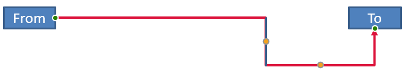

## **Introduction**

A PowerPoint connector is a specialized line that links two shapes and stays attached when the shapes are moved or repositioned on a slide. Connectors attach to **connection points** (green points) on shapes. Connection points appear when the pointer approaches them. **Adjustment handles** (yellow points), available on certain connectors, let you modify a connector’s position and shape.

## **Connector Types**

In PowerPoint, you can use three types of connectors: straight, elbow (angled), and curved.

Aspose.Slides supports the following connector types:

| Connector Type                  | Image                                                     | Number of adjustment points |
| ------------------------------- | --------------------------------------------------------- | --------------------------- |
| `ShapeType.LINE`                |             | 0                           |
| `ShapeType.STRAIGHT_CONNECTOR1` |  | 0                           |
| `ShapeType.BENT_CONNECTOR2`     |         | 0                           |
| `ShapeType.BENT_CONNECTOR3`     |          | 1                           |
| `ShapeType.BENT_CONNECTOR4`     |          | 2                           |
| `ShapeType.BENT_CONNECTOR5`     |          | 3                           |
| `ShapeType.CURVED_CONNECTOR2`   |      | 0                           |
| `ShapeType.CURVED_CONNECTOR3`   |      | 1                           |
| `ShapeType.CURVED_CONNECTOR4`   |      | 2                           |
| `ShapeType.CURVED_CONNECTOR5`   |      | 3                           |

## **Connect Shapes with Connectors**

This section demonstrates how to link shapes with connectors in Aspose.Slides. You’ll add a connector to a slide, attach its start and end to target shapes. Using connection sites ensures the connector stays "glued" to shapes even when they move or resize.

1. Create an instance of the [Presentation](https://reference.aspose.com/slides/python-net/aspose.slides/presentation/) class.
1. Get a reference to the slide by its index.
1. Add two [AutoShape](https://reference.aspose.com/slides/python-net/aspose.slides/autoshape/) objects to the slide using the `add_auto_shape` method exposed by the [ShapeCollection](https://reference.aspose.com/slides/python-net/aspose.slides/shapecollection/) object.
1. Add a connector using the `add_connector` method exposed by the [ShapeCollection](https://reference.aspose.com/slides/python-net/aspose.slides/shapecollection/) object and specify the connector type.
1. Connect the shapes with the connector.
1. Call the `reroute` method to apply the shortest connection path.
1. Save the presentation.

The following Python code shows how to add a bent connector between two shapes (an ellipse and a rectangle):

```python
import aspose.slides as slides

# Instantiate the Presentation class to create a PPTX file.
with slides.Presentation() as presentation:

    # Access the shapes collection for the first slide.
    shapes = presentation.slides[0].shapes

    # Add an ellipse AutoShape.
    ellipse = shapes.add_auto_shape(slides.ShapeType.ELLIPSE, 50, 50, 100, 100)

    # Add a rectangle AutoShape.
    rectangle = shapes.add_auto_shape(slides.ShapeType.RECTANGLE, 150, 200, 100, 100)

    # Add a connector to the slide.
    connector = shapes.add_connector(slides.ShapeType.BENT_CONNECTOR2, 0, 0, 10, 10)

    # Connect the shapes with the connector.
    connector.start_shape_connected_to = ellipse
    connector.end_shape_connected_to = rectangle

    # Call reroute to set the shortest path.
    connector.reroute()

    # Save the presentation.
    presentation.save("connected_shapes.pptx", slides.export.SaveFormat.PPTX)
```

{}

The `connector.reroute` method reroutes a connector, forcing it to take the shortest possible path between shapes. To do this, the method may change the `start_shape_connection_site_index` and `end_shape_connection_site_index` values.

{}

## **Specify Connection Points**

This section explains how to attach a connector to a specific connection point on a shape in Aspose.Slides. By targeting precise connection sites, you can control connector routing and layout, producing clean, predictable diagrams in your presentations.

1. Create an instance of the [Presentation](https://reference.aspose.com/slides/python-net/aspose.slides/presentation/) class.
1. Get a reference to the slide by its index.
1. Add two [AutoShape](https://reference.aspose.com/slides/python-net/aspose.slides/autoshape/) objects to the slide using the `add_auto_shape` method exposed by the [ShapeCollection](https://reference.aspose.com/slides/python-net/aspose.slides/shapecollection/) object.
1. Add a connector using the `add_connector` method on the [ShapeCollection](https://reference.aspose.com/slides/python-net/aspose.slides/shapecollection/) object and specify the connector type.
1. Connect the shapes with the connector.
1. Set your preferred connection points on the shapes.
1. Save the presentation.

The following Python code demonstrates how to specify a preferred connection point:

```python
import aspose.slides as slides

# Instantiate the Presentation class to create a PPTX file.
with slides.Presentation() as presentation:

    # Access the shapes collection for the first slide.
    shapes = presentation.slides[0].shapes

    # Add an ellipse AutoShape.
    ellipse = shapes.add_auto_shape(slides.ShapeType.ELLIPSE, 50, 50, 100, 100)

    # Add a rectangle AutoShape.
    rectangle = shapes.add_auto_shape(slides.ShapeType.RECTANGLE, 150, 200, 100, 100)

    # Add a connector to the slide's shape collection.
    connector = shapes.add_connector(slides.ShapeType.BENT_CONNECTOR3, 0, 0, 10, 10)

    # Connect the shapes with the connector.
    connector.start_shape_connected_to = ellipse
    connector.end_shape_connected_to = rectangle

    # Set the preferred connection site index on the ellipse.
    site_index = 6

    # Check that the preferred index is within the available site count.
    if  ellipse.connection_site_count > site_index:
        # Assign the preferred connection site on the ellipse AutoShape.
        connector.start_shape_connection_site_index = site_index

    # Save the presentation.
    presentation.save("connection_points.pptx", slides.export.SaveFormat.PPTX)
```

## **Adjust Connector Points**

You can modify connectors using their adjustment points. Only connectors that expose adjustment points can be edited in this way. For details on which connectors support adjustments, see the table under [Connector Types](/slides/python-net/connector/#connector-types).

### **Simple Case**

Consider a case where a connector between two shapes (A and B) intersects a third shape (C):


Code example:

```python
import aspose.slides as slides
import aspose.pydrawing as draw

with slides.Presentation() as presentation:
    slide = presentation.slides[0]

    shape = slide.shapes.add_auto_shape(slides.ShapeType.RECTANGLE, 300, 150, 150, 75)
    shape_from = slide.shapes.add_auto_shape(slides.ShapeType.RECTANGLE, 500, 400, 100, 50)
    shape_to = slide.shapes.add_auto_shape(slides.ShapeType.RECTANGLE, 100, 100, 70, 30)
    
    connector = slide.shapes.add_connector(slides.ShapeType.BENT_CONNECTOR5, 20, 20, 400, 300)
    
    connector.line_format.end_arrowhead_style = slides.LineArrowheadStyle.TRIANGLE
    connector.line_format.fill_format.fill_type = slides.FillType.SOLID
    connector.line_format.fill_format.solid_fill_color.color = draw.Color.black
    
    connector.start_shape_connected_to = shape_from
    connector.end_shape_connected_to = shape_to
    connector.start_shape_connection_site_index = 2
```

To avoid the third shape, adjust the connector by moving its vertical segment to the left:


```python
    adjustment2 = connector.adjustments[1]
    adjustment2.raw_value += 10000
```

### **Complex Cases** 

For more advanced adjustments, consider the following:

- A connector’s adjustable point is governed by a formula that determines its position. Changing this point can alter the connector’s overall shape.
- A connector’s adjustment points are stored in a strictly ordered array, numbered from the connector’s start to its end.
- Adjustment point values represent percentages of the connector shape’s width/height.
  - The shape is bounded by the start and end points of the connector and scaled by 1000.
  - The first, second, and third adjustment points represent: percentage of width, percentage of height, and percentage of width (again), respectively.
- When computing the coordinates of adjustment points, account for the connector’s rotation and reflection. **Note:** For all connectors listed under [Connector Types](/slides/python-net/connector/#connector-types), the rotation angle is 0.

#### **Case 1**

Consider a case where two text frame objects are linked with a connector:


Code example:

```python
import aspose.slides as slides
import aspose.pydrawing as draw

# Instantiate the Presentation class to create a PPTX file.
with slides.Presentation() as presentation:

    # Get the first slide.
    slide = presentation.slides[0]

    # Get the first slide.
    shape_from = slide.shapes.add_auto_shape(slides.ShapeType.RECTANGLE, 100, 100, 60, 25)
    shape_from.text_frame.text = "From"
    shape_to = slide.shapes.add_auto_shape(slides.ShapeType.RECTANGLE, 500, 100, 60, 25)
    shape_to.text_frame.text = "To"

    # Add a connector.
    connector = slide.shapes.add_connector(slides.ShapeType.BENT_CONNECTOR4, 20, 20, 400, 300)
    # Set the connector's direction.
    connector.line_format.end_arrowhead_style = slides.LineArrowheadStyle.TRIANGLE
    # Set the connector's color.
    connector.line_format.fill_format.fill_type = slides.FillType.SOLID
    connector.line_format.fill_format.solid_fill_color.color = draw.Color.crimson
    # Set the connector's line thickness.
    connector.line_format.width = 3

    # Link the shapes with the connector.
    connector.start_shape_connected_to = shape_from
    connector.start_shape_connection_site_index = 3
    connector.end_shape_connected_to = shape_to
    connector.end_shape_connection_site_index = 2

    # Get the connector's adjustment points.
    adjustment_0 = connector.adjustments[0]
    adjustment_1 = connector.adjustments[1]
```

**Adjustment**

Change the connector’s adjustment point values by increasing the width percentage by 20% and the height percentage by 200%, respectively:

```python
    # Change the values of the adjustment points.
    adjustment_0.raw_value += 20000
    adjustment_1.raw_value += 200000
```

The result:


To define a model that allows us to determine the coordinates and shape of the connector’s segments, create a shape that corresponds to the vertical component of the connector at `connector.adjustments[0]`:

```python
    # Draw the vertical component of the connector.
    x = connector.x + connector.width * adjustment_0.raw_value / 100000
    y = connector.y
    height = connector.height * adjustment_1.raw_value / 100000

    slide.shapes.add_auto_shape(slides.ShapeType.RECTANGLE, x, y, 0, height)
```

The result:



#### **Case 2**

In **Case 1**, we demonstrated a simple connector adjustment using basic principles. In typical scenarios, you must account for the connector’s rotation and its display settings (controlled by `connector.rotation`, `connector.frame.flip_h`, and `connector.frame.flip_v`). Here’s how the process works.

First, add a new text frame object (**To 1**) to the slide (for connection), and create a new green connector that links it to the existing objects.

```python
    # Create a new target object.
    shape_to_1 = sld.shapes.add_auto_shape(slides.ShapeType.RECTANGLE, 100, 400, 60, 25)
    shape_to_1.text_frame.text = "To 1"

    # Create a new connector.
    connector = sld.shapes.add_connector(slides.ShapeType.BENT_CONNECTOR4, 20, 20, 400, 300)
    connector.line_format.end_arrowhead_style = slides.LineArrowheadStyle.TRIANGLE
    connector.line_format.fill_format.fill_type = slides.FillType.SOLID
    connector.line_format.fill_format.solid_fill_color.color = draw.Color.medium_aquamarine
    connector.line_format.width = 3

    # Connect the objects using the newly created connector.
    connector.start_shape_connected_to = shapeFrom
    connector.start_shape_connection_site_index = 2
    connector.end_shape_connected_to = shape_to_1
    connector.end_shape_connection_site_index = 3

    # Get the connector adjustment points.
    adjustment_0 = connector.adjustments[0]
    adjustment_1 = connector.adjustments[1]
    
    # Change the values of the adjustment points.
    adjustment_0.raw_value += 20000
    adjustment_1.raw_value += 200000
```

The result:


Second, create a shape that corresponds to the **horizontal** segment of the connector that passes through the new connector’s adjustment point, `connector.adjustments[0]`. Use the values from `connector.rotation`, `connector.frame.flip_h`, and `connector.frame.flip_v`, and apply the standard coordinate conversion formula for rotation around a given point `x0`:

X = (x — x0) * cos(alpha) — (y — y0) * sin(alpha) + x0;

Y = (x — x0) * sin(alpha) + (y — y0) * cos(alpha) + y0;

In our case, the object’s rotation angle is 90 degrees and the connector is displayed vertically, so the corresponding code is:

```python
    # Save the connector coordinates.
    x = connector.x
    y = connector.y
    
    # Correct the connector coordinates if it is flipped.
    if connector.frame.flip_h == 1:
        x += connector.width
    if connector.frame.flip_v == 1:
        y += connector.height

    # Use the adjustment point value as the coordinate.
    x += connector.width * adjValue_0.raw_value / 100000
    
    # Convert the coordinates because sin(90°) = 1 and cos(90°) = 0.
    xx = connector.frame.center_x - y + connector.frame.center_y
    yy = x - connector.frame.center_x + connector.frame.center_y

    # Determine the width of the horizontal segment using the second adjustment point value.
    width = connector.height * adjValue_1.raw_value / 100000
    shape = sld.shapes.add_auto_shape(slides.ShapeType.RECTANGLE, xx, yy, width, 0)
    shape.line_format.fill_format.fill_type = slides.FillType.SOLID
    shape.line_format.fill_format.solid_fill_color.color = draw.Color.red
```

The result:


We demonstrated calculations involving simple adjustments and more complex adjustment points (those that account for rotation). Using this knowledge, you can develop your own model—or write code—to obtain a `GraphicsPath` object or even set a connector’s adjustment point values based on specific slide coordinates.

## **Find Connector Line Angles**

Use the example below to determine the angle of connector lines on a slide with Aspose.Slides. You’ll learn how to read a connector’s endpoints and compute its orientation so you can precisely align arrows, labels, and other shapes.

1. Create an instance of the [Presentation](https://reference.aspose.com/slides/python-net/aspose.slides/presentation/) class.
1. Get a reference to the slide by index.
1. Access the connector line shape.
1. Use the line’s width and height, and the shape frame’s width and height, to calculate the angle.

The following Python code demonstrates how to calculate the angle for a connector line shape:

```python
import aspose.slides as slides
import math

def get_direction(w, h, flip_h, flip_v):
    end_line_x = w * (-1 if flip_h else 1)
    end_line_y = h * (-1 if flip_v else 1)
    end_y_axis_x = 0
    end_y_axis_y = h
    angle = math.atan2(end_y_axis_y, end_y_axis_x) - math.atan2(end_line_y, end_line_x)
    if (angle < 0):
         angle += 2 * math.pi
    return angle * 180.0 / math.pi

with slides.Presentation("connector_line_angle.pptx") as presentation:
    slide = presentation.slides[0]
    for shape_index in range(len(slide.shapes)):
        direction = 0.0
        shape = slide.shapes[shape_index]
        if type(shape) is slides.AutoShape and shape.shape_type == slides.ShapeType.LINE:
            direction = get_direction(shape.width, shape.height, shape.frame.flip_h, shape.frame.flip_v)
        elif type(shape) is slides.Connector:
            direction = get_direction(shape.width, shape.height, shape.frame.flip_h, shape.frame.flip_v)
        print(direction)
```

## **FAQ**

**How can I tell whether a connector can be "glued" to a specific shape?**

Check that the shape exposes [connection sites](https://reference.aspose.com/slides/python-net/aspose.slides/shape/connection_site_count/). If there are none or the count is zero, gluing isn’t available; in that case, use free endpoints and position them manually. It’s sensible to check the site count before attaching.

**What happens to a connector if I delete one of the connected shapes?**

Its ends will be detached; the connector remains on the slide as an ordinary line with free start/end. You can either delete it or reassign the connections and, if needed, [reroute](https://reference.aspose.com/slides/python-net/aspose.slides/connector/reroute/).

**Are connector bindings preserved when copying a slide to another presentation?**

Generally yes, provided the target shapes are copied as well. If the slide is inserted into another file without the connected shapes, the ends become free and you’ll need to reattach them.
