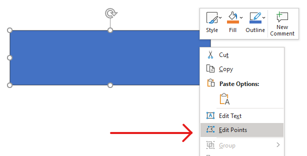
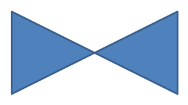
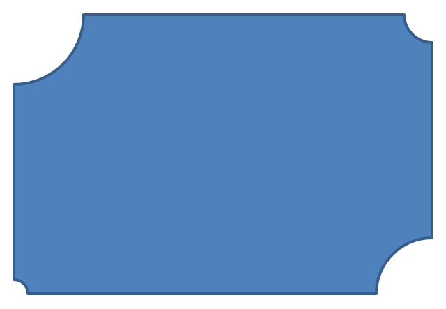

## **Overview**

Consider a square. In PowerPoint, using **Edit Points**, you can:

* move a square’s corner inward or outward,
* adjust the curvature of a corner or point,
* add new points to the square,
* manipulate its points.

You can apply these operations to any shape. With **Edit Points**, you can modify a shape or create a new one from an existing shape.

## **Shape Editing Tips**



Before you start editing PowerPoint shapes using **Edit Points**, consider these notes about shapes:

* A shape (or its path) can be **closed** or **open**.
* A closed shape has no start or end point; an open shape has a beginning and an end.
* Every shape has at least two anchor points connected by line segments.
* A segment is either straight or curved; anchor points determine the segment’s nature.
* Anchor points can be **corner**, **smooth**, or **straight**:
  * A **corner** point is where two straight segments meet at an angle.
  * A **smooth** point has two handles that are collinear, and the adjoining segments form a smooth curve. In this case, both handles are the same distance from the anchor point.
  * A **straight** point also has two collinear handles, and the adjoining segments form a smooth curve. In this case, the handles do not have to be the same distance from the anchor point.
* By moving or editing anchor points (thereby changing segment angles), you can change the shape’s appearance.

To edit PowerPoint shapes, Aspose.Slides provides the [GeometryPath](https://reference.aspose.com/slides/python-net/aspose.slides/geometrypath/) class.

* A [GeometryPath](https://reference.aspose.com/slides/python-net/aspose.slides/geometrypath/) instance represents the geometry path of a [GeometryShape](https://reference.aspose.com/slides/python-net/aspose.slides/geometryshape/) object.
* To retrieve the [GeometryPath](https://reference.aspose.com/slides/python-net/aspose.slides/geometrypath/) from a [GeometryShape](https://reference.aspose.com/slides/python-net/aspose.slides/geometryshape/) instance, use the [GeometryShape.get_geometry_paths](https://reference.aspose.com/slides/python-net/aspose.slides/geometryshape/get_geometry_paths/) method.
* To set the [GeometryPath](https://reference.aspose.com/slides/python-net/aspose.slides/geometrypath/) for a shape, use [GeometryShape.set_geometry_path](https://reference.aspose.com/slides/python-net/aspose.slides/geometryshape/set_geometry_path/) for *solid shapes* and [GeometryShape.set_geometry_paths](https://reference.aspose.com/slides/python-net/aspose.slides/geometryshape/set_geometry_paths/) for *composite shapes*.
* To add segments, use the methods on [GeometryPath](https://reference.aspose.com/slides/python-net/aspose.slides/geometrypath/).
* Use the [GeometryPath.stroke](https://reference.aspose.com/slides/python-net/aspose.slides/geometrypath/stroke/) and [GeometryPath.fill_mode](https://reference.aspose.com/slides/python-net/aspose.slides/geometrypath/fill_mode/) properties to control a geometry path’s appearance.
* Use the [GeometryPath.path_data](https://reference.aspose.com/slides/python-net/aspose.slides/geometrypath/path_data/) property to retrieve a shape’s geometry path as an array of path segments.

## **Simple Editing Operations**

The following methods are used for simple editing operations.

**Add a line** to the end of a path:

```py
line_to(point)
line_to(x, y)
```

**Add a line** at a specified position in a path:

```py    
line_to(point, index)
line_to(x, y, index)
```

**Add a cubic Bezier curve** to the end of a path:

```py
cubic_bezier_to(point1, point2, point3)
cubic_bezier_to(x1, y1, x2, y2, x3, y3)
```

**Add a cubic Bezier curve** at a specified position in a path:

```py
cubic_bezier_to(point1, point2, point3, index)
cubic_bezier_to(x1, y1, x2, y2, x3, y3, index)
```

**Add a quadratic Bezier curve** to the end of a path:

```py
quadratic_bezier_to(point1, point2)
quadratic_bezier_to(x1, y1, x2, y2)
```

**Add a quadratic Bezier curve** at a specified position in a path:

```py
quadratic_bezier_to(point1, point2, index)
quadratic_bezier_to(x1, y1, x2, y2, index)
```

**Append an arc** to a path:

```py
arc_to(width, heigth, startAngle, sweepAngle)
```

**Close the current figure** in a path:

```py
close_figure()
```

**Set the position for the next point**:

```py
move_to(point)
move_to(x, y)
```

**Remove the path segment** at a given index:

```py
remove_at(index)
```

## **Add Custom Points to Shapes**

Here you’ll learn how to define a freeform shape by adding your own sequence of points. By specifying ordered points and segment types (straight or curved) and optionally closing the path, you can draw precise custom graphics—polygons, icons, callouts, or logos—directly on your slides.

1. Create an instance of the [GeometryShape](https://reference.aspose.com/slides/python-net/aspose.slides/geometryshape/) class and set its [ShapeType.RECTANGLE](https://reference.aspose.com/slides/python-net/aspose.slides/shapetype/).
2. Get a [GeometryPath](https://reference.aspose.com/slides/python-net/aspose.slides/geometrypath/) instance from the shape.
3. Insert a new point between the two top points on the path.
4. Insert a new point between the two bottom points on the path.
5. Apply the updated path to the shape.

The following Python code shows how to add custom points to a shape:

```py
import aspose.slides as slides

with slides.Presentation() as presentation:
    slide = presentation.slides[0]

    shape = slide.shapes.add_auto_shape(slides.ShapeType.RECTANGLE, 100, 100, 200, 100)

    geometry_path = shape.get_geometry_paths()[0]
    geometry_path.line_to(100, 50, 1)
    geometry_path.line_to(100, 50, 4)

    shape.set_geometry_path(geometry_path)

    presentation.save("custom_points.pptx", slides.export.SaveFormat.PPTX)
```



##  **Remove Points from Shapes**

Sometimes a custom shape contains unnecessary points that complicate its geometry or affect how it renders. This section shows how to remove specific points from a shape’s path so you can simplify the outline and achieve cleaner, more precise results.

1. Create an instance of the [GeometryShape](https://reference.aspose.com/slides/python-net/aspose.slides/geometryshape/) class and set its [ShapeType.HEART](https://reference.aspose.com/slides/python-net/aspose.slides/shapetype/) type.
2. Get a [GeometryPath](https://reference.aspose.com/slides/python-net/aspose.slides/geometrypath/) instance from the shape.
3. Remove a segment from the path.
4. Apply the updated path to the shape.

The following Python code shows how to remove points from a shape:

```py
import aspose.slides as slides

with slides.Presentation() as presentation:
    slide = presentation.slides[0]

    shape = slide.shapes.add_auto_shape(slides.ShapeType.HEART, 100, 100, 300, 300)

    path = shape.get_geometry_paths()[0]
    path.remove_at(2)

    shape.set_geometry_path(path)

    presentation.save("removed_points.pptx", slides.export.SaveFormat.PPTX)
```


##  **Create Custom Shapes**

Create bespoke vector shapes by defining a [GeometryPath](https://reference.aspose.com/slides/python-net/aspose.slides/geometrypath/) and composing it from lines, arcs, and Bézier curves. This section shows how to build a custom geometry from scratch and add the resulting shape to your slide.

1. Calculate the points for the shape.
2. Create an instance of the [GeometryPath](https://reference.aspose.com/slides/python-net/aspose.slides/geometrypath/) class.
3. Populate the path with the points.
4. Create an instance of the [GeometryShape](https://reference.aspose.com/slides/python-net/aspose.slides/geometryshape/) class.
5. Apply the path to the shape.

The following Python code shows how to create a custom shape:

```py
import aspose.slides as slides
import aspose.pydrawing as draw
import math

points = []

R = 100
r = 50
step = 72

for angle in range(-90, 270, step):
    radians = angle * (math.pi / 180)
    x = R * math.cos(radians)
    y = R * math.sin(radians)
    points.append(draw.PointF(x + R, y + R))

    radians = math.pi * (angle + step / 2) / 180.0
    x = r * math.cos(radians)
    y = r * math.sin(radians)
    points.append(draw.PointF(x + R, y + R))

star_path = slides.GeometryPath()
star_path.move_to(points[0])

for i in range(len(points)):
    star_path.line_to(points[i])

star_path.close_figure()

with slides.Presentation() as presentation:
    slide = presentation.slides[0]

    shape = slide.shapes.add_auto_shape(slides.ShapeType.RECTANGLE, 100, 100, R * 2, R * 2)
    shape.set_geometry_path(star_path)

    presentation.save("custom_shape.pptx", slides.export.SaveFormat.PPTX)
```


## **Create Composite Custom Shapes**

Creating a composite custom shape lets you combine multiple geometry paths into a single, reusable shape on a slide. Define and merge these paths to build complex visuals that go beyond the standard shape set.

1. Create an instance of the [GeometryShape](https://reference.aspose.com/slides/python-net/aspose.slides/geometryshape/) class.
2. Create the first instance of the [GeometryPath](https://reference.aspose.com/slides/python-net/aspose.slides/geometrypath/) class.
3. Create the second instance of the [GeometryPath](https://reference.aspose.com/slides/python-net/aspose.slides/geometrypath/) class.
4. Apply both paths to the shape.

The following Python code shows how to create a composite custom shape:

```py
import aspose.slides as slides

with slides.Presentation() as presentation:
    slide = presentation.slides[0]

    shape = slide.shapes.add_auto_shape(slides.ShapeType.RECTANGLE, 100, 100, 200, 100)

    geometry_path_0 = slides.GeometryPath()
    geometry_path_0.move_to(0, 0)
    geometry_path_0.line_to(shape.width, 0)
    geometry_path_0.line_to(shape.width, shape.height/3)
    geometry_path_0.line_to(0, shape.height / 3)
    geometry_path_0.close_figure()

    geometry_path_1 = slides.GeometryPath()
    geometry_path_1.move_to(0, shape.height/3 * 2)
    geometry_path_1.line_to(shape.width, shape.height / 3 * 2)
    geometry_path_1.line_to(shape.width, shape.height)
    geometry_path_1.line_to(0, shape.height)
    geometry_path_1.close_figure()

    shape.set_geometry_paths([ geometry_path_0, geometry_path_1])

    presentation.save("composite_shape.pptx", slides.export.SaveFormat.PPTX)
```


## **Create Custom Shapes with Curved Corners**

This section shows how to draw a custom shape with smoothly curved corners using a geometry path. You’ll combine straight segments and circular arcs to form the outline and add the finished shape to your slide.

The following Python code shows how to create a custom shape with curved corners:

```py
import aspose.slides as slides
import aspose.pydrawing as draw

shape_x = 20
shape_y = 20
shape_width = 300
shape_height = 200

left_top_size = 50
right_top_size = 20
right_bottom_size = 40
left_bottom_size = 10

with slides.Presentation() as presentation:
    slide = presentation.slides[0]

    shape = slide.shapes.add_auto_shape(
        slides.ShapeType.CUSTOM, shape_x, shape_y, shape_width, shape_height)

    point1 = draw.PointF(left_top_size, 0)
    point2 = draw.PointF(shape_width - right_top_size, 0)
    point3 = draw.PointF(shape_width, shape_height - right_bottom_size)
    point4 = draw.PointF(left_bottom_size, shape_height)
    point5 = draw.PointF(0, left_top_size)

    geometry_path = slides.GeometryPath()
    geometry_path.move_to(point1)
    geometry_path.line_to(point2)
    geometry_path.arc_to(right_top_size, right_top_size, 180, -90)
    geometry_path.line_to(point3)
    geometry_path.arc_to(right_bottom_size, right_bottom_size, -90, -90)
    geometry_path.line_to(point4)
    geometry_path.arc_to(left_bottom_size, left_bottom_size, 0, -90)
    geometry_path.line_to(point5)
    geometry_path.arc_to(left_top_size, left_top_size, 90, -90)
    geometry_path.close_figure()

    shape.set_geometry_path(geometry_path)

    presentation.save("curved_corners.pptx", slides.export.SaveFormat.PPTX)
```



## **Determine Whether a Shape’s Geometry Is Closed**

A closed shape is defined as one where all its sides connect, forming a single boundary without gaps. Such a shape can be a simple geometric form or a complex custom outline. The following code example shows how to check if a shape geometry is closed:

```py
def is_geometry_closed(geometry_shape):
    is_closed = None

    for geometry_path in geometry_shape.get_geometry_paths():
        data_length = len(geometry_path.path_data)
        if data_length == 0:
            continue

        last_segment = geometry_path.path_data[data_length - 1]
        is_closed = last_segment.path_command == PathCommandType.CLOSE

        if not is_closed:
            return False

    return is_closed
```

## **FAQ**

**What will happen to the fill and outline after replacing the geometry?**

The style remains with the shape; only the contour changes. The fill and outline are automatically applied to the new geometry.

**How do I correctly rotate a custom shape along with its geometry?**

Use the shape’s [rotation](https://reference.aspose.com/slides/python-net/aspose.slides/geometryshape/rotation/) property; the geometry rotates with the shape because it’s bound to the shape’s own coordinate system.

**Can I convert a custom shape to an image to "lock in" the result?**

Yes. Export the required [slide](/slides/python-net/convert-powerpoint-to-png/) area or the [shape](/slides/python-net/create-shape-thumbnails/) itself to a raster format; this simplifies further work with heavy geometries.
