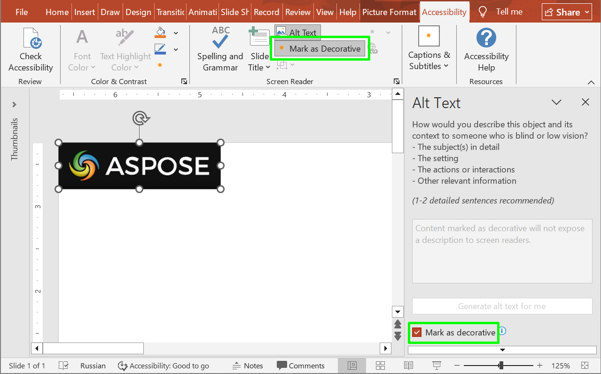

## **Overview**

Presentation accessibility ensures that people using assistive technologies—such as screen readers, braille displays, or keyboard-only navigation—can understand and navigate your slides as effectively as sighted, mouse-using audiences. Good practice focuses on clear reading order, meaningful alternative text for informative visuals, sufficient color contrast, readable typography, descriptive link text, and avoiding conveying meaning by color or position alone. When accessibility is planned from the start, the result is a cleaner structure, more consistent visuals, and content that reaches every viewer without workarounds.

## **Mark as Decorative**

Mark as decorative flags purely ornamental visuals so screen readers skip them, reducing noise and keeping focus on meaningful content. Apply it to backgrounds, flourishes, and spacers—never to charts, icons, or images that convey information. Aspose.Slides exposes this flag for detection and validation, enabling automated accessibility checks and cleanup.



The following code sample shows how to determine whether a shape is marked as decorative.

```py
import aspose.slides as slides

with slides.Presentation("sample.pptx") as presentation:
    shape = presentation.slides[0].shapes[0]
    print(f"Is shape decorative: {shape.is_decorative}")
```
