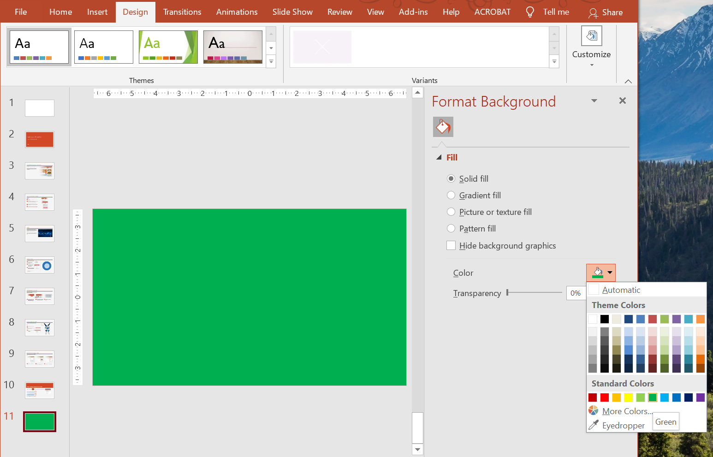

## **Overview**

Solid colors, gradients, and images are commonly used for slide backgrounds. You can set the background for a **normal slide** (a single slide) or a **master slide** (applies to multiple slides at once).



## **Set a Solid Color Background for a Normal Slide**

Aspose.Slides allows you to set a solid color as the background for a specific slide in a presentation—even if the presentation uses a master slide. The change applies only to the selected slide.

1. Create an instance of the [Presentation](https://reference.aspose.com/slides/python-net/aspose.slides/presentation/) class.
2. Set the slide’s [BackgroundType](https://reference.aspose.com/slides/python-net/aspose.slides/backgroundtype/) to `OWN_BACKGROUND`.
3. Set the slide background [FillType](https://reference.aspose.com/slides/python-net/aspose.slides/filltype/) to `SOLID`.
4. Use the `solid_fill_color` property on [FillFormat](https://reference.aspose.com/slides/python-net/aspose.slides/fillformat/) to specify the solid background color.
5. Save the modified presentation.

The following Python example shows how to set a blue solid color as the background for a normal slide:

```python
import aspose.pydrawing as draw
import aspose.slides as slides

# Create an instance of the Presentation class.
with slides.Presentation() as presentation:
    slide = presentation.slides[0]

    # Set the background color of the slide to blue.
    slide.background.type = slides.BackgroundType.OWN_BACKGROUND
    slide.background.fill_format.fill_type = slides.FillType.SOLID
    slide.background.fill_format.solid_fill_color.color = draw.Color.blue

    # Save the presentation to disk.
    presentation.save("SolidColorBackground.pptx", slides.export.SaveFormat.PPTX)
```

## **Set a Solid Color Background for the Master Slide**

Aspose.Slides allows you to set a solid color as the background for the master slide in a presentation. The master slide acts as a template that controls formatting for all slides, so when you choose a solid color for the master slide’s background, it applies to every slide.

1. Create an instance of the [Presentation](https://reference.aspose.com/slides/python-net/aspose.slides/presentation/) class.
2. Set the master slide’s [BackgroundType](https://reference.aspose.com/slides/python-net/aspose.slides/backgroundtype/) (via `masters`) to `OWN_BACKGROUND`.
3. Set the master slide background [FillType](https://reference.aspose.com/slides/python-net/aspose.slides/filltype/) to `SOLID`.
4. Use the `solid_fill_color` property on [FillFormat](https://reference.aspose.com/slides/python-net/aspose.slides/fillformat/) to specify the solid background color.
5. Save the modified presentation.

The following Python example shows how to set a solid color (forest green) as the background for a master slide:

```python
import aspose.pydrawing as draw
import aspose.slides as slides

# Create an instance of the Presentation class.
with slides.Presentation() as presentation:
    master_slide = presentation.masters[0]

    # Set the background color for the Master slide to Forest Green.
    master_slide.background.type = slides.BackgroundType.OWN_BACKGROUND
    master_slide.background.fill_format.fill_type = slides.FillType.SOLID
    master_slide.background.fill_format.solid_fill_color.color = draw.Color.forest_green

    # Save the presentation to disk.
    presentation.save("MasterSlideBackground.pptx", slides.export.SaveFormat.PPTX)
```

## **Set a Gradient Background for a Slide**

A gradient is a graphical effect created by a gradual change in color. When used as a slide background, gradients can make presentations look more artistic and professional. Aspose.Slides allows you to set a gradient color as the background for slides.

1. Create an instance of the [Presentation](https://reference.aspose.com/slides/python-net/aspose.slides/presentation/) class.
2. Set the slide’s [BackgroundType](https://reference.aspose.com/slides/python-net/aspose.slides/backgroundtype/) to `OWN_BACKGROUND`.
3. Set the slide background [FillType](https://reference.aspose.com/slides/python-net/aspose.slides/filltype/) to `GRADIENT`.
4. Use the `gradient_format` property on [FillFormat](https://reference.aspose.com/slides/python-net/aspose.slides/fillformat/) to configure your preferred gradient settings.
5. Save the modified presentation.

The following Python example shows how to set a gradient color as the background for a slide:

```python
import aspose.slides as slides

# Create an instance of the Presentation class.
with slides.Presentation() as presentation:
    slide = presentation.slides[0]

    # Apply a gradient effect to the background.
    slide.background.type = slides.BackgroundType.OWN_BACKGROUND
    slide.background.fill_format.fill_type = slides.FillType.GRADIENT
    slide.background.fill_format.gradient_format.tile_flip = slides.TileFlip.FLIP_BOTH

    # Save the presentation to disk.
    presentation.save("GradientBackground.pptx", slides.export.SaveFormat.PPTX)
```

## **Set an Image as a Slide Background**

In addition to solid and gradient fills, Aspose.Slides allows you to use images as slide backgrounds.

1. Create an instance of the [Presentation](https://reference.aspose.com/slides/python-net/aspose.slides/presentation/) class.
2. Set the slide’s [BackgroundType](https://reference.aspose.com/slides/python-net/aspose.slides/backgroundtype/) to `OWN_BACKGROUND`.
3. Set the slide background [FillType](https://reference.aspose.com/slides/python-net/aspose.slides/filltype/) to `PICTURE`.
4. Load the image you want to use as the slide background.
5. Add the image to the presentation’s image collection.
6. Use the `picture_fill_format` property on [FillFormat](https://reference.aspose.com/slides/python-net/aspose.slides/fillformat/) to assign the image as the background.
7. Save the modified presentation.

The following Python example shows how to set an image as the background for a slide:

```python
import aspose.slides as slides

# Create an instance of the Presentation class.
with slides.Presentation() as presentation:
    slide = presentation.slides[0]

    # Set background image properties.
    slide.background.type = slides.BackgroundType.OWN_BACKGROUND
    slide.background.fill_format.fill_type = slides.FillType.PICTURE
    slide.background.fill_format.picture_fill_format.picture_fill_mode = slides.PictureFillMode.STRETCH

    # Load the image.
    with slides.Images.from_file("Tulips.jpg") as image:
        # Add the image to the presentation's image collection.
        pp_image = presentation.images.add_image(image)

    slide.background.fill_format.picture_fill_format.picture.image = pp_image

    # Save the presentation to disk.
    presentation.save("ImageAsBackground.pptx", slides.export.SaveFormat.PPTX)
```

The following code sample shows how to set the background fill type to a tiled picture and modify the tiling properties:

```py
import aspose.slides as slides

with slides.Presentation() as presentation:

    first_slide = presentation.slides[0]

    background = first_slide.background

    background.type = slides.BackgroundType.OWN_BACKGROUND
    background.fill_format.fill_type = slides.FillType.PICTURE

    with slides.Images.from_file("image.png") as new_image:
        pp_image = presentation.images.add_image(new_image)

    # Set the image used for the background fill.
    back_picture_fill_format = background.fill_format.picture_fill_format
    back_picture_fill_format.picture.image = pp_image

    # Set the picture fill mode to Tile and adjust the tile properties.
    back_picture_fill_format.picture_fill_mode = slides.PictureFillMode.TILE
    back_picture_fill_format.tile_offset_x = 15.0
    back_picture_fill_format.tile_offset_y = 15.0
    back_picture_fill_format.tile_scale_x = 46.0
    back_picture_fill_format.tile_scale_y = 87.0
    back_picture_fill_format.tile_alignment = slides.RectangleAlignment.CENTER
    back_picture_fill_format.tile_flip = slides.TileFlip.FLIP_Y

    presentation.save("TileBackground.pptx", slides.export.SaveFormat.PPTX)
```

{}

Read more: [**Tile Picture As Texture**](/slides/python-net/shape-formatting/#tile-picture-as-texture).

{}

### **Change the Background Image Transparency**

You may want to adjust the transparency of a slide's background image to make the contents of the slide stand out. The following Python code shows you how to change the transparency for a slide background image:

```python
transparency_value = 30  # For example.

# Get the collection of picture transform operations.
image_transform = slide.background.fill_format.picture_fill_format.picture.image_transform

transparency_operation = None

# Find an existing fixed-percentage transparency effect.
for operation in image_transform:
    if type(operation) is slides.AlphaModulateFixed:
        transparency_operation = operation
        break

# Set the new transparency value.
if transparency_operation is None:
    image_transform.add_alpha_modulate_fixed_effect(100 - transparency_value)
else:
    transparency_operation.amount = 100 - transparency_value
```

## **Get the Slide Background Value**

Aspose.Slides provides the [IBackgroundEffectiveData](https://reference.aspose.com/slides/python-net/aspose.slides/ibackgroundeffectivedata/) class for retrieving a slide’s effective background values. This class exposes the effective [FillFormat](https://reference.aspose.com/slides/python-net/aspose.slides/fillformat/) and [EffectFormat](https://reference.aspose.com/slides/python-net/aspose.slides/effectformat/).

Using the [BaseSlide](https://reference.aspose.com/slides/python-net/aspose.slides/baseslide/) class’s `background` property, you can obtain the effective background for a slide.

The following Python example shows how to get a slide’s effective background value:

```python
import aspose.slides as slides

# Create an instance of the Presentation class.
with slides.Presentation("Sample.pptx") as presentation:
    slide = presentation.slides[0]

    # Retrieve the effective background, taking into account master, layout, and theme.
    effective_background = slide.background.get_effective()

    if effective_background.fill_format.fill_type == slides.FillType.SOLID:
        color = effective_background.fill_format.solid_fill_color
        print(f"Fill color: Color [A={color.a}, R={color.r}, G={color.g}, B={color.b}]")
    else:
        print("Fill type:", str(effective_background.fill_format.fill_type))
```

## **FAQ**

**Can I reset a custom background and restore the theme/layout background?**

Yes. Remove the slide’s custom fill, and the background will be inherited again from the corresponding [layout](/slides/python-net/slide-layout/)/[master](/slides/python-net/slide-master/) slide (i.e., the [theme background](/slides/python-net/presentation-theme/)).

**What happens to the background if I change the presentation’s theme later?**

If a slide has its own fill, it will remain unchanged. If the background is inherited from the [layout](/slides/python-net/slide-layout/)/[master](/slides/python-net/slide-master/), it will update to match the [new theme](/slides/python-net/presentation-theme/).
