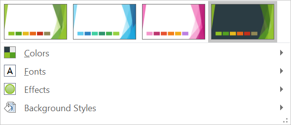
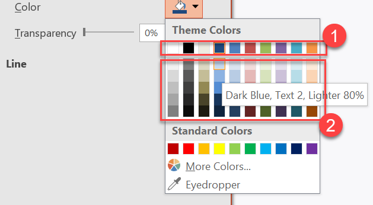
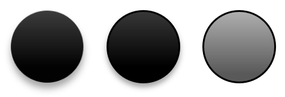
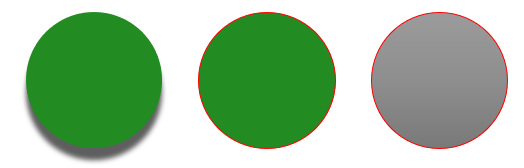

## **Overview**

A presentation theme defines the properties of its design elements. When you select a theme, you’re choosing a coordinated set of visual elements and their properties.

In PowerPoint, a theme includes colors, [fonts](/slides/python-net/powerpoint-fonts/), [background styles](/slides/python-net/presentation-background/), and effects.



## **Change the Theme Color**

A PowerPoint theme uses a specific set of colors for different elements on a slide. If you don’t like the defaults, you can change them by applying new theme colors. To let you select a new theme color, Aspose.Slides provides values in the [SchemeColor](https://reference.aspose.com/slides/python-net/aspose.slides/schemecolor/) enumeration.

This Python code shows how to change a theme’s accent color:

```python
import aspose.pydrawing as draw
import aspose.slides as slides

with slides.Presentation() as presentation:
    slide = presentation.slides[0]

    shape = slide.shapes.add_auto_shape(slides.ShapeType.RECTANGLE, 10, 10, 100, 100)
    shape.fill_format.fill_type = slides.FillType.SOLID
    shape.fill_format.solid_fill_color.scheme_color = slides.SchemeColor.ACCENT4
```

You can determine the effective value of the resulting color as follows:

```python
fill_effective = shape.fill_format.get_effective()
print("{0} ({1})".format(fill_effective.solid_fill_color.name, fill_effective.solid_fill_color))

# The example output:
#
# ff8064a2 (Color [A=255, R=128, G=100, B=162])
```

To further demonstrate the color change, we create another element, assign it the accent color from the initial step, and then update the theme color.

```python
other_shape = slide.shapes.add_auto_shape(slides.ShapeType.RECTANGLE, 10, 120, 100, 100)
other_shape.fill_format.fill_type = slides.FillType.SOLID
other_shape.fill_format.solid_fill_color.scheme_color = slides.SchemeColor.ACCENT4

presentation.master_theme.color_scheme.accent4.color = draw.Color.red
```

The new color is applied automatically to both elements.

### **Set a Theme Color from the Additional Palette**

When you apply luminance transformations to the main theme color (1), colors from the additional palette (2) are generated. You can then set and retrieve those theme colors.



**1** — Main theme colors

**2** — Colors from the additional palette

This Python code demonstrates how additional-palette colors are derived from the main theme color and then used in shapes:

```python
import aspose.slides as slides

with slides.Presentation() as presentation:
    slide = presentation.slides[0]

    # Accent 4
    shape1 = slide.shapes.add_auto_shape(slides.ShapeType.RECTANGLE, 10, 10, 50, 50)

    shape1.fill_format.fill_type = slides.FillType.SOLID
    shape1.fill_format.solid_fill_color.scheme_color = slides.SchemeColor.ACCENT4

    # Accent 4, Lighter 80%
    shape2 = slide.shapes.add_auto_shape(slides.ShapeType.RECTANGLE, 10, 70, 50, 50)

    shape2.fill_format.fill_type = slides.FillType.SOLID
    shape2.fill_format.solid_fill_color.scheme_color = slides.SchemeColor.ACCENT4
    shape2.fill_format.solid_fill_color.color_transform.add(slides.ColorTransformOperation.MULTIPLY_LUMINANCE, 0.2)
    shape2.fill_format.solid_fill_color.color_transform.add(slides.ColorTransformOperation.ADD_LUMINANCE, 0.8)

    # Accent 4, Lighter 60%
    shape3 = slide.shapes.add_auto_shape(slides.ShapeType.RECTANGLE, 10, 130, 50, 50)

    shape3.fill_format.fill_type = slides.FillType.SOLID
    shape3.fill_format.solid_fill_color.scheme_color = slides.SchemeColor.ACCENT4
    shape3.fill_format.solid_fill_color.color_transform.add(slides.ColorTransformOperation.MULTIPLY_LUMINANCE, 0.4)
    shape3.fill_format.solid_fill_color.color_transform.add(slides.ColorTransformOperation.ADD_LUMINANCE, 0.6)

    # Accent 4, Lighter 40%
    shape4 = slide.shapes.add_auto_shape(slides.ShapeType.RECTANGLE, 10, 190, 50, 50)

    shape4.fill_format.fill_type = slides.FillType.SOLID
    shape4.fill_format.solid_fill_color.scheme_color = slides.SchemeColor.ACCENT4
    shape4.fill_format.solid_fill_color.color_transform.add(slides.ColorTransformOperation.MULTIPLY_LUMINANCE, 0.6)
    shape4.fill_format.solid_fill_color.color_transform.add(slides.ColorTransformOperation.ADD_LUMINANCE, 0.4)

    # Accent 4, Darker 25%
    shape5 = slide.shapes.add_auto_shape(slides.ShapeType.RECTANGLE, 10, 250, 50, 50)

    shape5.fill_format.fill_type = slides.FillType.SOLID
    shape5.fill_format.solid_fill_color.scheme_color = slides.SchemeColor.ACCENT4
    shape5.fill_format.solid_fill_color.color_transform.add(slides.ColorTransformOperation.MULTIPLY_LUMINANCE, 0.75)

    # Accent 4, Darker 50%
    shape6 = slide.shapes.add_auto_shape(slides.ShapeType.RECTANGLE, 10, 310, 50, 50)

    shape6.fill_format.fill_type = slides.FillType.SOLID
    shape6.fill_format.solid_fill_color.scheme_color = slides.SchemeColor.ACCENT4
    shape6.fill_format.solid_fill_color.color_transform.add(slides.ColorTransformOperation.MULTIPLY_LUMINANCE, 0.5)

    presentation.save("example.pptx", slides.export.SaveFormat.PPTX)
```

## **Change the Theme Font**

To allow you to select fonts for themes and other purposes, Aspose.Slides uses these special identifiers (similar to those in PowerPoint):

- **+mn-lt** — Body Font Latin (Minor Latin Font)
- **+mj-lt** — Heading Font Latin (Major Latin Font)
- **+mn-ea** — Body Font East Asian (Minor East Asian Font)
- **+mj-ea** — Heading Font East Asian (Major East Asian Font)

This Python code shows how to assign the Latin font to a theme element:

```python
portion = slides.Portion("Theme text format")
portion.portion_format.latin_font = slides.FontData("+mn-lt")

paragraph = slides.Paragraph()
paragraph.portions.add(portion)

shape = slide.shapes.add_auto_shape(slides.ShapeType.RECTANGLE, 10, 10, 100, 100)
shape.text_frame.paragraphs.add(paragraph)
```

This Python example shows how to change the presentation’s theme font:

```python
presentation.master_theme.font_scheme.minor.latin_font = slides.FontData("Arial")
```

All text boxes will be updated to the new font.

{}

For more information, see [Master PowerPoint Fonts with Python](/slides/python-net/powerpoint-fonts/).

{}

## **Change the Theme Background Style**

By default, PowerPoint provides 12 predefined backgrounds, but a typical presentation stores only 3 of them.


For example, after you save a presentation in PowerPoint, you can run the following Python code to determine how many predefined backgrounds it contains:

```python
with slides.Presentation() as presentation:
    number_of_background_fills = len(presentation.master_theme.format_scheme.background_fill_styles)
    print(f"Number of theme background fill styles: {number_of_background_fills}")
```

{}

Using the `background_fill_styles` property from the [FormatScheme](https://reference.aspose.com/slides/python-net/aspose.slides.theme/formatscheme/) class, you can add or access background styles in a PowerPoint theme.

{}

This Python example shows how to set the presentation background:

```python
presentation.masters[0].background.style_index = 2  # 0 denotes no fill; indexing starts at 1.
```

{}

For more information, see [Manage Presentation Backgrounds in Python](/slides/python-net/presentation-background/).
 
{}

## **Change the Theme Effects**

A PowerPoint theme typically includes three values in each style array. These arrays combine into three effect levels: subtle, moderate, and intense. For example, here is the result when those effects are applied to a specific shape:



Using the three properties—`FillStyles`, `LineStyles`, and `EffectStyles`—from the [FormatScheme](https://reference.aspose.com/slides/python-net/aspose.slides.theme/formatscheme/) class, you can modify theme elements (even more flexibly than in PowerPoint).

This Python code shows how to change a theme effect by altering parts of those elements:

```python
with slides.Presentation("sample.pptx") as presentation:
    presentation.master_theme.format_scheme.line_styles[0].fill_format.solid_fill_color.color = draw.Color.red
    presentation.master_theme.format_scheme.fill_styles[2].fill_type = slides.FillType.SOLID
    presentation.master_theme.format_scheme.fill_styles[2].solid_fill_color.color = draw.Color.forest_green
    presentation.master_theme.format_scheme.effect_styles[2].effect_format.outer_shadow_effect.distance = 10

    presentation.save("output.pptx", slides.export.SaveFormat.PPTX)
```

The resulting changes include updates to the fill color, fill type, shadow effect, and other properties:



## **FAQ**

**Can I apply a theme to a single slide without changing the master?**

Yes. Aspose.Slides support slide-level theme overrides, so you can apply a local theme to just that slide while keeping the master theme intact (via the [SlideThemeManager](https://reference.aspose.com/slides/python-net/aspose.slides.theme/slidethememanager/)).

**What’s the safest way to carry a theme from one presentation to another?**

[Clone slides](/slides/python-net/clone-slides/) together with their master into the target presentation. This preserves the original master, layouts, and the associated theme so the appearance remains consistent.

**How can I see the "effective" values after all inheritance and overrides?**

Use the API’s ["effective" views](/slides/python-net/shape-effective-properties/) for theme/color/font/effect. These return the resolved, final properties after applying the master plus any local overrides.
