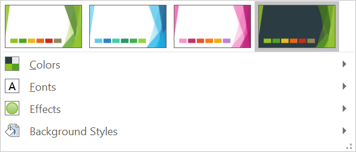

## **Introduction**

A presentation theme defines a coordinated set of colors, fonts, background styles, fills, lines, and effects. Theme-aware objects refer to these shared definitions instead of storing every visual property as a fixed value, so a theme change can update many objects at once.

In Aspose.Slides, the presentation-level theme is available through the [Presentation.master_theme](https://reference.aspose.com/slides/python-net/aspose.slides/presentation/master_theme/) property. A presentation can also contain theme overrides at lower levels. A master can override the presentation theme through [MasterThemeManager.override_theme](https://reference.aspose.com/slides/python-net/aspose.slides.theme/masterthememanager/override_theme/), a layout can override its inherited theme through [BaseOverrideThemeManager.override_theme](https://reference.aspose.com/slides/python-net/aspose.slides.theme/baseoverridethememanager/override_theme/), and an individual slide can do the same. In practice, the effective theme for a slide is resolved through this inheritance chain: presentation theme, master override, layout override, and slide override.



The sections below show the most common theme workflows: inspect a theme, change colors and fonts, copy or apply a theme, update background and effect styles, and read effective values after inheritance and overrides have been resolved.

## **Inspect a Theme**

The [MasterTheme](https://reference.aspose.com/slides/python-net/aspose.slides.theme/mastertheme/) object exposes the theme's [color_scheme](https://reference.aspose.com/slides/python-net/aspose.slides.theme/mastertheme/color_scheme/), [font_scheme](https://reference.aspose.com/slides/python-net/aspose.slides.theme/mastertheme/font_scheme/), and [format_scheme](https://reference.aspose.com/slides/python-net/aspose.slides.theme/mastertheme/format_scheme/) properties. Inspecting these collections before changing them is especially useful when a presentation comes from an external source because the number and content of style entries can vary.

The following example reads the main theme properties and reports how many background, fill, line, and effect styles are stored in the theme:

```python
import aspose.slides as slides

with slides.Presentation("input.pptx") as presentation:
    theme = presentation.master_theme
    print(f"Theme name: {theme.name}")
    print(f"Accent 1: {theme.color_scheme.accent1.color}")
    print(f"Major Latin font: {theme.font_scheme.major.latin_font.font_name}")
    print(f"Minor Latin font: {theme.font_scheme.minor.latin_font.font_name}")
    print(f"Background fill styles: {len(theme.format_scheme.background_fill_styles)}")
    print(f"Fill styles: {len(theme.format_scheme.fill_styles)}")
    print(f"Line styles: {len(theme.format_scheme.line_styles)}")
    print(f"Effect styles: {len(theme.format_scheme.effect_styles)}")
```

If a file uses multiple masters, do not assume that every slide has the same effective theme. Inspect the master associated with the slide, and use the effective-theme workflow shown later in this article when layout or slide overrides may be present.

## **Change Theme Colors**

Theme-aware fills, lines, and text can refer to a logical color from the [SchemeColor](https://reference.aspose.com/slides/python-net/aspose.slides/schemecolor/) enumeration. When you change the corresponding entry in the theme's [ColorScheme](https://reference.aspose.com/slides/python-net/aspose.slides.theme/colorscheme/), all objects that still reference that theme color are resolved against the new value. Objects that use a direct RGB color are not changed by a theme-color update.

The following end-to-end example creates a shape that uses `ACCENT4`, changes the theme's `accent4` color to red, saves the presentation, reopens it, and prints the effective fill color:

```python
import aspose.pydrawing as draw
import aspose.slides as slides

with slides.Presentation() as presentation:
    slide = presentation.slides[0]
    shape = slide.shapes.add_auto_shape(slides.ShapeType.RECTANGLE, 10, 10, 100, 100)
    shape.fill_format.fill_type = slides.FillType.SOLID
    shape.fill_format.solid_fill_color.scheme_color = slides.SchemeColor.ACCENT4
    presentation.master_theme.color_scheme.accent4.color = draw.Color.red
    presentation.save("theme-color.pptx", slides.export.SaveFormat.PPTX)

with slides.Presentation("theme-color.pptx") as saved_presentation:
    saved_slide = saved_presentation.slides[0]
    saved_shape = saved_slide.shapes[0]
    effective_fill = saved_shape.fill_format.get_effective()
    print(f"Effective fill color: {effective_fill.solid_fill_color}")
```

Because the rectangle remains linked to `ACCENT4`, its visible color becomes red after the theme is changed. If you replace the scheme color with a direct color on the shape, later changes to `accent4` will no longer affect that fill.

### **Use Colors from the Additional Palette**

PowerPoint derives lighter and darker variants from a theme color by applying color transformations. Aspose.Slides exposes these transformations through the [ColorTransformOperation](https://reference.aspose.com/slides/python-net/aspose.slides/colortransformoperation/) enumeration.


**1** - Main theme colors.

**2** - Lighter and darker variants produced from the main theme colors.

The following example creates six rectangles based on `ACCENT4`, applies luminance transformations to five of them, and saves the result:

```python
import aspose.slides as slides

with slides.Presentation() as presentation:
    slide = presentation.slides[0]
    shape1 = slide.shapes.add_auto_shape(slides.ShapeType.RECTANGLE, 10, 10, 50, 50)
    shape1.fill_format.fill_type = slides.FillType.SOLID
    shape1.fill_format.solid_fill_color.scheme_color = slides.SchemeColor.ACCENT4
    shape2 = slide.shapes.add_auto_shape(slides.ShapeType.RECTANGLE, 10, 70, 50, 50)
    shape2.fill_format.fill_type = slides.FillType.SOLID
    shape2.fill_format.solid_fill_color.scheme_color = slides.SchemeColor.ACCENT4
    shape2.fill_format.solid_fill_color.color_transform.add(slides.ColorTransformOperation.MULTIPLY_LUMINANCE, 0.2)
    shape2.fill_format.solid_fill_color.color_transform.add(slides.ColorTransformOperation.ADD_LUMINANCE, 0.8)
    shape3 = slide.shapes.add_auto_shape(slides.ShapeType.RECTANGLE, 10, 130, 50, 50)
    shape3.fill_format.fill_type = slides.FillType.SOLID
    shape3.fill_format.solid_fill_color.scheme_color = slides.SchemeColor.ACCENT4
    shape3.fill_format.solid_fill_color.color_transform.add(slides.ColorTransformOperation.MULTIPLY_LUMINANCE, 0.4)
    shape3.fill_format.solid_fill_color.color_transform.add(slides.ColorTransformOperation.ADD_LUMINANCE, 0.6)
    shape4 = slide.shapes.add_auto_shape(slides.ShapeType.RECTANGLE, 10, 190, 50, 50)
    shape4.fill_format.fill_type = slides.FillType.SOLID
    shape4.fill_format.solid_fill_color.scheme_color = slides.SchemeColor.ACCENT4
    shape4.fill_format.solid_fill_color.color_transform.add(slides.ColorTransformOperation.MULTIPLY_LUMINANCE, 0.6)
    shape4.fill_format.solid_fill_color.color_transform.add(slides.ColorTransformOperation.ADD_LUMINANCE, 0.4)
    shape5 = slide.shapes.add_auto_shape(slides.ShapeType.RECTANGLE, 10, 250, 50, 50)
    shape5.fill_format.fill_type = slides.FillType.SOLID
    shape5.fill_format.solid_fill_color.scheme_color = slides.SchemeColor.ACCENT4
    shape5.fill_format.solid_fill_color.color_transform.add(slides.ColorTransformOperation.MULTIPLY_LUMINANCE, 0.75)
    shape6 = slide.shapes.add_auto_shape(slides.ShapeType.RECTANGLE, 10, 310, 50, 50)
    shape6.fill_format.fill_type = slides.FillType.SOLID
    shape6.fill_format.solid_fill_color.scheme_color = slides.SchemeColor.ACCENT4
    shape6.fill_format.solid_fill_color.color_transform.add(slides.ColorTransformOperation.MULTIPLY_LUMINANCE, 0.5)
    presentation.save("theme-color-palette.pptx", slides.export.SaveFormat.PPTX)
```

These variants remain based on the theme color. If `accent4` changes later, the transformed colors are recalculated from the new `accent4` value.

### **Map `SchemeColor` Values to `ColorScheme` Slots**

The [SchemeColor](https://reference.aspose.com/slides/python-net/aspose.slides/schemecolor/) enumeration uses `TEXT1`, `BACKGROUND1`, `TEXT2`, and `BACKGROUND2`, while [ColorScheme](https://reference.aspose.com/slides/python-net/aspose.slides.theme/colorscheme/) exposes the same theme slots as `dark1`, `light1`, `dark2`, and `light2`. The mapping is fixed:

* `TEXT1` = `dark1`
* `BACKGROUND1` = `light1`
* `TEXT2` = `dark2`
* `BACKGROUND2` = `light2`

These are alternate names for the same theme slots; they are not values that are dynamically converted from one form to another.

## **Change Theme Fonts**

A theme font scheme contains a major font set for headings and a minor font set for body text. The [FontScheme.major](https://reference.aspose.com/slides/python-net/aspose.slides.theme/fontscheme/major/) and [FontScheme.minor](https://reference.aspose.com/slides/python-net/aspose.slides.theme/fontscheme/minor/) properties expose those sets.

PowerPoint-compatible theme font identifiers can be used in text formatting:

* `+mn-lt` - Body Font Latin (Minor Latin Font)
* `+mj-lt` - Heading Font Latin (Major Latin Font)
* `+mn-ea` - Body Font East Asian (Minor East Asian Font)
* `+mj-ea` - Heading Font East Asian (Major East Asian Font)

The following example creates one heading that uses the major Latin theme font and one body line that uses the minor Latin theme font. It then changes the theme fonts and saves the result:

```python
import aspose.slides as slides

with slides.Presentation() as presentation:
    slide = presentation.slides[0]
    heading = slide.shapes.add_auto_shape(slides.ShapeType.RECTANGLE, 40, 40, 500, 60)
    heading.text_frame.text = "Theme heading"
    heading.text_frame.paragraphs[0].portions[0].portion_format.latin_font = slides.FontData("+mj-lt")
    body = slide.shapes.add_auto_shape(slides.ShapeType.RECTANGLE, 40, 120, 500, 60)
    body.text_frame.text = "Theme body text"
    body.text_frame.paragraphs[0].portions[0].portion_format.latin_font = slides.FontData("+mn-lt")
    presentation.master_theme.font_scheme.major.latin_font = slides.FontData("Aptos Display")
    presentation.master_theme.font_scheme.minor.latin_font = slides.FontData("Arial")
    presentation.save("theme-fonts.pptx", slides.export.SaveFormat.PPTX)
```

The heading follows the major font and the body text follows the minor font. Text that has an explicit font name instead of a theme identifier will not automatically switch when the theme font scheme changes.

The major and minor font collections can also contain font mappings for individual writing systems, such as Cyrillic, Arabic, Japanese, Georgian, and Thaana. To inspect, add, replace, or remove these mappings, see [Script-Specific Theme Fonts](/slides/python-net/script-specific-font-mappings/).

{}

For more information about presentation fonts, see [PowerPoint Fonts](/slides/python-net/powerpoint-fonts/).

{}

## **Copy or Apply a Theme**

The workflows below solve different theme-related problems.

### **Apply an External Theme to a Master's Dependent Slides**

Use [IMasterSlide.apply_external_theme_to_depending_slides](https://reference.aspose.com/slides/python-net/aspose.slides/imasterslide/apply_external_theme_to_depending_slides/) when you have a PowerPoint theme file (`.thmx`) and want to restyle every slide that depends on a particular master. Select the master from the [Presentation.masters](https://reference.aspose.com/slides/python-net/aspose.slides/presentation/masters/) collection, which implements [MasterSlideCollection](https://reference.aspose.com/slides/python-net/aspose.slides/masterslidecollection/), and pass the theme file path to the method.

The method performs the following operations:

1. Creates a new master slide based on the selected master.
1. Applies the external theme to the new master.
1. Assigns the new master to all slides that previously depended on the selected master.
1. Returns the newly created [IMasterSlide](https://reference.aspose.com/slides/python-net/aspose.slides/imasterslide/).

The following example applies an external theme to the slides that depend on the first master and saves the presentation:

```python
import aspose.slides as slides

with slides.Presentation("presentation.pptx") as presentation:
    selected_master = presentation.masters[0]
    themed_master = selected_master.apply_external_theme_to_depending_slides("corporate-theme.thmx")

    print(f"Created master: {themed_master.name}")
    presentation.save("presentation-with-external-theme.pptx", slides.export.SaveFormat.PPTX)
```

An invalid, corrupted, or unsupported theme can cause [PptxException](https://reference.aspose.com/slides/python-net/aspose.slides/pptxexception/) or one of its format-related subclasses. Validate paths supplied by users, handle file-system access failures, and save the presentation only after the theme has been applied successfully.

Only the slides that depended on the selected master are reassigned. Slides associated with other masters retain their existing masters and themes. Theme-aware colors, fonts, fills, lines, backgrounds, and effects are resolved against the external theme. Directly assigned colors, fonts, fills, and other explicit formatting may remain unchanged. Layout-level and slide-level overrides can also take precedence over values inherited from the new master.

The theme can reference fonts that are not available in the runtime environment. For consistent rendering and export, install the required fonts, provide them through [custom font sources](/slides/python-net/custom-font/), or configure [font substitution](/slides/python-net/font-substitution/).

This is a direct master-level workflow: the method accepts a file path to a `.thmx` file and does not require manually creating slide-level or layout-level theme overrides.

### **Apply Different External Themes in a Multi-Master Presentation**

When the relevant master is not known in advance, obtain it from a representative slide through [Slide.layout_slide](https://reference.aspose.com/slides/python-net/aspose.slides/slide/layout_slide/) and [LayoutSlide.master_slide](https://reference.aspose.com/slides/python-net/aspose.slides/layoutslide/master_slide/). Store the original master references before applying any themes because each call creates another master in the presentation.

The following example uses slides from two sections to locate their masters and applies a different external theme to each group:

```python
import aspose.slides as slides

with slides.Presentation("multi-master-presentation.pptx") as presentation:
    if len(presentation.slides) < 5:
        print("The presentation does not contain the expected representative slides.")
    else:
        first_group_master = presentation.slides[0].layout_slide.master_slide
        second_group_master = presentation.slides[4].layout_slide.master_slide

        if first_group_master.slide_id == second_group_master.slide_id:
            print("The representative slides use the same master.")
        else:
            first_themed_master = first_group_master.apply_external_theme_to_depending_slides("blue-theme.thmx")
            second_themed_master = second_group_master.apply_external_theme_to_depending_slides("green-theme.thmx")

            print(f"First themed master: {first_themed_master.name}")
            print(f"Second themed master: {second_themed_master.name}")
            presentation.save("multi-master-with-external-themes.pptx", slides.export.SaveFormat.PPTX)
```

The first call affects only slides that depended on `first_group_master`, and the second call affects only slides that depended on `second_group_master`. Slides belonging to any other master are not restyled.

### **Preserve a Source Theme When Moving Slides**

If you want to move a slide to another presentation and preserve its original design, clone the source master into the target presentation with [MasterSlideCollection.add_clone](https://reference.aspose.com/slides/python-net/aspose.slides/masterslidecollection/add_clone/), then clone the slide with [SlideCollection.add_clone](https://reference.aspose.com/slides/python-net/aspose.slides/slidecollection/add_clone/) and the cloned master. This carries the master, its layouts, and the associated theme together.

```python
import aspose.slides as slides

with slides.Presentation("source-theme.pptx") as source:
    with slides.Presentation("target.pptx") as target:
        source_slide = source.slides[0]
        source_master = source_slide.layout_slide.master_slide
        cloned_master = target.masters.add_clone(source_master)
        target.slides.add_clone(source_slide, cloned_master, True)
        target.save("theme-preserved.pptx", slides.export.SaveFormat.PPTX)
```

This is the preferred workflow when the source slide must look the same in the destination. Simply cloning content onto an unrelated destination master can change theme-driven colors, fonts, backgrounds, and effects.

### **Apply Theme Values to an Existing Slide**

If the target slide must stay on its current master and layout, initialize a slide-level override from the source theme. The [OverrideTheme.init_color_scheme_from](https://reference.aspose.com/slides/python-net/aspose.slides.theme/overridetheme/init_color_scheme_from/), [OverrideTheme.init_font_scheme_from](https://reference.aspose.com/slides/python-net/aspose.slides.theme/overridetheme/init_font_scheme_from/), and [OverrideTheme.init_format_scheme_from](https://reference.aspose.com/slides/python-net/aspose.slides.theme/overridetheme/init_format_scheme_from/) methods copy the three main theme components into the override.

```python
import aspose.slides as slides

with slides.Presentation("source-theme.pptx") as source:
    with slides.Presentation("target.pptx") as target:
        target_slide = target.slides[0]
        override_theme = target_slide.theme_manager.override_theme
        override_theme.init_color_scheme_from(source.master_theme.color_scheme)
        override_theme.init_font_scheme_from(source.master_theme.font_scheme)
        override_theme.init_format_scheme_from(source.master_theme.format_scheme)
        target.save("theme-applied-to-slide.pptx", slides.export.SaveFormat.PPTX)
```

This changes the theme used by that slide without changing the theme inherited by other slides. To remove the local override and return to inherited values, call [OverrideTheme.clear](https://reference.aspose.com/slides/python-net/aspose.slides.theme/overridetheme/clear/).

### **Apply a Theme Override to a Layout**

A layout-level override applies to slides that use that layout, unless a particular slide has its own override. The same initialization methods can be used through the layout's [LayoutSlideThemeManager](https://reference.aspose.com/slides/python-net/aspose.slides.theme/layoutslidethememanager/):

```python
import aspose.slides as slides

with slides.Presentation("source-theme.pptx") as source:
    with slides.Presentation("target.pptx") as target:
        target_slide = target.slides[0]
        override_theme = target_slide.layout_slide.theme_manager.override_theme
        override_theme.init_color_scheme_from(source.master_theme.color_scheme)
        override_theme.init_font_scheme_from(source.master_theme.font_scheme)
        override_theme.init_format_scheme_from(source.master_theme.format_scheme)
        target.save("theme-applied-to-layout.pptx", slides.export.SaveFormat.PPTX)
```

Use a master or presentation-level theme when many layouts and slides should share the same base design, a layout override when one layout family needs different styling, and a slide override only for true exceptions. Excessive slide-level overrides make later global theme changes harder to predict.

## **Update Theme Background Styles**

The theme's background fills are stored in [FormatScheme.background_fill_styles](https://reference.aspose.com/slides/python-net/aspose.slides.theme/formatscheme/background_fill_styles/). PowerPoint can present more background choices in its UI than the number of fill definitions physically stored in this collection because the UI can combine theme fills with theme colors and other style references.


Before using a background style, inspect the stored collection and the current [Background.style_index](https://reference.aspose.com/slides/python-net/aspose.slides/background/style_index/). `style_index` uses `0` for no themed fill; positive values are theme background-style references. This is different from indexing a Python collection directly, where `[0]` means the first stored item. Do not assume that every presentation contains the same number of background fill styles.

The following example reports the available background fill count, assigns a themed background reference to the first master, and saves the presentation:

```python
import aspose.slides as slides

with slides.Presentation("input.pptx") as presentation:
    background_styles = presentation.master_theme.format_scheme.background_fill_styles
    print(f"Background fill styles: {len(background_styles)}")
    if len(background_styles) == 0:
        raise RuntimeError("The presentation theme does not contain background fill styles.")
    master_slide = presentation.masters[0]
    master_slide.background.type = slides.BackgroundType.THEMED
    master_slide.background.style_index = 1
    presentation.save("theme-background.pptx", slides.export.SaveFormat.PPTX)
```

The visible result depends on the theme entry referenced by the master and on any background overrides at the layout or slide level. If a slide uses its own background, changing only the master background may not change that slide. Use [Background.get_effective](https://reference.aspose.com/slides/python-net/aspose.slides/background/get_effective/) when you need to know the final background after inheritance has been applied.

{}

Do not treat `style_index` as a zero-based collection index. Also avoid hard-coding a style number from one file and assuming it has the same appearance in another file; theme style definitions are presentation-specific.

{}

{}

For direct background formatting and background inheritance, see [Presentation Background](/slides/python-net/presentation-background/).

{}

## **Update Theme Effects**

A theme format scheme contains separate [FormatScheme.fill_styles](https://reference.aspose.com/slides/python-net/aspose.slides.theme/formatscheme/fill_styles/), [FormatScheme.line_styles](https://reference.aspose.com/slides/python-net/aspose.slides.theme/formatscheme/line_styles/), and [FormatScheme.effect_styles](https://reference.aspose.com/slides/python-net/aspose.slides.theme/formatscheme/effect_styles/) collections. Typical Office themes often contain three principal style entries that correspond visually to subtle, moderate, and intense formatting, but code should inspect each collection instead of assuming a fixed count.


When you access these collections in Python, the collection index is zero-based: `[0]` is the first stored style and `[2]` is the third. A shape's style-reference indexes are a separate concept, exposed through [IShapeStyle](https://reference.aspose.com/slides/python-net/aspose.slides/ishapestyle/). Modifying a theme style affects shapes that reference that theme style; shapes with direct formatting may remain unchanged.

The following example checks that the required style entries exist, changes the first line style, changes the third fill style, enables an outer shadow in the third effect style, and saves the result:

```python
import aspose.pydrawing as draw
import aspose.slides as slides

with slides.Presentation("Subtle_Moderate_Intense.pptx") as presentation:
    format_scheme = presentation.master_theme.format_scheme
    if len(format_scheme.line_styles) < 1 or len(format_scheme.fill_styles) < 3 or len(format_scheme.effect_styles) < 3:
        raise RuntimeError("The theme does not contain the style entries required by this example.")
    format_scheme.line_styles[0].fill_format.fill_type = slides.FillType.SOLID
    format_scheme.line_styles[0].fill_format.solid_fill_color.color = draw.Color.red
    format_scheme.fill_styles[2].fill_type = slides.FillType.SOLID
    format_scheme.fill_styles[2].solid_fill_color.color = draw.Color.forest_green
    format_scheme.effect_styles[2].effect_format.enable_outer_shadow_effect()
    format_scheme.effect_styles[2].effect_format.outer_shadow_effect.distance = 10
    presentation.save("theme-effects.pptx", slides.export.SaveFormat.PPTX)
```

For shapes that reference these slots, the first theme line style becomes red, the third theme fill style becomes solid forest green, and the third effect style gains an outer shadow with a distance of 10 points. The exact visual result still depends on which style slots each shape references and whether direct formatting overrides the theme.


## **Determine Whether an Effective Solid Fill Uses a Theme Color**

A fill can be stored directly on an object or inherited from a paragraph, layout, master, theme style, or another formatting level. Call [FillFormat.get_effective](https://reference.aspose.com/slides/python-net/aspose.slides/fillformat/get_effective/) to resolve that hierarchy into immutable [IFillFormatEffectiveData](https://reference.aspose.com/slides/python-net/aspose.slides/ifillformateffectivedata/). First check [IFillFormatEffectiveData.fill_type](https://reference.aspose.com/slides/python-net/aspose.slides/ifillformateffectivedata/fill_type/). Only when it is `FillType.SOLID` should you read the solid-fill properties.

For a solid fill, [IFillFormatEffectiveData.solid_fill_color](https://reference.aspose.com/slides/python-net/aspose.slides/ifillformateffectivedata/solid_fill_color/) returns the final rendered RGB value after inheritance, theme lookup, and color transformations are applied. [IFillFormatEffectiveData.solid_fill_scheme_color](https://reference.aspose.com/slides/python-net/aspose.slides/ifillformateffectivedata/solid_fill_scheme_color/) returns the corresponding logical [SchemeColor](https://reference.aspose.com/slides/python-net/aspose.slides/schemecolor/) slot, such as `TEXT1` or `ACCENT6`. A value of `SchemeColor.NOT_DEFINED` means that the effective solid fill is not based on a scheme color. In a workflow where fills are either theme colors or direct RGB colors, this value identifies a direct RGB fill.

Do not use the local [IColorFormat.scheme_color](https://reference.aspose.com/slides/python-net/aspose.slides/icolorformat/scheme_color/) value alone to classify a fill. For example, a text portion can have no locally defined scheme color, so its local value is `NOT_DEFINED`, while its effective fill inherits a theme color and resolves to `TEXT1` or `ACCENT6`. Conversely, `solid_fill_scheme_color` tells you which logical theme slot produced the effective color, but it does not tell you whether that slot came from the object, paragraph, layout, master, or another level of the formatting hierarchy.

The following example loads a presentation, audits both shape fills and text-portion fills, prints each final RGB value and associated scheme color, and flags solid fills that will not track theme color changes:

```python
import aspose.slides as slides


def audit_fill(object_name, local_fill):
    effective_fill = local_fill.get_effective()

    if effective_fill.fill_type != slides.FillType.SOLID:
        print(f"{object_name}: fill type = {effective_fill.fill_type}; not a solid fill.")
        return

    rgb = effective_fill.solid_fill_color
    effective_scheme_color = effective_fill.solid_fill_scheme_color
    local_scheme_color = local_fill.solid_fill_color.scheme_color

    print(f"{object_name}: RGB = #{rgb.r:02X}{rgb.g:02X}{rgb.b:02X}")
    print(f"{object_name}: local scheme = {local_scheme_color}, effective scheme = {effective_scheme_color}")

    if effective_scheme_color == slides.SchemeColor.NOT_DEFINED:
        print(f"{object_name}: direct RGB or another non-scheme fill; audit as theme-independent.")
    else:
        print(f"{object_name}: theme-dependent through {effective_scheme_color}.")


with slides.Presentation("input.pptx") as presentation:
    for slide_index, slide in enumerate(presentation.slides):
        for shape_index, shape in enumerate(slide.shapes):
            shape_name = f"Slide {slide_index + 1}, shape {shape_index + 1}"
            audit_fill(shape_name, shape.fill_format)

            if isinstance(shape, slides.AutoShape):
                for paragraph_index, paragraph in enumerate(shape.text_frame.paragraphs):
                    for portion_index, portion in enumerate(paragraph.portions):
                        portion_name = f"{shape_name}, paragraph {paragraph_index + 1}, portion {portion_index + 1}"
                        audit_fill(portion_name, portion.portion_format.fill_format)
```

The `NOT_DEFINED` branch provides an audit list of solid fills that will not respond to changes in theme color slots. Review those objects when a presentation must follow a new brand palette. The reported RGB value still shows the current appearance, while the scheme value explains whether that appearance is connected to the theme.

Effective-format objects are snapshots. After changing the presentation theme, a theme override, or any inherited formatting, call `get_effective` again and read a new `IFillFormatEffectiveData` object before comparing or reporting colors.

## **Read Effective Theme Values**

Raw theme objects tell you what is defined at a particular level. Effective values tell you what a slide or shape actually uses after inheritance and local overrides are resolved. For a slide, call [BaseOverrideThemeManager.create_theme_effective](https://reference.aspose.com/slides/python-net/aspose.slides.theme/baseoverridethememanager/create_theme_effective/). For a background, use [Background.get_effective](https://reference.aspose.com/slides/python-net/aspose.slides/background/get_effective/), and for a fill, use [FillFormat.get_effective](https://reference.aspose.com/slides/python-net/aspose.slides/fillformat/get_effective/).

The following example reads the effective theme, background, and first shape fill from a slide:

```python
import aspose.slides as slides

with slides.Presentation("input.pptx") as presentation:
    slide = presentation.slides[0]
    effective_theme = slide.theme_manager.create_theme_effective()
    effective_background = slide.background.get_effective()
    print(f"Effective major Latin font: {effective_theme.font_scheme.major.latin_font.font_name}")
    print(f"Effective minor Latin font: {effective_theme.font_scheme.minor.latin_font.font_name}")
    print(f"Effective background fill type: {effective_background.fill_format.fill_type}")
    if len(slide.shapes) > 0:
        effective_fill = slide.shapes[0].fill_format.get_effective()
        print(f"First shape effective fill type: {effective_fill.fill_type}")
        if effective_fill.fill_type == slides.FillType.SOLID:
            print(f"First shape effective fill color: {effective_fill.solid_fill_color}")
```

Use effective data for rendering diagnostics, validation, and comparisons. If you inspect only [Presentation.master_theme](https://reference.aspose.com/slides/python-net/aspose.slides/presentation/master_theme/), you can miss a master, layout, slide, or shape override that changes the final appearance.

## **FAQ**

**Does applying an external theme affect every slide in the presentation?**

No. [IMasterSlide.apply_external_theme_to_depending_slides](https://reference.aspose.com/slides/python-net/aspose.slides/imasterslide/apply_external_theme_to_depending_slides/) reassigns only the slides that depend on the selected master. Slides that use other masters retain their existing themes.

**Can I apply a theme to a single slide without changing the master?**

Yes. Use the slide's [SlideThemeManager](https://reference.aspose.com/slides/python-net/aspose.slides.theme/slidethememanager/) and initialize its override theme. The change remains local to that slide; other slides continue to inherit their existing themes.

**What is the safest way to carry a theme from one presentation to another?**

When moving a slide and preserving its source appearance, clone the source master into the destination and clone the slide with that master using [MasterSlideCollection.add_clone](https://reference.aspose.com/slides/python-net/aspose.slides/masterslidecollection/add_clone/) and [SlideCollection.add_clone](https://reference.aspose.com/slides/python-net/aspose.slides/slidecollection/add_clone/). This keeps the master, layouts, and theme together.

**How can I see the effective values after inheritance and overrides?**

Use [BaseOverrideThemeManager.create_theme_effective](https://reference.aspose.com/slides/python-net/aspose.slides.theme/baseoverridethememanager/create_theme_effective/) for a slide or layout theme and the corresponding effective-data methods for format objects such as [Background.get_effective](https://reference.aspose.com/slides/python-net/aspose.slides/background/get_effective/) and [FillFormat.get_effective](https://reference.aspose.com/slides/python-net/aspose.slides/fillformat/get_effective/). These APIs return the resolved values after inheritance and overrides are applied.
