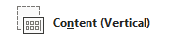

## **Overview**

A slide layout defines the arrangement of placeholder boxes and formatting for the content on a slide. It controls which placeholders are available and where they appear. Slide layouts help you design presentations quickly and consistently—whether you're creating something simple or more complex. Some of the most common slide layouts in PowerPoint include:

**Title Slide layout** – Includes two text placeholders: one for the title and one for the subtitle.

**Title and Content layout** – Features a smaller title placeholder at the top and a larger one below for main content (such as text, bullet points, charts, images, and more).

**Blank layout** – Contains no placeholders, giving you full control to design the slide from scratch.

Slide layouts are part of a slide master, which is the top-level slide that defines layout styles for the presentation. You can access and modify layout slides through the slide master—either by their type, name, or unique ID. Alternatively, you can edit a specific layout slide directly within the presentation.

To work with slide layouts in Aspose.Slides for Python, you can use:

- Properties such as [layout_slides](https://reference.aspose.com/slides/python-net/aspose.slides/presentation/layout_slides/) and [masters](https://reference.aspose.com/slides/python-net/aspose.slides/presentation/masters/) under the [Presentation](https://reference.aspose.com/slides/python-net/aspose.slides/presentation/) class
- Types like [LayoutSlide](https://reference.aspose.com/slides/python-net/aspose.slides/layoutslide/), [MasterLayoutSlideCollection](https://reference.aspose.com/slides/python-net/aspose.slides/masterlayoutslidecollection/), [LayoutPlaceholderManager](https://reference.aspose.com/slides/python-net/aspose.slides/layoutplaceholdermanager/), and [LayoutSlideHeaderFooterManager](https://reference.aspose.com/slides/python-net/aspose.slides/layoutslideheaderfootermanager/)

{}

To learn more about working with master slides, check out the [Manage PowerPoint Slide Masters in Python](/slides/python-net/slide-master/) article.

{}

## **Add Slide Layouts to Presentations**

To customize the appearance and structure of your slides, you may need to add new layout slides to a presentation. Aspose.Slides for Python allows you to check whether a specific layout already exists, add a new one if needed, and use it to insert slides based on that layout.

1. Create an instance of the [Presentation](https://reference.aspose.com/slides/python-net/aspose.slides/presentation/) class.
1. Access the [MasterLayoutSlideCollection](https://reference.aspose.com/slides/python-net/aspose.slides/masterlayoutslidecollection/).
1. Check whether the desired layout slide already exists in the collection. If not, add the layout slide you need.
1. Add an empty slide based on the new layout slide.
1. Save the presentation.

The following Python code demonstrates how to add a slide layout to a PowerPoint presentation:

```python
import aspose.slides as slides

# Instantiate the Presentation class to open the presentation file.
with slides.Presentation("sample.pptx") as presentation:
    # Go through the layout slide types to select a layout slide.
    layout_slides = presentation.masters[0].layout_slides
    layout_slide = layout_slides.get_by_type(slides.SlideLayoutType.TITLE_AND_OBJECT)
    if layout_slide is None:
         layout_slide = layout_slides.get_by_type(slides.SlideLayoutType.TITLE)

    if layout_slide is None:
        # A situation where the presentation doesn't contain all layout types.
        # The presentation file contains only Blank and Custom layout types.
        # However, layout slides with custom types may have recognizable names,
        # such as "Title", "Title and Content", etc., which can be used for layout slide selection.
        # You can also rely on a set of placeholder shape types.
        # For example, a Title slide should have only the Title placeholder type, and so on.
        for title_and_object_layout_slide in layout_slides:
            if title_and_object_layout_slide.name == "Title and Object":
                layout_slide = title_and_object_layout_slide
                break

        if layout_slide is None:
            for title_layout_slide in layout_slides:
                if title_layout_slide.name == "Title":
                    layout_slide = title_layout_slide
                    break

            if layout_slide is None:
                layout_slide = layout_slides.get_by_type(slides.SlideLayoutType.BLANK)
                if layout_slide is None:
                    layout_slide = layout_slides.Add(slides.SlideLayoutType.TITLE_AND_OBJECT, "Title and Object")

    # Add an empty slide using the added layout slide.
    presentation.slides.insert_empty_slide(0, layout_slide)

    # Save the presentation to disk.
    presentation.save("output.pptx", slides.export.SaveFormat.PPTX)
```

## **Remove Unused Layout Slides**

Aspose.Slides provides the [remove_unused_layout_slides](https://reference.aspose.com/slides/python-net/aspose.slides.lowcode/compress/remove_unused_layout_slides/) method from the [Compress](https://reference.aspose.com/slides/python-net/aspose.slides.lowcode/compress/) class to allow you to delete unwanted and unused layout slides.

The following Python code shows how to remove a layout slide from a PowerPoint presentation:

```python
import aspose.slides as slides

with slides.Presentation("sample.pptx") as presentation:
    slides.lowcode.Compress.remove_unused_layout_slides(presentation)
    presentation.save("output.pptx", slides.export.SaveFormat.PPTX)
```

## **Add Placeholders To Slide Layouts**

Aspose.Slides provides the [LayoutSlide.placeholder_manager](https://reference.aspose.com/slides/python-net/aspose.slides/layoutslide/placeholder_manager/) property, which allows you to add new placeholders to a layout slide.

This manager contains methods for the following placeholder types:

| PowerPoint Placeholder              | [LayoutPlaceholderManager](https://reference.aspose.com/slides/python-net/aspose.slides/layoutplaceholdermanager/) Method |
| ----------------------------------- | ------------------------------------------------------------ |
|              | add_content_placeholder(x: float, y: float, width: float, height: float) |
|  | add_vertical_content_placeholder(x: float, y: float, width: float, height: float) |
|                    | add_text_placeholder(x: float, y: float, width: float, height: float) |
|        | add_vertical_text_placeholder(x: float, y: float, width: float, height: float) |
|              | add_picture_placeholder(x: float, y: float, width: float, height: float) |
|                  | add_chart_placeholder(x: float, y: float, width: float, height: float) |
|                  | add_table_placeholder(x: float, y: float, width: float, height: float) |
|            | add_smart_art_placeholder(x: float, y: float, width: float, height: float) |
|                  | add_media_placeholder(x: float, y: float, width: float, height: float) |
|     | add_online_image_placeholder(x: float, y: float, width: float, height: float) |

The following Python code demonstrates how to add new placeholder shapes to the Blank layout slide:

```py
import aspose.slides as slides

with slides.Presentation() as presentation:
    # Get the Blank layout slide.
    layout = presentation.layout_slides.get_by_type(slides.SlideLayoutType.BLANK)

    # Get the placeholder manager of the layout slide.
    placeholder_manager = layout.placeholder_manager

    # Add different placeholders to the Blank layout slide.
    placeholder_manager.add_content_placeholder(20, 20, 310, 270)
    placeholder_manager.add_vertical_text_placeholder(350, 20, 350, 270)
    placeholder_manager.add_chart_placeholder(20, 310, 310, 180)
    placeholder_manager.add_table_placeholder(350, 310, 350, 180)

    # Add a new slide with the Blank layout.
    new_slide = presentation.slides.add_empty_slide(layout)

    presentation.save("placeholders.pptx", slides.export.SaveFormat.PPTX)
```

The result:


## **Set Footer Visibility for a Layout Slide**

In PowerPoint presentations, footer elements like date, slide number, and custom text can be shown or hidden depending on the slide layout. Aspose.Slides for Python allows you to control the visibility of these footer placeholders. This is useful when you want certain layouts to display footer information while others remain clean and minimal.

1. Create an instance of the [Presentation](https://reference.aspose.com/slides/python-net/aspose.slides/presentation/) class.
1. Get a layout slide reference by its index.
1. Set the slide footer placeholder to visible.
1. Set the slide number placeholder to visible.
1. Set the date-time placeholder to visible.
1. Save the presentation.

The following Python code shows how to set the visibility of a slide footer and perform related tasks:

```python
import aspose.slides as slides

with slides.Presentation("sample.pptx") as presentation:
    header_footer_manager = presentation.layout_slides[0].header_footer_manager

    if not header_footer_manager.is_footer_visible: 
        header_footer_manager.set_footer_visibility(True) 

    if not header_footer_manager.is_slide_number_visible:  
        header_footer_manager.set_slide_number_visibility(True) 

    if not header_footer_manager.is_date_time_visible: 
        header_footer_manager.set_date_time_visibility(True)

    header_footer_manager.set_footer_text("Footer text") 
    header_footer_manager.set_date_time_text("Date and time text") 

    presentation.save("output.ppt", slides.export.SaveFormat.PPT)
```

## **Set Child Footer Visibility for a Slide**

​In PowerPoint presentations, footer elements such as date, slide number, and custom text can be controlled at the master slide level to ensure consistency across all layout slides. Aspose.Slides for Python enables you to set the visibility and content of these footer placeholders on the master slide and propagate these settings to all child layout slides. This approach ensures uniform footer information throughout your presentation.​

1. Create an instance of the [Presentation](https://reference.aspose.com/slides/python-net/aspose.slides/presentation/) class.
1. Get a reference to the master slide by its index.
1. Set the master’s and all child footer placeholders to visible.
1. Set the master’s and all child slide number placeholders to visible.
1. Set the master’s and all child date-time placeholders to visible.
1. Save the presentation.

The following Python code demonstrates this operation:

```python
import aspose.slides as slides

with slides.Presentation("presentation.pptx") as presentation:
    header_footer_manager = presentation.masters[0].header_footer_manager

    header_footer_manager.set_footer_and_child_footers_visibility(True)
    header_footer_manager.set_slide_number_and_child_slide_numbers_visibility(True)
    header_footer_manager.set_date_time_and_child_date_times_visibility(True)

    header_footer_manager.set_footer_and_child_footers_text("Footer text")
    header_footer_manager.set_date_time_and_child_date_times_text("Date and time text")

    presentation.save("output.pptx", slides.export.SaveFormat.PPTX)
```

## **FAQ**

**What’s the difference between a master slide and a layout slide?**

A master slide defines the overall theme and default formatting, while layout slides define specific arrangements of placeholders for different types of content.

**Can I copy a layout slide from one presentation to another?**

Yes, you can clone a layout slide from one presentation’s [layout_slides](https://reference.aspose.com/slides/python-net/aspose.slides/presentation/layout_slides/) collection and insert it into another using the `add_clone` method.

**What happens if I delete a layout slide that's still used by a slide?**

If you try to delete a layout slide that is still referenced by at least one slide in the presentation, Aspose.Slides will throw a [PptxEditException](https://reference.aspose.com/slides/python-net/aspose.slides/pptxeditexception/). To avoid this, use [remove_unused_layout_slides](https://reference.aspose.com/slides/python-net/aspose.slides.lowcode/compress/remove_unused_layout_slides/) which safely removes only the layout slides that are not in use.
