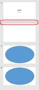
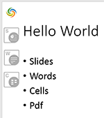
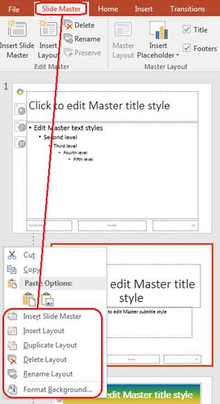

## **Overview**

A **Slide Master** is a slide template that defines the layout, styles, theme, fonts, background, and other properties for slides in a presentation. If you want to create a presentation (or a series of presentations) with the same style and template for your company, you can use a Slide Master.

A Slide Master is useful because it allows you to set and change the look of all presentation slides at once. Aspose.Slides supports PowerPoint’s Slide Master mechanism.

VBA also allows you to manipulate the Slide Master and perform the same operations supported in PowerPoint: change backgrounds, add shapes, customize layouts, and more. Aspose.Slides provides flexible APIs that let you work with Slide Masters and perform common tasks.

These are basic Slide Master operations:

- Create a Slide Master.
- Apply the Slide Master to presentation slides.
- Change the Slide Master background.
- Add an image, placeholder, SmartArt, etc., to the Slide Master.

These are more advanced operations involving the Slide Master:

- Compare Slide Masters.
- Merge Slide Masters.
- Apply multiple Slide Masters.
- Copy a slide along with its Slide Master to another presentation.
- Identify duplicate Slide Masters in presentations.
- Set the Slide Master as the presentation’s default view.

{}

You may want to check out Aspose [Online PowerPoint Viewer](https://products.aspose.app/slides/viewer) because it is a live implementation of some of the core processes described here.

{}

## **How the Slide Master Is Applied**

Before you work with a Slide Master, you may want to understand how Slide Masters are used in presentations and applied to slides.

- Every presentation has at least one Slide Master by default.
- A presentation can contain several Slide Masters. You can add multiple Slide Masters and use them to style different parts of a presentation in different ways.

In Aspose.Slides, a Slide Master is represented by the [MasterSlide](https://reference.aspose.com/slides/python-net/aspose.slides/masterslide/) type.

The Aspose.Slides [Presentation](https://reference.aspose.com/slides/python-net/aspose.slides/presentation/) object contains the [masters](https://reference.aspose.com/slides/python-net/aspose.slides/presentation/masters/) collection of type [MasterSlideCollection](https://reference.aspose.com/slides/python-net/aspose.slides/masterslidecollection/), which holds all master slides defined in a presentation.

Beyond CRUD operations, the [MasterSlideCollection](https://reference.aspose.com/slides/python-net/aspose.slides/masterslidecollection/) class provides useful methods such as [add_clone](https://reference.aspose.com/slides/python-net/aspose.slides/masterslidecollection/add_clone/) and [insert_clone](https://reference.aspose.com/slides/python-net/aspose.slides/masterslidecollection/insert_clone/). These extend the basic slide-cloning functionality and, when working with Slide Masters, allow you to implement more complex setups.

When a new slide is added to a presentation, a Slide Master is applied to it automatically. By default, the Slide Master from the previous slide is selected.

**Note:** Presentation slides are stored in the [slides](https://reference.aspose.com/slides/python-net/aspose.slides/presentation/slides/) collection, and every new slide is added to the end of that collection by default. If a presentation contains a single Slide Master, that Slide Master is selected for all new slides. For this reason, you do not have to specify the Slide Master for every new slide you create.

The same principle applies in PowerPoint and Aspose.Slides. For example, in PowerPoint, when you add a new slide, you can click the area below the last slide, and a new slide (using the previous slide’s Slide Master) will be created.



In Aspose.Slides, you can perform the equivalent task using the [add_clone(ISlide)](https://reference.aspose.com/slides/python-net/aspose.slides/slidecollection/add_clone/) method of the [SlideCollection](https://reference.aspose.com/slides/python-net/aspose.slides/slidecollection/) class.

## **Slide Master in the Slides Hierarchy**

Using **Slide Layouts** with the **Slide Master** provides maximum flexibility. A Slide Layout can define the same types of styles as the Slide Master (background, fonts, shapes, etc.). When multiple Slide Layouts are defined under a Slide Master, they collectively form a cohesive style system. By applying a Slide Layout to an individual slide, you can adjust its style relative to what the Slide Master provides.

The precedence is: **Slide Master** → **Slide Layout** → **Slide**.


Each [MasterSlide](https://reference.aspose.com/slides/python-net/aspose.slides/masterslide/) object has a [layout_slides](https://reference.aspose.com/slides/python-net/aspose.slides/masterslide/layout_slides/) property that contains the list of slide layouts. A [Slide](https://reference.aspose.com/slides/python-net/aspose.slides/slide/) has a [layout_slide](https://reference.aspose.com/slides/python-net/aspose.slides/slide/layout_slide/) property that references the slide layout applied to it. The interaction between a slide and the Slide Master occurs through its Slide Layout.

{}

- In Aspose.Slides, all slide constructs (Slide Master, Slide Layout, and the slide itself) are slide objects that extend the [BaseSlide](https://reference.aspose.com/slides/python-net/aspose.slides/baseslide/) class.
- Because Slide Master and Slide Layout expose many of the same properties, you need to know how their values are applied to a [Slide](https://reference.aspose.com/slides/python-net/aspose.slides/slide/) object. The Slide Master is applied first, then the Slide Layout. For example, if both the Slide Master and Slide Layout define a background, the slide uses the background from the Slide Layout.

{}

## **What a Slide Master Comprises**

To understand how a Slide Master can be modified, you need to know its components. These are the core properties of [MasterSlide](https://reference.aspose.com/slides/python-net/aspose.slides/masterslide/):

- `background` — gets/sets the slide background.
- `body_style` — gets/sets text styles for the slide body.
- `shapes` — gets/sets all shapes on the Slide Master (placeholders, picture frames, etc.).
- `controls` — gets/sets ActiveX controls.
- `theme_manager` — gets the theme manager.
- `header_footer_manager` — gets the header and footer manager.

Slide Master methods:

- `get_depending_slides()` — gets all slides that depend on the Slide Master.
- `apply_external_theme_to_depending_slides(fname)` — creates a new Slide Master based on the current one and an external theme, then applies the new Slide Master to all dependent slides.

## **Get the Slide Master**

In PowerPoint, you can access the Slide Master from **View** → **Slide Master**:


Using Aspose.Slides, you can access a Slide Master as follows:

```python
import aspose.slides as slides

with slides.Presentation() as presentation:
    # Get the first master slide in the presentation.
    master_slide = presentation.masters[0]
```

The [MasterSlide](https://reference.aspose.com/slides/python-net/aspose.slides/masterslide/) class represents a Slide Master. The [masters](https://reference.aspose.com/slides/python-net/aspose.slides/presentation/masters/) property (an [MasterSlideCollection](https://reference.aspose.com/slides/python-net/aspose.slides/masterslidecollection/)) holds all Slide Masters defined in the presentation.

## **Add an Image to the Slide Master**

When you add an image to a Slide Master, that image appears on all slides that depend on that master.

For example, place your company logo or other images on the Slide Master, then return to Normal view. You will see the image on every dependent slide.


You can add images to a Slide Master with Aspose.Slides:

```python
import aspose.slides as slides

with slides.Presentation() as presentation:

    with open("image.png", "rb") as image_stream:
        image = presentation.images.add_image(image_stream.read())

    master_slide = presentation.masters[0]
    master_slide.shapes.add_picture_frame(slides.ShapeType.RECTANGLE, 10, 10, 100, 100, image)

    presentation.save("presentation.pptx", slides.export.SaveFormat.PPTX)
```

{}

For more information about adding images to a slide, see the [Add Picture Frames to Presentations with Python](/slides/python-net/picture-frame/) article.

{}

## **Add a Placeholder to the Slide Master**

These text fields are the standard placeholders on a Slide Master:

- Click to edit Master title style
- Edit Master text styles
- Second level
- Third level

These placeholders also appear on slides that are based on the Slide Master. You can edit these placeholders on the Slide Master, and the changes are applied automatically to the slides.

In PowerPoint, you can add a placeholder through **Slide Master** → **Insert Placeholder**:


Let's examine a more complex example of placeholders in Aspose.Slides. Consider a slide with placeholders inherited from the Slide Master:



We want to update the Title and Subtitle formatting on the Slide Master as follows:


First, retrieve the title placeholder from the Slide Master, and then use the `PlaceHolder.fill_format` property:

```python
# Get a reference to the master slide's title placeholder.
title_placeholder = master_slide.shapes[0]

# Set the fill format to gradient.
title_placeholder.fill_format.fill_type = slides.FillType.GRADIENT
title_placeholder.fill_format.gradient_format.gradient_stops.add(0, draw.Color.red)
title_placeholder.fill_format.gradient_format.gradient_stops.add(50, draw.Color.green)
title_placeholder.fill_format.gradient_format.gradient_stops.add(100, draw.Color.blue)
```

The title style and formatting will change on all slides that are based on the Slide Master:


{}

* [Manage Placeholders in Presentations with Python](/slides/python-net/manage-placeholder/)
* [Format PowerPoint Text in Python](/slides/python-net/text-formatting/)

{}

## **Change the Slide Master Background**

When you change a Slide Master’s background color, all regular slides in the presentation inherit the new color. The following Python code demonstrates this:

```python
master_slide.background.type = slides.BackgroundType.OWN_BACKGROUND
master_slide.background.fill_format.fill_type = slides.FillType.SOLID
master_slide.background.fill_format.solid_fill_color.color = draw.Color.gray
```

{}

- [Manage Presentation Backgrounds in Python](/slides/python-net/presentation-background/)
- [Manage PowerPoint Presentation Themes in Python](/slides/python-net/presentation-theme/)

{}

## **Add Multiple Slide Masters to a Presentation**

Aspose.Slides allows you to add multiple Slide Masters and Slide Layouts to any presentation. This enables you to configure styles, layouts, and formatting options for slides in many different ways.

In PowerPoint, you can add new Slide Masters and Slide Layouts from the **Slide Master** menu as follows:



Using Aspose.Slides, you can add a new Slide Master by calling the `add_clone` method:

```python
# Add a new master slide.
master_slide2 = presentation.masters.add_clone(master_slide1)
```

## **Compare Slide Masters**

A Slide Master extends the [BaseSlide](https://reference.aspose.com/slides/python-net/aspose.slides/baseslide/) class, which includes the `equals(slide)` method for comparing slides. This method returns true when Slide Masters are identical in structure and static content.

Two Slide Masters are considered equal if their shapes, styles, text, animations, and other settings are the same. The comparison ignores unique identifier values (e.g., `slide_id`) and dynamic content (e.g., the current date in a Date placeholder).

## **Set the Slide Master as the Presentation's Default View**

Aspose.Slides allows you to set a Slide Master as the presentation’s default view. The default view is what you see first when you open the presentation. The following Python example shows how to set a Slide Master as the presentation’s default view:

```py
import aspose.slides as slides

# Instantiate the Presentation class that represents a presentation file.
with slides.Presentation() as presentation:
    # Set the default view as the Slide Master View.
    presentation.view_properties.last_view = slides.ViewType.SLIDE_MASTER_VIEW

    # Save the presentation.
    presentation.save("presentation_view.pptx", slides.export.SaveFormat.PPTX)
```

## **Remove an Unused Master Slide**

Aspose.Slides provides the `remove_unused_master_slides` method (in the [Compress](https://reference.aspose.com/slides/python-net/aspose.slides.lowcode/compress/) class) to delete unwanted, unused master slides. The following Python code shows how to remove unused master slides from a PowerPoint presentation:

```python
import aspose.slides as slides

with slides.Presentation("presentation.pptx") as presentation:
    slides.lowcode.Compress.remove_unused_master_slides(presentation)
    presentation.save("presentation-out.pptx", slides.export.SaveFormat.PPTX)
```

## **FAQ**

**What is a Slide Master in PowerPoint?**

A Slide Master is a slide template that defines the layout, styles, themes, fonts, background, and other properties for slides in a presentation. It allows you to set and change the look of all presentation slides at once.

**How do Slide Masters relate to Slide Layouts?**

Slide Layouts work in conjunction with Slide Masters to provide flexibility in slide design. While a Slide Master defines overarching styles and themes, [Slide Layouts](/slides/python-net/slide-layout/) allow for variations in content arrangement. The hierarchy is as follows:

- **Slide Master** → Defines global styles.
- **Slide Layout** → Provides different content arrangements.
- **Slide** → Inherits design from its Slide Layout.

**Can I have multiple Slide Masters in a single presentation?**

Yes, a presentation can contain several Slide Masters. This allows you to style different sections of a presentation in various ways, providing flexibility in design.  

**How do I access and modify a Slide Master using Aspose.Slides?**

In Aspose.Slides, a Slide Master is represented by the [MasterSlide](https://reference.aspose.com/slides/python-net/aspose.slides/masterslide/) class. You can access a Slide Master using the [masters](https://reference.aspose.com/slides/python-net/aspose.slides/presentation/masters/) property of the [Presentation](https://reference.aspose.com/slides/python-net/aspose.slides/presentation/) object.
