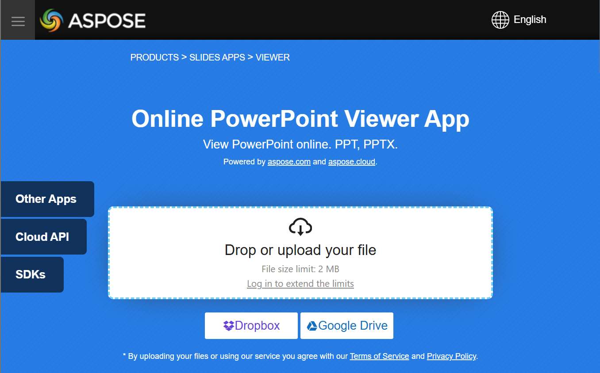

## **Overview**

Aspose.Slides for Python is used to create presentation files with slides. These slides can be viewed by opening the presentations in Microsoft PowerPoint, for example. However, developers may sometimes need to view slides as images in their preferred image viewer or use them in a custom presentation viewer. In such cases, Aspose.Slides allows you to export individual slides as images. This article explains how to do that.

## **Generate an SVG Image from a Slide**

To generate an SVG image from a presentation slide with Aspose.Slides, follow the steps below:

1. Create an instance of the [Presentation](https://reference.aspose.com/slides/python-net/aspose.slides/presentation/) class.
1. Get a reference to the slide by its index.
1. Open a file stream.
1. Save the slide as an SVG image to the file stream.

```py
import aspose.slides as slides

slide_index = 0

with slides.Presentation("sample.pptx") as presentation:
    slide = presentation.slides[slide_index]

    with open("output.svg", "wb") as svg_stream:
        slide.write_as_svg(svg_stream)
```

## **Create a Slide Thumbnail Image**

Aspose.Slides helps you generate thumbnail images of slides. To generate a thumbnail of a slide using Aspose.Slides, follow the steps below:

1. Create an instance of the [Presentation](https://reference.aspose.com/slides/python-net/aspose.slides/presentation/) class.
1. Get a reference to the slide by its index.
1. Create a thumbnail image of the referenced slide at the desired scale.
1. Save the thumbnail image in your preferred image format.

```py
import aspose.slides as slides

slide_index = 0
scale_x = 1
scale_y = scale_x

with slides.Presentation("sample.pptx") as presentation:
    slide = presentation.slides[slide_index]

    with slide.get_image(scale_x, scale_y) as image:
        image.save("output.jpg", slides.ImageFormat.JPEG)
```

## **Create a Slide Thumbnail with User Defined Dimensions**

To create a slide thumbnail image with user-defined dimensions, follow the steps below:

1. Create an instance of the [Presentation](https://reference.aspose.com/slides/python-net/aspose.slides/presentation/) class.
1. Get a reference to the slide by its index.
1. Generate a thumbnail image of the referenced slide with the specified dimensions.
1. Save the thumbnail image in your preferred image format.

```py
import aspose.slides as slides
import aspose.pydrawing as pydrawing

slide_index = 0
slide_size = pydrawing.Size(1200, 800)

with slides.Presentation("sample.pptx") as presentation:
    slide = presentation.slides[slide_index]

    with slide.get_image(slide_size) as image:
        image.save("output.jpg", slides.ImageFormat.JPEG)
```

## **Create a Slide Thumbnail with Speaker Notes**

To generate a thumbnail of a slide with speaker notes using Aspose.Slides, follow the steps below:

1. Create an instance of the [RenderingOptions](https://reference.aspose.com/slides/python-net/aspose.slides.export/renderingoptions/) class.
1. Use the `RenderingOptions.slides_layout_options` property to set the position of the speaker notes.
1. Create an instance of the [Presentation](https://reference.aspose.com/slides/python-net/aspose.slides/presentation/) class.
1. Get a reference to the slide by its index.
1. Generate a thumbnail image of the referenced slide using the rendering options.
1. Save the thumbnail image in your preferred image format.

```py
slide_index = 0

layout_options = slides.export.NotesCommentsLayoutingOptions()
layout_options.notes_position = slides.export.NotesPositions.BOTTOM_TRUNCATED

rendering_options = slides.export.RenderingOptions()
rendering_options.slides_layout_options = layout_options

with slides.Presentation("sample.pptx") as presentation:
    slide = presentation.slides[slide_index]

    with slide.get_image(rendering_options) as image:
        image.save("output.png", slides.ImageFormat.PNG)
```

## **Live Example**

Try [**Aspose.Slides Viewer**](https://products.aspose.app/slides/viewer/) free app to see what you can implement with Aspose.Slides API:

[](https://products.aspose.app/slides/viewer/)

## **FAQ**

**Can I embed a presentation viewer in an ASP.NET web application?**

Yes. You can use Aspose.Slides on the server side to render slides as [images](/slides/python-net/convert-powerpoint-to-png/) or [HTML](/slides/python-net/convert-powerpoint-to-html/) and display them in the browser. Navigation and zoom features can be implemented with JavaScript for an interactive experience.

**What is the best way to display slides inside a custom .NET viewer?**

The recommended approach is to render each slide as an [image](/slides/python-net/convert-powerpoint-to-png/) (e.g., PNG or SVG) or convert it to [HTML](/slides/python-net/convert-powerpoint-to-html/) using Aspose.Slides, then display the output inside a picture box (for desktop) or HTML container (for web).

**How do I handle large presentations with many slides?**

For large decks, consider lazy-loading or on-demand rendering of slides. This means generating a slide’s content only when the user navigates to it, reducing memory and load time.
