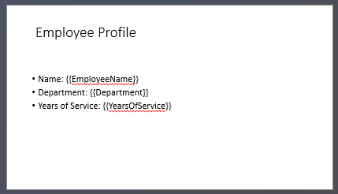
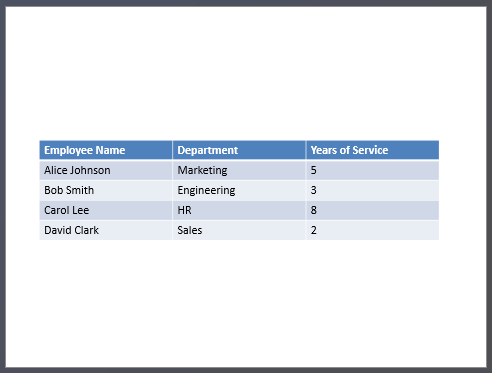

## **Introduction**

PowerPoint presentations are a powerful way to display and communicate information. They are often used in conjunction with Excel workbooks, where Excel serves as an excellent source of structured data and PowerPoint excels at visualizing that data for an audience.

There are many practical scenarios where combining Excel and PowerPoint is essential: mail merges, populating data tables, generating one slide per data record (batch slide generation), creating training materials, and consolidating multiple Excel reports into a single presentation, to name a few.

Until now, implementing such features with the Aspose.Slides API required relying on third-party solutions like Aspose.Cells. While these tools are robust, they can be overly complex and costly for users who only need basic data integration functionality.

## **How It Works**

To make working with Excel data easier and more streamlined, Aspose.Slides has introduced a new class for reading data from Excel workbooks. This feature opens up powerful new possibilities for API users who want to leverage Excel as a data source within their presentation workflows.

The new functionality is designed for general-purpose data access and is not integrated into the Presentation Document Object Model (DOM). That means *it does not allow editing or saving Excel files* — its sole purpose is to open workbooks and navigate through their content to retrieve cell data.

At the core of this feature is the new [ExcelDataWorkbook](https://reference.aspose.com/slides/python-net/aspose.slides.excel/exceldataworkbook/) class. This class allows you to load an Excel workbook from a local file or a stream. Once loaded, it provides several overloads of the [get_cell](https://reference.aspose.com/slides/python-net/aspose.slides.excel/exceldataworkbook/get_cell/) method, which you can use to retrieve specific cells by their position (e.g., row and column indices or named ranges).

Each call to [get_cell](https://reference.aspose.com/slides/python-net/aspose.slides.excel/exceldataworkbook/get_cell/) returns an instance of the [ExcelDataCell](https://reference.aspose.com/slides/python-net/aspose.slides.excel/exceldatacell/) class. This object represents a single cell in the Excel workbook and gives you access to its value in a simple and intuitive way.

In short, it's a lightweight and straightforward API for reading Excel data — exactly what many developers need without the overhead of a full spreadsheet processing library.

## **Let's Code**

### **Example 1**

In the following example, we'll implement a simple Mail Merge scenario by generating multiple presentations based on data stored in an Excel workbook.

To get started, we need two things:
1. An Excel workbook containing the data


2.  PowerPoint presentation template



```py
import aspose.slides as slides

# Load the Excel workbook with employee data.
workbook = slides.excel.ExcelDataWorkbook("TemplateData.xlsx")
worksheet_index = 0

# Load the presentation template.
with slides.Presentation("PresentationTemplate.pptx") as template_presentation:

    # Loop through Excel rows (excluding header at row 0).
    for row_index in range(1, 5):

        # Create a new presentation for each employee record.
        with slides.Presentation() as employee_presentation:

            # Remove the default blank slide.
            employee_presentation.slides.remove_at(0)

            # Clone the template slide into the new presentation.
            slide = employee_presentation.slides.add_clone(template_presentation.slides[0])

            # Get paragraphs from the target shape (assumes shape index 1 is used).
            paragraphs = slide.shapes[1].text_frame.paragraphs

            # Replace the placeholders with data from Excel.
            employee_name = workbook.get_cell(worksheet_index, row_index, 0).value
            name_portion = paragraphs[0].portions[0]
            name_portion.text = name_portion.text.replace("{{EmployeeName}}", employee_name)

            department = workbook.get_cell(worksheet_index, row_index, 1).value
            department_portion = paragraphs[1].portions[0]
            department_portion.text = department_portion.text.replace("{{Department}}", department)

            years_of_service = str(workbook.get_cell(worksheet_index, row_index, 2).value)
            years_portion = paragraphs[2].portions[0]
            years_portion.text = years_portion.text.replace("{{YearsOfService}}", years_of_service)

            # Save the personalized presentation to a separate file.
            employee_presentation.save(f"{employee_name} Report.pptx", slides.export.SaveFormat.PPTX)
```


### **Example 2**

In the second example, we simply copy data from an Excel table and display it on a PowerPoint slide in a more visually appealing format.

In this example, we reuse the same Excel workbook from the first example, which contains a simple employee table.

```py
# Load the Excel workbook containing the employee data.
workbook = slides.excel.ExcelDataWorkbook("TemplateData.xlsx")
worksheet_index = 0

# Create a new PowerPoint presentation.
with slides.Presentation() as presentation:

    # Add a table shape to the first slide.
    table = presentation.slides[0].shapes.add_table(
        50, 200,
        [200, 200, 200],
        [30, 30, 30, 30, 30]
    )

    # Fill the PowerPoint table with data from the Excel workbook.
    for row_index in range(0, 5):
        for column_index in range(0, 3):
            cell_value = str(workbook.get_cell(worksheet_index, row_index, column_index).value)
            table.columns[column_index][row_index].text_frame.text = cell_value

    # Save the resulting presentation to a file.
    presentation.save("Table.pptx", slides.export.SaveFormat.PPTX)
```



## **Summary**

This mechanism, available directly in Aspose.Slides, combines working with Excel data and presentations in one place. It allows you to create slides with visual charts and data presented as Excel tables - without any additional libraries or complex integrations.
