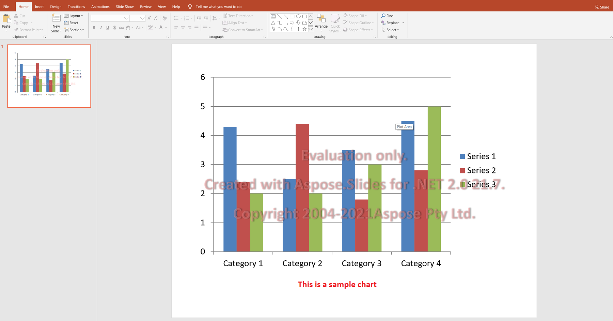

## **Aspose.Slides Evaluation**

You can easily download Aspose.Slides for evaluation. The evaluation package is the same as the purchased package. The evaluation version simply becomes licensed after you add a few lines of code to apply the license. 

The evaluation version of Aspose.Slides (without a license specified) provides full product functionality, but it inserts an evaluation watermark at the top of the document on open and save. You are also limited to one slide when extracting texts from presentation slides.

{} 

If you want to test Aspose.Slides without evaluation version limitations, you can request a **30 Day Temporary License**. Please refer to [How to get a Temporary License?](https://purchase.aspose.com/temporary-license) for more information.

{}

## **FAQ**

**Can I test multiple presentations in parallel across different threads in evaluation mode?**

Yes. You can process different documents in parallel; you should not share the same presentation object [across threads](/slides/python-net/multithreading/). Evaluation mode does not affect this.

**Do I need to install Microsoft PowerPoint to evaluate the library on a server or in CI?**

No. Aspose.Slides is a standalone engine and does not require PowerPoint installed for either evaluation or production.

**Can I fully test conversion of PPT/PPTX to PDF and images in evaluation mode?**

Yes. The [converters](/slides/python-net/convert-presentation/) work; the output will include a watermark.

**Can I use a temporary license for load testing without a watermark?**

Yes. A 30-day temporary license removes evaluation-mode limitations and allows testing without a watermark.
