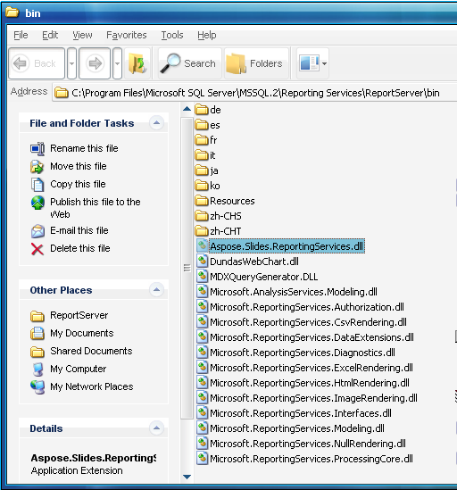

{} 

Aspose.Slides for Reporting Services is a [rendering extension](http://msdn2.microsoft.com/en-us/library/ms154606.aspx) for Microsoft SQL Server Reporting Services. 
Aspose.Slides for Reporting Services is provided as a single MSI installer that can install on the computers running one of the following: 

- Microsoft SQL Server 2005 Reporting Services (32-bit and 64-bit)
- Microsoft SQL Server 2008 Reporting Services (32-bit and 64-bit)

It is also easy to deploy and manage Aspose.Slides for Reporting Services manually, as it is comprised of only one .NET assembly *Aspose.Slides* *.ReportingServices.dll* , written completely in C#, CLS compliant and containing only safe managed code. 

{} 

The MSI installer and the ZIP download include Aspose.Slides for ReportingServices: 

- Bin\SSRS2005\Aspose.Slides.ReportingServices.dll – built for Microsoft SQL Server 2005 and .NET Framework 2.0 (use for x86 and x64)
- Bin\SSRS2008\Aspose.Slides.ReportingServices.dll – built for Microsoft SQL Server 2008 and .NET Framework 2.0 (use for x86 and x64)

When installing, Aspose.Slides.ReportingServices.dll is copied to the ReportServer\bin directory and the configuration file is updated so Reporting Services is aware of the new rendering extension. These steps are performed by the Aspose.Slides for Reporting Services installer, but you could also perform them manually as described further in this documentation. 

**Figure**: Aspose.Slides.ReportingServices.dll is copied into the **ReportServer\bin** directory.
