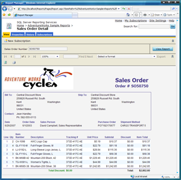
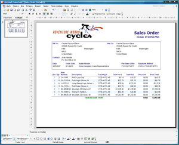
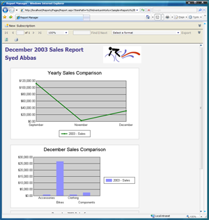
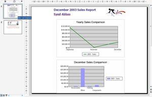

{} 

Aspose.Slides for Reporting Services exports reports as Microsoft PowerPoint presentations in such a way that they appear identical to reports exported by the built-in renderers of Microsoft SQL Server Reporting Services. 

{} 

|**HTML, exported by Microsoft SQL Server Reporting Services built-in renderer** |**PPT, exported by Aspose.Slides for Reporting Services** |
| :- | :- |
|||
|**HTML, exported by Microsoft SQL Server Reporting Services built-in renderer** |**PPT, exported by Aspose.Slides for Reporting Services** |
|||

