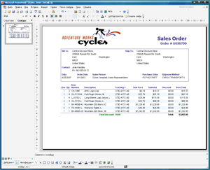

{} 

Microsoft SQL Server Reporting Services does not have built-in abilities to export reports as Microsoft PowerPoint presentations, but after installing Aspose.Slides for Reporting Services on your server, you will get access to two additional export formats: 

- Microsoft PowerPoint Presentation (PPT)
- Microsoft PowerPoint SlideShow (PPS)
- Microsoft PowerPoint 2007 Presentation (PPTX)
- Microsoft PowerPoint 2007 SlideShow (PPSX)

{} 

To create documents in these formats, Aspose.Slides for Reporting Services relies on a built-in version of [Aspose.Slides for .NET](http://www.aspose.com/Products/Aspose.Slides/), the market leading presentation-processing component from Aspose. Microsoft PowerPoint is not used to generate the documents. 

PPT and PPS copies of the same report will appear identical to each other, thanks to the high degree of support for the underlying file formats, provided by Aspose.Slides. 

**Figure**: A sample report exported as a Microsoft PowerPoint (PPT) Presentation
