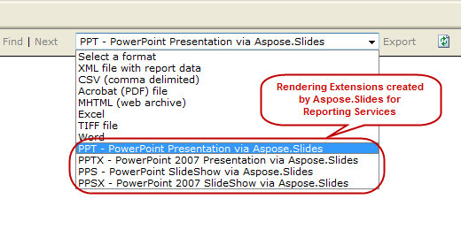
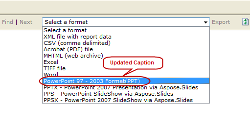

{} 

This article shows you how to customize Aspose.Slides for Reporting Services rendering options captions. 

{} 
## **Example**
When installing Aspose.Slides for Reporting Services, 4 additional export options are added in the drop-down menu of the export options:


## **How to modify the captions text**
The default captions of these extensions can be changed by overriding the default names. These steps show you how to change the caption from “ **PPT – PowerPoint** **Presentation via** **Aspose.Slides** ” to “ **PowerPoint 97 – 2003 format(PPT)** ”. 

**Step 1:** Locate the **rsreportserver.config** file that is usually in this directory: 

**OS Root Drive\Program Files\Microsoft SQL Server\MSRS10.MSSQLSERVER\Reporting Services\ReportServer** 

**Step** **2:** Find these lines in rsreportserver.config file: 

``` xml

 <Extension Name="ASPPT" Type="Aspose.Slides.ReportingServices.PptRenderer,Aspose.Slides.ReportingServices"/>


```

**Step** **3:** Replace the extension parameter with this: 

**<Extension Name="ASPPT" Type="Aspose.Slides.ReportingServices.PptRenderer,Aspose.Slides.ReportingServices">**

``` xml

         <OverrideNames>

          <Name Language="en-US">PowerPoint 97 - 2003 Format(PPT)</Name>

        </OverrideNames>

</Extension>


```

The export options will now appear like this: 


