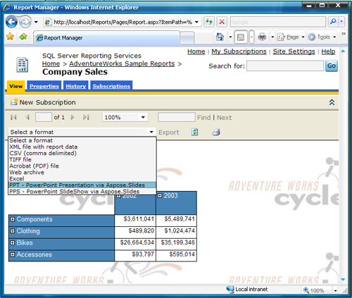
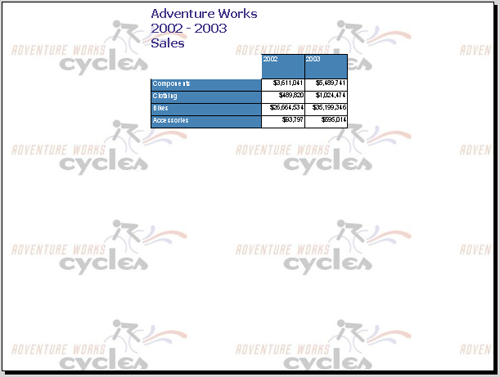

{} 

Follow these steps only if plan to install Aspose.Slides for Reporting Services manually. In this case, you downloaded the ZIP package containing assembly files. 

{} 

{} 

**Aspose.Slides for Reporting Services** requires the installation of **.NET Framework 3.5** on the host machine. 

{}

### **Manual Installation**
These instructions show you how to copy and modify files in the directory where Microsoft SQL Server Reporting Services is installed:

1. Locate the Report Server installation directory.
   The root directory for Microsoft SQL Server is usually here: ***C:\Program Files\Microsoft SQL Server***
   
   {} 
   
   **Microsoft SQL Server 2005 and 2008**: There might be several Microsoft SQL Server instances configured on the machine and they may occupy different MSSQL.x subdirectories such as MSSQL.1, MSSQL.2 and so on. You must find the correct ***C:\Program Files\Microsoft SQL Server\MSSQL.x\Reporting Services\ReportServer*** directory before you continue to the next step.
   
   {} All paths used below will refer to this directory as <Instance>. 

2. Copy Aspose.Slides.ReportingServices.dll to the **C:\Program Files\Microsoft SQL Server\xxx\Reporting Services\ReportServer\bin** folder.
   The **Aspose.Slides.ReportingServices.zip** download contains the **Aspose.Slides.ReportingServices.dll**. {} 

In some cases, when you copy the DLL to the **ReportServer\bin** directory, it might get copied alongside the explicit NTFS file permissions assigned to it. The NTFS permissions cause Microsoft SQL Server Reporting Services to get denied access when loading **Aspose.Slides.ReportingServices.dll**. If this happens, the new export formats will not become available. Check and confirm that the correct NTFS permissions are in place :

   1. Right-click **Aspose.Slides.ReportingServices.dll**.
   1. Click **Properties** and select the **Security** tab.
   1. Remove any explicitly assigned NTFS permissions and leave only inherited permissions.

{}

3. Register Aspose.Slides for Reporting Services as a rendering extension: 
   1. Open *C:\Program
      Files\Microsoft SQL Server\<Instance>\Reporting Services\ReportServer\rsreportserver.config*.
   1. Add these lines to the <Render> element: 

**<Render>**

``` xml

   ...

  <!--Start here.-->

  <Extension Name="ASPPT" Type="Aspose.Slides.ReportingServices.PptRenderer,Aspose.Slides.ReportingServices"/>

  <Extension Name="ASPPS" Type="Aspose.Slides.ReportingServices.PpsRenderer,Aspose.Slides.ReportingServices"/>

  <Extension Name="ASPPTX" Type="Aspose.Slides.ReportingServices.PptxRenderer,Aspose.Slides.ReportingServices"/>

  <Extension Name="ASPPSX" Type="Aspose.Slides.ReportingServices.PpsxRenderer,Aspose.Slides.ReportingServices"/>

  <!--End here.-->

</Render>


```

4. Give Aspose.Slides for Reporting Services permissions to execute: 
   1. Open **C:\Program Files\Microsoft SQL Server\<Instance>\Reporting Services\ReportServer\rssrvpolicy.config**.
   1. Add the following as the last item in the second to outer <CodeGroup> element (which should be <CodeGroup class="FirstMatchCodeGroup" version="1" PermissionSetName="Execution" Description="This code group grants MyComputer code Execution permission. ">). 

**<CodeGroup>**

``` xml


...

  <CodeGroup>

    ...

    <!--Start here.-->

    <CodeGroup

        class="UnionCodeGroup"

        version="1"

        PermissionSetName="FullTrust"

        Name="Aspose.Slides_for_Reporting_Services"

        Description="This code group grants full trust to the AS4SSRS assembly.">

        <IMembershipCondition

            class="StrongNameMembershipCondition"

            version="1"

            PublicKeyBlob="00240000048000009400000006020000002400005253413100040000010001005542e

            99cecd28842dad186257b2c7b6ae9b5947e51e0b17b4ac6d8cecd3e01c4d20658c5e4ea1b9a6c8f854b2

            d796c4fde740dac65e834167758cff283eed1be5c9a812022b015a902e0b97d4e95569eb8c0971834744

            e633d9cb4c4a6d8eda03c12f486e13a1a0cb1aa101ad94943236384cbbf5c679944b994de9546e493bf" />

    </CodeGroup>

    <!--End here.-->

  </CodeGroup>

</CodeGroup>


```

5. Verify that Aspose.Slides for Reporting Services was installed successfully: 
   1. Open Report Manager and check the list of available export types for a report. 
   
      {} You can launch Report Manager by opening a browser (Microsoft Internet Explorer 6.0 or later) and typing the Report Manager URL in the address bar (by default it is http://< ComputerName >/Reports ). 
   
      {}

1. Select a report on the server.
1. Open the **Select Format** list.
   You should see a list of export formats provided by Aspose.Slides for Reporting Services. 
1. Select **PPT – PowerPoint Presentation via Aspose.Slides**. 

   **Aspose.Slides for Reporting Services installed successfully and new export formats are available.** 




6. Click the **Export** link.
   The report is generated in the chosen format, sent to the client, and then opened in an appropriate application. In our case, the report was opened in Microsoft PowerPoint. 

   **A PPT report generated by Aspose.Slides for Reporting Services.** 



You have successfully installed Aspose.Slides for Reporting Services and generated a report as a Microsoft PowerPoint presentation ! 

