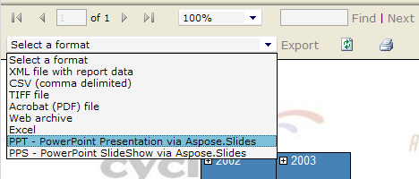
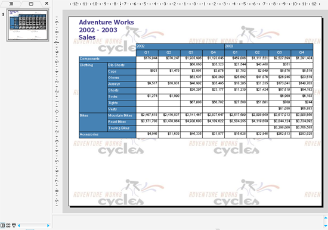

{} 

### **Welcome to the Aspose.Slides for Reporting Services documentation!**
Aspose.Slides for Reporting Services is the only solution on the market that makes it possible to generate true PPT and PPS reports in Microsoft SQL Server 2005, 2008, 2012, 2016 and 2017 Reporting Services (32-bit and 64-bit). All RDL report features, including tables, matrices, charts and images are converted with the highest degree of precision to Microsoft PowerPoint presentations.

{} 
### **Product Overview**
Microsoft SQL Server Reporting Services does not have built-in abilities to export reports as Microsoft PowerPoint presentations, but after installing Aspose.Slides for Reporting Services on your server, you get access to additional export formats:

- PPT - PowerPoint Presentation via Aspose.Slides
- PPS - PowerPoint SlideShow via Aspose.Slides
- PPTX - PowerPoint 2007 Presentation via Aspose.Slides
- PPSX - PowerPoint 2007 SlideShow via Aspose.Slides

Aspose.Slides for Reporting Services creates presentations on the server without using Microsoft PowerPoint. Aspose.Slides for Reporting Services internally uses Aspose.Slides for .NET – the world-class component for server-side presentations processing.

**Aspose.Slides for Reporting Services makes it possible to export any report in PPT, PPS, PPTX or PPSX format.** 

**Aspose.Slides for Reporting Services exported a report as a PPT file.** 

