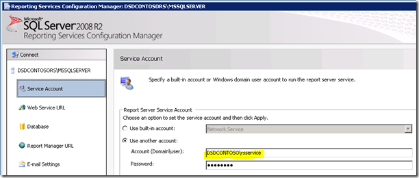
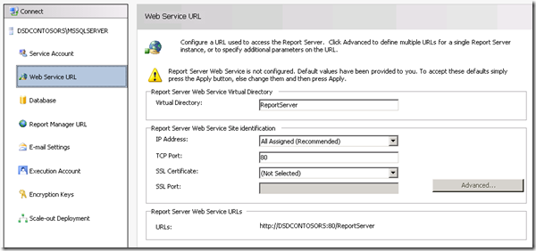
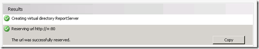
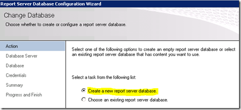
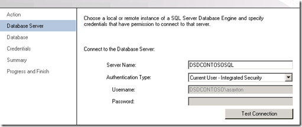
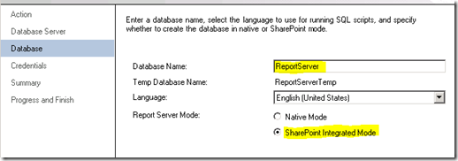
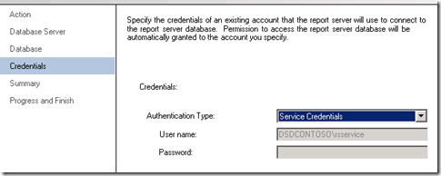
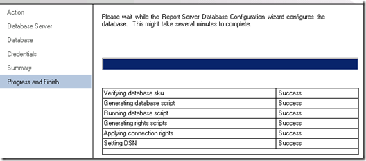
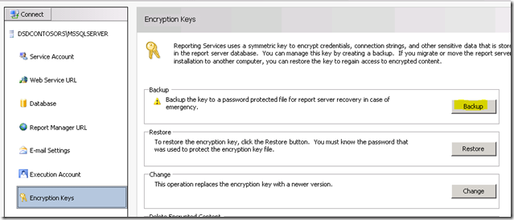
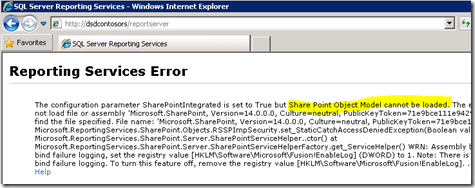

{} 

Our first stop on the RS Server is the Reporting Services Configuration Manager. 

{} 
## **Service Account**
Be sure to understand what service account you are using for Reporting Services. If we run into issues, it may be related to the service account you are using. The default is Network Service. Whenever I deploy new builds, I always use Domain Accounts, because that is where I am likely to hit issues. For this configuration on my server, I have used a Domain Account called **RSService**. 
## **Web Service URL**
We will need to configure the Web Service URL. This is the **ReportServer** virtual directory (vdir) that hosts the Web Services Reporting Services uses, and what SharePoint will communicate with. Unless you want to customize the properties of the vdir (i.e. SSL, ports, host headers, etc…), you should just be able to click Apply here and be good to go. 

**Figure 3**: Setting up Web Service URL 

When that is done you should see the following figure. 

**Figure 4**: Successful set up of Web Service URL 
## **Database**
We need to create the Reporting Services Catalog Database. This can be placed on any SQL 2008 or SQL 2008 R2 Database Engine. SQL11 would work ok as well, but that is still in BETA. This action will create two databases, **ReportServer** and **ReportServerTempDB** , by default. 
The other important step with this is to make sure that you choose SharePoint Integrated for the database type. Once this choice is made, it cannot be changed. Please observe the Figures 5, 6 and 7 for reference. 

**Figure 5**: Creating Report Server Database 

**Figure 6**: Setting up Database Server and Authentication Type 

**Figure 7**: Setting up Database Name and Mode 

For the credentials, this is how the Report Server will communicate with the SQL Server. Whatever account you select, will be given certain rights within the Catalog database as well as a few of the system databases via the RSExecRole. MSDB is one of these databases for Subscription usage as we make use of SQL Agent. 

**Figure 8**: Setting up Report Server Database Credentials 

Once that is done, it should look like the following figure. 

**Figure 9**: Progress to Finish the Report Server Database setup 
## **Report Manager URL**
We can skip the Report Manager URL, as it is not used when we are in SharePoint Integrated mode. SharePoint is our frontend. Report Manager does not work. 
## **Encryption Keys**
Backup your Encryption Keys and make sure you know where you keep them. If you get into a situation where you need to migrate the Database or restore it, you will need these. 

That is it for the Reporting Services Configuration Manager. If you browse to the URL on the Web Service URL tab, it should show something similar to the following figure. 

**Figure 12**: Report Server access after installation 

What happened? SharePoint is installed on my WFE and I finished setting up Reporting Services. In this example, Reporting Services and SharePoint are on different machines. Had they been on the same machine, you wouldn't have seen this error. We technically need to install SharePoint on the RS Box. That means IIS will be enabled as well. 
