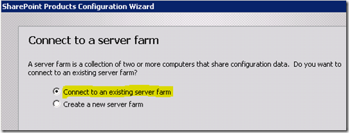
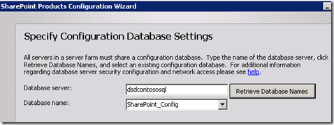
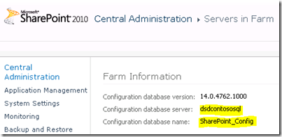
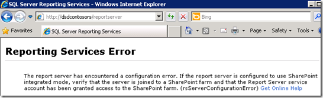

{} 

So, we need to do what we did for the SharePoint WFE. First thing is to go through the prerequisites installation and after that startup the SharePoint setup. 

For the setup, we choose Server Farm and a complete install to match my SharePoint Box, as we do not want a standalone install for SharePoint. 

{} 
### **SharePoint Configuration**
In the SharePoint Configuration Wizard, we want to connect to an existing farm. 

**Figure 13**: SharePoint Configuration Wizard 

We will then point it to the **SharePoint_Config** database that our farm is using. If you do not know where this is, you can find out through Central Admin through **System Settings -> Manager Servers in this farm.** 

**Figure 14**: SharePoint Configuration Wizard 

**Figure 15**: SharePoint Configuration Wizard 

Once the wizard is done, that is all we need to do on the Report Server Box for now. Going back to the ReportServer URL, we will see another error, but that is because we have not configured it through Central Administrator. 

**Figure 16**: Report Server Error
