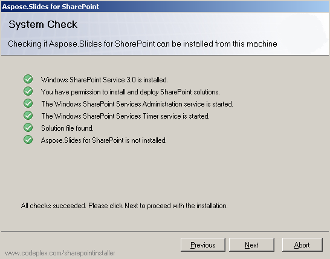
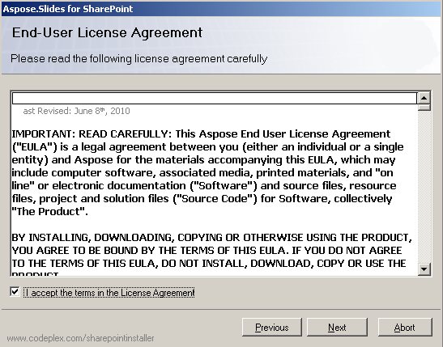
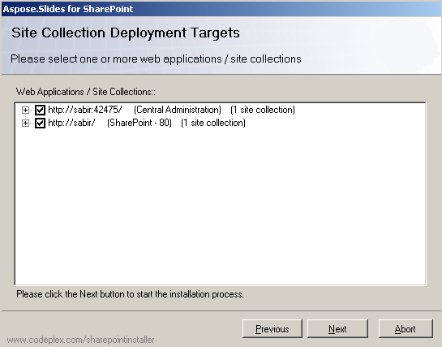
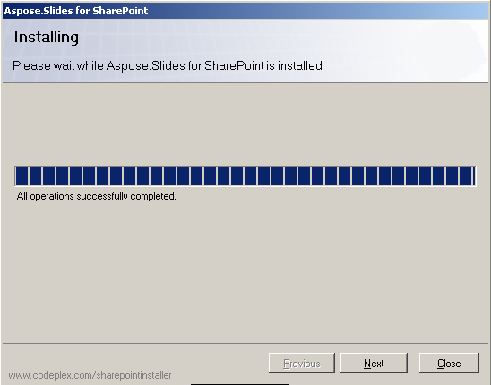
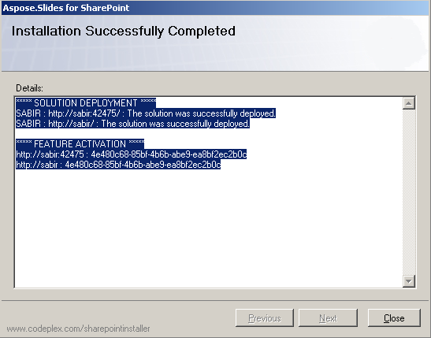

{} 

Aspose.Slides for SharePoint is downloaded as the Aspose.Slides.SharePoint.zip archive. The archive contains: 

- **Aspose.Slides.SharePoint.wsp**: SharePoint solution file. Aspose.Slides for SharePoint is packaged as a SharePoint solution to facilitate activation and deactivation across the server farm.
- **Aspose_LicenseAgreement.rtf**: The end user license agreement.
- **Setup.exe**: The setup program.
- **Setup.exe.config**: The setup configuration file.

{} 
## **Installation Process**
Before running the installation, the setup program checks that:

- WSS 3.0 or MOSS 2007 is installed.
- The user has permission to install SharePoint solutions.
- SharePoint database is online.
- WSS Administration Service is started.
- WSS Timer service is started.

The WSS Administration and Timer services are needed because some setup actions rely on a timer job to propagate to all servers in the server farm. 
### **Running the Installation**
To install Aspose.Slides for SharePoint: 

1. Unpack Aspose.Slides.SharePoint zip to the local drive on the MOSS 7.0 or WSS 3.0 Server.
2. Run setup.exe and follow the instructions on the screen.
   The setup program performs the following actions: 
   1. Checks the installation prerequisites. Setup will not continue if any check fails. 

      **Running a systems check** 

3. Displays the End User License Agreement. You must accept the agreement to proceed. 

   **The EULA** 

4. Displays deployment target selection. Selects the web applications and site collections that the feature should be activated for. 

   **Selecting deployment targets** 

5. Deploys the feature to server farm. 

   **The installation progress bar** 

6. Activates Aspose.Slides for the selected site collections and configures their parent web applications.
7. Displays a list of web applications and site collections that the feature has been deployed and activated for. 

   **Successful installation** 

