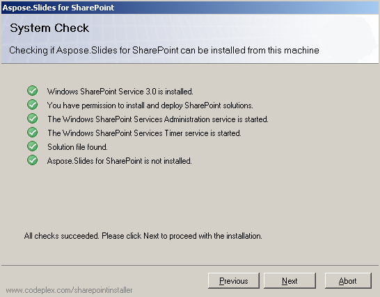

## **Package Contents**

Aspose.Slides for SharePoint is downloaded from the [download page](https://releases.aspose.com/slides/sharepoint/) as a ZIP archive. The archive holds one SharePoint solution package (WSP) and one setup program for each supported SharePoint version:

| SharePoint version | Setup program | Solution package |
| :- | :- | :- |
| SharePoint 2007 | Setup2007.exe | Aspose.Slides.SharePoint2007.wsp |
| SharePoint 2010 | Setup2010.exe | Aspose.Slides.SharePoint2010.wsp |
| SharePoint Server 2013 | Setup2013.exe | Aspose.Slides.SharePoint2013.wsp |
| SharePoint Server 2016 | Setup2016.exe | Aspose.Slides.SharePoint2016.wsp |
| SharePoint Server 2019 | Setup2019.exe | Aspose.Slides.SharePoint2019.wsp |

Each setup program has a configuration file next to it (for example, *Setup2019.exe.config*) that names the solution package it installs. The *License* folder holds a link to the end-user license agreement and the third-party license notices.

Aspose.Slides for SharePoint is packaged as a SharePoint solution, which SharePoint deploys across the server farm. Its feature is then activated or deactivated per site collection.

## **Installation Process**

Before installing, the setup program runs a system check. It verifies that:

- SharePoint is installed on the server.
- The current user has permission to install and deploy SharePoint solutions.
- The SharePoint Administration service is started.
- The SharePoint Timer service is started.
- The solution package named in the configuration file is present.

The Administration and Timer services are needed because some setup actions run as timer jobs that propagate the solution to all servers in the farm.

### **Running the Installation**

To install Aspose.Slides for SharePoint:

1. Unpack the ZIP archive to a local drive on a server in the SharePoint farm.
2. Run the setup program that matches your SharePoint version (see the table above) and follow the instructions on the screen. The setup program:
   1. Runs the system check. Setup does not continue if any check fails.

      **Running a system check**

      

   2. Displays the end-user license agreement. You must accept it to continue.

      **The license agreement**

      

   3. Displays the deployment targets. Select the web applications and site collections to activate the feature for.

      **Selecting deployment targets**

      

   4. Deploys the solution to the farm.

      **The installation progress**

      

   5. Activates Aspose.Slides for SharePoint on the selected site collections.
   6. Lists the web applications and site collections where the solution has been deployed and activated.

      **Successful installation**

      

{}
The screenshots were taken on SharePoint 2007. The setup programs for later versions go through the same screens.
{}

If the same version of Aspose.Slides for SharePoint is already installed, the setup program offers to repair or remove it. If another version is installed, it offers to upgrade or remove it.

After installation, a **Convert via Aspose.Slides** item appears in the menu of files in document libraries of the selected site collections (on SharePoint 2007, **Convert with Aspose.Slides**). To convert a first presentation, see [Converting Microsoft PowerPoint Documents into Other Formats](/slides/sharepoint/converting-microsoft-powerpoint-documents-into-other-formats/). What the solution adds to the farm is described in [Deployment and Activation](/slides/sharepoint/deployment-and-activation/).

## **FAQ**

**Which setup program do I run?**

The one whose name matches your SharePoint version. For example, run *Setup2016.exe* on a SharePoint Server 2016 farm. Each setup program installs only its own solution package.

**Do I need a separate download for the licensed version?**

No. The same package works in evaluation mode until you install the license solution; see [Installing Aspose.Slides for SharePoint License](/slides/sharepoint/installing-aspose-slides-for-sharepoint-license/).

**How do I remove the product?**

Run the same setup program again and select **Remove**; see [Uninstalling Aspose.Slides for SharePoint](/slides/sharepoint/uninstalling-aspose-slides-for-sharepoint/).
