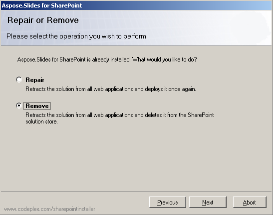

To uninstall Aspose.Slides for SharePoint: 

1. Run the setup program.
   If Aspose.Slides for SharePoint is already installed, the setup program suggests removing or repairing it. 
1. Select **Remove** to uninstall the Aspose.Slides for SharePoint.

**Uninstalling Aspose.Slides for SharePoint** 

