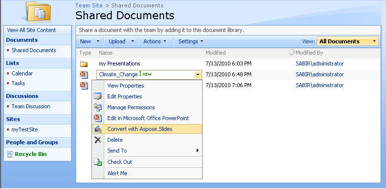

{} 

**Welcome to Aspose.Slides for SharePoint!**

Aspose.Slides for SharePoint is a flexible solution that makes it possible to convert PowerPoint® documents within Microsoft SharePoint Sites.

{} 
### **Product Overview**
Aspose.Slides for SharePoint supports a number of PowerPoint document formats:

- PPT – Microsoft PowerPoint presentation 97 - 2003
- PPS – Microsoft PowerPoint slideShow 97 - 2003
- POT – Microsoft PowerPoint Template 97 - 2003
- PPTX – Office Open XML presentation
- PPSX – Office Open XML slideShow
- POTX – Office Open XML template

Aspose.Slides for SharePoint is designed to be work with the following products:

- Windows SharePoint Services 3.0 (WSS)
- Microsoft Office SharePoint Server 2007 (MOSS) Standard
- Microsoft Office SharePoint Server 2007 (MOSS) Enterprise
- Microsoft Office SharePoint Server 2013
- Microsoft Office SharePoint Server 2019

There are no other system requirements besides ones, which exist for the products above.

**Use Aspose.Slides for SharePoint to convert documents from SharePoint's document library** 

