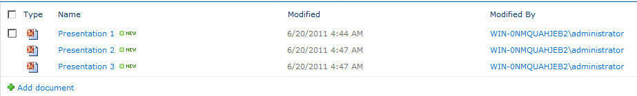

A library is a content structure that contains files. A library may contain only one type of file or many different types, including documents, spreadsheets and presentations. A SharePoint library creates a single location where people can upload and access documents. Documents are stored in binary format in the SQL Server database used by the SharePoint site. The documents are available to other SharePoint users as a list of hyperlinks. 

**A SharePoint document library** 

