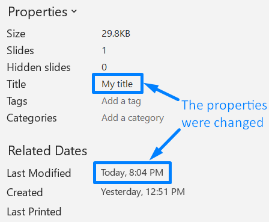

## **بررسی کلی**

این مقاله نشان می‌دهد چگونه اطلاعات ارائه را در Aspose.Slides بررسی کنید. روش تعیین فرمت فعلی یک ارائه را بدون بارگذاری کامل فایل، خواندن ویژگی‌های سند آن و به‌روزرسانی این ویژگی‌ها در صورت نیاز توضیح می‌دهد.

مثال‌ها بر پایهٔ APIهای [PresentationInfo](https://reference.aspose.com/slides/fa/androidjava/com.aspose.slides/presentationinfo/) و [DocumentProperties](https://reference.aspose.com/slides/fa/androidjava/com.aspose.slides/documentproperties/) هستند و عملیات معمول برای کار با فراداده‌های ارائه را نشان می‌دهند.

## **بررسی فرمت ارائه**

قبل از کار بر روی یک ارائه، ممکن است بخواهید فرمت فعلی ارائه (PPT، PPTX، ODP و دیگران) را مشخص کنید.

می‌توانید فرمت ارائه را بدون بارگذاری آن بررسی کنید. کد Java زیر را ببینید:

```java
IPresentationInfo info = PresentationFactory.getInstance().getPresentationInfo("pres.pptx");
System.out.println(info.getLoadFormat()); // PPTX

IPresentationInfo info2 = PresentationFactory.getInstance().getPresentationInfo("pres.ppt");
System.out.println(info2.getLoadFormat()); // PPT

IPresentationInfo info3 = PresentationFactory.getInstance().getPresentationInfo("pres.odp");
System.out.println(info3.getLoadFormat()); // ODP
```

## **دریافت ویژگی‌های ارائه**

این کد Java نشان می‌دهد چگونه ویژگی‌های ارائه (اطلاعات دربارهٔ ارائه) را دریافت کنید:

```java
IPresentationInfo info = PresentationFactory.getInstance().getPresentationInfo("pres.pptx");
IDocumentProperties props = info.readDocumentProperties();
System.out.println(props.getCreatedTime());
System.out.println(props.getSubject());
System.out.println(props.getTitle());
// ..
```

ممکن است بخواهید [ویژگی‌های موجود در کلاس DocumentProperties](https://reference.aspose.com/slides/fa/androidjava/com.aspose.slides/documentproperties/#DocumentProperties--) را ببینید.

## **به‌روزرسانی ویژگی‌های ارائه**

Aspose.Slides متد [PresentationInfo.updateDocumentProperties](https://reference.aspose.com/slides/fa/androidjava/com.aspose.slides/PresentationInfo#updateDocumentProperties-com.aspose.slides.IDocumentProperties-) را فراهم می‌کند که امکان اعمال تغییرات بر ویژگی‌های ارائه را می‌دهد.

فرض کنید یک ارائه PowerPoint داریم که ویژگی‌های سند آن در زیر نشان داده شده است.


این مثال کد نشان می‌دهد چگونه برخی از ویژگی‌های ارائه را ویرایش کنید:

```java
String fileName = "sample.pptx";

IPresentationInfo info = PresentationFactory.getInstance().getPresentationInfo(fileName);

IDocumentProperties properties = info.readDocumentProperties();
properties.setTitle("My title");
properties.setLastSavedTime(new Date());

info.updateDocumentProperties(properties);
info.writeBindedPresentation(fileName);
```

نتایج تغییر ویژگی‌های سند در زیر نشان داده شده است.



## **لینک‌های مفید**

برای دریافت اطلاعات بیشتر دربارهٔ یک ارائه و ویژگی‌های امنیتی آن، ممکن است این لینک‌ها مفید باشند:

- [بررسی اینکه آیا یک ارائه رمزگذاری شده است](https://docs.aspose.com/slides/fa/androidjava/password-protected-presentation/#checking-whether-a-presentation-is-encrypted)
- [بررسی اینکه آیا یک ارائه از نوشتن محافظت شده (فقط‑خواندنی) است](https://docs.aspose.com/slides/fa/androidjava/password-protected-presentation/#checking-whether-a-presentation-is-write-protected)
- [بررسی اینکه آیا یک ارائه قبل از بارگذاری رمز عبور دارد](https://docs.aspose.com/slides/fa/androidjava/password-protected-presentation/#checking-whether-a-presentation-is-password-protected-before-loading-it)
- [تأیید رمز عبور استفاده‌شده برای محافظت از ارائه](https://docs.aspose.com/slides/fa/androidjava/password-protected-presentation/#validating-or-confirming-that-a-specific-password-has-been-used-to-protect-a-presentation).

## **سؤالات متداول**

**چگونه می‌توانم بررسی کنم که آیا قلم‌ها جاسازی شده‌اند و کدامیک هستند؟**

به دنبال [اطلاعات قلم‌های جاسازی‌شده](https://reference.aspose.com/slides/fa/androidjava/com.aspose.slides/fontsmanager/#getEmbeddedFonts--) در سطح ارائه بگردید، سپس آن ورودی‌ها را با مجموعهٔ [قلم‌های واقعاً استفاده‌شده در محتوا](https://reference.aspose.com/slides/fa/androidjava/com.aspose.slides/fontsmanager/#getFonts--) مقایسه کنید تا قلم‌های مهم برای رندرینگ را شناسایی کنید.

**چگونه می‌توانم به سرعت تشخیص دهم آیا فایل اسلایدهای مخفی دارد و چه تعداد؟**

از طریق [مجموعه اسلایدها](https://reference.aspose.com/slides/fa/androidjava/com.aspose.slides/slidecollection/) پیمایش کنید و پرچم [قابلیت مشاهده](https://reference.aspose.com/slides/fa/androidjava/com.aspose.slides/slide/#getHidden--) هر اسلاید را بررسی کنید.

**آیا می‌توانم تشخیص دهم که آیا اندازه و جهت سفارشی اسلاید استفاده شده است و آیا با مقادیر پیش‌فرض متفاوت است؟**

بله. [اندازه اسلاید](https://reference.aspose.com/slides/fa/androidjava/com.aspose.slides/presentation/#getSlideSize--) و جهت فعلی را با تنظیمات پیش‌فرض مقایسه کنید؛ این کار به پیش‌بینی رفتار هنگام چاپ و خروجی‌گیری کمک می‌کند.

**آیا راهی سریع برای مشاهده این که آیا نمودارها به منابع داده خارجی ارجاع می‌دهند وجود دارد؟**

بله. تمام [نمودارها](https://reference.aspose.com/slides/fa/androidjava/com.aspose.slides/chart/) را مرور کنید، [منبع داده](https://reference.aspose.com/slides/fa/androidjava/com.aspose.slides/chartdata/#getDataSourceType--) آنها را بررسی کنید و توجه کنید که داده داخلی است یا مبتنی بر لینک، از جمله هر لینک خراب.

**چگونه می‌توانم اسلایدهای «سنگین» که ممکن است رندرینگ یا خروجی PDF را کند کنند ارزیابی کنم؟**

برای هر اسلاید، تعداد اشیاء را شمارش کنید و به دنبال تصاویر بزرگ، شفافیت، سایه‌ها، انیمیشن‌ها و رسانه‌های چندرسانه‌ای باشید؛ سپس یک امتیاز پیچیدگی تقریبی اختصاص دهید تا نقاط بحرانی عملکردی ممکن را نشان دهد.