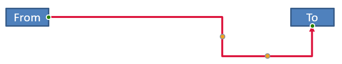

## **مقدمه**

یک اتصال‌گر PowerPoint یک خط ویژه است که دو شکل را به هم متصل یا لینک می‌کند و حتی هنگام جابجا یا تغییر موقعیت آن‌ها در یک اسلاید، به شکل‌ها متصل می‌ماند. 

اتصال‌گرها معمولاً به *نقاط اتصال* (نقطه‌های سبز) متصل می‌شوند که به‌صورت پیش‌فرض بر روی همه شکل‌ها وجود دارند. نقاط اتصال زمانی ظاهر می‌شوند که مکان‌نمای ماوس به آن‌ها نزدیک شود.

*نقاط تنظیم* (نقطه‌های نارنجی) که فقط در برخی اتصال‌گرها وجود دارند، برای تغییر موقعیت و شکل اتصال‌گرها استفاده می‌شوند.

## **انواع اتصال‌گرها**

در PowerPoint می‌توانید از اتصال‌گرهای مستقیم، زانو (زاویه‌دار) و منحنی استفاده کنید. 

Aspose.Slides این اتصال‌گرها را فراهم می‌کند:

| اتصال‌گر | تصویر | تعداد نقاط تنظیم |
| ------------------------------ | ------------------------------------------------------------ | --------------------------- |
| `ShapeType.Line` |  | 0 |
| `ShapeType.StraightConnector1` |  | 0 |
| `ShapeType.BentConnector2` |  | 0 |
| `ShapeType.BentConnector3` |  | 1 |
| `ShapeType.BentConnector4` |  | 2 |
| `ShapeType.BentConnector5` |  | 3 |
| `ShapeType.CurvedConnector2` |  | 0 |
| `ShapeType.CurvedConnector3` |  | 1 |
| `ShapeType.CurvedConnector4` |  | 2 |
| `ShapeType.CurvedConnector5` |  | 3 |

## **اتصال اشکال با استفاده از اتصال‌گرها**

1. یک نمونه از کلاس [Presentation](https://apireference.aspose.com/slides/fa/androidjava/com.aspose.slides/Presentation) ایجاد کنید.
1. مرجع یک اسلاید را بر اساس ایندکس آن دریافت کنید.
1. دو [AutoShape](https://reference.aspose.com/slides/fa/androidjava/com.aspose.slides/AutoShape) به اسلاید اضافه کنید با استفاده از متد `addAutoShape` که توسط شیء `Shapes` در دسترس است.
1. یک اتصال‌گر با استفاده از متد `addConnector` که توسط شیء `Shapes` در دسترس است و نوع اتصال‌گر را تعریف می‌کند، اضافه کنید.
1. با استفاده از اتصال‌گر، اشکال را متصل کنید.
1. متد `reroute` را فراخوانی کنید تا کوتاه‌ترین مسیر اتصال اعمال شود.
1. ارائه (Presentation) را ذخیره کنید. 

این کد Java نشان می‌دهد چطور یک اتصال‌گر (یک اتصال‌گر خمیده) بین دو شکل (یک بیضی و یک مستطیل) اضافه کنید:

```Java
// یک شیء presentation ایجاد می‌کند که فایل PPTX را نمایندگی می‌کند
Presentation pres = new Presentation();
try {
    // دسترسی به مجموعه shapes برای یک اسلاید خاص
    IShapeCollection shapes = pres.getSlides().get_Item(0).getShapes();
    
    // یک شکل خودکار بیضی اضافه می‌کند
    IAutoShape ellipse = shapes.addAutoShape(ShapeType.Ellipse, 0, 100, 100, 100);
    
    // یک شکل خودکار مستطیل اضافه می‌کند
    IAutoShape rectangle = shapes.addAutoShape(ShapeType.Rectangle, 100, 300, 100, 100);
    
    // یک شکل اتصال‌گر به مجموعه اشکال اسلاید اضافه می‌کند
    IConnector connector = shapes.addConnector(ShapeType.BentConnector2, 0, 0, 10, 10);
    
    // اشکال را با استفاده از اتصال‌گر متصل می‌کند
    connector.setStartShapeConnectedTo(ellipse);
    connector.setEndShapeConnectedTo(rectangle);
    
    // متد reroute را فراخوانی می‌کند که مسیر کوتاه‌ترین مسیر خودکار بین اشکال را تنظیم می‌کند
    connector.reroute();
    
    // ارائه را ذخیره می‌کند
    pres.save("output.pptx", SaveFormat.Pptx);
} finally {
    if (pres != null) pres.dispose();
}
```

{} 

متد `Connector.reroute` یک اتصال‌گر را مجدداً مسیر می‌دهد و آن را مجبور می‌کند کوتاه‌ترین مسیر ممکن بین اشکال را بپیماید. برای رسیدن به این هدف، این متد ممکن است نقاط `setStartShapeConnectionSiteIndex` و `setEndShapeConnectionSiteIndex` را تغییر دهد. 

{} 

## **مشخص کردن نقطه اتصال**

اگر می‌خواهید یک اتصال‌گر دو شکل را با استفاده از نقاط خاصی روی شکل‌ها لینک کند، باید نقاط اتصال مورد نظر خود را به این شکل مشخص کنید:

1. یک نمونه از کلاس [Presentation](https://reference.aspose.com/slides/fa/androidjava/com.aspose.slides/Presentation) ایجاد کنید.
1. مرجع یک اسلاید را بر اساس ایندکس آن دریافت کنید.
1. دو [AutoShape](https://reference.aspose.com/slides/fa/androidjava/com.aspose.slides/AutoShape) به اسلاید اضافه کنید با استفاده از متد `addAutoShape` که توسط شیء `Shapes` در دسترس است.
1. یک اتصال‌گر با استفاده از متد `addConnector` که توسط شیء `Shapes` در دسترس است و نوع اتصال‌گر را تعریف می‌کند، اضافه کنید.
1. با استفاده از اتصال‌گر، اشکال را متصل کنید.
1. نقاط اتصال مورد نظر خود را بر روی اشکال تنظیم کنید. 
1. ارائه (Presentation) را ذخیره کنید.

این کد Java یک عملیات را نشان می‌دهد که در آن یک نقطه اتصال مورد نظر مشخص می‌شود:

```java
// یک شیء presentation می‌سازد که نمایانگر یک فایل PPTX است
Presentation pres = new Presentation();
try {
    // دسترسی به مجموعه shapes برای یک اسلاید خاص
    IShapeCollection shapes = pres.getSlides().get_Item(0).getShapes();

    // یک شکل خودکار بیضی اضافه می‌کند
    IAutoShape ellipse = shapes.addAutoShape(ShapeType.Ellipse, 0, 100, 100, 100);

    // یک شکل خودکار مستطیل اضافه می‌کند
    IAutoShape rectangle = shapes.addAutoShape(ShapeType.Rectangle, 100, 300, 100, 100);

    // یک شکل اتصال‌گر به مجموعه اشکال اسلاید اضافه می‌کند
    IConnector connector = shapes.addConnector(ShapeType.BentConnector2, 0, 0, 10, 10);

    // اشکال را با استفاده از اتصال‌گر متصل می‌کند
    connector.setStartShapeConnectedTo(ellipse);
    connector.setEndShapeConnectedTo(rectangle);

    // اندیس نقطه اتصال مورد نظر را روی شکل بیضی تنظیم می‌کند
    int wantedIndex = 6;

    // بررسی می‌کند که آیا اندیس مورد نظر کمتر از حداکثر شمارش سایت‌ها است یا نه
    if (ellipse.getConnectionSiteCount() > wantedIndex) 
    {
        // نقطه اتصال مورد نظر را روی شکل خودکار بیضی تنظیم می‌کند
        connector.setStartShapeConnectionSiteIndex(wantedIndex);
    }

    // ارائه را ذخیره می‌کند
    pres.save("output.pptx", SaveFormat.Pptx);
} finally {
    if (pres != null) pres.dispose();
}
```

## **تنظیم نقطه یک اتصال‌گر**

می‌توانید یک اتصال‌گر موجود را از طریق نقاط تنظیم آن تنظیم کنید. تنها اتصال‌گرهایی که نقاط تنظیم دارند می‌توانند به این روش تغییر کنند. جدول زیر را در بخش **[انواع اتصال‌گرها](/slides/fa/androidjava/connector/#types-of-connectors)** ببینید.

### **مورد ساده**

به مانده‌ای فکر کنید که یک اتصال‌گر بین دو شکل (A و B) از یک شکل سوم (C) عبور می‌کند:


```java
Presentation pres = new Presentation();
try {

    ISlide sld = pres.getSlides().get_Item(0);
    IShape shape = sld.getShapes().addAutoShape(ShapeType.Rectangle, 300, 150, 150, 75);
    IShape shapeFrom = sld.getShapes().addAutoShape(ShapeType.Rectangle, 500, 400, 100, 50);
    IShape shapeTo = sld.getShapes().addAutoShape(ShapeType.Rectangle, 100, 100, 70, 30);

    IConnector connector = sld.getShapes().addConnector(ShapeType.BentConnector5, 20, 20, 400, 300);

    connector.getLineFormat().setEndArrowheadStyle(LineArrowheadStyle.Triangle);
    connector.getLineFormat().getFillFormat().setFillType(FillType.Solid);
    connector.getLineFormat().getFillFormat().getSolidFillColor().setColor(Color.BLACK);

    connector.setStartShapeConnectedTo(shapeFrom);
    connector.setEndShapeConnectedTo(shapeTo);
    connector.setStartShapeConnectionSiteIndex(2);
} finally {
    if (pres != null) pres.dispose();
}
```

برای دوری یا عبور از شکل سوم، می‌توانیم اتصال‌گر را با جابجایی خط عمودی آن به سمت چپ به این شکل تنظیم کنیم:


```java
IAdjustValue adj2 = connector.getAdjustments().get_Item(1);
adj2.setRawValue(adj2.getRawValue() + 10000);
```

### **موارد پیچیده** 

برای انجام تنظیمات پیچیده‌تر، باید موارد زیر را در نظر بگیرید:

* نقطه قابل تنظیم یک اتصال‌گر به‌طور قوی به فرمولی که موقعیت آن را محاسبه و تعیین می‌کند مرتبط است. بنابراین تغییر مکان نقطه ممکن است شکل اتصال‌گر را تغییر دهد.
* نقاط تنظیم یک اتصال‌گر به‌صورت یک ترتیب سفت و سخت در یک آرایه تعریف شده‌اند. نقاط تنظیم از نقطه شروع اتصال‌گر تا نقطه انتهای آن شماره‌گذاری می‌شوند.
* مقدارهای نقاط تنظیم درصدی از عرض/ارتفاع شکل اتصال‌گر را نشان می‌دهند. 
  * شکل توسط نقاط شروع و پایان اتصال‌گر ضرب در 1000 محدود می‌شود. 
  * نقطه اول، نقطه دوم و نقطه سوم به ترتیب درصدی از عرض، درصدی از ارتفاع و دوباره درصدی از عرض را تعریف می‌کنند.
* برای محاسباتی که مختصات نقاط تنظیم یک اتصال‌گر را تعیین می‌کند، باید چرخش اتصال‌گر و بازتاب آن را در نظر بگیرید. **توجه** داشته باشید که زاویه چرخش تمام اتصال‌گرهای نشان‌داده‌شده در بخش **[انواع اتصال‌گرها](/slides/fa/androidjava/connector/#types-of-connectors)** برابر 0 است.

#### **مورد 1**

به موردی فکر کنید که دو شیء قاب متن از طریق یک اتصال‌گر به هم متصل هستند:


```java
// یک شیء presentation ایجاد می‌کند که نمایانگر یک فایل PPTX است
Presentation pres = new Presentation();
try {
    // اسلاید اول در ارائه را دریافت می‌کند
    ISlide sld = pres.getSlides().get_Item(0);
    // اشکالی را اضافه می‌کند که از طریق یک اتصال‌گر به هم پیوسته خواهند شد
    IAutoShape shapeFrom = sld.getShapes().addAutoShape(ShapeType.Rectangle, 100, 100, 60, 25);
    shapeFrom.getTextFrame().setText("From");
    IAutoShape shapeTo = sld.getShapes().addAutoShape(ShapeType.Rectangle, 500, 100, 60, 25);
    shapeTo.getTextFrame().setText("To");
    // یک اتصال‌گر اضافه می‌کند
    IConnector connector = sld.getShapes().addConnector(ShapeType.BentConnector4, 20, 20, 400, 300);
    // جهت اتصال‌گر را مشخص می‌کند
    connector.getLineFormat().setEndArrowheadStyle(LineArrowheadStyle.Triangle);
    // رنگ اتصال‌گر را مشخص می‌کند
    connector.getLineFormat().getFillFormat().setFillType(FillType.Solid);
    connector.getLineFormat().getFillFormat().getSolidFillColor().setColor(Color.RED);
    // ضخامت خط اتصال‌گر را مشخص می‌کند
    connector.getLineFormat().setWidth(3);
    
    // اشکال را با استفاده از اتصال‌گر به هم متصل می‌کند
    connector.setStartShapeConnectedTo(shapeFrom);
    connector.setStartShapeConnectionSiteIndex(3);
    connector.setEndShapeConnectedTo(shapeTo);
    connector.setEndShapeConnectionSiteIndex(2);
    
    // نقاط تنظیم اتصال‌گر را دریافت می‌کند
    IAdjustValue adjValue_0 = connector.getAdjustments().get_Item(0);
    IAdjustValue adjValue_1 = connector.getAdjustments().get_Item(1);

} finally {
    if (pres != null) pres.dispose();
}
```

**تنظیم**

می‌توانیم مقادیر نقاط تنظیم اتصال‌گر را با افزایش درصد عرض و ارتفاع مربوطه به ترتیب 20٪ و 200٪ تغییر دهیم:

```java
// مقادیر نقاط تنظیم را تغییر می‌دهد
adjValue_0.setRawValue(adjValue_0.getRawValue() + 20000);
adjValue_1.setRawValue(adjValue_1.getRawValue() + 200000);
```

نتیجه:



برای تعریف مدلی که بتواند مختصات و شکل بخش‌های منفرد اتصال‌گر را تعیین کند، بیایید یک شکل ایجاد کنیم که به مؤلفه افقی اتصال‌گر در نقطه connector.getAdjustments().get_Item(0) متناظر باشد:

```java
// رسم مؤلفه عمودی اتصال‌گر
float x = connector.getX() + connector.getWidth() * adjValue_0.getRawValue() / 100000;
float y = connector.getY();
float height = connector.getHeight() * adjValue_1.getRawValue() / 100000;
sld.getShapes().addAutoShape( ShapeType .Rectangle, x, y, 0, height);
```

نتیجه:


#### **مورد 2**

در **مورد 1**، عملیات ساده تنظیم اتصال‌گر را با استفاده از اصول پایه نشان دادیم. در شرایط عادی، باید چرخش اتصال‌گر و نمایش آن (که توسط connector.getRotation()، connector.getFrame().getFlipH() و connector.getFrame().getFlipV() تنظیم می‌شود) را در نظر بگیرید. اکنون فرآیند را نشان می‌دهیم.

اولاً، بیایید یک شیء قاب متن جدید (**To 1**) به اسلاید اضافه کنیم (برای اهداف اتصال) و یک اتصال‌گر جدید (سبز) ایجاد کنیم که آن را به اشیائی که قبلاً ساخته‌ایم متصل کند.

```java
// یک شیء بایندینگ جدید ایجاد می‌کند
IAutoShape shapeTo_1 = sld.getShapes().addAutoShape(ShapeType.Rectangle, 100, 400, 60, 25);
shapeTo_1.getTextFrame().setText("To 1");
// یک اتصال‌گر جدید ایجاد می‌کند
connector = sld.getShapes().addConnector(ShapeType.BentConnector4, 20, 20, 400, 300);
connector.getLineFormat().setEndArrowheadStyle(LineArrowheadStyle.Triangle);
connector.getLineFormat().getFillFormat().setFillType(FillType.Solid);
connector.getLineFormat().getFillFormat().getSolidFillColor().setColor(Color.CYAN);
connector.getLineFormat().setWidth(3);
// اشیا را با استفاده از اتصال‌گر جدید ایجاد‌شده متصل می‌کند
connector.setStartShapeConnectedTo(shapeFrom);
connector.setStartShapeConnectionSiteIndex(2);
connector.setEndShapeConnectedTo(shapeTo_1);
connector.setEndShapeConnectionSiteIndex(3);
// نقاط تنظیم اتصال‌گر را دریافت می‌کند
adjValue_0 = connector.getAdjustments().get_Item(0);
adjValue_1 = connector.getAdjustments().get_Item(1);
// مقادیر نقاط تنظیم را تغییر می‌دهد
adjValue_0.setRawValue(adjValue_0.getRawValue() + 20000);
adjValue_1.setRawValue(adjValue_1.getRawValue() + 200000);
```

نتیجه:


دوماً، بیایید یک شکل ایجاد کنیم که به مؤلفه افقی اتصال‌گر که از نقطه تنظیم جدید connector.getAdjustments().get_Item(0) می‌گذرد، متناظر باشد. ما از مقادیر داده‌های اتصال‌گر برای connector.getRotation()، connector.getFrame().getFlipH() و connector.getFrame().getFlipV() استفاده می‌کنیم و فرمول تبدیل مختصات مشهور برای چرخش حول یک نقطه x0 را اعمال می‌کنیم:

X = (x — x0) * cos(alpha) — (y — y0) * sin(alpha) + x0;
Y = (x — x0) * sin(alpha) + (y — y0) * cos(alpha) + y0;

در مورد ما، زاویه چرخش شیء 90 درجه است و اتصال‌گر به صورت عمودی نمایش داده می‌شود، بنابراین کد متناظر به این شکل است:

```java
// ذخیره مختصات اتصال‌گر
x = connector.getX();
y = connector.getY();
// اصلاح مختصات اتصال‌گر در صورت نیاز
if (connector.getFrame().getFlipH() == NullableBool.True)
{
    x += connector.getWidth();
}
if (connector.getFrame().getFlipV() == NullableBool.True)
{
    y += connector.getHeight();
}
// استفاده از مقدار نقطه تنظیم به عنوان مختصات
x += connector.getWidth() * adjValue_0.getRawValue() / 100000;
// تبدیل مختصات چرا که Sin(90) = 1 و Cos(90) = 0
float xx = connector.getFrame().getCenterX() - y + connector.getFrame().getCenterY();
float yy = x - connector.getFrame().getCenterX() + connector.getFrame().getCenterY();
// تعیین عرض مؤلفه افقی با استفاده از مقدار نقطه تنظیم دوم
float width = connector.getHeight() * adjValue_1.getRawValue() / 100000;
IAutoShape shape = sld.getShapes().addAutoShape(ShapeType.Rectangle, xx, yy, width, 0);
shape.getLineFormat().getFillFormat().setFillType(FillType.Solid);
shape.getLineFormat().getFillFormat().getSolidFillColor().setColor(Color.RED);
```

نتیجه:


ما محاسباتی را که شامل تنظیمات ساده و نقاط تنظیم پیچیده (نقاط تنظیم با زاویه چرخش) بود نشان دادیم. با استفاده از دانش به دست آمده می‌توانید مدل خود را توسعه دهید (یا کدی بنویسید) تا یک شیء `GraphicsPath` به‌دست آورید یا حتی مقادیر نقاط تنظیم اتصال‌گر را بر اساس مختصات خاص اسلاید تنظیم کنید.

## **یافتن زاویه خطوط اتصال‌گر**

1. یک نمونه از کلاس ایجاد کنید.
1. مرجع یک اسلاید را بر اساس ایندکس آن دریافت کنید.
1. به شکل خط اتصال‌گر دسترسی پیدا کنید.
1. از عرض خط، ارتفاع، ارتفاع چهارچوب شکل و عرض چهارچوب شکل برای محاسبه زاویه استفاده کنید.

این کد Java عملیاتی را نشان می‌دهد که در آن زاویه یک شکل خط اتصال‌گر را محاسبه کردیم:

```java
Presentation pres = new Presentation("ConnectorLineAngle.pptx");
try {
    Slide slide = (Slide)pres.getSlides().get_Item(0);
    
    for (int i = 0; i < slide.getShapes().size(); i++)
    {
        double dir = 0.0;
        Shape shape = (Shape)slide.getShapes().get_Item(i);
        if (shape instanceof AutoShape)
        {
            AutoShape ashp = (AutoShape)shape;
            if (ashp.getShapeType() == ShapeType.Line)
            {
                dir = getDirection(ashp.getWidth(), ashp.getHeight(),
                        ashp.getFrame().getFlipH() > 0, ashp.getFrame().getFlipV() > 0);
            }
        }
        else if (shape instanceof Connector)
        {
            Connector ashp = (Connector)shape;
            dir = getDirection(ashp.getWidth(), ashp.getHeight(),
                    ashp.getFrame().getFlipH() > 0, ashp.getFrame().getFlipV() > 0);
        }

        System.out.println(dir);
    }
} finally {
    if (pres != null) pres.dispose();
}
```

```java
public static double getDirection(float w, float h, boolean flipH, boolean flipV)
{
    float endLineX = w * (flipH ? -1 : 1);
    float endLineY = h * (flipV ? -1 : 1);
    float endYAxisX = 0;
    float endYAxisY = h;
    double angle = (Math.atan2(endYAxisY, endYAxisX) - Math.atan2(endLineY, endLineX));
    if (angle < 0) angle += 2 * Math.PI;
    return angle * 180.0 / Math.PI;
}
```

## **سؤالات متداول**

**چگونه می‌توانم تشخیص دهم که یک اتصال‌گر می‌تواند به شکل خاصی «چسبانده» شود؟**

بررسی کنید که شکل [نقاط اتصال](https://reference.aspose.com/slides/fa/androidjava/com.aspose.slides/shape/#getConnectionSiteCount--) را در دسترس قرار می‌دهد. اگر هیچکدام وجود نداشته باشد یا تعداد صفر باشد، قابلیت “چسباندن” موجود نیست؛ در این صورت، از نقاط انتهایی آزاد استفاده کنید و آنها را به‌صورت دستی موقعیت‌دهی کنید. منطقی است قبل از متصل کردن تعداد نقاط را بررسی کنید.

**اگر یکی از اشکال متصل‌شده را حذف کنم، چه اتفاقی برای اتصال‌گر می‌افتد؟**

پایان‌های آن جدا می‌شوند؛ اتصال‌گر به‌عنوان یک خط عادی با نقطه شروع/پایان آزاد بر روی اسلاید باقی می‌ماند. می‌توانید آن را حذف کنید یا اتصالات را مجدداً اختصاص دهید و در صورت نیاز، [reroute](https://reference.aspose.com/slides/fa/androidjava/com.aspose.slides/connector/#reroute--) را فراخوانی کنید.

**آیا اتصال‌گرها هنگام کپی یک اسلاید به ارائهٔ دیگری حفظ می‌شوند؟**

عموماً بله، به‌شرط اینکه اشکال هدف نیز کپی شوند. اگر اسلاید بدون اشکال متصل‌شده به فایل دیگری وارد شود، انتهاها آزاد می‌شوند و شما باید آنها را دوباره متصل کنید.