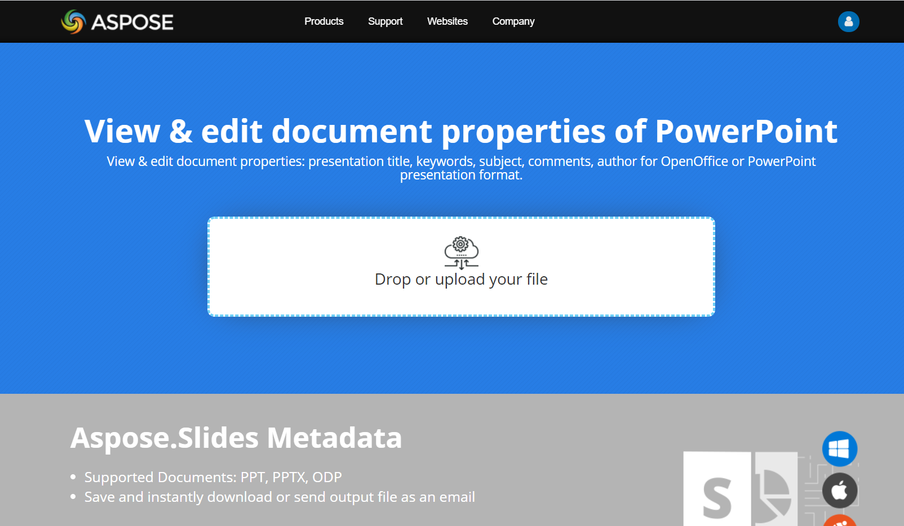

## **مقدمه**

Aspose.Slides دو نوع ویژگی سند را پشتیبانی می‌کند: **ساختاری** و **سفارشی**. هر دو نوع ویژگی می‌توانند به راحتی با استفاده از API Aspose.Slides دسترسی و مدیریت شوند.

Aspose.Slides به شما امکان کار با ویژگی‌های سند ارائه‌نامه را از طریق رابط [IDocumentProperties](https://reference.aspose.com/slides/fa/androidjava/com.aspose.slides/idocumentproperties/) می‌دهد. یک نمونه از این رابط توسط [IPresentation.getDocumentProperties](https://reference.aspose.com/slides/fa/androidjava/com.aspose.slides/ipresentation/#getDocumentProperties--) برگردانده می‌شود. مثال‌های زیر نشان می‌دهند چگونه این ویژگی‌ها را بخوانید، تغییر دهید و مدیریت کنید.

{}

لطفاً توجه داشته باشید که فیلدهای **Application** و **AppVersion** قابل تغییر نیستند. Aspose.Slides آنها را در هر ذخیره‌سازی دوباره می‌نویسد، بنابراین یک ارائه‌نامه ذخیره‌شده همیشه نام محصول Aspose.Slides و نسخه کتابخانه‌ای که آن را تولید کرده است را گزارش می‌دهد. هر مقداری که به `setNameOfApplication` پاس داده شود هنگام نوشتن ارائه‌نامه نادیده گرفته می‌شود.

{} 

## **ویژگی‌های سند در PowerPoint**

Microsoft PowerPoint 2007 امکان مدیریت ویژگی‌های سند فایل‌های ارائه‌نامه را فراهم می‌کند. کافی است روی آیکون Office کلیک کنید و سپس گزینه **Prepare | Properties | Advanced Properties** را در منوی Microsoft PowerPoint 2007 همان‌طور که در زیر نشان داده شده است انتخاب کنید:

|**انتخاب گزینه Advanced Properties**|** |
| :- | :- |
|| |
پس از انتخاب گزینه **Advanced Properties**، دیالوگی ظاهر می‌شود که به شما امکان مدیریت ویژگی‌های سند فایل PowerPoint را می‌دهد همان‌طور که در شکل زیر نشان داده شده است:

|**دیالوگ ویژگی‌ها**|** |
| :- | :- |
|| |
در **دیالوگ ویژگی‌ها** بالا، می‌توانید ببینید که صفحات تب متعددی مانند **General**، **Summary**، **Statistics**، **Contents** و **Custom** وجود دارند. تمام این تب‌ها امکان پیکربندی انواع مختلف اطلاعات مرتبط با فایل‌های PowerPoint را فراهم می‌کنند. تب **Custom** برای مدیریت ویژگی‌های سفارشی فایل‌های PowerPoint استفاده می‌شود.


کار با ویژگی‌های سند با استفاده از Aspose.Slides برای Android از طریق Java

همان‌طور که پیش‌تر توضیح دادیم، Aspose.Slides برای Android از طریق Java دو نوع ویژگی سند را پشتیبانی می‌کند: ویژگی‌های **ساختاری** و **سفارشی**. بنابراین، توسعه‌دهندگان می‌توانند با استفاده از API Aspose.Slides برای Android از طریق Java به هر دو نوع ویژگی دسترسی پیدا کنند. Aspose.Slides برای Android از طریق Java یک کلاس [IDocumentProperties](https://reference.aspose.com/slides/fa/androidjava/com.aspose.slides/idocumentproperties) ارائه می‌دهد که ویژگی‌های سند مرتبط با یک فایل ارائه‌نامه را از طریق ویژگی **Presentation.DocumentProperties** نمایان می‌کند.

توسعه‌دهندگان می‌توانند از ویژگی **IDocumentProperties** که توسط شیء [Presentation](https://reference.aspose.com/slides/fa/androidjava/com.aspose.slides/presentation) افشا می‌شود، برای دسترسی به ویژگی‌های سند فایل‌های ارائه‌نامه همان‌طور که در زیر توصیف شده است، استفاده کنند:

## **خواندن ویژگی‌های عمومی از یک ارائه‌نامه رمزگذاری‌شده**

یک رمز عبور باز کردن معمولاً هم محتویات ارائه‌نامه و هم ویژگی‌های سند را محافظت می‌کند. وقتی یک ارائه‌نامه با عبور `false` به [IProtectionManager.setEncryptDocumentProperties](https://reference.aspose.com/slides/fa/androidjava/com.aspose.slides/iprotectionmanager/#setEncryptDocumentProperties-boolean-) رمزگذاری می‌شود، ویژگی‌های سند آن عمومی می‌مانند. سپس یک برنامه می‌تواند `true` را به [LoadOptions.setOnlyLoadDocumentProperties](https://reference.aspose.com/slides/fa/androidjava/com.aspose.slides/loadoptions/#setOnlyLoadDocumentProperties-boolean-) پاس دهد و متاداده عمومی را بدون ارائه رمز عبور باز کردن بخواند.

گزینهٔ فقط‑بارگذاری‑ویژگی‑سند، کنترل می‌کند که Aspose.Slides چه چیزی را بارگذاری می‌کند؛ هیچ چیزی را رمزگشایی نمی‌کند. اگر ویژگی‌ها در رمزگذاری گنجانده شوند، بارگذاری آنها بدون رمز عبور شکست می‌خورد. اگر ارائه‌نامه رمزگذاری نشده باشد، این گزینه نادیده گرفته می‌شود و کل ارائه‌نامه بارگذاری می‌شود.

مثال زیر حالت بارگذاری را از طریق [IProtectionManager.isOnlyDocumentPropertiesLoaded](https://reference.aspose.com/slides/fa/androidjava/com.aspose.slides/iprotectionmanager/#isOnlyDocumentPropertiesLoaded--) بررسی می‌کند و سپس ویژگی‌های ساختاری را از طریق [IPresentation.getDocumentProperties](https://reference.aspose.com/slides/fa/androidjava/com.aspose.slides/ipresentation/#getDocumentProperties--) می‌خواند:

```java
import com.aspose.slides.IDocumentProperties;
import com.aspose.slides.LoadOptions;
import com.aspose.slides.Presentation;

LoadOptions loadOptions = new LoadOptions();
loadOptions.setOnlyLoadDocumentProperties(true);

Presentation presentation = new Presentation("public-properties-encrypted.pptx", loadOptions);
try {
    if (presentation.getProtectionManager().isOnlyDocumentPropertiesLoaded()) {
        IDocumentProperties properties = presentation.getDocumentProperties();

        System.out.println("Author: " + properties.getAuthor());
        System.out.println("Title: " + properties.getTitle());
        System.out.println("Keywords: " + properties.getKeywords());
    } else {
        System.out.println("The presentation was not loaded in document-properties-only mode.");
    }
} finally {
    presentation.dispose();
}
```

در این حالت، محتویات اسلاید بارگذاری نمی‌شود. اسلایدها، مسترها، چینش‌ها، اشکال، رسانه‌ها و سایر اشیاء ارائه‌نامه در دسترس نیستند. برنامه‌ها باید همیشه قبل از انجام عملیاتی که به مدل کامل شیء ارائه‌نامه نیاز دارد، [IProtectionManager.isOnlyDocumentPropertiesLoaded](https://reference.aspose.com/slides/fa/androidjava/com.aspose.slides/iprotectionmanager/#isOnlyDocumentPropertiesLoaded--) را بررسی کنند.

{}
متاداده عمومی ممکن است نام نویسندگان، عناوین، موضوعات، کلیدواژه‌ها، اطلاعات شرکت، نظرات و مقادیر سفارشی را افشا کند. ویژگی‌های حساس را همراه با ارائه‌نامه رمزگذاری کنید. تنها وقتی که سیستم‌های ایندکس‌گذاری، طبقه‌بندی، جستجو یا مدیریت سند نیاز خاصی به دسترسی بدون رمز عبور داشته باشند، آنها را عمومی بگذارید.
{}

## **به‌روزرسانی ویژگی‌های یک ارائه‌نامه رمزگذاری‌شده**

برای یک فایل PPTX رمزگذاری‌شده، یک ارائه‌نامه که در حالت فقط‑بارگذاری‑ویژگی‑سند باز شده است، برای خواندن متاداده عمومی در نظر گرفته می‌شود. Aspose.Slides نمی‌تواند ویژگی‌های تغییر یافته را از آن شیء فقط‑متاداده ذخیره کند، زیرا ویژگی‌های عمومی باید با داده‌های متناظر داخل ارائه‌نامه رمزگذاری‌شده همخوانی داشته باشند. بنابراین به‌روزرسانی آنها نیاز به رمز عبور باز کردن صحیح و بارگذاری کامل دارد.

مثال زیر ارائه‌نامه را با استفاده از [LoadOptions.setPassword](https://reference.aspose.com/slides/fa/androidjava/com.aspose.slides/loadoptions/#setPassword-java.lang.String-) باز می‌کند، ویژگی‌های ساختاری عمومی را به‌روزرسانی می‌کند و نتیجه را ذخیره می‌نماید. سپس با استفاده از [IPresentationInfo.isEncrypted](https://reference.aspose.com/slides/fa/androidjava/com.aspose.slides/ipresentationinfo/#isEncrypted--) تأیید می‌کند که رمزگذاری حفظ شده است و متاداده عمومی را بدون رمز عبور باز می‌کند تا مقادیر جدید را بررسی کند:

```java
import com.aspose.slides.IPresentationInfo;
import com.aspose.slides.LoadOptions;
import com.aspose.slides.Presentation;
import com.aspose.slides.PresentationFactory;
import com.aspose.slides.SaveFormat;

final String inputPath = "public-properties-encrypted.pptx";
final String outputPath = "updated-public-properties-encrypted.pptx";

LoadOptions loadOptions = new LoadOptions();
loadOptions.setPassword("open_password");

Presentation presentation = new Presentation(inputPath, loadOptions);
try {
    presentation.getDocumentProperties().setTitle("Updated Product Roadmap");
    presentation.getDocumentProperties().setKeywords("roadmap, planning, indexed");
    presentation.save(outputPath, SaveFormat.Pptx);
} finally {
    presentation.dispose();
}

IPresentationInfo presentationInfo = PresentationFactory.getInstance().getPresentationInfo(outputPath);
System.out.println("The presentation is encrypted: " + presentationInfo.isEncrypted());

LoadOptions metadataLoadOptions = new LoadOptions();
metadataLoadOptions.setOnlyLoadDocumentProperties(true);

Presentation metadataPresentation = new Presentation(outputPath, metadataLoadOptions);
try {
    if (metadataPresentation.getProtectionManager().isOnlyDocumentPropertiesLoaded()) {
        System.out.println("Title: " + metadataPresentation.getDocumentProperties().getTitle());
        System.out.println("Keywords: " + metadataPresentation.getDocumentProperties().getKeywords());
    } else {
        System.out.println("The presentation was not loaded in document-properties-only mode.");
    }
} finally {
    metadataPresentation.dispose();
}
```

اگر یک برنامه اجازهٔ رمزگشایی یا بارگذاری محتویات ارائه‌نامه را نداشته باشد، باید ویژگی‌های عمومی یک فایل PPTX رمزگذاری‌شده را به‌عنوان فقط‑خواندنی در نظر بگیرد.

## **دسترسی به ویژگی‌های ساختاری**

این ویژگی‌ها که توسط شیء [IDocumentProperties](https://reference.aspose.com/slides/fa/androidjava/com.aspose.slides/idocumentproperties) افشا می‌شوند شامل: **Creator** (نویسنده)، **Description**، **Keywords**، **Created** (تاریخ ایجاد)، **Modified** (تاریخ اصلاح)، **Printed** (تاریخ چاپ آخر)، **LastModifiedBy**، **SharedDoc** (آیا بین تولیدکنندگان مختلف به اشتراک گذاشته شده است؟)، **PresentationFormat**، **Subject** و **Title** می‌شوند.

```java
import com.aspose.slides.*;

// یک نمونه از کلاس Presentation ایجاد کنید که نمایانگر ارائه است
Presentation pres = new Presentation("Presentation.pptx");
try {
    // یک مرجع به شیء IDocumentProperties مرتبط با Presentation ایجاد کنید
    IDocumentProperties dp = pres.getDocumentProperties();
    
    // Display the built-in properties
    System.out.println("Category : " + dp.getCategory());
    System.out.println("Current Status : " + dp.getContentStatus());
    System.out.println("Creation Date : " + dp.getCreatedTime());
    System.out.println("Author : " + dp.getAuthor());
    System.out.println("Description : " + dp.getComments());
    System.out.println("KeyWords : " + dp.getKeywords());
    System.out.println("Last Modified By : " + dp.getLastSavedBy());
    System.out.println("Supervisor : " + dp.getManager());
    System.out.println("Modified Date : " + dp.getLastSavedTime());
    System.out.println("Presentation Format : " + dp.getPresentationFormat());
    System.out.println("Last Print Date : " + dp.getLastPrinted());
    System.out.println("Is Shared between producers : " + dp.getSharedDoc());
    System.out.println("Subject : " + dp.getSubject());
    System.out.println("Title : " + dp.getTitle());
} finally {
    if (pres != null) pres.dispose();
}
```

## **تغییر ویژگی‌های ساختاری**

تغییر ویژگی‌های ساختاری فایل‌های ارائه‌نامه به همان سادگی دسترسی به آن‌ها است. شما می‌توانید به سادگی یک مقدار رشته‌ای را به هر ویژگی دلخواه اختصاص دهید و مقدار ویژگی تغییر خواهد کرد. در مثال زیر نشان داده‌ایم چگونه می‌توان ویژگی‌های ساختاری سند ارائه‌نامه را با استفاده از Aspose.Slides برای Android از طریق Java تغییر داد.

```java
import com.aspose.slides.*;

Presentation pres = new Presentation("Presentation.pptx");
try {
    // یک مرجع به شیء IDocumentProperties مرتبط با Presentation ایجاد کنید
    IDocumentProperties dp = pres.getDocumentProperties();
    
    // ویژگی‌های ساختاری را تنظیم کنید
    dp.setAuthor("Aspose.Slides for Android via Java");
    dp.setTitle("Modifying Presentation Properties");
    dp.setSubject("Aspose Subject");
    dp.setComments("Aspose Description");
    dp.setManager("Aspose Manager");
    
    // ارائه‌نامه خود را در فایلی ذخیره کنید
    pres.save("DocProps.pptx", SaveFormat.Pptx);
} finally {
    if (pres != null) pres.dispose();
}
```

این مثال ویژگی‌های ساختاری ارائه‌نامه را تغییر می‌دهد که می‌توانند همان‌طور که در زیر نشان داده شده است مشاهده شوند:

|**ویژگی‌های سند ساختاری پس از تغییر**|** |
| :- | :- |
|| |

## **افزودن ویژگی‌های سند سفارشی**

Aspose.Slides برای Android از طریق Java همچنین به توسعه‌دهندگان اجازه می‌دهد مقادیر سفارشی برای ویژگی‌های سند ارائه‌نامه اضافه کنند. مثال زیر سه ویژگی سفارشی اضافه می‌کند، سپس نام ذخیره‌شده در ایندکس ۲ را جستجو می‌کند و آن ویژگی را حذف می‌کند، بنابراین ارائه‌نامهٔ ذخیره‌شده دو مورد از آن‌ها را نگه می‌دارد. ویژگی‌های سفارشی به ترتیب حروف الفبا ایندکس می‌شوند، نه به ترتیبی که اضافه شده‌اند.

```java
import com.aspose.slides.*;

Presentation pres = new Presentation();
try {
    // دریافت ویژگی‌های سند
    IDocumentProperties dProps = pres.getDocumentProperties();
    
    // افزودن ویژگی‌های سفارشی
    dProps.set_Item("New Custom", 12);
    dProps.set_Item("My Name", "Mudassir");
    dProps.set_Item("Custom", 124);
    
    // دریافت نام ویژگی در ایندکس مشخص
    String getPropertyName = dProps.getCustomPropertyName(2);
    
    // حذف ویژگی انتخاب‌شده
    dProps.removeCustomProperty(getPropertyName);
    
    // ذخیره‌سازی ارائه‌نامه
    pres.save("CustomDemo.pptx", SaveFormat.Pptx);
} finally {
    if (pres != null) pres.dispose();
}
```

|**ویژگی‌های سند سفارشی اضافه‌شده**|** |
| :- | :- |
|| |

## **دسترسی و تغییر ویژگی‌های سفارشی**

Aspose.Slides برای Android از طریق Java همچنین به توسعه‌دهندگان امکان دسترسی به مقادیر ویژگی‌های سفارشی را می‌دهد. مثال زیر نشان می‌دهد چگونه می‌توانید تمام این ویژگی‌های سفارشی را برای یک ارائه‌نامه دسترسی و تغییر دهید.

```java
import com.aspose.slides.*;

Presentation pres = new Presentation("Presentation.pptx");
try {
    // یک مرجع به شیء DocumentProperties مرتبط با Presentation ایجاد کنید
    IDocumentProperties dp = pres.getDocumentProperties();
    
    // دسترسی و تغییر ویژگی‌های سفارشی
    for (int i = 0; i < dp.getCountOfCustomProperties(); i++) {
        // نمایش نام‌ها و مقادیر ویژگی‌های سفارشی
        System.out.println("Custom Property Name : " + dp.getCustomPropertyName(i));
        System.out.println("Custom Property Value : " + dp.get_Item(dp.getCustomPropertyName(i)));
    
        // تغییر مقادیر ویژگی‌های سفارشی
        dp.set_Item(dp.getCustomPropertyName(i), "New Value " + (i + 1));
    }
    
    // ارائه‌نامه خود را در فایلی ذخیره کنید
    pres.save("CustomDemoModified.pptx", SaveFormat.Pptx);
} finally {
    if (pres != null) pres.dispose();
}
```

این مثال ویژگی‌های سفارشی [PPTX](https://docs.fileformat.com/presentation/pptx/) را تغییر می‌دهد. شکل‌های زیر ویژگی‌های سفارشی ارائه‌نامه را قبل و بعد از تغییر نشان می‌دهند:

|**ویژگی‌های سفارشی قبل از تغییر**|** |
| :- | :- |
|| |


|**ویژگی‌های سفارشی پس از تغییر**|** |
| :- | :- |
|| |

## **ویژگی‌های سند پیشرفته**

{}

متدهای جدید [ReadDocumentProperties](https://reference.aspose.com/slides/fa/androidjava/com.aspose.slides/IPresentationInfo#readDocumentProperties--)، [UpdateDocumentProperties](https://reference.aspose.com/slides/fa/androidjava/com.aspose.slides/IPresentationInfo#updateDocumentProperties-com.aspose.slides.IDocumentProperties-)، و [WriteBindedPresentation](https://reference.aspose.com/slides/fa/androidjava/com.aspose.slides/IPresentationInfo#writeBindedPresentation-java.lang.String-) به [IPresentationInfo](https://reference.aspose.com/slides/fa/androidjava/com.aspose.slides/IPresentationInfo) اضافه شده‌اند، منطق Setter ویژگی [IDocumentProperties.setLastSavedTime](https://reference.aspose.com/slides/fa/androidjava/com.aspose.slides/idocumentproperties#setLastSavedTime-java.util.Date-) تغییر یافته است.

{} 

دو متد جدید [ReadDocumentProperties](https://reference.aspose.com/slides/fa/androidjava/com.aspose.slides/IPresentationInfo#readDocumentProperties--) و [UpdateDocumentProperties](https://reference.aspose.com/slides/fa/androidjava/com.aspose.slides/IPresentationInfo#updateDocumentProperties-com.aspose.slides.IDocumentProperties-) به اینترفیس [IPresentationInfo](https://reference.aspose.com/slides/fa/androidjava/com.aspose.slides/IPresentationInfo) اضافه شده‌اند. آنها دسترسی سریع به ویژگی‌های سند را فراهم می‌کنند و امکان تغییر و به‌روزرسانی ویژگی‌ها بدون بارگذاری کامل ارائه‌نامه را می‌دهند.

سناریوی معمول بارگذاری ویژگی‌ها، تغییر مقداری و به‌روزرسانی سند می‌تواند به شکل زیر پیاده‌سازی شود:

```java
import com.aspose.slides.*;

// ارائه اطلاعات ارائه‌نامه را بخوانید
IPresentationInfo info = PresentationFactory.getInstance().getPresentationInfo("presentation.pptx");

// ویژگی‌های فعلی را به‌دست آورید
IDocumentProperties props = info.readDocumentProperties();

// مقادیر جدید فیلدهای Author و Title را تنظیم کنید
props.setAuthor("New Author");
props.setTitle("New Title");

// ارائه‌نامه را با مقادیر جدید به‌روزرسانی کنید
info.updateDocumentProperties(props);
info.writeBindedPresentation("presentation.pptx");
```

یک روش دیگر استفاده از ویژگی‌های یک ارائه‌نامه خاص به عنوان قالب برای به‌روزرسانی ویژگی‌ها در ارائه‌نامه‌های دیگر است:

```java
import com.aspose.slides.*;

IPresentationInfo info = PresentationFactory.getInstance().getPresentationInfo("template.pptx");
DocumentProperties template = (DocumentProperties) info.readDocumentProperties();

template.setAuthor("Template Author");
template.setTitle("Template Title");
template.setCategory("Template Category");
template.setKeywords("Keyword1, Keyword2, Keyword3");
template.setCompany("Our Company");
template.setComments("Created from template");
template.setContentType("Template Content");
template.setSubject("Template Subject");

updateByTemplate("doc1.pptx", template);
updateByTemplate("doc2.odp", template);
updateByTemplate("doc3.ppt", template);
```

```java
import com.aspose.slides.*;

private static void updateByTemplate(String path, IDocumentProperties template) 
{
    IPresentationInfo toUpdate = PresentationFactory.getInstance().getPresentationInfo(path);
    toUpdate.updateDocumentProperties(template);
    toUpdate.writeBindedPresentation(path);
}
```

یک قالب جدید می‌تواند از صفر ایجاد شده و سپس برای به‌روزرسانی چندین ارائه‌نامه استفاده شود:

```java
import com.aspose.slides.*;

DocumentProperties template = new DocumentProperties();

template.setAuthor("Template Author");
template.setTitle("Template Title");
template.setCategory("Template Category");
template.setKeywords("Keyword1, Keyword2, Keyword3");
template.setCompany("Our Company");
template.setComments("Created from template");
template.setContentType("Template Content");
template.setSubject("Template Subject");

for (String path : new String[] { "doc1.pptx", "doc2.odp", "doc3.ppt" })
{
    IPresentationInfo toUpdate = PresentationFactory.getInstance().getPresentationInfo(path);
    toUpdate.updateDocumentProperties(template);
    toUpdate.writeBindedPresentation(path);
}
```

## **تنظیم زبان تصحیح املایی**

Aspose.Slides ویژگی LanguageId (که توسط کلاس PortionFormat افشا می‌شود) را فراهم می‌کند تا به شما اجازه دهد زبان تصحیح املایی برای یک سند PowerPoint را تنظیم کنید. زبان تصحیح املایی زبانی است که املا و دستور زبان PowerPoint برای آن بررسی می‌شود.

این کد Java نشان می‌دهد چگونه زبان تصحیح املایی را برای یک PowerPoint تنظیم کنید:

```java
import com.aspose.slides.*;

Presentation pres = new Presentation("presentation.pptx");
try {
    AutoShape autoShape = (AutoShape)pres.getSlides().get_Item(0).getShapes().get_Item(0);

    IParagraph paragraph = autoShape.getTextFrame().getParagraphs().get_Item(0);
    paragraph.getPortions().clear();

    Portion newPortion = new Portion();

    IFontData font = new FontData("SimSun");
    IPortionFormat portionFormat = newPortion.getPortionFormat();
    portionFormat.setComplexScriptFont(font);
    portionFormat.setEastAsianFont(font);
    portionFormat.setLatinFont(font);

    portionFormat.setLanguageId("zh-CN"); // تنظیم شناسهٔ زبان بررسی املایی

    newPortion.setText("1。");
    paragraph.getPortions().add(newPortion);
} finally {
    if (pres != null) pres.dispose();
}
```

## **تنظیم زبان پیش‌فرض**

این کد Java نشان می‌دهد چگونه زبان پیش‌فرض را برای کل یک ارائه‌نامه PowerPoint تنظیم کنید:

```java
import com.aspose.slides.*;

LoadOptions loadOptions = new LoadOptions();
loadOptions.setDefaultTextLanguage("en-US");

Presentation pres = new Presentation(loadOptions);
try {
    // یک شکل مستطیلی جدید با متن اضافه می‌کند
    IAutoShape shp = pres.getSlides().get_Item(0).getShapes().addAutoShape(ShapeType.Rectangle, 50, 50, 150, 50);
    shp.getTextFrame().setText("New Text");

    // زبان اولین بخش را بررسی می‌کند
    System.out.println(shp.getTextFrame().getParagraphs().get_Item(0).getPortions().get_Item(0).getPortionFormat().getLanguageId());
} finally {
    if (pres != null) pres.dispose();
}
```

## **مثال زنده**

سعی کنید برنامه آنلاین [**Aspose.Slides Metadata**](https://products.aspose.app/slides/fa/metadata) را امتحان کنید تا ببینید چگونه با ویژگی‌های سند از طریق API Aspose.Slides کار می‌کنید:

[](https://products.aspose.app/slides/fa/metadata)

## **سوالات متداول**

**چگونه می‌توان یک ویژگی ساختاری را از یک ارائه‌نامه حذف کرد؟**

ویژگی‌های ساختاری بخشی جدایی‌ناپذیر از ارائه‌نامه هستند و نمی‌توانند به‌طور کامل حذف شوند. با این حال، می‌توانید مقدار آنها را تغییر دهید یا اگر ویژگی اجازه دهد، آنها را خالی کنید.

**اگر ویژگی سفارشی‌ای اضافه کنم که قبلاً وجود دارد چه می‌شود؟**

اگر ویژگی سفارشی‌ای اضافه کنید که پیش‌تر موجود است، مقدار موجود آن با مقدار جدید بازنویسی می‌شود. نیازی به حذف یا بررسی پیشین ویژگی نیست، زیرا Aspose.Slides به‌طور خودکار مقدار ویژگی را به‑روز می‌کند.

**آیا می‌توانم بدون بارگذاری کامل ارائه‌نامه به ویژگی‌های ارائه‌نامه دسترسی داشته باشم؟**

بله. از [PresentationFactory.getPresentationInfo](https://reference.aspose.com/slides/fa/androidjava/com.aspose.slides/presentationfactory/#getPresentationInfo-java.lang.String-) استفاده کنید و سپس [IPresentationInfo.readDocumentProperties](https://reference.aspose.com/slides/fa/androidjava/com.aspose.slides/ipresentationinfo/#readDocumentProperties--) را فراخوانی کنید تا متادیتای ذخیره‌شده سند را بدون ایجاد یک نمونه [Presentation](https://reference.aspose.com/slides/fa/androidjava/com.aspose.slides/presentation/) بخوانید. برای یک مثال کامل گزارش‌گیری و محدودیت‌های خاص قالب، به [Build a Lightweight Presentation Inventory](/slides/fa/androidjava/examine-presentation/) مراجعه کنید.

**آیا می‌توانم ویژگی‌های عمومی یک ارائه‌نامه رمزگذاری‌شده را بدون رمز عبور باز کردن آن بخوانم؟**

بله. رمزنگاری ویژگی‑سند باید قبل از رمزگذاری ارائه‌نامه غیرفعال شده باشد و ارائه‌نامه باید در حالت فقط‑بارگذاری‑ویژگی‑سند بارگذاری شود.

**آیا می‌توانم یک فایل PPTX رمزگذاری‌شده را در حالت فقط‑بارگذاری‑ویژگی‑سند به‌روز کنم؟**

خیر. داده‌های ویژگی عمومی و رمزگذاری‌شده باید سازگاری داشته باشند، بنابراین به‌روزرسانی یک فایل PPTX رمزگذاری‌شده نیاز به بارگذاری کامل ارائه‌نامه با رمز عبور باز کردن صحیح دارد.