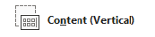

## **بررسی کلی**

یک طرح اسلاید موقعیت‌ها و قالب‌بندی مبدل‌های متنی مانند عنوان‌ها، متن، تصاویر، نمودارها و جداول را تعریف می‌کند. اعمال یک طرح به اسلایدها ساختار ثابتی می‌بخشد در حالی که هر اسلاید می‌تواند محتوای خود را داشته باشد.

متداول‌ترین طرح‌ها عبارتند از:

- **اسلاید عنوان**: شامل مبدل‌های عنوان و زیرعنوان است.
- **عنوان و محتوا**: شامل یک مبدل عنوان و یک مبدل محتوای عمومی است.
- **خالی**: شامل هیچ مبدل محتوایی نیست و هنگامی که هر شکل به‌صورت دستی موقعیت‌یابی می‌شود مفید است.

## **درک وراثت طرح**

یک ارائه دارای سه سطح مرتبط است:

1. یک [اسلاید اصلی](https://reference.aspose.com/slides/fa/androidjava/com.aspose.slides/imasterslide/) تم، قالب‌بندی مشترک، پس‌زمینه و اشیای عمومی را تعریف می‌کند.
2. یک [اسلاید طرح](https://reference.aspose.com/slides/fa/androidjava/com.aspose.slides/ilayoutslide/) متعلق به یک اسلاید اصلی است و یک چیدمان خاص از مبدل‌ها را مشخص می‌کند.
3. یک [اسلاید عادی](https://reference.aspose.com/slides/fa/androidjava/com.aspose.slides/islide/) از یک طرح استفاده می‌کند و محتوای وارد شده برای آن اسلاید را ذخیره می‌نماید.

یک اسلاید عادی تم و قالب‌بندی را از طرح خود به ارث می‌برد و طرح نیز از اسلاید اصلی وراثت می‌گیرد. مقدار تنظیم‌شده مستقیم بر روی اسلاید عادی، مقدار ارث‌برده را در همان سطح بازنویسی می‌کند. هنگام ایجاد یک اسلاید عادی، اشکال مبدل آن از طرح انتخاب شده تولید می‌شوند، در حالی که محتوای وارد شده در آن مبدل‌ها به اسلاید عادی تعلق دارد.

پیش از ایجاد اسلایدها، مبدل‌های لازم را به طرح اضافه کنید. افزودن مبدل جدید به یک طرح بعداً به‌صورت خودکار مبدل متناظر را به اسلایدهای عادی موجود اضافه نمی‌کند.

این رابطه دو پیامد مهم دارد:

- تغییر قالب‌بندی وراثت‌شده یا شکل جئومتری مبدل‌های موجود در یک طرح می‌تواند تمام اسلایدهای وابسته به آن را به‌روز کند. قبل از ویرایش طرحی که در حال حاضر استفاده می‌شود، اسلایدهای وابسته آن را بررسی کنید و ارائه نهایی را مرور نمایید.
- طرحی که هنوز توسط اسلایدی استفاده می‌شود نمی‌تواند حذف شود. ابتدا اسلایدهای وابسته آن را به طرح دیگری انتساب دهید یا فقط طرح‌های بلا استفاده را حذف کنید.

برای اطلاعات بیشتر درباره سطح بالای این سلسله‌مراتبی، به [اسلاید اصلی](/slides/fa/androidjava/slide-master/) مراجعه کنید.

## **انتخاب و اعمال یک طرح اسلاید**

هنگامی که ارائه از تعاریف استاندارد طرح پاورپوینت پیروی می‌کند، از نوع طرح استفاده کنید. نام‌های طرح قابل ویرایش توسط کاربر هستند و می‌توانند بومی‌سازی شوند، بنابراین انتخاب بر پایه نام کمتر قابل اطمینان است مگر آنکه قالب منبع را کنترل کنید.

مثال زیر به دنبال **عنوان و محتوا** در اولین اسلاید اصلی می‌گردد. اگر آن طرح موجود نباشد، عمداً به **خالی** باز می‌گردد. بررسی دوم `null` ضرورت دارد زیرا یک ارائه ممکن است فقط شامل طرح‌های سفارشی باشد. سپس طرح انتخاب‌شده با استفاده از متد [ISlide.setLayoutSlide](https://reference.aspose.com/slides/fa/androidjava/com.aspose.slides/islide/#setLayoutSlide-com.aspose.slides.ILayoutSlide-) به اولین اسلاید عادی اعمال می‌شود.

```java
import com.aspose.slides.*;

Presentation presentation = new Presentation("input.pptx");
try {
    IMasterLayoutSlideCollection layoutSlides = presentation.getMasters().get_Item(0).getLayoutSlides();
    ILayoutSlide targetLayout = layoutSlides.getByType(SlideLayoutType.TitleAndObject);

    if (targetLayout == null) {
        targetLayout = layoutSlides.getByType(SlideLayoutType.Blank);
    }

    if (targetLayout == null) {
        throw new IllegalStateException("The first master does not contain a suitable layout slide.");
    }

    presentation.getSlides().get_Item(0).setLayoutSlide(targetLayout);
    presentation.save("output-with-new-layout.pptx", SaveFormat.Pptx);
} finally {
    presentation.dispose();
}
```

تغییر طرح اسلاید، اشکال عادی اضافه‌شده مستقیم به اسلاید را حذف نمی‌کند. اما موقعیت مبدل‌ها، قالب‌بندی وراثت‌شده و تطابق مبدل‌های موجود با طرح جدید ممکن است تغییر کند، بنابراین هنگام جابجایی بین طرح‌های به‌طرز قابل‌تفاوت، خروجی را بررسی کنید.

## **اضافه کردن یک اسلاید طرح**

انتخاب و ایجاد عملیات‌های جداگانه‌ای هستند. مثال قبلی یک طرح موجود را انتخاب کرد؛ آن را ایجاد نکرد. برای ایجاد یک طرح، متد [IMasterLayoutSlideCollection.add](https://reference.aspose.com/slides/fa/androidjava/com.aspose.slides/imasterlayoutslidecollection/#add-byte-java.lang.String-) را بر روی مجموعهٔ طرح‌های اسلاید اصلی هدف فراخوانی کنید.

مثال زیر همیشه یک طرح **عنوان و محتوا** جدید به نام `Report Title and Content` اضافه می‌کند، سپس یک اسلاید عادی بر پایهٔ آن می‌سازد. نام‌های طرح باید در مجموعه یکتا باشند.

```java
import com.aspose.slides.*;

Presentation presentation = new Presentation("input.pptx");
try {
    IMasterSlide masterSlide = presentation.getMasters().get_Item(0);
    ILayoutSlide reportLayout = masterSlide.getLayoutSlides().add(SlideLayoutType.TitleAndObject, "Report Title and Content");
    presentation.getSlides().addEmptySlide(reportLayout);

    presentation.save("output-with-report-layout.pptx", SaveFormat.Pptx);
} finally {
    presentation.dispose();
}
```

یک طرح را تنها زمانی اضافه کنید که قالب واقعاً به ساختار قابل‌استفادهٔ دیگری نیاز داشته باشد. اگر یک طرح مناسب از پیش وجود دارد، آن را انتخاب و مجدداً استفاده کنید به‌جای ایجاد یک نسخهٔ تکراری.

## **اضافه کردن مبدل‌ها به یک اسلاید طرح**

متد [ILayoutSlide.getPlaceholderManager](https://reference.aspose.com/slides/fa/androidjava/com.aspose.slides/ilayoutslide/#getPlaceholderManager--) یک [ILayoutPlaceholderManager](https://reference.aspose.com/slides/fa/androidjava/com.aspose.slides/ilayoutplaceholdermanager/) برای افزودن اشکال مبدل به طرح فراهم می‌کند.

| مبدل پاورپوینت                     | متد `ILayoutPlaceholderManager` |
| ----------------------------------- | -------------------------------- |
|                | [`addContentPlaceholder(float x, float y, float width, float height)`](https://reference.aspose.com/slides/fa/androidjava/com.aspose.slides/ilayoutplaceholdermanager/#addContentPlaceholder-float-float-float-float-) |
|      | [`addVerticalContentPlaceholder(float x, float y, float width, float height)`](https://reference.aspose.com/slides/fa/androidjava/com.aspose.slides/ilayoutplaceholdermanager/#addVerticalContentPlaceholder-float-float-float-float-) |
|                     | [`addTextPlaceholder(float x, float y, float width, float height)`](https://reference.aspose.com/slides/fa/androidjava/com.aspose.slides/ilayoutplaceholdermanager/#addTextPlaceholder-float-float-float-float-) |
|            | [`addVerticalTextPlaceholder(float x, float y, float width, float height)`](https://reference.aspose.com/slides/fa/androidjava/com.aspose.slides/ilayoutplaceholdermanager/#addVerticalTextPlaceholder-float-float-float-float-) |
|                | [`addPicturePlaceholder(float x, float y, float width, float height)`](https://reference.aspose.com/slides/fa/androidjava/com.aspose.slides/ilayoutplaceholdermanager/#addPicturePlaceholder-float-float-float-float-) |
|                 | [`addChartPlaceholder(float x, float y, float width, float height)`](https://reference.aspose.com/slides/fa/androidjava/com.aspose.slides/ilayoutplaceholdermanager/#addChartPlaceholder-float-float-float-float-) |
|                   | [`addTablePlaceholder(float x, float y, float width, float height)`](https://reference.aspose.com/slides/fa/androidjava/com.aspose.slides/ilayoutplaceholdermanager/#addTablePlaceholder-float-float-float-float-) |
|            | [`addSmartArtPlaceholder(float x, float y, float width, float height)`](https://reference.aspose.com/slides/fa/androidjava/com.aspose.slides/ilayoutplaceholdermanager/#addSmartArtPlaceholder-float-float-float-float-) |
|                  | [`addMediaPlaceholder(float x, float y, float width, float height)`](https://reference.aspose.com/slides/fa/androidjava/com.aspose.slides/ilayoutplaceholdermanager/#addMediaPlaceholder-float-float-float-float-) |
|     | [`addOnlineImagePlaceholder(float x, float y, float width, float height)`](https://reference.aspose.com/slides/fa/androidjava/com.aspose.slides/ilayoutplaceholdermanager/#addOnlineImagePlaceholder-float-float-float-float-) |

مثال زیر بررسی می‌کند که طرح **خالی** وجود دارد، چهار مبدل به آن اضافه می‌کند و سپس یک اسلاید عادی که از طرح اصلاح‌شده استفاده می‌کند را می‌سازد. ترتیب کار عمدی است: مبدل‌ها قبل از ایجاد اسلاید عادی اضافه می‌شوند تا Aspose.Slides بتواند اشکال مبدل متناظر را روی آن اسلاید تولید کند.

```java
import com.aspose.slides.*;

Presentation presentation = new Presentation();
try {
    ILayoutSlide blankLayout = presentation.getLayoutSlides().getByType(SlideLayoutType.Blank);

    if (blankLayout == null) {
        throw new IllegalStateException("The presentation does not contain a Blank layout slide.");
    }

    ILayoutPlaceholderManager placeholderManager = blankLayout.getPlaceholderManager();
    placeholderManager.addContentPlaceholder(20, 20, 310, 270);
    placeholderManager.addVerticalTextPlaceholder(350, 20, 350, 270);
    placeholderManager.addChartPlaceholder(20, 310, 310, 180);
    placeholderManager.addTablePlaceholder(350, 310, 350, 180);

    presentation.getSlides().addEmptySlide(blankLayout);
    presentation.save("output-with-placeholders.pptx", SaveFormat.Pptx);
} finally {
    presentation.dispose();
}
```

نتیجه:


{}

تغییر قالب‌بندی وراثت‌شده یا شکل جئومتری مبدل‌های موجود در طرح می‌تواند اسلایدهای وابسته را تحت تأثیر قرار دهد. یک مبدل طرح تازه اضافه‌شده به‌صورت خودکار به اسلایدهای عادی موجود بازگردانی نمی‌شود. تغییرات طرح را روی یک نسخهٔ копی از ارائه تست کنید و هر اسلاید وابسته را با دقت بررسی نمایید.

{}

## **حذف اسلایدهای طرح بلااستفاده**

از متد [Compress.removeUnusedLayoutSlides](https://reference.aspose.com/slides/fa/androidjava/com.aspose.slides/compress/#removeUnusedLayoutSlides-com.aspose.slides.Presentation-) برای حذف طرح‌هایی که هیچ اسلاید عادی به آن‌ها ارجاع نمی‌دهد استفاده کنید. این متد طرح‌های همچنان مورد استفاده را دست نخورده می‌گذارد.

```java
import com.aspose.slides.*;

Presentation presentation = new Presentation("input.pptx");
try {
    Compress.removeUnusedLayoutSlides(presentation);
    presentation.save("output-without-unused-layouts.pptx", SaveFormat.Pptx);
} finally {
    presentation.dispose();
}
```

برای حذف یک طرح خاص، ابتدا از متدهای [hasDependingSlides](https://reference.aspose.com/slides/fa/androidjava/com.aspose.slides/ilayoutslide/#hasDependingSlides--) یا [getDependingSlides](https://reference.aspose.com/slides/fa/androidjava/com.aspose.slides/ilayoutslide/#getDependingSlides--) آن استفاده کنید. قبل از فراخوانی [ILayoutSlide.remove](https://reference.aspose.com/slides/fa/androidjava/com.aspose.slides/ilayoutslide/#remove--) اسلایدهای وابسته را مجدداً اختصاص دهید. تلاش برای حذف یک طرح در حال استفاده، یک [PptxEditException](https://reference.aspose.com/slides/fa/androidjava/com.aspose.slides/pptxeditexception/) را به‌وجود می‌آورد.

## **کنترل قابلیت مشاهده پاورقی در یک اسلاید طرح**

یک طرح پاورقی، شماره اسلاید و مبدل تاریخ‑زمان خود را دارد. برای کنترل این مبدل‌ها برای یک طرح، از متد [ILayoutSlide.getHeaderFooterManager](https://reference.aspose.com/slides/fa/androidjava/com.aspose.slides/ilayoutslide/#getHeaderFooterManager--) استفاده کنید. این موضوع زمانی مفید است که به‌عنوان مثال طرح‌های محتوا بخواهند پاورقی نشان دهند ولی طرح‌های عنوان نه.

مثال زیر یک طرح را به‌صورت ایمن انتخاب کرده و عناصر پاورقی آن را قابل مشاهده می‌کند:

```java
import com.aspose.slides.*;

Presentation presentation = new Presentation("input.pptx");
try {
    ILayoutSlide layoutSlide = presentation.getLayoutSlides().getByType(SlideLayoutType.TitleAndObject);

    if (layoutSlide == null) {
        layoutSlide = presentation.getLayoutSlides().getByType(SlideLayoutType.Blank);
    }

    if (layoutSlide == null) {
        throw new IllegalStateException("The presentation does not contain a suitable layout slide.");
    }

    ILayoutSlideHeaderFooterManager headerFooterManager = layoutSlide.getHeaderFooterManager();
    headerFooterManager.setFooterVisibility(true);
    headerFooterManager.setSlideNumberVisibility(true);
    headerFooterManager.setDateTimeVisibility(true);
    headerFooterManager.setFooterText("Footer text");
    headerFooterManager.setDateTimeText("Date and time text");

    presentation.save("output-with-layout-footers.pptx", SaveFormat.Pptx);
} finally {
    presentation.dispose();
}
```

## **کنترل قابلیت مشاهده پاورقی در یک اسلاید اصلی و طرح‌های فرزند آن**

برای اعمال تنظیمات پاورقی یکدست در تمام سلسله‌مراتبی اسلاید اصلی، از متد [IMasterSlide.getHeaderFooterManager](https://reference.aspose.com/slides/fa/androidjava/com.aspose.slides/imasterslide/#getHeaderFooterManager--) استفاده کنید. متدهای انتشار [IMasterSlideHeaderFooterManager](https://reference.aspose.com/slides/fa/androidjava/com.aspose.slides/imasterslideheaderfootermanager/) بر روی اسلاید اصلی و اسلایدهای طرح و اسلایدهای عادی وابسته به آن عمل می‌کنند؛ آن‌ها فقط یک اسلاید عادی را هدف نمی‌گیرند.

```java
import com.aspose.slides.*;

Presentation presentation = new Presentation("input.pptx");
try {
    IMasterSlideHeaderFooterManager headerFooterManager = presentation.getMasters().get_Item(0).getHeaderFooterManager();
    headerFooterManager.setFooterAndChildFootersVisibility(true);
    headerFooterManager.setSlideNumberAndChildSlideNumbersVisibility(true);
    headerFooterManager.setDateTimeAndChildDateTimesVisibility(true);
    headerFooterManager.setFooterAndChildFootersText("Footer text");
    headerFooterManager.setDateTimeAndChildDateTimesText("Date and time text");

    presentation.save("output-with-master-footers.pptx", SaveFormat.Pptx);
} finally {
    presentation.dispose();
}
```

## **سؤالات متداول**

**تفاوت بین اسلاید اصلی و اسلاید طرح چیست؟**

اسلاید اصلی تم و قالب‌بندی مشترک ارائه را تعریف می‌کند. اسلاید طرح به یک اسلاید اصلی تعلق دارد و یک چیدمان قابل‌استفادهٔ مبدل‌ها را تعریف می‌کند. اسلایدهای عادی از این طرح‌ها استفاده می‌کنند و محتوای خاص خود را ذخیره می‌نمایند.

**آیا می‌توانم یک اسلاید طرح را از یک ارائه به ارائه دیگر کپی کنم؟**

بله. با استفاده از متد [addClone](https://reference.aspose.com/slides/fa/androidjava/com.aspose.slides/igloballayoutslidecollection/#addClone-com.aspose.slides.ILayoutSlide-) یک نسخه به مجموعهٔ مقصد اضافه کنید. هنگام کپی بین ارائه‌ها، فونت‌ها، تم‌ها، تصاویر و سایر منابع استفاده‌شده توسط طرح منبع را نیز بررسی کنید.

**وقتی یک طرح که در حال استفاده است را ویرایش می‌کنم چه اتفاقی می‌افتد؟**

اسلایدهای وابسته تغییرات طرح را به ارث می‌برند مگر اینکه قالب‌بندی یا اشیای موردنظر را به‌صورت محلی بازنویسی کرده باشند. بنابراین شکل جئومتری مبدل‌ها و استایل‌های وراثت‌شده می‌تواند یک‌باره در بسیاری از اسلایدها تغییر کند. قبل از ویرایش طرح، با استفاده از [getDependingSlides](https://reference.aspose.com/slides/fa/androidjava/com.aspose.slides/ilayoutslide/#getDependingSlides--) اسلایدهای تحت‌اثر را شناسایی کنید.

**اگر یک طرح هنوز در حال استفاده باشد را حذف کنم چه می‌شود؟**

Aspose.Slides یک [PptxEditException](https://reference.aspose.com/slides/fa/androidjava/com.aspose.slides/pptxeditexception/) پرتاب می‌کند. ابتدا اسلایدهای وابسته را به طرح دیگری انتساب دهید یا از [removeUnusedLayoutSlides](https://reference.aspose.com/slides/fa/androidjava/com.aspose.slides/compress/#removeUnusedLayoutSlides-com.aspose.slides.Presentation-) برای حذف تنها طرح‌های بدون ارجاع استفاده کنید.