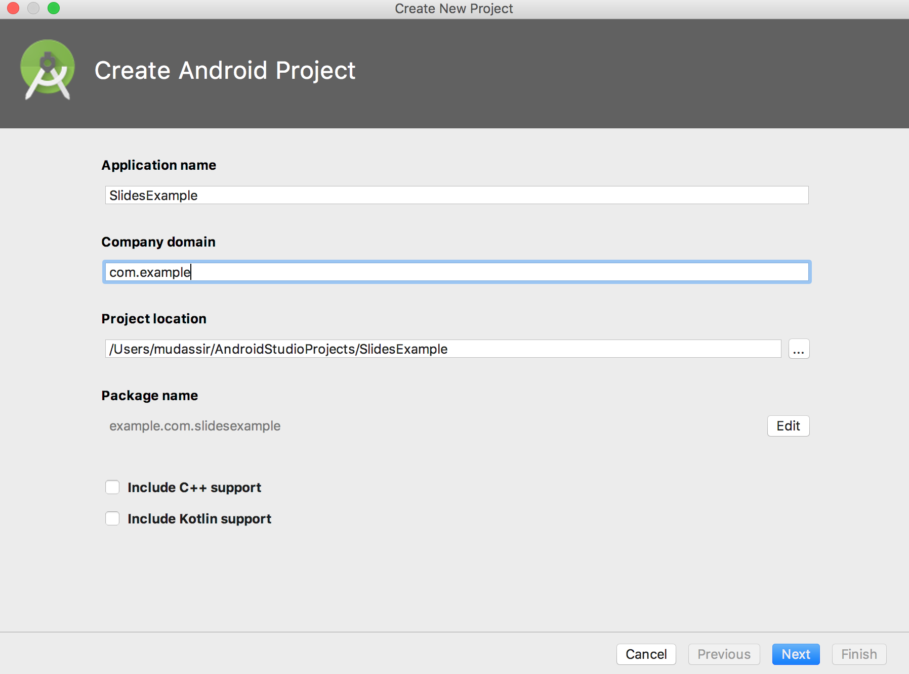

## **بررسی کلی**

این مقاله توضیح می‌دهد چگونه Aspose.Slides for Android via Java را نصب و به یک پروژه Android اضافه کنید. دو گزینه نصب را توصیف می‌کند: افزودن فایل JAR Aspose.Slides به صورت دستی به پروژه و نصب کتابخانه از مخزن Maven.

همچنین مقاله یک مثال گام‌به‌گام ارائه می‌دهد که نشان می‌دهد چگونه یک برنامه Android جدید در Android Studio ایجاد کنید، به کتابخانه Aspose.Slides ارجاع دهید، یک ارائه PowerPoint را به طور برنامه‌نویسی ایجاد کنید و آن را با فرمت PPTX ذخیره کنید. همچنین نکاتی درباره نسخه‌بندی و پاسخ به سؤالات رایج در مورد تأیید یکپارچه‌سازی، مدیریت مصرف حافظه و کاهش حجم نهایی JAR را شامل می‌شود.

## **نصب**
در گذشته، Aspose.Slides for Android via Java به صورت یک فایل ZIP واحد که شامل فایل JAR، نمونه‌ها و مستندات محصول بود توزیع می‌شد.

1. اگر می‌خواهید از نسخه‌ای قدیمی‌تر از Aspose.Words for Android via Java 18.9 استفاده کنید، باید فایل Aspose.Slides.Android.zip را در پوشه مورد نظر خود استخراج کنید.  
1. فایل JAR استخراج‌شده را با استفاده از تنظیمات Build Path به برنامه خود اضافه کنید.  

### **افزودن مرجع به Aspose.Slides for Android via Java Jar**
1. جدیدترین نسخهٔ [Aspose.Slides for Android via Java](https://downloads.aspose.com/slides/fa/androidjava) را دانلود کنید  
1. فایل aspose-slides-18.9-android.via.java.jar را در پوشه *libs/* پروژه خود کپی کنید  


### **نصب Aspose.Slides for Android via Java از مخزن Maven**
1. مخزن Maven را به فایل build.gradle خود اضافه کنید.  
1. فایل JAR [Aspose.Slides for Android via Java](https://releases.aspose.com/java/repo/com/aspose/aspose-slides/) را به‌عنوان وابستگی اضافه کنید.  

``` java

 // 1. مخزن maven را به فایل build.gradle خود اضافه کنید 

repositories {

    mavenCentral()

    maven { url "https://releases.aspose.com/java/repo/" }

}

// 2. JAR 'Aspose.Slides for Android via Java' را به‌عنوان وابستگی اضافه کنید

dependencies {

    ...

    ...

    compile (group: 'com.aspose', name: 'aspose-slides', version: 'XX.XX', classifier: 'android.via.java')

}
```
## **اولین برنامهٔ شما با استفاده از Aspose.Slides for Android via Java**
در این بخش، نحوهٔ شروع کار با Aspose.Slides for Android via Java را یاد می‌گیرید. قصد داریم نشان دهیم چگونه از صفر یک پروژهٔ Android جدید راه‌اندازی کنید، مرجع به فایل JAR Aspose.Slides اضافه کنید و یک ارائهٔ PowerPoint جدید ایجاد کنید که به‌صورت فایل PPTX بر روی دی스크 ذخیره می‌شود. مثال زیر از [Android Studio](https://developer.android.com/studio/index.html) برای توسعه استفاده می‌کند و برنامه روی Android Emulator اجرا می‌شود. برای شروع کار با Aspose.Slides for Android via Java، این آموزش گام‌به‌گام را برای ساخت یک برنامه که از Aspose.Slides for Android via Java استفاده می‌کند، دنبال کنید:

1. [Android Studio](https://developer.android.com/studio/index.html) را دانلود و در هر مسیری نصب کنید.  
1. Android Studio را اجرا کنید.  
1. یک پروژهٔ جدید Android Application ایجاد کنید.  





1. فایل aspose-slides-XX.XX-android.via.java.jar را در پوشه libs/پروژه خود کپی کنید  


1. گزینه Project Section (از منوی File) را انتخاب کنید و به تب Dependencies بروید.  
   1. روی دکمه "+" کلیک کنید. گزینه file dependency را برگزینید.  
   1. کتابخانه Aspose.Slides را از پوشه libs انتخاب کنید و روی OK کلیک کنید.  


1. در صورت نیاز پروژه را با فایل‌های Gradle همگام‌سازی کنید.  


1. برای دسترسی به SDcard، باید مجوزهای خاصی اضافه شود. فایل AndroidManifest.xml را باز کنید، نمای XML را انتخاب کنید و خط زیر را به فایل اضافه کنید  
  <uses-permission android:name="android.permission.WRITE_EXTERNAL_STORAGE" />  


1. به بخش کد برنامه بازگردید و این imports را اضافه کنید:  

``` java

 import java.io.File;

import com.aspose.slides.IAutoShape;

import com.aspose.slides.IParagraph;

import com.aspose.slides.IPortion;

import com.aspose.slides.ISlide;

import com.aspose.slides.ITextFrame;

import com.aspose.slides.Presentation;

import com.aspose.slides.SaveFormat;

import com.aspose.slides.ShapeType;

import android.os.Environment; 

```

حالا این کد را در بدنهٔ متد onCreate قرار دهید تا یک Presentation جدید از صفر با استفاده از Aspose.Slides ایجاد و در SDCard با فرمت PPTX ذخیره شود.

``` java

 try

{

    // نمونه‌سازی کلاس Presentation که نمایانگر PPTX است
    Presentation pres = new Presentation();


    // دسترسی به اولین اسلاید
    ISlide sld = pres.getSlides().get_Item(0);


    // افزودن AutoShape از نوع Rectangle
    IAutoShape ashp = sld.getShapes().addAutoShape(ShapeType.Rectangle, 150, 75, 150, 50);


    // افزودن TextFrame به Rectangle
    ashp.addTextFrame(" ");


    // دسترسی به فریم متن
    ITextFrame txtFrame = ashp.getTextFrame();


    // ایجاد شیء Paragraph برای فریم متن
    IParagraph para = txtFrame.getParagraphs().get_Item(0);


    // ایجاد شیء Portion برای پاراگراف
    IPortion portion = para.getPortions().get_Item(0);


    // تنظیم متن
    portion.setText("Aspose TextBox");


    // ذخیره PPTX بر روی کارت
    String sdCardPath = Environment.getExternalStorageDirectory().getPath() + File.separator;
    pres.save(sdCardPath + "Textbox.pptx",SaveFormat.Pptx);
}

catch (Exception e)

{
   e.printStackTrace();
}

```

کد کامل باید به‌این شکل باشد:


1. برنامه را مجدداً اجرا کنید. این بار کد Aspose.Slides در پس‌زمینه اجرا می‌شود و سندی را تولید می‌کند که در SDcard ذخیره می‌شود.  


1. برای مشاهدهٔ سند ایجاد‌شده، به منوی Tools بروید. Android را انتخاب کنید و سپس Android Device Monitor را باز کنید.  


## **نسخه‌بندی**
از سال 2018، نسخه‌بندی Aspose.Slides for Android via Java با Aspose.Slides for Java هم‌خوانی دارد.

## **سؤالات متداول**

**چگونه می‌توانم تأیید کنم که Aspose.Slides به‌درستی یکپارچه شده است؟**

پروژه خود را بسازید، یک [Presentation](https://reference.aspose.com/slides/fa/androidjava/com.aspose.slides/presentation/) خالی ایجاد کنید و زیر نام جدیدی ذخیره کنید. اگر فایل بدون پرتاب استثناء ایجاد شد، کتابخانه با موفقیت یکپارچه شده است.

**چگونه می‌توان مصرف حافظه را هنگام پردازش ارائه‌های بزرگ محدود کرد؟**

محدودیت‌های حافظه JVM را فقط تا حد مورد نیاز افزایش دهید و هر نمونهٔ [Presentation](https://reference.aspose.com/slides/fa/androidjava/com.aspose.slides/presentation/) را در یک بلوک `finally` بسته کنید تا کش به‌سرعت آزاد شود. این کار از خطاهای «یاد حافظه کافی نیست» جلوگیری می‌کند و مصرف کلی حافظه را پیش‌بینی‌پذیر نگه می‌دارد.

**آیا می‌توان فرمت‌های خروجی ناخواسته را برای کاهش حجم نهایی JAR حذف کرد؟**

نسخه‌های جاری Aspose.Slides به‌صورت یک کتابخانهٔ یکتا توزیع می‌شوند، بنابراین نمی‌توانید در زمان ساخت صادرکننده‌های خاصی مانند PDF یا SVG را غیر فعال کنید.